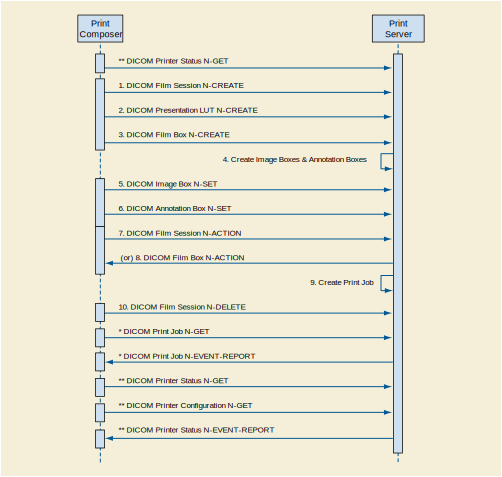

.. _chapter_E:

Conformance Statement Example Print Server (Informative)
========================================================

Disclaimer:

This document is a sample DICOM Conformance Statement for a fictional
Print Server (SCP) Management System, called
EXAMPLE-PRINT-SERVER-MANAGEMENT (also called Print Server) produced by a
fictional vendor called EXAMPLE-IMAGING-PRODUCTS.

As stated in the annex title, this document is truly informative, and
not normative. A conformance statement of an actual product might
implement additional services and options as appropriate for its
specific purpose. In addition, an actual product might implement the
services described in a different manner and, for example, with
different characteristics and/or sequencing of activities. In other
words, this conformance statement example does not intend to standardize
a particular manner that a product might implement DICOM functionality.

.. _sect_E.0:

Cover Page
----------

Company Name: EXAMPLE-Printing­PRODUCTS.

Product Name: EXAMPLE-PRINT-SERVER

Version: 1.0-rev. A.1

Internal document number: 4226-xxx-yyy-zzz rev 1

Date: YYYYMMDD

.. _sect_E.1:

Conformance Statement Overview
------------------------------

This fictional product EXAMPLE-PRINT-SERVER-MANAGEMENT implements the
necessary DICOM services to facilitate the Print (SCP) Imaging
Management in the healthcare departments, managing Print imaging over a
network on Medical Laser Imaging Systems. It enables the capabilities to
capture images at any networked DICOM modality and then print them
anywhere they're needed in the medical facility.

Furthermore, before sending the images to be printed the
EXAMPLE-PRINT-SERVER-MANAGEMENT will apply image processing, using
presentation parameters and LUT to improve the image presentation
quality and consistency. Moreover, it will manage the printing
presentation format and the Printer queue and Configuration.

`table_title <#table_E.1-1>`__ provides an overview of the network
services supported by EXAMPLE-PRINT-SERVER-MANAGEMENT.

.. table:: Network Services

   +----------------------+----------------------+----------------------+
   | SOP Classes          | User of Service      | Provider of Service  |
   |                      | (SCU)                | (SCP)                |
   +======================+======================+======================+
   | Print Management     |                      |                      |
   +----------------------+----------------------+----------------------+
   | Grayscale Print      | No                   | Yes                  |
   | Management Meta      |                      |                      |
   +----------------------+----------------------+----------------------+
   | Presentation LUT     | No                   | Yes                  |
   +----------------------+----------------------+----------------------+
   | Printer              | No                   | Yes                  |
   | Configuration        |                      |                      |
   +----------------------+----------------------+----------------------+
   | Print Job            | No                   | Yes                  |
   +----------------------+----------------------+----------------------+
   | Basic Annotation     | No                   | Yes                  |
   +----------------------+----------------------+----------------------+

.. _sect_E.2:

Table of Contents
-----------------

A table of contents shall be provided to assist readers in easily
finding the needed information.

.. _sect_E.3:

Introduction
------------

.. _sect_E.3.1:

Revision History
~~~~~~~~~~~~~~~~

.. table:: Revision History

   ================ =============== ====== ====================
   Document Version Date            Author Description
   ================ =============== ====== ====================
   1.1              October 30,2003 WG 6   For Final Text
   1.2              August 30, 2007 WG 6   Revised Introduction
   ================ =============== ====== ====================

.. _sect_E.3.2:

Audience, Remarks, Terms and Definitions, Basics of DICOM Communication, Abbreviations, References
~~~~~~~~~~~~~~~~~~~~~~~~~~~~~~~~~~~~~~~~~~~~~~~~~~~~~~~~~~~~~~~~~~~~~~~~~~~~~~~~~~~~~~~~~~~~~~~~~~

*See example text in*\ `Introduction <#sect_A.3>`__\ *.*

.. _sect_E.3.3:

Additional Remarks for This Example
~~~~~~~~~~~~~~~~~~~~~~~~~~~~~~~~~~~

This document is a sample DICOM Conformance Statement created for DICOM
. It is to be used solely as an example to illustrate how to create a
DICOM Conformance Statement for a print server system supporting DICOM
Print Services. The subject of the document,
EXAMPLE-PRINT-SERVER-MANAGEMENT, is a fictional product.

.. _sect_E.4:

Networking
----------

.. _sect_E.4.1:

Implementation Model
~~~~~~~~~~~~~~~~~~~~

.. _sect_E.4.1.1:

Application Data Flow
^^^^^^^^^^^^^^^^^^^^^

This implementation model uses the DICOM Basic Print Management Meta SOP
Class to receive studies for the Medical Imager. Multiple associations
to Print SCUs are supported.

The Print Server is receiving the Images with the Presentation and
Annotation information, it Apply it on the images and creates a
print-job within the print queue, containing one or more film pages
composed from images selected by the client Print SCU. Furthermore, it
also manages the Printer Status and Configuration.

.. _sect_E4.1.2:

Functional Definition of AEs
^^^^^^^^^^^^^^^^^^^^^^^^^^^^

.. _sect_E.4.1.2.1:

Functional Definition of Print Server (SCP) Application Entity
''''''''''''''''''''''''''''''''''''''''''''''''''''''''''''''

The Print Server System acquires the images with the demographics and
presentation information from the connected Print Composer (SCU) that is
Grouped with a Workstation or an Archive device. Studies are temporarily
stored on disk. The images are then processed and formatted and finally
queued as a print job on the Printer queue. If the Printer is operating
normally, then the film sheets described in the print-job will be
printed. Changes in the Printer operation status will be detected (e.g.,
film Magazine empty) and reported back to the Print SCU. If the Printer
is not operating normally, then the print-job will be set to an error
state and can be restarted by the user via the job control interface.

The Print Server Management includes:

-  DICOM Association and Negotiation Management

-  Image Buffering

-  Image Processing (Windowing level, P-LUT, GSDF, Annotation, etc)

-  Image Formatting (Film sheet format)

-  Printing

-  Print Job Status Tracking

-  Print Status Tracking

-  Printer Configuration Tracking

The Printer Status and Configuration can be requested at any time by the
Print SCU, while the Print Server will update the Print SCU
asynchronously whenever the Printer status get changed. Furthermore, the
Print Server provides in addition a Service operation of checking the
networking connectivity to it's Print SCU using the Verification SOP
Class.

.. _sect_E.4.1.3:

Sequencing of Real-World Activities
^^^^^^^^^^^^^^^^^^^^^^^^^^^^^^^^^^^

   Print Server Management Sequence

.. note::

   1. The Print Job N-GET and N-EVENT-REPORT are Asynchronous messages
      that may occur at any time after the Print Job was created.

   2. The Printer Status & Configuration N-GET and the N-EVENT-REPORT
      are Asynchronous messages that may occur at any time it is needed
      during the Print sequence.

The Print Server Management workflow activities in the sequence order as
described in `figure_title <#figure_E.4.1-2>`__ apply:

1.  DICOM Film Session N-CREATE

2.  DICOM Presentation LUT N-CREATE

3.  DICOM Film Box N-CREATE

4.  Create Image Boxes & Annotation Boxes

5.  DICOM Image Box N-SET

6.  DICOM Annotation Box N-SET

7.  DICOM Film Session N-ACTION, A print job is created for each Film
    Session N-action.

8.  DICOM Film Box N-ACTION, A print job is created for each Film Box
    N-action.

9.  Create Print Job

10. DICOM Film Session N-DELETE.

The following additional activities are asynchronous mode and they can
be send any time the Print Server is up and running:

\* DICOM Print Job N-GET, request the execution status of a Print Job.

\* DICOM Print Job N-EVENT-REPORT, report an update on the execution
status of a Print Job.

\*\* DICOM Printer Status N-GET - Request a Printer Status, anytime the
Printer is ON.

\*\* DICOM Printer Configuration N-GET - Request the Printer
configuration, anytime the Printer is ON.

\*\* DICOM Printer Status N-EVENT-REPORT - Report the Printer Status
Changed.

.. _sect_E.4.2:

AE Specifications
~~~~~~~~~~~~~~~~~

.. _sect_E.4.2.1:

Print Server Management (SCP) Application Entity Specification
^^^^^^^^^^^^^^^^^^^^^^^^^^^^^^^^^^^^^^^^^^^^^^^^^^^^^^^^^^^^^^

.. _sect_E.4.2.1.1:

SOP Classes
'''''''''''

The EXAMPLE-PRINT-SERVER-MANAGEMENT provides Standard Conformance to the
following SOP Classes:

.. table:: SOP Classes for AE Print Server (SCP)

   +---------------------------+---------------------------+-----+-----+
   | SOP Class Name            | SOP Class UID             | SCU | SCP |
   +===========================+===========================+=====+=====+
   | Basic Grayscale Print     | 1.2.840.10008.5.1.1.9     | No  | Yes |
   | Management Meta SOP Class |                           |     |     |
   +---------------------------+---------------------------+-----+-----+
   | Presentation LUT SOP      | 1.2.840.10008.5.1.1.23    | No  | Yes |
   | Class                     |                           |     |     |
   +---------------------------+---------------------------+-----+-----+
   | Printer Configuration     | 1                         | No  | Yes |
   |                           | .2.840.10008.5.1.1.16.376 |     |     |
   +---------------------------+---------------------------+-----+-----+
   | Print Job                 | 1.2.840.10008.5.1.1.14    | No  | Yes |
   +---------------------------+---------------------------+-----+-----+
   | Basic Annotation Box SOP  | 1.2.840.10008.5.1.1.15    | No  | Yes |
   | Class                     |                           |     |     |
   +---------------------------+---------------------------+-----+-----+
   | Verification SOP Class    | 1.2.840.10008.1.1         | Yes | Yes |
   +---------------------------+---------------------------+-----+-----+

.. _sect_E.4.2.1.2:

Association Establishment Policy
''''''''''''''''''''''''''''''''

.. _sect_E.4.2.1.2.1:

General
       

The Print Server Management System will accept associations while
configured as an Print SCP and while a valid local Printer destination
exists.

The DICOM standard application context name for DICOM is always accepted

.. table:: DICOM Application Context for AE Print SCP

   ======================== =====================
   Application Context Name 1.2.840.10008.3.1.1.1
   ======================== =====================

.. _sect_E.4.2.1.2.2:

Number of Associations
                      

The EXAMPLE-PRINT-SERVER-MANAGEMENT will accept Up to 8 simultaneous
delivery Associations. If an attempt is made to open more than 8
simultaneous Associations, the Print Server System will reject the
additional Associations (A-ASSOCIATE-RJ).

.. table:: Number of Associations Accepted for AE Print Server
Management (SCP)

   =========================================== ================
   Maximum number of simultaneous Associations 8 (Configurable)
   =========================================== ================

EXAMPLE-PRINT-SERVER-MANAGEMENT will also initiate one Association at a
time for each destination to which a connectivity verification request
is being processed. Only one connectivity verification job will be
active at a time, the other remains pending until the active job is
completed or failed.

.. table:: Number of Associations Initiated for Connectivity

   =========================================== =
   Maximum number of simultaneous Associations 1
   =========================================== =

.. _sect_E.4.2.1.2.3:

Asynchronous Nature
                   

The EXAMPLE-PRINT-SERVER-MANAGEMENT does not support asynchronous
communication. Multiple outstanding transactions are not supported. It
allows up to one invoked and one performed operation on an Association
(it is synchronous).

.. table:: Asynchronous Nature as a SCP for AE Print Server (SCP)

   ======================================================= =
   Maximum number of outstanding asynchronous transactions 1
   ======================================================= =

.. _sect_E.4.2.1.2.4:

Implementation Identifying Information
                                      

The implementation information for this Application Entity is:

.. table:: DICOM Implementation Class and Version for AE Print SCP

   =========================== =============================
   Implementation Class UID    xxxxxxxxxxx.yy.etc.ad.inf.usw
   Implementation Version Name PRINTSCP_VERS_01
   =========================== =============================

.. _sect_E.4.2.1.3:

Association Initiation Policy
'''''''''''''''''''''''''''''

.. _sect_E.4.2.1.3.1:

Activity - Connectivity Verification
                                    

.. _sect_E.4.2.1.3.1.1:

Description and Sequencing of Activities
                                        

The EXAMPLE-PRINT-SERVER-MANAGEMENT initiates Associations only for the
purpose of verifying a DICOM connection.

.. _sect_E.4.2.1.3.1.2:

Proposed Presentation Context Table
                                   

The EXAMPLE-PRINT-SERVER-MANAGEMENT is capable of proposing the
Presentation Contexts as shown in the following table:

.. table:: Proposed Presentation Context for Connectivity Verification

   +------------+------------+------------+------------+-----+------+
   | Pr         |            |            |            |     |      |
   | esentation |            |            |            |     |      |
   | Context    |            |            |            |     |      |
   | Table      |            |            |            |     |      |
   +============+============+============+============+=====+======+
   | Ve         | 1.2.840    | Implicit   | 1.2.840    | SCU | None |
   | rification | .10008.1.1 | VR Little  | .10008.1.2 |     |      |
   |            |            | Endian     |            |     |      |
   +------------+------------+------------+------------+-----+------+
   | Explicit   | 1.2.840.1  |            |            |     |      |
   | VR Little  | 0008.1.2.1 |            |            |     |      |
   | Endian     |            |            |            |     |      |
   +------------+------------+------------+------------+-----+------+

.. _sect_E.4.2.1.3.1.3:

SOP Specific Conformance for Connectivity Verification
                                                      

The EXAMPLE-PRINT-SERVER-MANAGEMENT provides standard conformance to the
DICOM Verification Service Class as an SCU. The status code for the
C-ECHO is as follows:

.. table:: C-ECHO Response Status Handling Behavior

   ==== ======= ===============================
   Code Status  Meaning
   ==== ======= ===============================
   0000 Success The C-ECHO request is accepted.
   ==== ======= ===============================

.. _sect_E.4.2.1.4:

Association Acceptance Policy
'''''''''''''''''''''''''''''

.. _sect_E.4.2.1.4.1:

Activity - Print Server Management
                                  

.. _sect_E.4.2.1.4.1.1:

Description and Sequencing of Activities
                                        

A remote peer DICOM Application Entity, acting as an Print SCU,
establishes an association with the EXAMPLE-PRINT-SERVER-MANAGEMENT that
accepts these Associations for the purpose of receiving images and image
presentation related data for image processing and printing on a hard
copy medium.

When an association has been established the Sequencing of Real-World
Activities is as described in `Sequencing of Real-World
Activities <#sect_E.4.1.3>`__.

The Print Server (SCP) AE may reject association attempts as shown in
`table_title <#table_E.4.2-9>`__. The Result, Source and Reason/Diag
columns represent the values returned in the appropriate fields of an
ASSOCIATE-RJ PDU (see ). The contents of the Source column is
abbreviated to save space and the meaning of the abbreviations are:

a. 1 - DICOM UL service-user

b. 2 - DICOM UL service-provider (ASCE related function)

c. 3 - DICOM UL service-provider (Presentation related function)

.. table:: Association Rejection Reasons

   +------------------+--------+------------------+------------------+
   | Result           | Source | Reason/Diag      | Explanation      |
   +==================+========+==================+==================+
   | 2 -              | c      | 2 -              | The              |
   | re               |        | loca             | (configurable)   |
   | jected-transient |        | l-limit-exceeded | maximum number   |
   |                  |        |                  | of simultaneous  |
   |                  |        |                  | associations has |
   |                  |        |                  | been reached. An |
   |                  |        |                  | association      |
   |                  |        |                  | request with the |
   |                  |        |                  | same parameters  |
   |                  |        |                  | may succeed at a |
   |                  |        |                  | later time.      |
   +------------------+--------+------------------+------------------+
   | 2 -              | c      | 1 -              | No associations  |
   | re               |        | temp             | can be accepted  |
   | jected-transient |        | orary-congestion | at this time due |
   |                  |        |                  | to the real-time |
   |                  |        |                  | requirements of  |
   |                  |        |                  | higher priority  |
   |                  |        |                  | activities       |
   |                  |        |                  | (e.g., during    |
   |                  |        |                  | image            |
   |                  |        |                  | acquisition no   |
   |                  |        |                  | associations     |
   |                  |        |                  | will be          |
   |                  |        |                  | accepted) or     |
   |                  |        |                  | because          |
   |                  |        |                  | insufficient     |
   |                  |        |                  | resources are    |
   |                  |        |                  | available (e.g., |
   |                  |        |                  | memory,          |
   |                  |        |                  | processes,       |
   |                  |        |                  | threads). An     |
   |                  |        |                  | association      |
   |                  |        |                  | request with the |
   |                  |        |                  | same parameters  |
   |                  |        |                  | may succeed at a |
   |                  |        |                  | later time.      |
   +------------------+--------+------------------+------------------+
   | 1 -              | a      | 2 -              | The association  |
   | re               |        | applic           | request          |
   | jected-permanent |        | ation-context-na | contained an     |
   |                  |        | me-not-supported | unsupported      |
   |                  |        |                  | Application      |
   |                  |        |                  | Context Name. An |
   |                  |        |                  | association      |
   |                  |        |                  | request with the |
   |                  |        |                  | same parameters  |
   |                  |        |                  | will not succeed |
   |                  |        |                  | at a later time. |
   +------------------+--------+------------------+------------------+
   | 1 -              | a      | 7 -              | The association  |
   | re               |        | called-AE-titl   | request          |
   | jected-permanent |        | e-not-recognized | contained an     |
   |                  |        |                  | unrecognized     |
   |                  |        |                  | Called AE Title. |
   |                  |        |                  | An association   |
   |                  |        |                  | request with the |
   |                  |        |                  | same parameters  |
   |                  |        |                  | will not succeed |
   |                  |        |                  | at a later time  |
   |                  |        |                  | unless           |
   |                  |        |                  | configuration    |
   |                  |        |                  | changes are      |
   |                  |        |                  | made. This       |
   |                  |        |                  | rejection reason |
   |                  |        |                  | normally occurs  |
   |                  |        |                  | when the         |
   |                  |        |                  | association      |
   |                  |        |                  | initiator is     |
   |                  |        |                  | incorrectly      |
   |                  |        |                  | configured and   |
   |                  |        |                  | attempts to      |
   |                  |        |                  | address the      |
   |                  |        |                  | association      |
   |                  |        |                  | acceptor using   |
   |                  |        |                  | the wrong AE     |
   |                  |        |                  | Title.           |
   +------------------+--------+------------------+------------------+
   | 1 -              | a      | 3 -              | The association  |
   | re               |        | calling-AE-titl  | request          |
   | jected-permanent |        | e-not-recognized | contained an     |
   |                  |        |                  | unrecognized     |
   |                  |        |                  | Calling AE       |
   |                  |        |                  | Title. An        |
   |                  |        |                  | association      |
   |                  |        |                  | request with the |
   |                  |        |                  | same parameters  |
   |                  |        |                  | will not succeed |
   |                  |        |                  | at a later time  |
   |                  |        |                  | unless           |
   |                  |        |                  | configuration    |
   |                  |        |                  | changes are      |
   |                  |        |                  | made. This       |
   |                  |        |                  | rejection reason |
   |                  |        |                  | normally occurs  |
   |                  |        |                  | when the         |
   |                  |        |                  | association      |
   |                  |        |                  | acceptor has not |
   |                  |        |                  | been configured  |
   |                  |        |                  | to recognize the |
   |                  |        |                  | AE Title of the  |
   |                  |        |                  | association      |
   |                  |        |                  | initiator.       |
   +------------------+--------+------------------+------------------+
   | 1 -              | b      | 1 -              | The association  |
   | re               |        | no-reason-given  | request could    |
   | jected-permanent |        |                  | not be parsed.   |
   |                  |        |                  | An association   |
   |                  |        |                  | request with the |
   |                  |        |                  | same format will |
   |                  |        |                  | not succeed at a |
   |                  |        |                  | later time.      |
   +------------------+--------+------------------+------------------+

.. _sect_E.4.2.1.4.1.2:

Accepted Presentation Contexts
                              

EXAMPLE-PRINT-SERVER-MANAGEMENT will accept Presentation Contexts as
shown in the following table:

.. table:: Accepted Presentation Contexts for Print Server Management
Activity

   +------------+------------+------------+------------+-----+------+
   | Pr         |            |            |            |     |      |
   | esentation |            |            |            |     |      |
   | Context    |            |            |            |     |      |
   | Table      |            |            |            |     |      |
   +============+============+============+============+=====+======+
   | Ve         | 1.2.840    | Implicit   | 1.2.840    | SCP | None |
   | rification | .10008.1.1 | VR Little  | .10008.1.2 |     |      |
   |            |            | Endian     |            |     |      |
   |            |            |            | 1.2.840.1  |     |      |
   |            |            | Explicit   | 0008.1.2.1 |     |      |
   |            |            | VR Little  |            |     |      |
   |            |            | Endian     |            |     |      |
   +------------+------------+------------+------------+-----+------+
   | Basic      | 1          | Implicit   | 1.2.840    | SCP | None |
   | Grayscale  | .2.840.100 | VR Little  | .10008.1.2 |     |      |
   | Print      | 08.5.1.1.9 | Endian     |            |     |      |
   | Management |            |            | 1.2.840.1  |     |      |
   | Meta SOP   |            | Explicit   | 0008.1.2.1 |     |      |
   |            |            | VR Little  |            |     |      |
   |            |            | Endian     |            |     |      |
   +------------+------------+------------+------------+-----+------+
   | Basic      | 1.         | Implicit   | 1.2.840    | SCP | None |
   | Annotation | 2.840.1000 | VR Little  | .10008.1.2 |     |      |
   | Box        | 8.5.1.1.15 | Endian     |            |     |      |
   |            |            |            | 1.2.840.1  |     |      |
   |            |            | Explicit   | 0008.1.2.1 |     |      |
   |            |            | VR Little  |            |     |      |
   |            |            | Endian     |            |     |      |
   +------------+------------+------------+------------+-----+------+
   | Print Job  | 1.         | Implicit   | 1.2.840    | SCP | None |
   |            | 2.840.1000 | VR Little  | .10008.1.2 |     |      |
   |            | 8.5.1.1.14 | Endian     |            |     |      |
   |            |            |            | 1.2.840.1  |     |      |
   |            |            | Explicit   | 0008.1.2.1 |     |      |
   |            |            | VR Little  |            |     |      |
   |            |            | Endian     |            |     |      |
   +------------+------------+------------+------------+-----+------+
   | Pr         | 1.         | Implicit   | 1.2.840    | SCP | None |
   | esentation | 2.840.1000 | VR Little  | .10008.1.2 |     |      |
   | LUT        | 8.5.1.1.23 | Endian     |            |     |      |
   |            |            |            | 1.2.840.1  |     |      |
   |            |            | Explicit   | 0008.1.2.1 |     |      |
   |            |            | VR Little  |            |     |      |
   |            |            | Endian     |            |     |      |
   +------------+------------+------------+------------+-----+------+
   | Printer    | 1.2.84     | Implicit   | 1.2.840    | SCP | None |
   | Con        | 0.10008.5. | VR Little  | .10008.1.2 |     |      |
   | figuration | 1.1.16.376 | Endian     |            |     |      |
   |            |            |            | 1.2.840.1  |     |      |
   |            |            | Explicit   | 0008.1.2.1 |     |      |
   |            |            | VR Little  |            |     |      |
   |            |            | Endian     |            |     |      |
   +------------+------------+------------+------------+-----+------+

The Print Server Management AE will prefer to accept the Explicit VR
Little Endian Transfer Syntax if multiple transfer syntaxes are offered.
Furthermore, At the time of association establishment, the Print Server
Management confirms, returning a list of presentation contexts that were
proposed by the Print SCU and that will be supported by the Print Server
Management.

.. _sect_E.4.2.1.4.1.3:

SOP Specific Conformance
                        

.. _sect_E.4.2.1.4.1.3.1:

Specific Conformance for Verification SOP Class
                                               

The EXAMPLE-PRINT-SERVER-MANAGEMENT provides standard conformance to the
DICOM Verification Service Class as a SCP. The status code for the
C-ECHO is in the following table:

.. table:: C-ECHO Response Status Handling Reasons

   ==== ======= ===============================
   Code Status  Reason
   ==== ======= ===============================
   0000 Success The C-ECHO request is accepted.
   ==== ======= ===============================

.. _sect_E.4.2.1.4.1.3.2:

Specific Conformance to Grayscale Print Management Meta SOP Class
                                                                 

The EXAMPLE-PRINT-SERVER-MANAGEMENT supports the following mandatory SOP
classes as defined by the Basic Grayscale Print Management Meta SOP
Class:

.. table:: SOP Classes for Basic Grayscale Print Management Meta SOP
Class

   ========================= ====================== === ===
   SOP Class Name            SOP Class UID          SCU SCP
   ========================= ====================== === ===
   Basic Film Session        1.2.840.10008.5.1.1.1  No  Yes
   Basic Film Box            1.2.840.10008.5.1.1.2  No  Yes
   Basic Grayscale Image Box 1.2.840.10008.5.1.1.4  No  Yes
   Printer                   1.2.840.10008.5.1.1.16 No  Yes
   ========================= ====================== === ===

The Common SOP Specific Conformance for all Print SOP Classes, including
the general behavior of Print Server Management AE during communication
failure is summarized in the following table:

.. table:: Print Server SCP Communication Failure Reasons

   +----------------------------------+----------------------------------+
   | Exception                        | Behavior                         |
   +==================================+==================================+
   | Timeout                          | The Association is aborted using |
   |                                  | A-ABORT and the print-job is     |
   |                                  | marked as failed. The reason is  |
   |                                  | logged and the job failure is    |
   |                                  | reported to the user via the job |
   |                                  | control application.             |
   +----------------------------------+----------------------------------+
   | Association aborted by the SCP   | The print-job is marked as       |
   | or network layers                | failed. The reason is logged and |
   |                                  | the job failure is reported to   |
   |                                  | the user via the job control     |
   |                                  | application.                     |
   +----------------------------------+----------------------------------+

The specific SOP Conformance statement for each of the Basic Grayscale
Print Management Meta SOP Class components is described in the
subsequent sections.

.. _sect_E.4.2.1.4.1.3.2.1:

Specific Conformance for Basic Film Session SOP Class
                                                     

The EXAMPLE-PRINT-SERVER-MANAGEMENT provides support for the following
DIMSE Services:

-  N-CREATE

-  N-SET

-  N-ACTION

-  N-DELETE

.. _sect_E.4.2.1.4.1.3.2.1.1:

Film Session SOP Class Operations for N-CREATE
                                              

The EXAMPLE-PRINT-SERVER-MANAGEMENT provides the following support for
the Film Session attributes sent by the N-CREATE DIMSE service::

.. table:: Basic Film Session SOP Class N-CREATE Request Attributes

   +-------------+-------------+-------------+-------------+-------------+
   | Attribute   | Tag         | Valid Range | Default     | Response to |
   |             |             |             | Value if    | Invalid     |
   |             |             |             | not sent by | Value       |
   |             |             |             | SCU or      |             |
   |             |             |             | invalid     |             |
   |             |             |             | value       |             |
   |             |             |             | received    |             |
   +=============+=============+=============+=============+=============+
   | Number of   | (2000,0010) | 1 - 99      | 1           | Warning     |
   | Copies      |             |             |             | (0x116)     |
   +-------------+-------------+-------------+-------------+-------------+
   | Print       | (2000,0020) | LOW         | LOW         | Warning     |
   | Priority    |             |             |             | (0x116)     |
   |             |             | MED         |             |             |
   |             |             |             |             |             |
   |             |             | HIGH        |             |             |
   +-------------+-------------+-------------+-------------+-------------+
   | Medium Type | (2000,0030) | CLEAR FILM  | CLEAR FILM  | Warning     |
   |             |             |             |             | (0x116)     |
   |             |             | BLUE FILM   |             |             |
   |             |             |             |             |             |
   |             |             | PAPER       |             |             |
   |             |             |             |             |             |
   |             |             | CURRENT     |             |             |
   |             |             | (See        |             |             |
   |             |             | `Standard   |             |             |
   |             |             | Extended    |             |             |
   |             |             | Basic Film  |             |             |
   |             |             | Session SOP |             |             |
   |             |             | Cla         |             |             |
   |             |             | ss <#sect_E |             |             |
   |             |             | .8.5.1>`__) |             |             |
   +-------------+-------------+-------------+-------------+-------------+
   | Film        | (2000,0040) | MAGAZINE    | MAGAZINE    | Warning     |
   | Destination |             |             |             | (0x116)     |
   |             |             | PROCESSOR   |             |             |
   |             |             |             |             |             |
   |             |             | CURRENT     |             |             |
   |             |             | (See        |             |             |
   |             |             | `Standard   |             |             |
   |             |             | Extended    |             |             |
   |             |             | Basic Film  |             |             |
   |             |             | Session SOP |             |             |
   |             |             | Cla         |             |             |
   |             |             | ss <#sect_E |             |             |
   |             |             | .8.5.1>`__) |             |             |
   +-------------+-------------+-------------+-------------+-------------+
   | Film        | (2000,0050) | Up to 64    | No default. | Warning     |
   | Session     |             | characters  |             | (0x116)     |
   | Label       |             |             |             |             |
   +-------------+-------------+-------------+-------------+-------------+

The Print Server Management behavior and specific status codes sent for
the N-CREATE of a specific Film Session is described in the following
table:

.. table:: Film Session SOP Class N-CREATE Response Status Handling
Reasons

   +----------------+-----------------+------------+-----------------+
   | Service Status | Further Meaning | Error Code | Reason          |
   +================+=================+============+=================+
   | Success        | Success         | 0000       | The SCP has     |
   |                |                 |            | completed the   |
   |                |                 |            | operation       |
   |                |                 |            | successfully.   |
   +----------------+-----------------+------------+-----------------+
   | Warning        | Attribute Value | 0116       | The N-CREATE    |
   |                | Out of Range    |            | operation is    |
   |                |                 |            | considered      |
   |                |                 |            | successful but  |
   |                |                 |            | the status      |
   |                |                 |            | meaning is      |
   |                |                 |            | logged.         |
   |                |                 |            | Additional      |
   |                |                 |            | information in  |
   |                |                 |            | the Response    |
   |                |                 |            | identifying the |
   |                |                 |            | attributes out  |
   |                |                 |            | of range will   |
   |                |                 |            | be logged       |
   |                |                 |            | (i.e., Elements |
   |                |                 |            | in the          |
   |                |                 |            | Modification    |
   |                |                 |            | List/Attribute  |
   |                |                 |            | List)           |
   +----------------+-----------------+------------+-----------------+
   | Warning        | Memory          | B600       | A Data Set is   |
   |                | allocation not  |            | returned with   |
   |                | supported       |            | valid           |
   |                |                 |            | att             |
   |                |                 |            | ributes/values. |
   +----------------+-----------------+------------+-----------------+
   | Warning        | Attribute List  | 0107       | The N-CREATE    |
   |                | Error           |            | operation is    |
   |                |                 |            | considered      |
   |                |                 |            | successful but  |
   |                |                 |            | the status      |
   |                |                 |            | meaning is      |
   |                |                 |            | logged.         |
   |                |                 |            | Additional      |
   |                |                 |            | information in  |
   |                |                 |            | the Response    |
   |                |                 |            | identifying the |
   |                |                 |            | attributes will |
   |                |                 |            | be logged       |
   |                |                 |            | (i.e., Elements |
   |                |                 |            | in the          |
   |                |                 |            | Attribute       |
   |                |                 |            | Identifier      |
   |                |                 |            | List)           |
   +----------------+-----------------+------------+-----------------+
   | Failure        | Invalid         | 0106       | A Data Set is   |
   |                | attribute value |            | returned of all |
   |                |                 |            | invalid         |
   |                |                 |            | at              |
   |                |                 |            | tributes/values |
   +----------------+-----------------+------------+-----------------+
   | Failure        | Processing      | 0110       | Cannot decode   |
   |                | failure         |            | the DIMSE       |
   |                |                 |            | attribute.      |
   +----------------+-----------------+------------+-----------------+
   | Failure        | Invalid object  | 0117       | Instance UID    |
   |                | instance        |            | given had       |
   |                |                 |            | incorrect       |
   |                |                 |            | syntax          |
   +----------------+-----------------+------------+-----------------+
   | Failure        | Resource        | 0213       | Film Session    |
   |                | limitation      |            | cannot be       |
   |                |                 |            | opened.         |
   +----------------+-----------------+------------+-----------------+

.. _sect_E.4.2.1.4.1.3.2.1.2:

Film Session SOP Class Operations for N-SET
                                           

The EXAMPLE-PRINT-SERVER-MANAGEMENT provides the support for the Film
Session attributes sent by the N-SET DIMSE service identically as it is
described for the Film Session with N-CREATE,
`table_title <#table_E.4.2-15>`__.

The Print Server Management behavior and specific status codes sent for
the N-SET of a specific Film Session is described in the following
table:

.. table:: Film Session SOP Class N-SET Response Status Handling Reasons

   +----------------+-----------------+------------+-----------------+
   | Service Status | Further Meaning | Error Code | Reason          |
   +================+=================+============+=================+
   | Success        | Success         | 0000       | The SCP has     |
   |                |                 |            | completed the   |
   |                |                 |            | operation       |
   |                |                 |            | successfully.   |
   |                |                 |            | Some attributes |
   |                |                 |            | may have        |
   |                |                 |            | different       |
   |                |                 |            | values than     |
   |                |                 |            | what was        |
   |                |                 |            | requested.      |
   |                |                 |            |                 |
   |                |                 |            | The actual      |
   |                |                 |            | values of       |
   |                |                 |            | attributes are  |
   |                |                 |            | returned.       |
   +----------------+-----------------+------------+-----------------+
   | Warning        | Attribute Value | 0116       | The attribute   |
   |                | Out of Range    |            | in question are |
   |                |                 |            | returned in the |
   |                |                 |            | responses Data  |
   |                |                 |            | Set.            |
   +----------------+-----------------+------------+-----------------+
   | Warning        | Attribute List  | 0107       | The N-CREATE    |
   |                | Error           |            | operation is    |
   |                |                 |            | considered      |
   |                |                 |            | successful but  |
   |                |                 |            | the status      |
   |                |                 |            | meaning is      |
   |                |                 |            | logged.         |
   |                |                 |            | Additional      |
   |                |                 |            | information in  |
   |                |                 |            | the Response    |
   |                |                 |            | identifying the |
   |                |                 |            | attributes will |
   |                |                 |            | be logged       |
   |                |                 |            | (i.e., Elements |
   |                |                 |            | in the          |
   |                |                 |            | Attribute       |
   |                |                 |            | Identifier      |
   |                |                 |            | List)           |
   +----------------+-----------------+------------+-----------------+
   | Warning        | Memory          | B600       | .A Data Set is  |
   |                | allocation not  |            | returned with   |
   |                | supported       |            | valid           |
   |                |                 |            | att             |
   |                |                 |            | ributes/values. |
   +----------------+-----------------+------------+-----------------+
   | Failure        | Invalid         | 0106       | A Data Set is   |
   |                | attribute value |            | returned of all |
   |                |                 |            | invalid         |
   |                |                 |            | at              |
   |                |                 |            | tributes/values |
   +----------------+-----------------+------------+-----------------+
   | Failure        | Processing      | 0110       | Cannot decode   |
   |                | failure         |            | the DIMSE       |
   |                |                 |            | attribute.      |
   +----------------+-----------------+------------+-----------------+
   | Failure        | Invalid object  | 0112       | No such object  |
   |                | instance        |            | instance: the   |
   |                |                 |            | instance UID    |
   |                |                 |            | given does not  |
   |                |                 |            | exist.          |
   +----------------+-----------------+------------+-----------------+

.. _sect_E.4.2.1.4.1.3.2.1.3:

Film Session SOP Class Operations for N-DELETE
                                              

The Print Server Management behavior and specific status codes sent for
the N-DELETE of a specific Film Session is described in the following
table:

.. table:: Film Session SOP Class N-DELETE Response Status Handling
Reasons

   +----------------+-----------------+------------+-----------------+
   | Service Status | Further Meaning | Error Code | Reason          |
   +================+=================+============+=================+
   | Success        | Success         | 0000       | The SCP has     |
   |                |                 |            | completed the   |
   |                |                 |            | operation       |
   |                |                 |            | successfully.   |
   |                |                 |            | Film session    |
   |                |                 |            | has been        |
   |                |                 |            | successfully    |
   |                |                 |            | deleted.        |
   +----------------+-----------------+------------+-----------------+
   | Failure        | Unknown UID     | 0112       | No such object  |
   |                |                 |            | instance: the   |
   |                |                 |            | instance UID    |
   |                |                 |            | given does not  |
   |                |                 |            | exist.          |
   |                |                 |            |                 |
   |                |                 |            | The Association |
   |                |                 |            | is aborted      |
   |                |                 |            | using A-ABORT   |
   |                |                 |            | and the         |
   |                |                 |            | print-job is    |
   |                |                 |            | marked as       |
   |                |                 |            | failed. The     |
   |                |                 |            | status meaning  |
   |                |                 |            | is logged and   |
   |                |                 |            | reported to the |
   |                |                 |            | user.           |
   +----------------+-----------------+------------+-----------------+

.. _sect_E.4.2.1.4.1.3.2.1.4:

Film Session SOP Class Operations for N-ACTION
                                              

The receipt of the N-ACTION will result in submitting a print job to
print all the films of the film session in the order that they were
received. The Film Session N-ACTION arguments are defined in the DICOM
Standard . The number of films that can be stored for print is limited
by the size of the Printer's installed disk space and the number of
images sent by the connected Print SCU simultaneously.

The Print Server Management behavior and specific status codes sent for
the N-ACTION of a specific Film Session is described in the following
table:

.. table:: Film Session SOP Class N-ACTION Response Status Handling
Reasons

   +----------------+-----------------+------------+-----------------+
   | Service Status | Further Meaning | Error Code | Reason          |
   +================+=================+============+=================+
   | Success        | Success         | 0000       | Films in the    |
   |                |                 |            | film session    |
   |                |                 |            | are accepted    |
   |                |                 |            | for printing.   |
   |                |                 |            |                 |
   |                |                 |            | Print Job SOP   |
   |                |                 |            | instance is     |
   |                |                 |            | created and the |
   |                |                 |            | instance UID is |
   |                |                 |            | returned.       |
   +----------------+-----------------+------------+-----------------+
   | Warning        | Empty film page | B602       | Film Session    |
   |                |                 |            | SOP instance    |
   |                |                 |            | hierarchy does  |
   |                |                 |            | not contain     |
   |                |                 |            | Image Box SOP   |
   |                |                 |            | instances       |
   |                |                 |            | (empty page).   |
   |                |                 |            | Empty page will |
   |                |                 |            | not be printed. |
   +----------------+-----------------+------------+-----------------+
   | Warning        | Image larger    | B604       | Image size is   |
   |                | then Image Box  |            | larger then     |
   |                |                 |            | Image Box size. |
   |                |                 |            | Image has been  |
   |                |                 |            | de-magnified    |
   +----------------+-----------------+------------+-----------------+
   | Warning        | Image larger    | B609       | Image size is   |
   |                | then Image Box  |            | larger then     |
   |                |                 |            | Image Box size. |
   |                |                 |            | Image has been  |
   |                |                 |            | clipped to fit  |
   |                |                 |            | it              |
   +----------------+-----------------+------------+-----------------+
   | Warning        | Image larger    | B60A       | Image size is   |
   |                | then Image Box  |            | larger then     |
   |                |                 |            | Image Box size. |
   |                |                 |            | Image has been  |
   |                |                 |            | decimated to    |
   |                |                 |            | fit it.         |
   +----------------+-----------------+------------+-----------------+
   | Failure        | Invalid object  | 0112       | No such object  |
   |                |                 |            | instance: the   |
   |                |                 |            | instance UID    |
   |                |                 |            | given does not  |
   |                |                 |            | exist.          |
   +----------------+-----------------+------------+-----------------+
   | Failure        | Invalid         | 0211       | The action ID   |
   |                | operation       |            | type is not     |
   |                |                 |            | supported       |
   |                |                 |            | (i.e., not      |
   |                |                 |            | PRINT).         |
   +----------------+-----------------+------------+-----------------+
   | Failure        | Processing      | C600       | Film Session    |
   |                | failure         |            | SOP instance    |
   |                |                 |            | hierarchy does  |
   |                |                 |            | not contain     |
   |                |                 |            | Film Box SOP    |
   |                |                 |            | instances.      |
   +----------------+-----------------+------------+-----------------+
   | Failure        | OUT of          | C601       | Unable to       |
   |                | Resources       |            | create Print    |
   |                |                 |            | Job SOP         |
   |                |                 |            | instance; print |
   |                |                 |            | queue is full.. |
   +----------------+-----------------+------------+-----------------+
   | Failure        | Wrong Image     | C603       | Image size is   |
   |                | size            |            | larger then     |
   |                |                 |            | Image Box size. |
   |                |                 |            | The image will  |
   |                |                 |            | not be printed. |
   +----------------+-----------------+------------+-----------------+
   | Failure        | Wrong Print     | C613       | Print Image     |
   |                | Image size      |            | size is greater |
   |                |                 |            | then the Image  |
   |                |                 |            | Box size. The   |
   |                |                 |            | image will not  |
   |                |                 |            | be printed.     |
   +----------------+-----------------+------------+-----------------+

.. _sect_E.4.2.1.4.1.3.2.2:

Specific Conformance for Basic Film Box SOP Class
                                                 

The EXAMPLE-PRINT-SERVER-MANAGEMENT provides support for the following
DIMSE Services:

-  N-CREATE

-  N-SET

-  N-ACTION

-  N-DELETE

.. _sect_E.4.2.1.4.1.3.2.2.1:

Basic Film Box SOP Class Operations for N-CREATE
                                                

The EXAMPLE-PRINT-SERVER-MANAGEMENT provides the following support for
the Film Box attributes sent by the N-CREATE DIMSE service

.. table:: Basic Film Box SOP Class N-CREATE Request Attributes

   +-------------+-------------+-------------+-------------+-------------+
   | Attribute   | Tag         | Valid Range | Default     | Response to |
   |             |             |             | Value if    | Invalid     |
   |             |             |             | not sent by | Value       |
   |             |             |             | SCU or      |             |
   |             |             |             | invalid     |             |
   |             |             |             | value       |             |
   |             |             |             | received    |             |
   +=============+=============+=============+=============+=============+
   | Image       | (2010,0010) | S           | C           | Failure     |
   | Display     |             | TANDARD\C,R | onfigurable | (0x0106)    |
   | Format      |             |             |             |             |
   |             |             | R           |             |             |
   |             |             | OW\R1,R2,R3 |             |             |
   |             |             |             |             |             |
   |             |             | C           |             |             |
   |             |             | OL\C1,C2,C3 |             |             |
   +-------------+-------------+-------------+-------------+-------------+
   | Referenced  | (2010,0500) | N/A         | N/A         | N/A         |
   | Film        |             |             |             |             |
   |             |             |             |             |             |
   | Session     |             |             |             |             |
   | Sequence    |             |             |             |             |
   +-------------+-------------+-------------+-------------+-------------+
   | >           | (0008,1150) | SOP Class   | Mandatory,  | Failure     |
   | Referenced  |             | UID         | no default  | (0x0106)    |
   | SOP Class   |             |             |             |             |
   | UID         |             |             |             |             |
   +-------------+-------------+-------------+-------------+-------------+
   | >           | (0008,1155) | SOP         | Mandatory,  | Failure     |
   | Referenced  |             | Instance    | no default  | (0x0106)    |
   | SOP         |             | UID         |             |             |
   | Instance    |             |             |             |             |
   | UID         |             |             |             |             |
   +-------------+-------------+-------------+-------------+-------------+
   | Referenced  | (2010,0510) | N/A         | N/A         | N/A         |
   | Image Box   |             |             |             |             |
   | Sequence    |             |             |             |             |
   +-------------+-------------+-------------+-------------+-------------+
   | >           | (0008,1150) | SOP Class   | Mandatory,  | Failure     |
   | Referenced  |             | UID         | no default  | (0x0106)    |
   | SOP Class   |             |             |             |             |
   | UID         |             |             |             |             |
   +-------------+-------------+-------------+-------------+-------------+
   | >           | (0008,1155) | SOP         | Mandatory,  | Failure     |
   | Referenced  |             | Instance    | no default  | (0x0106)    |
   | SOP         |             | UID         |             |             |
   | Instance    |             |             |             |             |
   | UID         |             |             |             |             |
   +-------------+-------------+-------------+-------------+-------------+
   | Film        | (2010,0040) | PORTRAIT    | PORTRAIT    | Warning     |
   | Orientation |             |             |             | (0x116)     |
   |             |             | LANDSCAPE   |             |             |
   +-------------+-------------+-------------+-------------+-------------+
   | Film Size   | (2010,0050) | 8INX10IN    | 14INX17IN   | Warning     |
   | Id          |             |             |             | (0x116)     |
   |             |             | 11INX14IN   |             |             |
   | (See Note   |             |             |             |             |
   | 1)          |             | 14INX17IN   |             |             |
   |             |             |             |             |             |
   |             |             | CURRENT     |             |             |
   +-------------+-------------+-------------+-------------+-------------+
   | Ma          | (2010,0060) | REPLICATE   | C           | Warning     |
   | gnification |             |             | onfigurable | (0x116)     |
   | Type        |             | BILINEAR    |             |             |
   |             |             |             |             |             |
   |             |             | CUBIC       |             |             |
   |             |             |             |             |             |
   |             |             | NONE        |             |             |
   +-------------+-------------+-------------+-------------+-------------+
   | Max Density | (2010,0130) | 170-350     | 320         | Warning     |
   |             |             |             |             | (0x116)     |
   +-------------+-------------+-------------+-------------+-------------+
   | Annotation  | (2010,0030) | LABEL       | NONE        | Warning     |
   | Display     |             |             |             | (0x116)     |
   |             |             | BOTTOM      |             |             |
   | Format Id   |             |             |             |             |
   | see note 2  |             | COMBINED    |             |             |
   |             |             |             |             |             |
   |             |             | NONE        |             |             |
   +-------------+-------------+-------------+-------------+-------------+
   | Smoothing   | (2010,0080) | 0-15, the   | C           | Warning     |
   | Type        |             | value is    | onfigurable | (0x116)     |
   |             |             | laser       |             |             |
   | See note 3  |             | specific.   |             |             |
   +-------------+-------------+-------------+-------------+-------------+
   | Border      | (2010,0100) | WHITE       | BLACK       | Warning     |
   | Density     |             |             |             | (0x116)     |
   |             |             | BLACK       |             |             |
   | See note 4  |             |             |             |             |
   +-------------+-------------+-------------+-------------+-------------+
   | Trim        | (2010,0140) | YES         | NO          | Warning     |
   |             |             |             |             | (0x116)     |
   | See note 5  |             | NO          |             |             |
   +-------------+-------------+-------------+-------------+-------------+
   | Reference   | (2050,0500) | N/A         | N/A         | N/A         |
   | P           |             |             |             |             |
   | resentation |             |             |             |             |
   | LUT         |             |             |             |             |
   | Sequence    |             |             |             |             |
   +-------------+-------------+-------------+-------------+-------------+
   | >Referenced | (0008,1150) | SOP Class   | Mandatory   | Failure     |
   | SOP Class   |             | UID         | if sequence | (0x0106)    |
   | UID         |             |             | is present, |             |
   |             |             |             | no default  |             |
   +-------------+-------------+-------------+-------------+-------------+
   | >Referenced | (0008,1155) | SOP         | Mandatory   | Failure     |
   | SOP         |             | Instance    | if sequence | (0x0106)    |
   | Instance    |             | UID         | is present, |             |
   | UID         |             |             | no default  |             |
   +-------------+-------------+-------------+-------------+-------------+
   | I           | (2010,015E) | Any valid   | 2000,       | Warning     |
   | llumination |             | value in    |             | (0x116)     |
   |             |             | the unit of | Mandatory   |             |
   |             |             | cd/m^2      | if          |             |
   |             |             |             | P           |             |
   |             |             |             | resentation |             |
   |             |             |             | LUT is      |             |
   |             |             |             | supported   |             |
   +-------------+-------------+-------------+-------------+-------------+
   | Reflective  | (2010,0160) | Any valid   | 10,         | Warning     |
   | Ambient     |             | value in    |             | (0x116)     |
   | Light       |             | the unit of | Mandatory   |             |
   |             |             | cd/m^2      | if          |             |
   |             |             |             | P           |             |
   |             |             |             | resentation |             |
   |             |             |             | LUT is      |             |
   |             |             |             | supported   |             |
   +-------------+-------------+-------------+-------------+-------------+

.. note::

   1. See the addition value "CURRENT" in `Standard Extended Basic Film
      Session SOP Class <#sect_E.8.5.1>`__

   2. Annotation Display Format Id1 - instructs the Print Server
      Management System to create annotation boxes and set the format of
      the annotation boxes. The currently loaded machine resident font
      will be used. See table below.

   3. Smoothing Type - If Magnification Type is CUBIC, this attribute
      allows the SCU to specify the various smoothing effects provided
      by the interpolation algorithm in the Laser Imager. 0 specifies
      replicate, and 1 through 15 specifies various levels of smoothing.

   4. Border Density - allows the density of the areas surrounding and
      between images on the film to be either dark or white.

   5. Trim - specifies whether a trim box be printed around each image
      on film. The trim density is the opposite of the border density.

The following table describes the annotation formats are supported:

.. table:: Annotation Display Formats

   +------------------------------+--------------------------------------+
   | Annotation Display Format Id | Format                               |
   +==============================+======================================+
   | LABEL                        | Prints a text string at the top of   |
   |                              | the film as a label. One Annotation  |
   |                              | Box is created. The Annotation       |
   |                              | Position for this box must be 0.     |
   +------------------------------+--------------------------------------+
   | BOTTOM                       | Prints a text string at the bottom   |
   |                              | of each image. The number of         |
   |                              | Annotation Boxes created will be     |
   |                              | equal to the number of images        |
   |                              | supported by the Image Display       |
   |                              | Format. The Annotation Position for  |
   |                              | each annotation string should be the |
   |                              | same as the corresponding Image      |
   |                              | Position.                            |
   +------------------------------+--------------------------------------+
   | COMBINED                     | Combines the above two annotation    |
   |                              | formats: Prints                      |
   |                              |                                      |
   |                              | a text string at the bottom of each  |
   |                              | image (with Annotation Position      |
   |                              | matching the corresponding Image     |
   |                              | Position), and a label at the top of |
   |                              | the film (its Annotation Position =  |
   |                              | 0). The number of Annotation Boxes   |
   |                              | created will be one greater than the |
   |                              | number of images supported by the    |
   |                              | Image Display Format.                |
   +------------------------------+--------------------------------------+
   | NONE                         | No text string is printed at the top |
   |                              | of the film or at the bottom of each |
   |                              | image.                               |
   +------------------------------+--------------------------------------+

The Print Server Management behavior and specific status codes sent for
the N-CREATE of a specific Film Box is described in the following table:

.. table:: Film Box SOP Class N-CREATE Response Status Handling Behavior

   +----------------+-----------------+------------+-----------------+
   | Service Status | Further Meaning | Error Code | Behavior        |
   +================+=================+============+=================+
   | Success        | Success         | 0000       | Film box is     |
   |                |                 |            | successfully    |
   |                |                 |            | created. Some   |
   |                |                 |            | attributes may  |
   |                |                 |            | have different  |
   |                |                 |            | values than     |
   |                |                 |            | what was        |
   |                |                 |            | requested. The  |
   |                |                 |            | actual values   |
   |                |                 |            | of attributes   |
   |                |                 |            | are returned.   |
   |                |                 |            |                 |
   |                |                 |            | Note that any   |
   |                |                 |            | existing film   |
   |                |                 |            | box will become |
   |                |                 |            | inaccessible    |
   |                |                 |            | when a new film |
   |                |                 |            | box is          |
   |                |                 |            | successfully    |
   |                |                 |            | created.        |
   |                |                 |            | Failure will be |
   |                |                 |            | returned to the |
   |                |                 |            | SCU if the SCU  |
   |                |                 |            | attempts to     |
   |                |                 |            | access (set     |
   |                |                 |            | image, erase    |
   |                |                 |            | image, delete,  |
   |                |                 |            | print) the      |
   |                |                 |            | previous film   |
   |                |                 |            | box             |
   +----------------+-----------------+------------+-----------------+
   | Warning        | Attribute Value | 0116       | With the        |
   |                | Out of Range    |            | exception of    |
   |                |                 |            | the referenced  |
   |                |                 |            | Film Session    |
   |                |                 |            | sequence, the   |
   |                |                 |            | referenced      |
   |                |                 |            | Image Box       |
   |                |                 |            | sequence and    |
   |                |                 |            | the possible    |
   |                |                 |            | referenced      |
   |                |                 |            | Annotation Box  |
   |                |                 |            | sequence, the   |
   |                |                 |            | attribute in    |
   |                |                 |            | question will   |
   |                |                 |            | be the only     |
   |                |                 |            | attribute       |
   |                |                 |            | returned in the |
   |                |                 |            | responses Data  |
   |                |                 |            | Set.            |
   +----------------+-----------------+------------+-----------------+
   | Warning        | Min/Max Density | B605       | Requested Min   |
   |                | out-range       |            | Density or Max  |
   |                |                 |            | Density outside |
   |                |                 |            | of printer's    |
   |                |                 |            | operating       |
   |                |                 |            | range. The      |
   |                |                 |            | printer will    |
   |                |                 |            | use its         |
   |                |                 |            | respective      |
   |                |                 |            | minimum or      |
   |                |                 |            | maximum density |
   |                |                 |            | value instead.  |
   +----------------+-----------------+------------+-----------------+
   | Failure        | Invalid         | 0106       | A Data Set is   |
   |                | attribute value |            | returned with   |
   |                |                 |            | all invalid     |
   |                |                 |            | at              |
   |                |                 |            | tributes/values |
   +----------------+-----------------+------------+-----------------+
   | Failure        | Processing      | 0110       | Cannot decode   |
   |                | failure         |            | the DIMSE       |
   |                |                 |            | attribute       |
   +----------------+-----------------+------------+-----------------+
   | Failure        | Duplicate SOP   | 0111       | The given       |
   |                | instance        |            | Instance UID is |
   |                |                 |            | already in use. |
   +----------------+-----------------+------------+-----------------+
   | Failure        | Invalid object  | 0117       | The given       |
   |                | instance        |            | Instance UID    |
   |                |                 |            | had incorrect   |
   |                |                 |            | syntax.         |
   +----------------+-----------------+------------+-----------------+
   | Failure        | Missing         | 0120       | Mandatory       |
   |                | attribute       |            | attributes are  |
   |                |                 |            | missing.        |
   |                |                 |            |                 |
   |                |                 |            | A list of       |
   |                |                 |            | missing         |
   |                |                 |            | mandatory       |
   |                |                 |            | attribute tags  |
   |                |                 |            | is returned in  |
   |                |                 |            | the Attribute   |
   |                |                 |            | Identifier List |
   |                |                 |            | (0000,1005).    |
   +----------------+-----------------+------------+-----------------+
   | Failure        | Missing         | 0121       | A mandatory     |
   |                | attribute value |            | attribute was   |
   |                |                 |            | given, but had  |
   |                |                 |            | no value.       |
   |                |                 |            |                 |
   |                |                 |            | A Data Set is   |
   |                |                 |            | returned of all |
   |                |                 |            | at              |
   |                |                 |            | tributes/values |
   |                |                 |            | missing.        |
   +----------------+-----------------+------------+-----------------+
   | Failure        | Resource        | 0213       | Film Session    |
   |                | limitation      |            | cannot be       |
   |                |                 |            | opened.         |
   +----------------+-----------------+------------+-----------------+
   | Failure        | Out of Print    | C616       | There is an     |
   |                | Job Sequence    |            | existing Film   |
   |                |                 |            | Box that has    |
   |                |                 |            | not been        |
   |                |                 |            | printed and the |
   |                |                 |            | Film Session    |
   |                |                 |            | N-ACTION, is    |
   |                |                 |            | not supported.  |
   |                |                 |            | A new Film Box  |
   |                |                 |            | will not be     |
   |                |                 |            | created when a  |
   |                |                 |            | previous Film   |
   |                |                 |            | Box has not     |
   |                |                 |            | been printed.   |
   +----------------+-----------------+------------+-----------------+

.. _sect_E.4.2.1.4.1.3.2.2.2:

Basic Film Box SOP Class Operations for N-SET
                                             

The EXAMPLE-PRINT-SERVER-MANAGEMENT provides the support for the
following Film Box attributes sent by the N-SET DIMSE service:

.. table:: Basic Film Box SOP Class N-SET Request Attributes

   +-------------+-------------+-------------+-------------+-------------+
   | Attribute   | Tag         | Valid Range | Default     | Response to |
   |             |             |             | Value if    | Invalid     |
   |             |             |             | not sent by | Value       |
   |             |             |             | SCU or      |             |
   |             |             |             | invalid     |             |
   |             |             |             | value       |             |
   |             |             |             | received    |             |
   +=============+=============+=============+=============+=============+
   | Ma          | (2010,0060) | REPLICATE   | C           | Warning     |
   | gnification |             |             | onfigurable | (0x116)     |
   | Type        |             | BILINEAR    |             |             |
   |             |             |             |             |             |
   |             |             | CUBIC       |             |             |
   |             |             |             |             |             |
   |             |             | NONE        |             |             |
   +-------------+-------------+-------------+-------------+-------------+
   | Max Density | (2010,0130) | 170-350     | 320         | Warning     |
   |             |             |             |             | (0x116)     |
   +-------------+-------------+-------------+-------------+-------------+
   | Smoothing   | (2010,0080) | 0-15, the   | C           | Warning     |
   | Types       |             | value is    | onfigurable | (0x116)     |
   |             |             | laser       |             |             |
   | (See Note   |             | specific.   |             |             |
   | 1)          |             |             |             |             |
   +-------------+-------------+-------------+-------------+-------------+
   | Border      | (2010,0100) | WHITE       | BLACK       | Warning     |
   | Density     |             |             |             | (0x116)     |
   |             |             | BLACK       |             |             |
   | (See Note   |             |             |             |             |
   | 2)          |             |             |             |             |
   +-------------+-------------+-------------+-------------+-------------+
   | Trim        | (2010,0140) | YES         | NO          | Warning     |
   |             |             |             |             | (0x116)     |
   | (See Note   |             | NO          |             |             |
   | 3)          |             |             |             |             |
   +-------------+-------------+-------------+-------------+-------------+
   | Reference   | (2050,0500) | N/A         | N/A         | N/A         |
   | P           |             |             |             |             |
   | resentation |             |             |             |             |
   | LUT         |             |             |             |             |
   | Sequence    |             |             |             |             |
   +-------------+-------------+-------------+-------------+-------------+
   | >Referenced | (0008,1150) | SOP Class   | Mandatory   | Failure     |
   | SOP Class   |             | UID         | if sequence | (0x0106)    |
   | UID         |             |             | is present, |             |
   |             |             |             | no default  |             |
   +-------------+-------------+-------------+-------------+-------------+
   | >Referenced | (0008,1155) | SOP         | Mandatory   | Failure     |
   | SOP         |             | Instance    | if sequence | (0x0106)    |
   | Instance    |             | UID         | is present, |             |
   | UID         |             |             | no default  |             |
   +-------------+-------------+-------------+-------------+-------------+
   | I           | (2010,015E) | Any valid   | 2000,       | Warning     |
   | llumination |             | value in    |             | (0x116)     |
   |             |             | the unit of | Mandatory   |             |
   |             |             | cd/m^2      | if          |             |
   |             |             |             | P           |             |
   |             |             |             | resentation |             |
   |             |             |             | LUT is      |             |
   |             |             |             | supported   |             |
   +-------------+-------------+-------------+-------------+-------------+
   | Co          | (2010,0150) | LUT = m,n   | m = a       | Warning     |
   | nfiguration |             |             | character   | (0x116)     |
   | Information |             | m = a       | string or   |             |
   |             |             | character   | 0,          |             |
   |             |             | string or   |             |             |
   |             |             | 0,          | n is        |             |
   |             |             |             | co          |             |
   |             |             | n = 0-15,   | nfigurable. |             |
   |             |             | the value   |             |             |
   |             |             | is laser    |             |             |
   |             |             | specific.   |             |             |
   |             |             |             |             |             |
   |             |             | CSxxx       |             |             |
   |             |             |             |             |             |
   |             |             | 000 ≤ xxx ≤ |             |             |
   |             |             | 015         |             |             |
   +-------------+-------------+-------------+-------------+-------------+
   | Reflective  | (2010,0160) | Any valid   | 10,         | Warning     |
   | Ambient     |             | value in    |             | (0x116)     |
   | Light       |             | the unit of | Mandatory   |             |
   |             |             | cd/m^2      | if          |             |
   |             |             |             | P           |             |
   |             |             |             | resentation |             |
   |             |             |             | LUT is      |             |
   |             |             |             | supported   |             |
   +-------------+-------------+-------------+-------------+-------------+

.. note::

   1. Smoothing Type 2- If Magnification Type is CUBIC, this attribute
      allows the SCU to specify the various smoothing effects provided
      by the interpolation algorithm in the Laser Imager. 0 specifies
      replicate, and 1 through 15 specifies various levels of smoothing.

   2. Border Density 3- allows the density of the areas surrounding and
      between images on the film to be either dark or white.

   3. Trim4 - specifies whether a trim box be printed around each image
      on film. The trim density is the opposite of the border density.

The Print Server Management behavior and specific status codes sent for
the N-SET of a specific Film Box is described in the following table:

.. table:: Film Box SOP Class N-SET Response Status Handling Behavior

   +----------------+-----------------+------------+-----------------+
   | Service Status | Further Meaning | Error Code | Behavior        |
   +================+=================+============+=================+
   | Success        | Success         | 0000       | Some attributes |
   |                |                 |            | may have        |
   |                |                 |            | different       |
   |                |                 |            | values than     |
   |                |                 |            | what was        |
   |                |                 |            | requested. The  |
   |                |                 |            | actual values   |
   |                |                 |            | of attributes   |
   |                |                 |            | are returned.   |
   +----------------+-----------------+------------+-----------------+
   | Warning        | Illegal         | 0107       | Attributes not  |
   |                | Attribute       |            | recognized      |
   |                |                 |            | within the      |
   |                |                 |            | context of this |
   |                |                 |            | SOP class. For  |
   |                |                 |            | example, an     |
   |                |                 |            | N-Set on the    |
   |                |                 |            | Image Display   |
   |                |                 |            | format          |
   |                |                 |            | attribute was   |
   |                |                 |            | attempted. A    |
   |                |                 |            | list of         |
   |                |                 |            | offending       |
   |                |                 |            | attribute tags  |
   |                |                 |            | is returned in  |
   |                |                 |            | Attribute List  |
   |                |                 |            | (0000,1005).    |
   |                |                 |            |                 |
   |                |                 |            | A Data Set is   |
   |                |                 |            | still returned  |
   |                |                 |            | with valid      |
   |                |                 |            | att             |
   |                |                 |            | ributes/values. |
   +----------------+-----------------+------------+-----------------+
   | Warning        | Attribute out   | 0116       | The attribute   |
   |                | of range        |            | in question is  |
   |                |                 |            | the only        |
   |                |                 |            | attribute       |
   |                |                 |            | returned in the |
   |                |                 |            | responses Data  |
   |                |                 |            | Set.            |
   +----------------+-----------------+------------+-----------------+
   | Failure        | Invalid         | 0106       | A Data Set is   |
   |                | attribute value |            | returned with   |
   |                |                 |            | all invalid     |
   |                |                 |            | at              |
   |                |                 |            | tributes/values |
   +----------------+-----------------+------------+-----------------+
   | Failure        | Processing      | 0110       | Cannot decode   |
   |                | failure         |            | the DIMSE       |
   |                |                 |            | attribute       |
   +----------------+-----------------+------------+-----------------+
   | Failure        | No object       | 0112       | The given       |
   |                | instance        |            | instance UID    |
   |                |                 |            | does not exist. |
   +----------------+-----------------+------------+-----------------+
   | Failure        | Missing         | 0121       | A mandatory     |
   |                | attribute value |            | attribute was   |
   |                |                 |            | given, but had  |
   |                |                 |            | no value.       |
   |                |                 |            |                 |
   |                |                 |            | A Data Set is   |
   |                |                 |            | returned of all |
   |                |                 |            | at              |
   |                |                 |            | tributes/values |
   |                |                 |            | missing.        |
   +----------------+-----------------+------------+-----------------+

.. _sect_E.4.2.1.4.1.3.2.2.3:

Basic Film Box SOP Class Operations for N-DELETE
                                                

The EXAMPLE-PRINT-SERVER-MANAGEMENT provides the support for deleting
the last created Film Box.

The specific behavior and status codes sent for the N-DELETE of the last
created Film Box is described in the following table:

.. table:: Film Box SOP Class N-DELETE Response Status Handling Behavior

   +----------------+-----------------+------------+-----------------+
   | Service Status | Further Meaning | Error Code | Behavior        |
   +================+=================+============+=================+
   | Success        | Success         | 0000       | Film box has    |
   |                |                 |            | been            |
   |                |                 |            | successfully    |
   |                |                 |            | deleted.        |
   +----------------+-----------------+------------+-----------------+
   | Failure        | Illegal UID     | 0112       | No such object  |
   |                |                 |            | instance: the   |
   |                |                 |            | instance UID    |
   |                |                 |            | given does not  |
   |                |                 |            | exist.          |
   +----------------+-----------------+------------+-----------------+

.. _sect_E.4.2.1.4.1.3.2.2.4:

Basic Film Box SOP Class Operations for N-ACTION
                                                

The EXAMPLE-PRINT-SERVER-MANAGEMENT provides the support for submitting
the print job for printing the specific Film Box. The Film BOX N-ACTION
arguments are defined in the DICOM Standard .

The specific behavior and status codes sent for the N-ACTION of the
specific Film Box is described in the following table:

.. table:: Film Box SOP Class N-ACTION Response Status Handling Behavior

   +----------------+-----------------+------------+-----------------+
   | Service Status | Further Meaning | Error Code | Behavior        |
   +================+=================+============+=================+
   | Success        | Success         | 0000       | Film accepted   |
   |                |                 |            | for printing.   |
   |                |                 |            |                 |
   |                |                 |            | Print Job SOP   |
   |                |                 |            | instance is     |
   |                |                 |            | created, and    |
   |                |                 |            | the instance    |
   |                |                 |            | UID is returned |
   +----------------+-----------------+------------+-----------------+
   | Warning        | Empty Film Page | B603       | Film Box SOP    |
   |                |                 |            | instance        |
   |                |                 |            | hierarchy does  |
   |                |                 |            | not contain     |
   |                |                 |            | Image Box SOP   |
   |                |                 |            | instances       |
   |                |                 |            | (empty page).   |
   |                |                 |            | Empty page will |
   |                |                 |            | not be printed. |
   +----------------+-----------------+------------+-----------------+
   | Warning        | Image larger    | B604       | Image size is   |
   |                | then Image Box  |            | larger then     |
   |                |                 |            | Image Box size. |
   |                |                 |            | Image has been  |
   |                |                 |            | de-magnified    |
   +----------------+-----------------+------------+-----------------+
   | Warning        | Image larger    | B609       | Image size is   |
   |                | then Image Box  |            | larger then     |
   |                |                 |            | Image Box size. |
   |                |                 |            | Image has been  |
   |                |                 |            | clipped to fit  |
   |                |                 |            | it              |
   +----------------+-----------------+------------+-----------------+
   | Warning        | Image larger    | B60A       | Image size is   |
   |                | then Image Box  |            | larger then     |
   |                |                 |            | Image Box size. |
   |                |                 |            | Image has been  |
   |                |                 |            | decimated to    |
   |                |                 |            | fit it.         |
   +----------------+-----------------+------------+-----------------+
   | Failure        | Out of          | C602       | Unable to       |
   |                | Resources       |            | create Print    |
   |                |                 |            | Job SOP         |
   |                |                 |            | instance; print |
   |                |                 |            | queue is full.  |
   +----------------+-----------------+------------+-----------------+
   | Failure        | Wrong Image     | C603       | Image size is   |
   |                | size            |            | larger then     |
   |                |                 |            | Image Box size. |
   |                |                 |            | The image will  |
   |                |                 |            | not be printed. |
   +----------------+-----------------+------------+-----------------+
   | Failure        | Wrong Print     | C613       | Print Image     |
   |                | Image size      |            | size is greater |
   |                |                 |            | then the Image  |
   |                |                 |            | Box size. The   |
   |                |                 |            | image will not  |
   |                |                 |            | be printed.     |
   +----------------+-----------------+------------+-----------------+

.. _sect_E.4.2.1.4.1.3.2.3:

Specific Conformance for Image Box SOP Class
                                            

The EXAMPLE-PRINT-SERVER-MANAGEMENT provides the following support for
the attributes contained in the N-SET DIMSE Service of the Basic
Grayscale Image Box SOP Class:

.. table:: Image Box SOP Class N-SET Request Attributes

   +-------------+-------------+-------------+-------------+-------------+
   | Attribute   | Tag         | Valid Range | Default     | Response to |
   |             |             |             | Value if    | Invalid     |
   |             |             |             | not sent by | Value       |
   |             |             |             | SCU or      |             |
   |             |             |             | invalid     |             |
   |             |             |             | value       |             |
   |             |             |             | received    |             |
   +=============+=============+=============+=============+=============+
   | Image       | (2020,0010) | 1 - Max     | Mandatory,  | Failure     |
   | Position    |             | number of   | no default. | (0x0106)    |
   |             |             | images for  |             |             |
   |             |             | Display     |             |             |
   |             |             | Format      |             |             |
   +-------------+-------------+-------------+-------------+-------------+
   | Basic       | (2020,0110) | N/A         | N/A         | N/A         |
   | Grayscale   |             |             |             |             |
   | Image       |             |             |             |             |
   | Sequence    |             |             |             |             |
   +-------------+-------------+-------------+-------------+-------------+
   | >Samples    | (0028,0002) | 1           | Mandatory,  | Failure     |
   | Per Pixel   |             |             | no default. | (0x0106)    |
   +-------------+-------------+-------------+-------------+-------------+
   | >           | (0028,0004) | MONOCHROME1 | Mandatory,  | Failure     |
   | Photometric |             |             | no default. | (0x0106)    |
   |             |             | MONOCHROME2 |             |             |
   | Int         |             |             |             |             |
   | erpretation |             |             |             |             |
   +-------------+-------------+-------------+-------------+-------------+
   | >Rows       | (0028,0010) | 1 - Maximum | Mandatory,  | Failure     |
   |             |             | rows for    | no default. | (0x0106) or |
   | (See Note   |             | film size   |             | (0xC603)    |
   | 1)          |             |             |             |             |
   +-------------+-------------+-------------+-------------+-------------+
   | >Columns    | (0028,0011) | 1 - Maximum | Mandatory,  | Failure     |
   |             |             | columns for | no default. | (0x0106)    |
   | (See Note   |             | film size.  |             |             |
   | 1)          |             |             |             | or (0xC603) |
   +-------------+-------------+-------------+-------------+-------------+
   | >Pixel      | (0028,0034) | Any pair of | 1:1         | Warning     |
   | Aspect      |             | valid       |             | (0x116)     |
   | Ratio       |             | positive    |             |             |
   |             |             | integers (1 |             |             |
   |             |             | to 215-1)   |             |             |
   +-------------+-------------+-------------+-------------+-------------+
   | >Bits       | (0028,0100) | 8 or 16     | Mandatory,  | Failure     |
   | Allocated   |             |             | no default. | (0x0106)    |
   +-------------+-------------+-------------+-------------+-------------+
   | >Bits       | (0028,0101) | 8 - 16      | Mandatory,  | Failure     |
   | Stored      |             |             | no default. | (0x0106)    |
   |             |             |             |             |             |
   | (See Note   |             |             |             |             |
   | 4)          |             |             |             |             |
   +-------------+-------------+-------------+-------------+-------------+
   | >High Bit   | (0028,0102) | 7-15        | Mandatory,  | Failure     |
   |             |             |             | no default. | (0x0106)    |
   +-------------+-------------+-------------+-------------+-------------+
   | >Pixel      | (0028,0103) | 0 =         | Mandatory,  | Failure     |
   | Rep         |             | unsigned    | no default. | (0x0106)    |
   | resentation |             |             |             |             |
   |             |             | 1 = 2's     |             |             |
   |             |             | Complement  |             |             |
   +-------------+-------------+-------------+-------------+-------------+
   | Polarity    | (2020,0020) | NORMAL      | NORMAL      | Failure     |
   |             |             |             |             | (0x0106)    |
   |             |             | REVERSE     |             |             |
   +-------------+-------------+-------------+-------------+-------------+
   | Ma          | (2010,0060) | REPLICATE   | C           | Warning     |
   | gnification |             |             | onfigurable | (0x116)     |
   | Type        |             | BILINEAR    |             |             |
   |             |             |             |             |             |
   | (See Note   |             | CUBIC       |             |             |
   | 2)          |             |             |             |             |
   |             |             | NONE        |             |             |
   +-------------+-------------+-------------+-------------+-------------+
   | Smoothing   | (2010,0080) | 0-15, the   | C           | Warning     |
   | Type        |             | value is    | onfigurable | (0x116)     |
   |             |             | laser       |             |             |
   | (See Note   |             | specific.   |             |             |
   | 3)          |             |             |             |             |
   +-------------+-------------+-------------+-------------+-------------+
   | Requested   | (2020,0030) | Up to the   | Not set     | Warning     |
   | Image Size  |             | maximum row |             | (0x116)     |
   |             |             | size for    |             |             |
   |             |             | film size.  |             |             |
   +-------------+-------------+-------------+-------------+-------------+
   | Image Tone  | (2001,1170) | 0 - None    | 0           | Failure     |
   | Adjustment  |             |             |             | (0x0106)    |
   |             |             | 1 - General |             |             |
   |             |             |             |             |             |
   |             |             | 2 - CR Tone |             |             |
   |             |             |             |             |             |
   |             |             | 3 - DR Tone |             |             |
   +-------------+-------------+-------------+-------------+-------------+
   | Reference   | (2050,0500) | N/A         | N/A         | N/A         |
   | P           |             |             |             |             |
   | resentation |             |             |             |             |
   | LUT         |             |             |             |             |
   | Sequence    |             |             |             |             |
   +-------------+-------------+-------------+-------------+-------------+
   | >Referenced | (0008,1150) | SOP Class   | Mandatory   | Failure     |
   | SOP Class   |             | UID         | if sequence | (0x0106)    |
   | UID         |             |             | is present, |             |
   |             |             |             | no default  |             |
   +-------------+-------------+-------------+-------------+-------------+
   | >Referenced | (0008,1155) | SOP         | Mandatory   | Failure     |
   | SOP         |             | Instance    | if sequence | (0x0106)    |
   | Instance    |             | UID         | is present, |             |
   | UID         |             |             | no default  |             |
   +-------------+-------------+-------------+-------------+-------------+

.. note::

   1. Max Rows and Columns - The Maximum number of printable pixel
      matrix per supported Media size

   2. Magnification Type - Same as the attribute Magnification Type in
      Film Box, but used here for image based setting. If not specified,
      the value of this attribute inherits from Magnification Type in
      Film Box.

   3. Smoothing Type - If Magnification Type was cubic, this attribute
      allows the Laser Imager interpolation algorithm to be further
      defined.

   4. See the addition value in `Standard Extended Basic Film Session
      SOP Class <#sect_E.8.5.1>`__

The Print Server Management behavior and specific status codes sent for
the N-SET of a specific Image Box is described in the following table:

.. table:: Image Box SOP Class N-SET Response Status Handling Behavior

   +----------------+-----------------+------------+-----------------+
   | Service Status | Further Meaning | Error Code | Behavior        |
   +================+=================+============+=================+
   | Success        | Success         | 0000       | Some attributes |
   |                |                 |            | may have        |
   |                |                 |            | different       |
   |                |                 |            | values than     |
   |                |                 |            | what was        |
   |                |                 |            | requested. The  |
   |                |                 |            | actual values   |
   |                |                 |            | of attributes   |
   |                |                 |            | are returned.   |
   +----------------+-----------------+------------+-----------------+
   | Warning        | Attribute out   | 0116       | The attribute   |
   |                | of range        |            | in question is  |
   |                |                 |            | the only        |
   |                |                 |            | attribute       |
   |                |                 |            | returned in the |
   |                |                 |            | responses Data  |
   |                |                 |            | Set.            |
   +----------------+-----------------+------------+-----------------+
   | Warning        | Image larger    | B604       | Image size is   |
   |                | then Image Box  |            | larger then     |
   |                |                 |            | Image Box size. |
   |                |                 |            | Image has been  |
   |                |                 |            | de-magnified    |
   +----------------+-----------------+------------+-----------------+
   | Warning        | Image larger    | B609       | Image size is   |
   |                | then Image Box  |            | larger then     |
   |                |                 |            | Image Box size. |
   |                |                 |            | Image has been  |
   |                |                 |            | clipped to fit  |
   |                |                 |            | it              |
   +----------------+-----------------+------------+-----------------+
   | Warning        | Image larger    | B60A       | Image size is   |
   |                | then Image Box  |            | larger then     |
   |                |                 |            | Image Box size. |
   |                |                 |            | Image has been  |
   |                |                 |            | decimated to    |
   |                |                 |            | fit it.         |
   +----------------+-----------------+------------+-----------------+
   | Failure        | No object       | 0112       | The given       |
   |                | instance        |            | instance UID    |
   |                |                 |            | does not exist. |
   +----------------+-----------------+------------+-----------------+
   | Failure        | Missing         | 0120       | Mandatory       |
   |                | attributes      |            | attributes are  |
   |                |                 |            | missing.        |
   |                |                 |            |                 |
   |                |                 |            | A list of       |
   |                |                 |            | missing         |
   |                |                 |            | mandatory       |
   |                |                 |            | attribute tags  |
   |                |                 |            | is returned.    |
   +----------------+-----------------+------------+-----------------+
   | Failure        | Missing         | 0121       | A mandatory     |
   |                | attribute value |            | attribute was   |
   |                |                 |            | given, but had  |
   |                |                 |            | no value.       |
   |                |                 |            |                 |
   |                |                 |            | A Data Set is   |
   |                |                 |            | returned of all |
   |                |                 |            | at              |
   |                |                 |            | tributes/values |
   |                |                 |            | missing.        |
   +----------------+-----------------+------------+-----------------+
   | Failure        | Image size      | C603       | Image size      |
   |                | doesn't match   |            | exceeds Image   |
   |                |                 |            | Box dimensions. |
   +----------------+-----------------+------------+-----------------+
   | Failure        | Out of          | C605       | Insufficient    |
   |                | Resources       |            | memory or disk  |
   |                |                 |            | space to store  |
   |                |                 |            | the image.      |
   +----------------+-----------------+------------+-----------------+

.. _sect_E.4.2.1.4.1.3.2.4:

Specific Conformance for Printer SOP Class
                                          

The EXAMPLE-PRINT-SERVER-MANAGEMENT supports the following DIMSE
operations and notifications for the Printer SOP Class:

-  N-GET

-  N-EVENT-REPORT

Details of the supported attributes and status-handling behavior are
described in the following subsections.

.. _sect_E.4.2.1.4.1.3.2.4.1:

Specific Conformance for Printer N-GET Status
                                             

The Print SCU uses the Printer SOP Class N-GET operation to obtain
information about the current Printer status. The attributes obtained
via N-GET are listed in the table below.

The following tables (listing attributes are sent by the SCP) use a
number of abbreviations. The abbreviations used in the "Presence of
Value" column are:

VNAP: Value Not Always Present (attribute sent zero length if no value
is present)

ANAP: Attribute Not Always Present

ALWAYS: Always Present

EMPTY: Attribute is sent without a value

NS: Not supported - attribute is not being sent

.. table:: Printer SOP Class N-GET Request Attributes

   +-----------+-----------+----+-----------+-----------+---------+
   | Attribute | Tag       | VR | Value     | Presence  | Source  |
   | Name      |           |    |           | of Value  |         |
   +===========+===========+====+===========+===========+=========+
   | Printer   | (2        | CS | NO        | ALWAYS    | Printer |
   | Status    | 110,0010) |    | RMALWARNI |           |         |
   |           |           |    | NGFAILURE |           |         |
   +-----------+-----------+----+-----------+-----------+---------+
   | Printer   | (2        | CS | for       | ALWAYS    | Printer |
   | Status    | 110,0020) |    | NORMAL    |           |         |
   | Info      |           |    | co        |           |         |
   |           |           |    | nditions: |           |         |
   |           |           |    |           |           |         |
   |           |           |    | -         |           |         |
   |           |           |    |  "NORMAL" |           |         |
   |           |           |    |           |           |         |
   |           |           |    | for       |           |         |
   |           |           |    | WARNING   |           |         |
   |           |           |    | co        |           |         |
   |           |           |    | nditions: |           |         |
   |           |           |    |           |           |         |
   |           |           |    | -         |           |         |
   |           |           |    |  "PRINTER |           |         |
   |           |           |    |    INIT"  |           |         |
   |           |           |    |           |           |         |
   |           |           |    | -         |           |         |
   |           |           |    |   "SUPPLY |           |         |
   |           |           |    |    LOW"   |           |         |
   |           |           |    |           |           |         |
   |           |           |    | -  "NO    |           |         |
   |           |           |    |    SUPPLY |           |         |
   |           |           |    |    MGZ"   |           |         |
   |           |           |    |           |           |         |
   |           |           |    | -  "BAD   |           |         |
   |           |           |    |    SUPPLY |           |         |
   |           |           |    |    MGZ"   |           |         |
   |           |           |    |           |           |         |
   |           |           |    | -  "FILM  |           |         |
   |           |           |    |    JAM"   |           |         |
   |           |           |    |           |           |         |
   |           |           |    | -         |           |         |
   |           |           |    |   "SUPPLY |           |         |
   |           |           |    |    EMPTY" |           |         |
   |           |           |    |           |           |         |
   |           |           |    | -  "COVER |           |         |
   |           |           |    |    OPEN"  |           |         |
   |           |           |    |           |           |         |
   |           |           |    | -  "ELEC  |           |         |
   |           |           |    |    DOWN"  |           |         |
   |           |           |    |           |           |         |
   |           |           |    | -  "PROC  |           |         |
   |           |           |    |    INIT"  |           |         |
   |           |           |    |           |           |         |
   |           |           |    | for       |           |         |
   |           |           |    | FAILURE   |           |         |
   |           |           |    | c         |           |         |
   |           |           |    | onditions |           |         |
   |           |           |    |           |           |         |
   |           |           |    | -  "CHECK |           |         |
   |           |           |    |           |           |         |
   |           |           |    |  PRINTER" |           |         |
   |           |           |    |           |           |         |
   |           |           |    | -  "ELEC  |           |         |
   |           |           |    |    CONFIG |           |         |
   |           |           |    |    ERR"   |           |         |
   |           |           |    |           |           |         |
   |           |           |    | -  "ELEC  |           |         |
   |           |           |    |    SW     |           |         |
   |           |           |    |    ERROR" |           |         |
   |           |           |    |           |           |         |
   |           |           |    | -         |           |         |
   |           |           |    |  "PRINTER |           |         |
   |           |           |    |           |           |         |
   |           |           |    |  OFFLINE" |           |         |
   |           |           |    |           |           |         |
   |           |           |    | -         |           |         |
   |           |           |    |  "PRINTER |           |         |
   |           |           |    |    DOWN"  |           |         |
   |           |           |    |           |           |         |
   |           |           |    | -  "CA    |           |         |
   |           |           |    | LIBRATION |           |         |
   |           |           |    |    ERR"   |           |         |
   |           |           |    |           |           |         |
   |           |           |    | -  "FILM  |           |         |
   |           |           |    |    TRANS  |           |         |
   |           |           |    |    ERR"   |           |         |
   |           |           |    |           |           |         |
   |           |           |    | -  "PROC  |           |         |
   |           |           |    |    DOWN"  |           |         |
   |           |           |    |           |           |         |
   |           |           |    | -         |           |         |
   |           |           |    | "UNKNOWN" |           |         |
   +-----------+-----------+----+-----------+-----------+---------+
   | Printer   | (2        | LO | Any value | ANAP      | Printer |
   | Name      | 110,0030) |    | up to 16  |           |         |
   |           |           |    | c         |           |         |
   |           |           |    | haracters |           |         |
   |           |           |    | in        |           |         |
   |           |           |    | length.   |           |         |
   |           |           |    | Chosen by |           |         |
   |           |           |    | user at   |           |         |
   |           |           |    | time of   |           |         |
   |           |           |    | ins       |           |         |
   |           |           |    | tallation |           |         |
   +-----------+-----------+----+-----------+-----------+---------+
   | Man       | (0        | LO | Any value | ANAP      | Printer |
   | ufacturer | 008,0070) |    | up to 16  |           |         |
   |           |           |    | c         |           |         |
   |           |           |    | haracters |           |         |
   |           |           |    | in        |           |         |
   |           |           |    | length.   |           |         |
   |           |           |    | Chosen by |           |         |
   |           |           |    | user at   |           |         |
   |           |           |    | time of   |           |         |
   |           |           |    | ins       |           |         |
   |           |           |    | tallation |           |         |
   +-----------+-----------+----+-----------+-----------+---------+
   | Man       | (0        | LO | Any value | ANAP      | Printer |
   | ufacturer | 008,1090) |    | up to 16  |           |         |
   | Model     |           |    | c         |           |         |
   | Name      |           |    | haracters |           |         |
   |           |           |    | in        |           |         |
   |           |           |    | length.   |           |         |
   |           |           |    | Chosen by |           |         |
   |           |           |    | user at   |           |         |
   |           |           |    | time of   |           |         |
   |           |           |    | ins       |           |         |
   |           |           |    | tallation |           |         |
   +-----------+-----------+----+-----------+-----------+---------+
   | Device    | (0        | LO | number up | ANAP      | Printer |
   | Serial    | 018,1000) |    | to 8      |           |         |
   | Number    |           |    | ASCII     |           |         |
   |           |           |    | c         |           |         |
   |           |           |    | haracters |           |         |
   +-----------+-----------+----+-----------+-----------+---------+
   | Software  | (0        | LO | ID up to  | ANAP      | Printer |
   | Version   | 018,1020) |    | 6 ASCII   |           |         |
   |           |           |    | c         |           |         |
   |           |           |    | haracters |           |         |
   +-----------+-----------+----+-----------+-----------+---------+
   | Date Last | (0        | DA | Provided  | NS        | Printer |
   | Ca        | 018,1200) |    | by        |           |         |
   | libration |           |    | Printer   |           |         |
   +-----------+-----------+----+-----------+-----------+---------+
   | Last      | (0        | TM | Provided  | NS        | Printer |
   | Ca        | 008,1090) |    | by        |           |         |
   | libration |           |    | Printer   |           |         |
   +-----------+-----------+----+-----------+-----------+---------+

The Printer Status information is evaluated as follows:

1. If Printer status (2110,0010) is NORMAL, the print-job continues to
   be printed.

2. If Printer status (2110,0010) is FAILURE, the print-job is marked as
   failed. The contents of Printer Status Info (2110,0020) is logged

3. If Printer status (2110,0010) is WARNING, the print-job continues to
   be printed. The content of Printer Status Info (2110,0020) is logged.

The following status codes may be returned in response to Printer N-GET:

.. table:: Printer SOP Class N-GET Response Status Handling Behavior

   +----------------+----------------+----------------+----------------+
   | Service Status | Further        | Error Code     | Behavior       |
   |                | Meaning        |                |                |
   +================+================+================+================+
   | Success        | Success        | 0000           | The request to |
   |                |                |                | get printer    |
   |                |                |                | status         |
   |                |                |                | information    |
   |                |                |                | was success.   |
   +----------------+----------------+----------------+----------------+
   | Warning        | Warning        | 0107           | Attributes not |
   |                |                |                | recognized     |
   |                |                |                | within the     |
   |                |                |                | context of     |
   |                |                |                | this SOP       |
   |                |                |                | class. For     |
   |                |                |                | example,       |
   |                |                |                | unsupported    |
   |                |                |                | attributes     |
   |                |                |                | were           |
   |                |                |                | requested.     |
   |                |                |                |                |
   |                |                |                | A list of      |
   |                |                |                | offending      |
   |                |                |                | attribute tags |
   |                |                |                | is returned in |
   |                |                |                | Attribute List |
   |                |                |                | (0000,1005).   |
   |                |                |                |                |
   |                |                |                | A Data Set is  |
   |                |                |                | still returned |
   |                |                |                | with valid     |
   |                |                |                | attr           |
   |                |                |                | ibutes/values. |
   +----------------+----------------+----------------+----------------+
   | Error          | Failure        | Any other      | The            |
   |                |                | status code.   | Association is |
   |                |                |                | aborted using  |
   |                |                |                | A-ABORT and    |
   |                |                |                | the print-job  |
   |                |                |                | is marked as   |
   |                |                |                | failed. The    |
   |                |                |                | status meaning |
   |                |                |                | is logged and  |
   |                |                |                | reported to    |
   |                |                |                | the user.      |
   +----------------+----------------+----------------+----------------+

.. _sect_E.4.2.1.4.1.3.2.4.2:

Specific Conformance for Printer N-EVENT-REPORT Status
                                                      

EXAMPLE-PRINT-SERVER-MANAGEMENT can be configured to send the Printer
status information using the N-EVENT-REPORT DIMSE Service,
asynchronously to all associated SCU that support the Printer SOP class.
When the printer status is NORMAL, no attribute is sent. When the
printer status is either WARNING or FAILURE, the following attributes
are sent:

.. table:: Printer SOP Class N-EVENT-REPORT Attributes

   +-----------+-----------+----+-----------+-----------+---------+
   | Attribute | Tag       | VR | Value     | Presence  | Source  |
   | Name      |           |    |           | of Value  |         |
   +===========+===========+====+===========+===========+=========+
   | Printer   | (2        | LO | Any value | ANAP      | Printer |
   | Name      | 110,0030) |    | up to 16  |           |         |
   |           |           |    | c         |           |         |
   |           |           |    | haracters |           |         |
   |           |           |    | in        |           |         |
   |           |           |    | length.   |           |         |
   |           |           |    | Chosen by |           |         |
   |           |           |    | user at   |           |         |
   |           |           |    | time of   |           |         |
   |           |           |    | ins       |           |         |
   |           |           |    | tallation |           |         |
   +-----------+-----------+----+-----------+-----------+---------+
   | Printer   | (2        | CS | NO        | ALWAYS    | Printer |
   | Status    | 110,0010) |    | RMALWARNI |           |         |
   |           |           |    | NGFAILURE |           |         |
   +-----------+-----------+----+-----------+-----------+---------+
   | Printer   | (2        | CS | If        | ALWAYS    | Printer |
   | Status    | 110,0020) |    | FAILURE:  |           |         |
   | Info      |           |    |           |           |         |
   |           |           |    | -  ELEC   |           |         |
   |           |           |    |    CONFIG |           |         |
   |           |           |    |    ERR    |           |         |
   |           |           |    |           |           |         |
   |           |           |    | -  ELEC   |           |         |
   |           |           |    |    SW     |           |         |
   |           |           |    |    ERROR  |           |         |
   |           |           |    |           |           |         |
   |           |           |    | -         |           |         |
   |           |           |    |   PRINTER |           |         |
   |           |           |    |    DOWN   |           |         |
   |           |           |    |           |           |         |
   |           |           |    | -         |           |         |
   |           |           |    |   UNKNOWN |           |         |
   |           |           |    |           |           |         |
   |           |           |    | If        |           |         |
   |           |           |    | W         |           |         |
   |           |           |    | ARNING**: |           |         |
   |           |           |    |           |           |         |
   |           |           |    | -  PROC   |           |         |
   |           |           |    |    INIT   |           |         |
   |           |           |    |           |           |         |
   |           |           |    | -  PROC   |           |         |
   |           |           |    |    DOWN   |           |         |
   |           |           |    |           |           |         |
   |           |           |    | -         |           |         |
   |           |           |    |   PRINTER |           |         |
   |           |           |    |    INIT   |           |         |
   |           |           |    |           |           |         |
   |           |           |    | -  CA     |           |         |
   |           |           |    | LIBRATION |           |         |
   |           |           |    |    ERR    |           |         |
   |           |           |    |           |           |         |
   |           |           |    | -  PROC   |           |         |
   |           |           |    |           |           |         |
   |           |           |    |  OVERFLOW |           |         |
   |           |           |    |    FL     |           |         |
   |           |           |    |           |           |         |
   |           |           |    | -         |           |         |
   |           |           |    | CHEMICALS |           |         |
   |           |           |    |    EMPTY  |           |         |
   |           |           |    |           |           |         |
   |           |           |    | -  CHECK  |           |         |
   |           |           |    |           |           |         |
   |           |           |    | CHEMISTRY |           |         |
   |           |           |    |           |           |         |
   |           |           |    | -  PROC   |           |         |
   |           |           |    |           |           |         |
   |           |           |    |  OVERFLOW |           |         |
   |           |           |    |    HI     |           |         |
   |           |           |    |           |           |         |
   |           |           |    | -         |           |         |
   |           |           |    | CHEMICALS |           |         |
   |           |           |    |    LOW    |           |         |
   |           |           |    |           |           |         |
   |           |           |    | -  BAD    |           |         |
   |           |           |    |    SUPPLY |           |         |
   |           |           |    |    MGZ    |           |         |
   |           |           |    |           |           |         |
   |           |           |    | -  NO     |           |         |
   |           |           |    |    SUPPLY |           |         |
   |           |           |    |    MGZ    |           |         |
   |           |           |    |           |           |         |
   |           |           |    | -  SUPPLY |           |         |
   |           |           |    |    MGZ    |           |         |
   |           |           |    |    ERR    |           |         |
   |           |           |    |           |           |         |
   |           |           |    | -  SUPPLY |           |         |
   |           |           |    |    EMPTY  |           |         |
   |           |           |    |           |           |         |
   |           |           |    | -  SUPPLY |           |         |
   |           |           |    |    LOW    |           |         |
   |           |           |    |           |           |         |
   |           |           |    | -         |           |         |
   |           |           |    |  RECEIVER |           |         |
   |           |           |    |    FULL   |           |         |
   |           |           |    |           |           |         |
   |           |           |    | -  NO     |           |         |
   |           |           |    |           |           |         |
   |           |           |    |   RECEIVE |           |         |
   |           |           |    |    MGZ    |           |         |
   |           |           |    |           |           |         |
   |           |           |    | -  CA     |           |         |
   |           |           |    | LIBRATION |           |         |
   |           |           |    |    ERR    |           |         |
   |           |           |    |           |           |         |
   |           |           |    | -  COVER  |           |         |
   |           |           |    |    OPEN   |           |         |
   |           |           |    |           |           |         |
   |           |           |    | -  FILM   |           |         |
   |           |           |    |    JAM    |           |         |
   +-----------+-----------+----+-----------+-----------+---------+

The EXAMPLE-PRINT-SERVER-MANAGEMENT behavior when sending the
N-EVENT-REPORT is summarized in the following table:

.. table:: Printer SOP Class N-EVENT-REPORT Behavior

   +-----------------+---------------+----------------------------------+
   | Event Type Name | Event Type ID | Behavior                         |
   +=================+===============+==================================+
   | Normal          | 1             | The print-job continues to be    |
   |                 |               | printed.                         |
   +-----------------+---------------+----------------------------------+
   | Warning         | 2             | The print-job continues to be    |
   |                 |               | printed. The contents of Printer |
   |                 |               | Status Info (2110,0020) is       |
   |                 |               | logged and reported to the user  |
   |                 |               | via the job-control application. |
   +-----------------+---------------+----------------------------------+
   | Failure         | 3             | The print-job is marked as       |
   |                 |               | failed. The contents of Printer  |
   |                 |               | Status Info (2110,0020) is       |
   |                 |               | logged and reported to the user  |
   |                 |               | via the job-control application. |
   +-----------------+---------------+----------------------------------+
   | \*              | \*            | An invalid Event Type ID will    |
   |                 |               | cause a status code of 0113H to  |
   |                 |               | be returned in a N-EVENT-REPORT  |
   |                 |               | response.                        |
   +-----------------+---------------+----------------------------------+

.. _sect_E.4.2.1.4.1.3.3:

Specific Conformance to Basic Annotation Box SOP Class
                                                      

The EXAMPLE-PRINT-SERVER-MANAGEMENT creates the Basic Annotation Box SOP
instance at the time the Basic Film Box SOP instance is created, based
on the value of the attribute Annotation Display Format ID (2010,0030)
of the Basic Film Box.

The created Basic Annotation Box SOP instance can be updated with the
N-SET DIMSE service. The following table describes the attributes that
can be updated:

.. table:: Basic Annotation Box SOP Class N-SET Request Attributes

   +-------------+-------------+-------------+-------------+-------------+
   | Attribute   | Tag         | Valid Range | Default     | Response to |
   |             |             |             | Value if    | Invalid     |
   |             |             |             | not sent by | Value       |
   |             |             |             | SCU or      |             |
   |             |             |             | invalid     |             |
   |             |             |             | value       |             |
   |             |             |             | received    |             |
   +=============+=============+=============+=============+=============+
   | Annotation  | (2030,0010) | 0 - Max     | Mandatory,  | Failure     |
   |             |             | number of   |             | (0x0106)    |
   | Position    |             | annotation  | no default. |             |
   |             |             | strings     |             |             |
   |             |             | defined for |             |             |
   |             |             | Annotation  |             |             |
   |             |             | Format      |             |             |
   +-------------+-------------+-------------+-------------+-------------+
   | Text String | (2030,0020) | 1-64        | Null string | Warning     |
   |             |             | characters  |             | (0x116)     |
   +-------------+-------------+-------------+-------------+-------------+

The Print Server Management behavior and specific status codes sent for
the N-SET of a specific Annotation Box is described in the following
table:

.. table:: Basic Annotation Box SOP Class N-SET Response Status Handling
Behavior

   +----------------+-----------------+------------+-----------------+
   | Service Status | Further Meaning | Error Code | Behavior        |
   +================+=================+============+=================+
   | Success        | Success         | 0000       | Some attributes |
   |                |                 |            | may have        |
   |                |                 |            | different       |
   |                |                 |            | values than     |
   |                |                 |            | what was        |
   |                |                 |            | requested. The  |
   |                |                 |            | actual values   |
   |                |                 |            | of attributes   |
   |                |                 |            | are returned.   |
   +----------------+-----------------+------------+-----------------+
   | Warning        | Attribute out   | 0116       | The attribute   |
   |                | of range        |            | in question is  |
   |                |                 |            | the only        |
   |                |                 |            | attribute       |
   |                |                 |            | returned in the |
   |                |                 |            | responses Data  |
   |                |                 |            | Set.            |
   +----------------+-----------------+------------+-----------------+
   | Failure        | Invalid         | 0106       | A Data Set is   |
   |                | attribute value |            | returned with   |
   |                |                 |            | all the invalid |
   |                |                 |            | att             |
   |                |                 |            | ributes/values. |
   +----------------+-----------------+------------+-----------------+
   | Failure        | Processing      | 0110       | Can not decode  |
   |                | failure         |            | the DIMSE       |
   |                |                 |            | attribute.      |
   +----------------+-----------------+------------+-----------------+
   | Failure        | No object       | 0112       | The given       |
   |                | instance        |            | instance UID    |
   |                |                 |            | does not exist. |
   +----------------+-----------------+------------+-----------------+
   | Failure        | Missing         | 0120       | Mandatory       |
   |                | attributes      |            | attributes are  |
   |                |                 |            | missing.        |
   |                |                 |            |                 |
   |                |                 |            | A list of       |
   |                |                 |            | missing         |
   |                |                 |            | mandatory       |
   |                |                 |            | attribute tags  |
   |                |                 |            | is returned.    |
   +----------------+-----------------+------------+-----------------+
   | Failure        | Missing         | 0121       | A mandatory     |
   |                | attribute value |            | attribute was   |
   |                |                 |            | given, but had  |
   |                |                 |            | no value.       |
   |                |                 |            |                 |
   |                |                 |            | A Data Set is   |
   |                |                 |            | returned of all |
   |                |                 |            | at              |
   |                |                 |            | tributes/values |
   |                |                 |            | missing.        |
   +----------------+-----------------+------------+-----------------+

.. _sect_E.4.2.1.4.1.3.4:

Specific Conformance to Print Job Box SOP Class
                                               

The EXAMPLE-PRINT-SERVER-MANAGEMENT supports the following DIMSE
operations and notifications for the Print Job SOP Class:

-  N-GET

-  N-EVENT-REPORT

Details of the supported attributes and status-handling behavior are
described in the following subsections.

.. _sect_E.4.2.1.4.1.3.4.1:

Specific Conformance for Print Job N-Event-Report
                                                 

The EXAMPLE-PRINT-SERVER-MANAGEMENT can be configured to report the
status of the Print job using the N-EVENT-REPORT DIMSE Service,
asynchronously to the associated SCU that created the job and
establishes the association to support the Print Job SOP Class. The
Print Job N-EVENT-REPORT will provide the following information:

.. table:: Print Job SOP Class N-EVENT-REPORT Attributes

   +-----------+-----------+----+-----------+-----------+---------+
   | Attribute | Tag       | VR | Value     | Presence  | Source  |
   | Name      |           |    |           | of Value  |         |
   +===========+===========+====+===========+===========+=========+
   | Printer   | (2        | LO | Any value | ANAP      | Printer |
   | Name      | 110,0030) |    | up to 16  |           |         |
   |           |           |    | c         |           |         |
   |           |           |    | haracters |           |         |
   |           |           |    | in        |           |         |
   |           |           |    | length.   |           |         |
   |           |           |    | Chosen by |           |         |
   |           |           |    | user at   |           |         |
   |           |           |    | time of   |           |         |
   |           |           |    | ins       |           |         |
   |           |           |    | tallation |           |         |
   +-----------+-----------+----+-----------+-----------+---------+
   | Film      | (2        | LO | Up to 64  | ALWAYS    | Printer |
   | Session   | 000,0050) |    | c         |           |         |
   | Label     |           |    | haracters |           |         |
   +-----------+-----------+----+-----------+-----------+---------+
   | Execution | (2        | CS | If        | ALWAYS    | Printer |
   | Status    | 100,0030) |    | PRINTING  |           |         |
   | Info      |           |    | or DONE:  |           |         |
   |           |           |    |           |           |         |
   |           |           |    | -  NORMAL |           |         |
   |           |           |    |           |           |         |
   |           |           |    | If        |           |         |
   |           |           |    | PENDING:  |           |         |
   |           |           |    |           |           |         |
   |           |           |    | -  QUEUED |           |         |
   |           |           |    |           |           |         |
   |           |           |    | -  PROC   |           |         |
   |           |           |    |    INIT   |           |         |
   |           |           |    |           |           |         |
   |           |           |    | -  PROC   |           |         |
   |           |           |    |    DOWN   |           |         |
   |           |           |    |           |           |         |
   |           |           |    | -         |           |         |
   |           |           |    |   PRINTER |           |         |
   |           |           |    |    INIT   |           |         |
   |           |           |    |           |           |         |
   |           |           |    | -  CA     |           |         |
   |           |           |    | LIBRATION |           |         |
   |           |           |    |    ERR    |           |         |
   |           |           |    |           |           |         |
   |           |           |    | -  PROC   |           |         |
   |           |           |    |           |           |         |
   |           |           |    |  OVERFLOW |           |         |
   |           |           |    |           |           |         |
   |           |           |    | -         |           |         |
   |           |           |    | CHEMICALS |           |         |
   |           |           |    |    EMPTY  |           |         |
   |           |           |    |           |           |         |
   |           |           |    | -  CHECK  |           |         |
   |           |           |    |           |           |         |
   |           |           |    | CHEMISTRY |           |         |
   |           |           |    |           |           |         |
   |           |           |    | -  PROC   |           |         |
   |           |           |    |           |           |         |
   |           |           |    |  OVERFLOW |           |         |
   |           |           |    |    HI     |           |         |
   |           |           |    |           |           |         |
   |           |           |    | -         |           |         |
   |           |           |    | CHEMICALS |           |         |
   |           |           |    |    LOW    |           |         |
   |           |           |    |           |           |         |
   |           |           |    | -  BAD    |           |         |
   |           |           |    |    SUPPLY |           |         |
   |           |           |    |    MGZ    |           |         |
   |           |           |    |           |           |         |
   |           |           |    | -  NO     |           |         |
   |           |           |    |    SUPPLY |           |         |
   |           |           |    |    MGZ    |           |         |
   |           |           |    |           |           |         |
   |           |           |    | -  SUPPLY |           |         |
   |           |           |    |    MGZ    |           |         |
   |           |           |    |    ERR    |           |         |
   |           |           |    |           |           |         |
   |           |           |    | -  SUPPLY |           |         |
   |           |           |    |    EMPTY  |           |         |
   |           |           |    |           |           |         |
   |           |           |    | -  SUPPLY |           |         |
   |           |           |    |    LOW    |           |         |
   |           |           |    |           |           |         |
   |           |           |    | -         |           |         |
   |           |           |    |  RECEIVER |           |         |
   |           |           |    |    FULL   |           |         |
   |           |           |    |           |           |         |
   |           |           |    | -  NO     |           |         |
   |           |           |    |           |           |         |
   |           |           |    |   RECEIVE |           |         |
   |           |           |    |    MGZ    |           |         |
   |           |           |    |           |           |         |
   |           |           |    | -  CA     |           |         |
   |           |           |    | LIBRATION |           |         |
   |           |           |    |    ERR    |           |         |
   |           |           |    |           |           |         |
   |           |           |    | -  COVER  |           |         |
   |           |           |    |    OPEN   |           |         |
   |           |           |    |           |           |         |
   |           |           |    | -  FILM   |           |         |
   |           |           |    |    JAM    |           |         |
   |           |           |    |           |           |         |
   |           |           |    | If        |           |         |
   |           |           |    | FAILURE:  |           |         |
   |           |           |    |           |           |         |
   |           |           |    | -  JOB    |           |         |
   |           |           |    |           |           |         |
   |           |           |    |  CANCELED |           |         |
   |           |           |    |           |           |         |
   |           |           |    | -         |           |         |
   |           |           |    |   INVALID |           |         |
   |           |           |    |    PAGE   |           |         |
   |           |           |    |    DES    |           |         |
   |           |           |    |           |           |         |
   |           |           |    | -  ELEC   |           |         |
   |           |           |    |    SW     |           |         |
   |           |           |    |    ERROR  |           |         |
   |           |           |    |           |           |         |
   |           |           |    | -         |           |         |
   |           |           |    |   UNKNOWN |           |         |
   +-----------+-----------+----+-----------+-----------+---------+

For each status type: PENDING, PRINTING, DONE and FAILURE, the following
print job attributes are returned to the SCU:

.. table:: Print Job SOP Class N-EVENT-REPORT Notification Events
Information

   =============== ============= ===================== ===========
   Event Type Name Event Type ID Attribute Name        Tag
   =============== ============= ===================== ===========
   Pending         1             Execution Status Info (2100,0030)
   \                             Print Job ID          (2100,0010)
   \                             Film Session Label    (2000,0050)
   \                             Printer Name          (2110,0030)
   Printing        2             Execution Status Info (2100,0030)
   \                             Print Job ID          (2100,0010)
   \                             Film Session Label    (2000,0050)
   \                             Printer Name          (2110,0030)
   Done            3             Execution Status Info (2100,0030)
   \                             Print Job ID          (2100,0010)
   \                             Film Session Label    (2000,0050)
   \                             Printer Name          (2110,0030)
   Failure         4             Execution Status Info (2100,0030)
   \                             Print Job ID          (2100,0010)
   \                             Film Session Label    (2000,0050)
   \                             Printer Name          (2110,0030)
   =============== ============= ===================== ===========

If the Event Type is Failure or Pending then the error/pending condition
is sent to the SCU through the Execution Status Info element
(2100,0030), as described in `table_title <#table_E.4.2-35>`__.

When the Event Type is Done or Printing the Print Server is deleting the
Print Job SOP Instance after receiving a confirmation from the Print
SCU.

.. _sect_E.4.2.1.4.1.3.4.2:

Specific Conformance for Print Job N-GET
                                        

The EXAMPLE-PRINT-SERVER-MANAGEMENT support the Print Job N-GET
requests. When a Print SCU needs to monitor the status of a print job,
it can either maintain its association until the Print Server Management
System notifies the SCU that the print job has completed, or it may open
a new association with the Print Server Management System to track the
print job using the Print Job SOP Class N-GET status.

The following table describes the Print Server Management System
responds to a N-GET Print Job DIMSE Service request and returns the
following attributes in support of Print Job SOP Class.

.. table:: Print Job SOP Class N-GET Request Attributes

   +-----------+-----------+----+-----------+-----------+---------+
   | Attribute | Tag       | VR | Value     | Presence  | Source  |
   | Name      |           |    |           | of Value  |         |
   +===========+===========+====+===========+===========+=========+
   | Execution | (2        | CS | PENDING   | ALWAYS    | Printer |
   | Status    | 100,0020) |    |           |           |         |
   |           |           |    | PRINTING  |           |         |
   |           |           |    |           |           |         |
   |           |           |    | DONE      |           |         |
   |           |           |    |           |           |         |
   |           |           |    | FAILURE   |           |         |
   +-----------+-----------+----+-----------+-----------+---------+
   | Print     | (2        | CS | HIGH      | ANAP      | Printer |
   | Priority  | 000,0020) |    |           |           |         |
   |           |           |    | MED       |           |         |
   |           |           |    |           |           |         |
   |           |           |    | LOW       |           |         |
   +-----------+-----------+----+-----------+-----------+---------+
   | Printer   | (2        | LO | Any value | ANAP      | Printer |
   | Name      | 110,0030) |    | up to 16  |           |         |
   |           |           |    | c         |           |         |
   |           |           |    | haracters |           |         |
   |           |           |    | in        |           |         |
   |           |           |    | length.   |           |         |
   |           |           |    | Chosen by |           |         |
   |           |           |    | user at   |           |         |
   |           |           |    | time of   |           |         |
   |           |           |    | ins       |           |         |
   |           |           |    | tallation |           |         |
   +-----------+-----------+----+-----------+-----------+---------+
   | O         | (2        | AE | 16 bytes  | ANAP      | Printer |
   | riginator | 100,0070) |    | string    |           |         |
   |           |           |    | for the   |           |         |
   |           |           |    | SCU AE    |           |         |
   |           |           |    | title     |           |         |
   |           |           |    | that      |           |         |
   |           |           |    | issued    |           |         |
   |           |           |    | the print |           |         |
   |           |           |    | operation |           |         |
   +-----------+-----------+----+-----------+-----------+---------+
   | Creation  | (2        | DA | 8 bytes   | ANAP      | Printer |
   | Date      | 100,0040) |    | Date      |           |         |
   |           |           |    | format    |           |         |
   |           |           |    | string:   |           |         |
   |           |           |    | YYYYMMDD  |           |         |
   |           |           |    | for the   |           |         |
   |           |           |    | Date of   |           |         |
   |           |           |    | print job |           |         |
   |           |           |    | creation  |           |         |
   +-----------+-----------+----+-----------+-----------+---------+
   | Creation  | (2        | TM | Up to 16  | ANAP      | Printer |
   | Time      | 100,0050) |    | bytes     |           |         |
   |           |           |    | Time      |           |         |
   |           |           |    | string    |           |         |
   |           |           |    | format:   |           |         |
   |           |           |    | hhmmss    |           |         |
   |           |           |    | .fraction |           |         |
   |           |           |    | for Time  |           |         |
   |           |           |    | of print  |           |         |
   |           |           |    | job       |           |         |
   |           |           |    | creation  |           |         |
   +-----------+-----------+----+-----------+-----------+---------+
   | Execution | (2        | LO | If        | ALWAYS    | Printer |
   | Status    | 100,0030) |    | PRINTING  |           |         |
   | Info      |           |    | or DONE:  |           |         |
   |           |           |    |           |           |         |
   |           |           |    | -  NORMAL |           |         |
   |           |           |    |           |           |         |
   |           |           |    | If        |           |         |
   |           |           |    | PENDING:  |           |         |
   |           |           |    |           |           |         |
   |           |           |    | -  QUEUED |           |         |
   |           |           |    |           |           |         |
   |           |           |    | -  PROC   |           |         |
   |           |           |    |    INIT   |           |         |
   |           |           |    |           |           |         |
   |           |           |    | -  PROC   |           |         |
   |           |           |    |    DOWN   |           |         |
   |           |           |    |           |           |         |
   |           |           |    | -         |           |         |
   |           |           |    |   PRINTER |           |         |
   |           |           |    |    INIT   |           |         |
   |           |           |    |           |           |         |
   |           |           |    | -  CA     |           |         |
   |           |           |    | LIBRATION |           |         |
   |           |           |    |    ERR    |           |         |
   |           |           |    |           |           |         |
   |           |           |    | -  PROC   |           |         |
   |           |           |    |           |           |         |
   |           |           |    |  OVERFLOW |           |         |
   |           |           |    |    FL     |           |         |
   |           |           |    |           |           |         |
   |           |           |    | -         |           |         |
   |           |           |    | CHEMICALS |           |         |
   |           |           |    |    EMPTY  |           |         |
   |           |           |    |           |           |         |
   |           |           |    | -  CHECK  |           |         |
   |           |           |    |           |           |         |
   |           |           |    | CHEMISTRY |           |         |
   |           |           |    |           |           |         |
   |           |           |    | -  PROC   |           |         |
   |           |           |    |           |           |         |
   |           |           |    |  OVERFLOW |           |         |
   |           |           |    |    HI     |           |         |
   |           |           |    |           |           |         |
   |           |           |    | -         |           |         |
   |           |           |    | CHEMICALS |           |         |
   |           |           |    |    LOW    |           |         |
   |           |           |    |           |           |         |
   |           |           |    | -  BAD    |           |         |
   |           |           |    |    SUPPLY |           |         |
   |           |           |    |    MGZ    |           |         |
   |           |           |    |           |           |         |
   |           |           |    | -  NO     |           |         |
   |           |           |    |    SUPPLY |           |         |
   |           |           |    |    MGZ    |           |         |
   |           |           |    |           |           |         |
   |           |           |    | -  SUPPLY |           |         |
   |           |           |    |    MGZ    |           |         |
   |           |           |    |    ERR    |           |         |
   |           |           |    |           |           |         |
   |           |           |    | -  SUPPLY |           |         |
   |           |           |    |    EMPTY  |           |         |
   |           |           |    |           |           |         |
   |           |           |    | -  SUPPLY |           |         |
   |           |           |    |    LOW    |           |         |
   |           |           |    |           |           |         |
   |           |           |    | -         |           |         |
   |           |           |    |  RECEIVER |           |         |
   |           |           |    |    FULL   |           |         |
   |           |           |    |           |           |         |
   |           |           |    | -  NO     |           |         |
   |           |           |    |           |           |         |
   |           |           |    |   RECEIVE |           |         |
   |           |           |    |    MGZ    |           |         |
   |           |           |    |           |           |         |
   |           |           |    | -  CA     |           |         |
   |           |           |    | LIBRATION |           |         |
   |           |           |    |    ERR    |           |         |
   |           |           |    |           |           |         |
   |           |           |    | -  COVER  |           |         |
   |           |           |    |    OPEN   |           |         |
   |           |           |    |           |           |         |
   |           |           |    | -  FILM   |           |         |
   |           |           |    |    JAM    |           |         |
   |           |           |    |           |           |         |
   |           |           |    | If        |           |         |
   |           |           |    | FAILURE:  |           |         |
   |           |           |    |           |           |         |
   |           |           |    | -  JOB    |           |         |
   |           |           |    |           |           |         |
   |           |           |    |  CANCELED |           |         |
   |           |           |    |           |           |         |
   |           |           |    | -         |           |         |
   |           |           |    |   INVALID |           |         |
   |           |           |    |    PAGE   |           |         |
   |           |           |    |    DES    |           |         |
   |           |           |    |           |           |         |
   |           |           |    | -  ELEC   |           |         |
   |           |           |    |    SW     |           |         |
   |           |           |    |    ERROR  |           |         |
   |           |           |    |           |           |         |
   |           |           |    | -         |           |         |
   |           |           |    |   UNKNOWN |           |         |
   +-----------+-----------+----+-----------+-----------+---------+

The following table describes the status codes and behavior of the Print
Server reply in response to Print Job N-GET requested by the Print SCU:

.. table:: Print Job SOP Class N-GET Response Status Handling Behavior

   +----------------+-----------------+------------+-----------------+
   | Service Status | Further Meaning | Error Code | Behavior        |
   +================+=================+============+=================+
   | Success        | Success         | 0000       | The request is  |
   |                |                 |            | successful;     |
   |                |                 |            | printer         |
   |                |                 |            | information is  |
   |                |                 |            | returned.       |
   +----------------+-----------------+------------+-----------------+
   | Warning        | Attributes not  | 0107       | Attributes not  |
   |                | recognized      |            | recognized      |
   |                |                 |            | within the      |
   |                |                 |            | context of this |
   |                |                 |            | SOP class.      |
   |                |                 |            |                 |
   |                |                 |            | A list of       |
   |                |                 |            | offending       |
   |                |                 |            | attribute tags  |
   |                |                 |            | is returned in  |
   |                |                 |            | Attribute List  |
   |                |                 |            | (0000,1005).    |
   |                |                 |            |                 |
   |                |                 |            | A Data Set is   |
   |                |                 |            | still returned  |
   |                |                 |            | with valid      |
   |                |                 |            | att             |
   |                |                 |            | ributes/values. |
   +----------------+-----------------+------------+-----------------+
   | Failure        | No such object  | 0112       | The instance    |
   |                | instance        |            | UID given does  |
   |                |                 |            | not exist.      |
   +----------------+-----------------+------------+-----------------+

.. _sect_E.4.2.1.4.1.3.5:

Specific Conformance for Presentation LUT Box SOP Class
                                                       

The Print Server Management System supports the Presentation LUT SOP
class as SCP. Print SCU may negotiate this support and create a
Presentation LUT instance prior to the creation of Film Boxes or Image
Boxes. Multiple Presentation LUT instances are supported in an
association, but only one instance will be supported for each image.

The SCU shall send either Presentation LUT Sequence or the Presentation
LUT Shape. These values are mutually exclusive and the action will
result in an error if neither or both are present. The presence of the
Presentation LUT instance overrides any Data Set in the Configuration
Information attribute (2010,0150) of the Film Box or Image Box.

The Print Server Management System provides support for the following
DIMSE Services:

-  N-CREATE

-  N-DELETE

.. _sect_E.4.2.1.4.1.3.5.1:

Presentation LUT Box SOP Class Operation for N-CREATE
                                                     

The Print Server Management System supports the following attributes of
the

N-CREATE DIMSE Service of the Presentation LUT SOP Class:

.. table:: Presentation LUT SOP Class N-CREATE Request Attributes

   +-------------+-------------+-------------+-------------+-------------+
   | Attribute & | Tag         | Supported   | Default     | Response to |
   | Usage       |             | Values      | Values if   | Invalid     |
   |             |             |             | not sent by | Value       |
   |             |             |             | SCU or      |             |
   |             |             |             | invalid     |             |
   |             |             |             | value       |             |
   |             |             |             | received    |             |
   +=============+=============+=============+=============+=============+
   | P           | (2050,0010) |             | None.       |             |
   | resentation |             |             |             |             |
   | LUT         |             |             |             |             |
   | Sequence    |             |             |             |             |
   +-------------+-------------+-------------+-------------+-------------+
   | >LUT        | (0028,3002) | The first   | First value | Failure     |
   | Descriptor  |             | value is    | should be   | (0x0106)    |
   |             |             | the number  | the number  |             |
   |             |             | of entries  | of LUT      |             |
   |             |             | in the      | entries.    |             |
   |             |             | lookup      |             |             |
   |             |             | table       | Second      |             |
   |             |             |             | value       |             |
   |             |             | The second  | should be 0 |             |
   |             |             | value       |             |             |
   |             |             | represents  | The third   |             |
   |             |             | the first   | value       |             |
   |             |             | mapped      | default is  |             |
   |             |             | value of    | 12.         |             |
   |             |             | the LUT.    |             |             |
   |             |             | The third   |             |             |
   |             |             | value shall |             |             |
   |             |             | be 10-16    |             |             |
   |             |             | (which      |             |             |
   |             |             | represents  |             |             |
   |             |             | the bit     |             |             |
   |             |             | depth of    |             |             |
   |             |             | each LUT    |             |             |
   |             |             | entries.    |             |             |
   +-------------+-------------+-------------+-------------+-------------+
   | >LUT        | (0028,3003) |             | None.       | NA          |
   | Explanation |             |             |             |             |
   +-------------+-------------+-------------+-------------+-------------+
   | >LUT Data   | (0028,3006) |             | None.       |             |
   +-------------+-------------+-------------+-------------+-------------+
   | P           | (2050,0020) | Enumerated  | None.       | Failure     |
   | resentation |             | values:     |             | (0x0107)    |
   | LUT Shape   |             | IDENTITY or |             |             |
   |             |             | LIN OD.     |             |             |
   +-------------+-------------+-------------+-------------+-------------+

The Print Server Management behavior and specific status codes sent for
the N-CREATE of a specific Presentation LUT is described in the
following table:

.. table:: Presentation LUT SOP Class N-CREATE Response Status Handling
Behavior

   +----------------+-----------------+------------+-----------------+
   | Service Status | Further Meaning | Error Code | Behavior        |
   +================+=================+============+=================+
   | Success        | Success         | 0000       | The SCP has     |
   |                |                 |            | completed       |
   |                |                 |            | successfully    |
   |                |                 |            | the creation of |
   |                |                 |            | the             |
   |                |                 |            | Presentation    |
   |                |                 |            | LUT.            |
   +----------------+-----------------+------------+-----------------+
   | Warning        | Requested Min   | B605H      | The N-CREATE    |
   |                | Density or Max  |            | operation is    |
   |                | Density outside |            | considered      |
   |                | of printer's    |            | successful but  |
   |                | operating range |            | the status      |
   |                |                 |            | meaning is      |
   |                |                 |            | logged.         |
   +----------------+-----------------+------------+-----------------+
   | Failure        | Invalid LUT     | 0106       | Reject the      |
   |                | Descriptor      |            | Presentation    |
   |                | values          |            | LUT             |
   +----------------+-----------------+------------+-----------------+
   | Failure        | Invalid         | 0107       | Reject the      |
   |                | Presentation    |            | Presentation    |
   |                | LUT Shape value |            | LUT Shape       |
   +----------------+-----------------+------------+-----------------+
   | Failure        | Send both       | 0108       | Reject both the |
   |                | Presentation    |            | Presentation    |
   |                | LUT and         |            | LUT and         |
   |                | Presentation    |            | Presentation    |
   |                | LUT Shape       |            | LUT Shape.      |
   +----------------+-----------------+------------+-----------------+

.. _sect_E.4.2.1.4.1.3.5.2:

Presentation LUT Box SOP Class Operation for N-Delete
                                                     

When a N-DELETE DIMSE service is requested with a specific Presentation
LUT SOP instance, the Print Server Management System will not delete the
specified Presentation LUT SOP instance as long as there are outstanding
references to it. Otherwise, it deletes the specified Presentation LUT
SOP instance.

.. _sect_E.4.2.1.4.1.3.5.3:

Consistent Presentation of Grayscale Images
                                           

The EXAMPLE-PRINT-SERVER-MANAGEMENT supports the DICOM standard ()
Grayscale Standard Display Function (GSDF) for Consistent Presentation
of Displayed and Printed Images. The Image Consistency is achieved
through the support of the Presentation LUT (transforming the image
pixels value in to the Standard Presentation P-values) and then
Transforming the Image pixel values from the standard Presentation
(P-value) space to the Optical Density space. Calibrating the Imager
Printer Device to adjust the Printer Imager characteristic curve to fit
the GSDF curve. The EXAMPLE-PRINT-SERVER-MANAGEMENT Service Manual
describes in details the Imager Printer calibration to the DICOM GSDF
curve.

.. _sect_E.4.2.1.4.1.3.6:

Specific Conformance for Printer Configuration SOP Class
                                                        

The EXAMPLE-PRINT-SERVER-MANAGEMENT is supporting the Printer
Configuration N-GET requested by the Print SCU. The following table
describes the Printer Configuration attributes:

.. table:: Printer Configuration SOP Class N-GET Response Attributes

   +-----------+-----------+----+-----------+-----------+---------+
   | Attribute | Tag       | VR | Value     | Presence  | Source  |
   | Name      |           |    |           | of Value  |         |
   +===========+===========+====+===========+===========+=========+
   | Printer   | (2        | SQ | Sequence  | ALWAYS    | Printer |
   | Conf      | 000,001E) |    | of the    |           |         |
   | iguration |           |    | conf      |           |         |
   | Sequence  |           |    | iguration |           |         |
   |           |           |    | a         |           |         |
   |           |           |    | ttributes |           |         |
   +-----------+-----------+----+-----------+-----------+---------+
   | >SOP      | (0        | UI | SOP Class | ANAP      | Printer |
   | Classes   | 008,115A) |    | supported |           |         |
   | Supported |           |    | UID.      |           |         |
   +-----------+-----------+----+-----------+-----------+---------+
   | >Maximum  | (2        | IS | See Film  | ANAP      | Printer |
   | Memory    | 000,0061) |    | (page)    |           |         |
   | A         |           |    | sizes     |           |         |
   | llocation |           |    |           |           |         |
   +-----------+-----------+----+-----------+-----------+---------+
   | >Memory   | (2        | US | 8 through | ANAP      | Printer |
   | Bit Depth | 000,00A0) |    | 16        |           |         |
   +-----------+-----------+----+-----------+-----------+---------+
   | >Printing | (2        | US | 8 or 12   | ANAP      | Printer |
   | Bit Depth | 000,00A1) |    |           |           |         |
   +-----------+-----------+----+-----------+-----------+---------+
   | >Media    | (2        | SQ |           | ANAP      | Printer |
   | Installed | 000,00A2) |    |           |           |         |
   | Sequence  |           |    |           |           |         |
   +-----------+-----------+----+-----------+-----------+---------+
   | >>Item    | (0        | IS |           | ANAP      | Printer |
   | Number    | 020,0019) |    |           |           |         |
   +-----------+-----------+----+-----------+-----------+---------+
   | >>Medium  | (2        | CS | BLUE      | ANAP      | Printer |
   | Type      | 000,0030) |    | FILM,     |           |         |
   |           |           |    |           |           |         |
   | (See Note |           |    | CLEAR     |           |         |
   | 1)        |           |    | FILM,     |           |         |
   |           |           |    |           |           |         |
   |           |           |    | PAPER     |           |         |
   |           |           |    |           |           |         |
   |           |           |    | CURRENT   |           |         |
   +-----------+-----------+----+-----------+-----------+---------+
   | >>Film    | (2        | CS | 8INX10IN  | ANAP      | Printer |
   | Size ID   | 010,0050) |    |           |           |         |
   |           |           |    | 11INX14IN |           |         |
   | (See Note |           |    |           |           |         |
   | 1)        |           |    | 14INX17IN |           |         |
   |           |           |    |           |           |         |
   |           |           |    | CURRENT   |           |         |
   +-----------+-----------+----+-----------+-----------+---------+
   | >>Min     | (2        | US | 0..50     | ANAP      | Printer |
   | Density   | 010,0120) |    |           |           |         |
   +-----------+-----------+----+-----------+-----------+---------+
   | >>Max     | (2        | US | 0..400    | ANAP      | Printer |
   | Density   | 010,0130) |    |           |           |         |
   +-----------+-----------+----+-----------+-----------+---------+
   | >         | (2        | SQ |           | ANAP      | Printer |
   | Supported | 000,00A8) |    |           |           |         |
   | Image     |           |    |           |           |         |
   | Display   |           |    |           |           |         |
   | Formats   |           |    |           |           |         |
   | Sequence  |           |    |           |           |         |
   +-----------+-----------+----+-----------+-----------+---------+
   | >>Rows    | (0        | US | 1 to Max  | ANAP      | Printer |
   |           | 028,0010) |    | Film rows |           |         |
   +-----------+-----------+----+-----------+-----------+---------+
   | >>Columns | (0        | US | 1 to max  | ANAP      | Printer |
   |           | 028,0011) |    | Film      |           |         |
   |           |           |    | columns   |           |         |
   +-----------+-----------+----+-----------+-----------+---------+
   | >>Image   | (2        | ST | STA       | ANAP      | Printer |
   | Display   | 010,0010) |    | NDARD\C,R |           |         |
   | Format    |           |    |           |           |         |
   |           |           |    | ROW       |           |         |
   |           |           |    | \R1,R2,R3 |           |         |
   |           |           |    |           |           |         |
   |           |           |    | COL       |           |         |
   |           |           |    | \C1,C2,C3 |           |         |
   +-----------+-----------+----+-----------+-----------+---------+
   | >>Film    | (2        | CS | PORTRAIT  | ANAP      | Printer |
   | Or        | 010,0040) |    |           |           |         |
   | ientation |           |    | LANDSCAPE |           |         |
   +-----------+-----------+----+-----------+-----------+---------+
   | >>Film    | (2        | CS | 8INX10IN  | ANAP      | Printer |
   | Size ID   | 010,0050) |    |           |           |         |
   |           |           |    | 11INX14IN |           |         |
   | (See Note |           |    |           |           |         |
   | 1)        |           |    | 14INX17IN |           |         |
   |           |           |    |           |           |         |
   |           |           |    | CURRENT   |           |         |
   +-----------+-----------+----+-----------+-----------+---------+
   | >>Printer | (2        | CS | STANDARD  | ANAP      | Printer |
   | R         | 010,0052) |    |           |           |         |
   | esolution |           |    | HIGH      |           |         |
   | ID        |           |    |           |           |         |
   +-----------+-----------+----+-----------+-----------+---------+
   | >>Printer | (2        | DS | Pair of   | ANAP      | Printer |
   | Pixel     | 010,0376) |    | decimal   |           |         |
   | Spacing   |           |    | numbers   |           |         |
   +-----------+-----------+----+-----------+-----------+---------+
   | >>        | (2        | CS | YES       | ANAP      | Printer |
   | Requested | 020,00A0) |    |           |           |         |
   | Image     |           |    | NO        |           |         |
   | Size Flag |           |    |           |           |         |
   +-----------+-----------+----+-----------+-----------+---------+
   | >Default  | (2        | CS | STANDARD  | ANAP      | Printer |
   | Printer   | 010,0054) |    |           |           |         |
   | R         |           |    | HIGH      |           |         |
   | esolution |           |    |           |           |         |
   | ID        |           |    |           |           |         |
   +-----------+-----------+----+-----------+-----------+---------+
   | >Default  | (2        | CS | REPLICATE | ANAP      | Printer |
   | Magn      | 010,00A6) |    |           |           |         |
   | ification |           |    | BILINEAR  |           |         |
   | Type      |           |    |           |           |         |
   |           |           |    | CUBIC     |           |         |
   |           |           |    |           |           |         |
   |           |           |    | NONE      |           |         |
   +-----------+-----------+----+-----------+-----------+---------+
   | >Default  | (2        | CS | 0-15, the | ANAP      | Printer |
   | Smoothing | 010,00A8) |    | value is  |           |         |
   | Type      |           |    | laser     |           |         |
   |           |           |    | specific. |           |         |
   +-----------+-----------+----+-----------+-----------+---------+
   | >Maximum  | (2        | IS | 1..100    | ANAP      | Printer |
   | Collated  | 010,0154) |    |           |           |         |
   | Films     |           |    |           |           |         |
   +-----------+-----------+----+-----------+-----------+---------+
   | >Deci     | (2        | CS | DECIMATE  | ANAP      | Printer |
   | mate/Crop | 020,00A2) |    |           |           |         |
   | Result    |           |    | CROP      |           |         |
   |           |           |    |           |           |         |
   |           |           |    | FAIL      |           |         |
   +-----------+-----------+----+-----------+-----------+---------+
   | >Man      | (0        | LO | Any value | ANAP      | Printer |
   | ufacturer | 008,0070) |    | up to 16  |           |         |
   |           |           |    | c         |           |         |
   |           |           |    | haracters |           |         |
   |           |           |    | in        |           |         |
   |           |           |    | length.   |           |         |
   |           |           |    | Chosen by |           |         |
   |           |           |    | user at   |           |         |
   |           |           |    | time of   |           |         |
   |           |           |    | ins       |           |         |
   |           |           |    | tallation |           |         |
   +-----------+-----------+----+-----------+-----------+---------+
   | >Man      | (0        | LO | Any value | ANAP      | Printer |
   | ufacturer | 008,1090) |    | up to 16  |           |         |
   | Model     |           |    | c         |           |         |
   | Name      |           |    | haracters |           |         |
   |           |           |    | in        |           |         |
   |           |           |    | length.   |           |         |
   |           |           |    | Chosen by |           |         |
   |           |           |    | user at   |           |         |
   |           |           |    | time of   |           |         |
   |           |           |    | ins       |           |         |
   |           |           |    | tallation |           |         |
   +-----------+-----------+----+-----------+-----------+---------+
   | >Printer  | (2        | LO | Any value | ANAP      | Printer |
   | Name      | 110,0030) |    | up to 16  |           |         |
   |           |           |    | c         |           |         |
   |           |           |    | haracters |           |         |
   |           |           |    | in        |           |         |
   |           |           |    | length.   |           |         |
   |           |           |    | Chosen by |           |         |
   |           |           |    | user at   |           |         |
   |           |           |    | time of   |           |         |
   |           |           |    | ins       |           |         |
   |           |           |    | tallation |           |         |
   +-----------+-----------+----+-----------+-----------+---------+

.. note::

   See the addition value "CURRENT" in `Standard Extended Basic Film
   Session SOP Class <#sect_E.8.5.1>`__

.. _sect_E.4.3:

Network Interfaces
------------------

.. _sect_E.4.3.1:

Physical Network Interface
~~~~~~~~~~~~~~~~~~~~~~~~~~

The EXAMPLE-PRINT-SERVER-MANAGEMENT supports a single network interface.
One of the following physical network interfaces will be available
depending on installed hardware options:

.. table:: Supported Physical Network Interfaces

   +-------------------+
   | Ethernet 100baseT |
   +-------------------+
   | Ethernet 10baseT  |
   +-------------------+

.. _sect_E.4.3.2:

Additional Protocols
~~~~~~~~~~~~~~~~~~~~

DHCP can be used to obtain TCP/IP network configuration information
(e.g., own TCP/IP address, net-mask, default gateway, DNS server, etc).
Support for DHCP can be configured via the Configuration
Service/Installation Tool. . If DHCP is not in use, TCP/IP network
configuration information can be manually configured via the
Service/Installation Tool.

DNS can be used for address resolution. If DHCP is not in use, the
identity of a DNS server can be configured via the Service/Installation
Tool. If a DNS server is not in use, local mapping between hostname and
TCP/IP address can be manually configured via the Service/Installation
Tool.

.. _sect_E.4.3.3:

IPv4 and IPv6 Support
~~~~~~~~~~~~~~~~~~~~~

This product supports both IPv4 and IPv6. It does not utilize any of the
optional configuration identification or security features of IPv6.

.. _sect_E.4.4:

Configuration
-------------

.. _sect_E.4.4.1:

AE Title/Presentation Address Mapping
~~~~~~~~~~~~~~~~~~~~~~~~~~~~~~~~~~~~~

.. _sect_E4.4.1.1:

Local AE Titles
^^^^^^^^^^^^^^^

All local applications use the AETs and TCP/IP Ports configured via the
Service/Installation Tool. The Field Service Engineer can configure the
IP Address via the Service/Installation Tool. No Default AE Titles are
provided. The AE Titles must be configured during installation. The
local AET used by each individual application can be configured
independently of the AET used by other local applications. If so
configured, all local AEs are capable of using the same AET.

The EXAMPLE-PRINT-SERVER-MANAGEMENT is configured via the Configuration
Service/Installation Tool as follows

.. table:: AE Title Configuration Table

   ================== ================== ===================
   Application Entity Default AE Title   Default TCP/IP Port
   ================== ================== ===================
   PRINT-SCP          Must be configured 104
   ================== ================== ===================

.. _sect_E.4.4.1.2:

Remote AE Title/Presentation Address Mapping
^^^^^^^^^^^^^^^^^^^^^^^^^^^^^^^^^^^^^^^^^^^^

The AET, host names and port numbers of remote applications are
configured using the EXAMPLE-PRINT-SERVER-MANAGEMENT
Service/Installation Tool.

.. _sect_E.4.4.1.2.1:

Print Server Management
'''''''''''''''''''''''

The EXAMPLE-PRINT-SERVER-MANAGEMENT Service/Installation tool must be
used to set the AETs, port-numbers, host-names, Local Network Host Name,
Router Address(Gateway), Sub-net Mask, IP-addresses (if no DHCP is used)
and other capabilities for the remote Print SCUs. Multiple remote Print
SCUs can be defined.

.. _sect_E.4.4.2:

Parameters
~~~~~~~~~~

A large number of parameters related to Print Management, Communications
and general operation can be configured using the Service/Installation
Tool. The following table shows those configuration parameters relevant
to DICOM communication. See the EXAMPLE-PRINT-SERVER-MANAGEMENT
Configuration Service Manual for details on general configuration
capabilities.

.. table:: Configuration Parameters Table

   +----------------------+----------------------+----------------------+
   | Parameter            | Configurable         | Default Value        |
   |                      | (Yes/No)             |                      |
   +======================+======================+======================+
   | **General            |                      |                      |
   | Parameters**         |                      |                      |
   +----------------------+----------------------+----------------------+
   | Max PDU Receive Size | Yes                  | 128 KB               |
   +----------------------+----------------------+----------------------+
   | Max PDU Send Size(If | Yes                  | 128 KB               |
   | the receiver         |                      |                      |
   | supports a smaller   |                      |                      |
   | Max PDU Receive Size |                      |                      |
   | then the Max PDU     |                      |                      |
   | Send Size will be    |                      |                      |
   | reduced accordingly  |                      |                      |
   | for the duration of  |                      |                      |
   | the Association. Max |                      |                      |
   | PDU Receive Size     |                      |                      |
   | information is       |                      |                      |
   | exchanged during     |                      |                      |
   | DICOM Association    |                      |                      |
   | Negotiation in the   |                      |                      |
   | Maximum Length       |                      |                      |
   | Sub-Item of the      |                      |                      |
   | A-ASSOCIATION-RQ and |                      |                      |
   | A-ASSOCIATE-AC)      |                      |                      |
   +----------------------+----------------------+----------------------+
   | Time-out waiting for | Yes                  | 20 s                 |
   | a acceptance or      |                      |                      |
   | rejection response   |                      |                      |
   | to an Association    |                      |                      |
   | Request (Application |                      |                      |
   | level Timeout).      |                      |                      |
   +----------------------+----------------------+----------------------+
   | Time-out waiting for | Yes                  | 30 s                 |
   | a response to an     |                      |                      |
   | Association release  |                      |                      |
   | request (Application |                      |                      |
   | level Timeout)       |                      |                      |
   +----------------------+----------------------+----------------------+
   | Time-out waiting for | Yes                  | 20 s                 |
   | completion of a      |                      |                      |
   | TCP/IP connect       |                      |                      |
   | request (Low-level   |                      |                      |
   | timeout)             |                      |                      |
   +----------------------+----------------------+----------------------+
   | Time-out awaiting a  | Yes                  | 360 s                |
   | Response to a DIMSE  |                      |                      |
   | Request (Low level   |                      |                      |
   | Timeout)             |                      |                      |
   +----------------------+----------------------+----------------------+
   | Time-out for waiting | Yes                  | 30 s                 |
   | for data between     |                      |                      |
   | TCP/IP-packets (Low  |                      |                      |
   | level Timeout)       |                      |                      |
   +----------------------+----------------------+----------------------+
   | Maximum number of    | Yes                  | 8                    |
   | simultaneous         |                      |                      |
   | Associations         |                      |                      |
   +----------------------+----------------------+----------------------+
   | Supported Transfer   | Yes                  | Implicit VR Little   |
   | Syntaxes             |                      | Endian               |
   |                      |                      |                      |
   |                      |                      | Explicit VR Little   |
   |                      |                      | Endian               |
   +----------------------+----------------------+----------------------+
   | **Print Server       |                      |                      |
   | Management**         |                      |                      |
   +----------------------+----------------------+----------------------+
   | Default Print        | Yes                  | Configurable         |
   | parameters: Max      |                      |                      |
   | density, Min         |                      |                      |
   | Density, Contrast,   |                      |                      |
   | Border Density,      |                      |                      |
   | Trim, Magnification  |                      |                      |
   | type, Smoothing      |                      |                      |
   | factor, Polarity,    |                      |                      |
   | Number of Copies,    |                      |                      |
   | Cropping Algorithm,  |                      |                      |
   | Orientation.         |                      |                      |
   +----------------------+----------------------+----------------------+
   | Number of times a    | Yes                  | 3                    |
   | failed print-job may |                      |                      |
   | be retried           |                      |                      |
   +----------------------+----------------------+----------------------+
   | Delay between        | Yes                  | 60s                  |
   | retrying failed      |                      |                      |
   | print-jobs           |                      |                      |
   +----------------------+----------------------+----------------------+
   | Printer Bit-depth    | Yes                  | 12                   |
   | Configurable: 8 or   |                      |                      |
   | 12                   |                      |                      |
   +----------------------+----------------------+----------------------+
   | Custom Format        | No                   | NA                   |
   +----------------------+----------------------+----------------------+
   | Media Type:          | Yes                  | Transparent          |
   | Transparent (Film),  |                      |                      |
   | Reflective (Paper)   |                      |                      |
   +----------------------+----------------------+----------------------+
   | Media size           | Yes                  | 14IN X 17IN          |
   | Configurable:        |                      |                      |
   |                      |                      |                      |
   | 8IN X 10IN           |                      |                      |
   |                      |                      |                      |
   | 11IN X 14IN          |                      |                      |
   |                      |                      |                      |
   | 14IN X 14IN          |                      |                      |
   |                      |                      |                      |
   | 14IN X 17IN          |                      |                      |
   +----------------------+----------------------+----------------------+
   | Maximum number of    | No                   | 8x10 - 2286x2836     |
   | printable pixel      |                      |                      |
   | matrix per supported |                      | 11x14 - 4096x3195    |
   | Media size; see Note |                      |                      |
   |                      |                      | 14x14 - 4096x4108    |
   |                      |                      |                      |
   |                      |                      | 14x17 - 4096x5120    |
   +----------------------+----------------------+----------------------+
   | Maximum number of    | Yes                  | 12                   |
   | collated films in a  |                      |                      |
   | film session         |                      |                      |
   +----------------------+----------------------+----------------------+
   | Support              | Yes                  | On                   |
   | N-EVENT-REPORT       |                      |                      |
   | (On/Off for either   |                      |                      |
   | Printer, Print Job   |                      |                      |
   | or both).            |                      |                      |
   +----------------------+----------------------+----------------------+
   | Handling of print    | Yes                  | Print on available   |
   | jobs when requested  |                      | media                |
   | Media Type and/or    |                      |                      |
   | Film Size are not    |                      |                      |
   | currently installed. |                      |                      |
   | The options are:     |                      |                      |
   |                      |                      |                      |
   | 1. Queue the print   |                      |                      |
   |    job until the     |                      |                      |
   |    film matching the |                      |                      |
   |    requested Media   |                      |                      |
   |    Type and/or Film  |                      |                      |
   |    Size is loaded.   |                      |                      |
   |                      |                      |                      |
   | 2. Print on the film |                      |                      |
   |    currently loaded  |                      |                      |
   |    in the printer.   |                      |                      |
   +----------------------+----------------------+----------------------+
   | Print SCP time-out   | Yes                  | 60 s                 |
   | waiting for a SCU    |                      |                      |
   | confirmation to a    |                      |                      |
   | Print Status         |                      |                      |
   | N-EVENT-REPORT       |                      |                      |
   +----------------------+----------------------+----------------------+
   | Print SCP time-out   | Yes                  | 60 s                 |
   | waiting for a SCU    |                      |                      |
   | confirmation to a    |                      |                      |
   | Print Job            |                      |                      |
   | N-EVENT-REPORT       |                      |                      |
   +----------------------+----------------------+----------------------+
   | Supported Transfer   | Yes                  | Implicit VR Little   |
   | Syntaxes (separately |                      | Endian               |
   | configurable for     |                      |                      |
   | each remote SCU      |                      | Explicit VR Little   |
   | printer)             |                      | Endian               |
   +----------------------+----------------------+----------------------+

.. note::

   The adjustment (Magnification or Clipping) of the original image to
   the Printable image size is described in the Printer Service Manual.

.. _sect_E.5:

Media Interchange
-----------------

The EXAMPLE-PRINT-SERVER-MANAGEMENT does not support Media Storage.

.. _sect_E.6:

Support of Character Sets
-------------------------

The EXAMPLE-PRINT-SERVER-MANAGEMENT supports the following Character
sets:

ISO_IR 100 (ISO 8859-1:1987 Latin Alphabet No. 1 supplementary set)

ISO_IR 144 (ISO 8859-5:1988 Latin/Cyrillic Alphabet supplementary set)

.. _sect_E.7:

Security
--------

The EXAMPLE-PRINT-SERVER-MANAGEMENT does not support any specific
security measures.

.. _sect_E.8:

Annexes
-------

.. _sect_E.8.1:

IOD Contents
~~~~~~~~~~~~

.. _sect_E.8.1.1:

Created IOD Instance(s)
^^^^^^^^^^^^^^^^^^^^^^^

The EXAMPLE-PRINT-SERVER-MANAGEMENT creates the following IOD types of
instances: Image Boxes, Annotation Boxes, Print Jobs, Printer, and
Printer Configuration.

The attributes of the created IODs are described in the SOP Specific
Conformance, `SOP Specific Conformance <#sect_E.4.2.1.4.1.3>`__.

.. _sect_E.8.1.2:

Usage of Attributes From Received IODs
^^^^^^^^^^^^^^^^^^^^^^^^^^^^^^^^^^^^^^

The usage of attributes received in the IODs sent by the Print SCU is
described in the SOP Specific Conformance, `SOP Specific
Conformance <#sect_E.4.2.1.4.1.3>`__.

.. _sect_E.8.1.3:

Attribute Mapping
^^^^^^^^^^^^^^^^^

The following table is a mapping table of attributes that can be set by
different Print IODs. If more then one IOD is setting the same element,
then the value will be over-written by the IOD's value in the order from
left to right, such that the Printer Configuration (PC) specific element
values (as described in the mapping table #45) is in lowest order might
be overwritten by any other IOD.

.. table:: Print Server Attribute Mapping

   ========================= =========== == == == == == ==
   Attribute Name            Tag         PC FS FB IB PI PJ
   ========================= =========== == == == == == ==
   Print Priority            (2000,0020)    X           X
   Medium Type               (2000,0030) X  X           
   Image Display Format      (2010,0010) X     X  X     
   Film Orientation          (2010,0040) X     X        
   Film Size ID              (2010,0050) X     X        
   Magnification Type        (2010,0060)       X  X     
   Smoothing Type            (2010,0080)       X  X     
   Min Density               (2010,0120) X     X        
   Max Density               (2010,0130) X     X        
   Configuration Information (2010,0150)       X  X     
   Printer Name              (2110,0030)             X  X
   ========================= =========== == == == == == ==

Print Management IODs Abbreviations

PC - Printer Configuration

FS - Film Session

FB - Film Box

IB - Image Box

PI - Printer Information

PJ - Print Job

The IODs in the above table are in the order from Left to Right
over-writing values that are already set by previous IODs. For Example:
the Print Priority element can be set by both the Film Session and the
Print Job, however if both IODs are setting this values then the Print
Job Print Priority value will over write the Film Session Print Priority
value.

.. _sect_E.8.1.4:

Coerced/Modified Fields
^^^^^^^^^^^^^^^^^^^^^^^

The EXAMPLE-PRINT-SERVER-MANAGEMENT AE will truncate attribute values
received from the Print Composer (SCU) if the value length is longer
than the maximum length permitted by the attribute VR.

.. _sect_E.8.2:

Data Dictionary of Private Attributes
~~~~~~~~~~~~~~~~~~~~~~~~~~~~~~~~~~~~~

The EXAMPLE-PRINT-SERVER-MANAGEMENT AE System reserves private attribute
values in group 2001. The private attributes added to created SOP
instances are listed in the following table:

.. table:: Data Dictionary of Private Attributes

   +-------------+-------------------+----+----+-------------------+
   | Tag         | Attribute Name    | VR | VM | Attribute         |
   |             |                   |    |    | Description       |
   +=============+===================+====+====+===================+
   | (2001,00xx) | Private creator   |    |    | PRINT SERVER_2001 |
   +-------------+-------------------+----+----+-------------------+
   | (2001,xx00) | Sheets Left       | IS | 1  | Number of sheets  |
   |             |                   |    |    | left in the film  |
   |             |                   |    |    | magazine.         |
   +-------------+-------------------+----+----+-------------------+
   | (2001,xx70) | Image Tone        | LO | 1  | Specify tone      |
   |             | Adjustment        |    |    | scaling for the   |
   |             |                   |    |    | image             |
   +-------------+-------------------+----+----+-------------------+

.. _sect_E.8.3:

Coded Terminology and Templates
~~~~~~~~~~~~~~~~~~~~~~~~~~~~~~~

The EXAMPLE-PRINT-SERVER-MANAGEMENT is not using any Codes (SNOMED) or
Controlled Terminology, such as the use of the DICOM Content Mapping
Resource (DCMR).

.. _sect_E.8.4:

Grayscale Image Consistency
~~~~~~~~~~~~~~~~~~~~~~~~~~~

The EXAMPLE-PRINT-SERVER-MANAGEMENT AE supports the Grayscale Standard
Display Function (GSDF) as described in , for the Printer Calibration
and Hardcopy Image Consistency.

.. _sect_E.8.5:

Standard Extended / Specialized / Private SOP Classes
~~~~~~~~~~~~~~~~~~~~~~~~~~~~~~~~~~~~~~~~~~~~~~~~~~~~~

.. _sect_E.8.5.1:

Standard Extended Basic Film Session SOP Class
^^^^^^^^^^^^^^^^^^^^^^^^^^^^^^^^^^^^^^^^^^^^^^

The EXAMPLE-PRINT-SERVER-MANAGEMENT is making the following extensions
to DICOM SOP Classes:

**SOP Class**: Basic Film Session SOP

**Attribute**: Film Destination (2000,0040)

**Extensions value**: CURRENT

This extension allows the SCU to print on the destination currently
configured at the printer.

**SOP Class**: Basic Film Session SOP

**Attribute**: Medium Type (2000,2000)

**Extensions**: CURRENT

This extension allows images to be printed on whatever media type is
currently loaded in the printer.

Note that if Medium Type is specified, and a media type other than that
requested is installed, then the EXAMPLE-PRINT-SERVER-MANAGEMENT will
return success (0x0) and will either queue the print job until the
correct media type is installed, or print on the media currently
installed, based on the EXAMPLE-PRINT-SERVER-MANAGEMENT configuration.
Specifying the Media Type to CURRENT will ensure that the print job will
always be printed.

If Medium Type is not specified, then the default CURRENT will be used,
allowing images to always be printed.

.. _sect_E.8.5.2:

Standard Extended Basic Film Box SOP Class
^^^^^^^^^^^^^^^^^^^^^^^^^^^^^^^^^^^^^^^^^^

**SOP Class**: Basic Film Box SOP

**Attribute**: Film Size (2010,2010)

**Extensions**: CURRENT

This extension allows images to be printed on whatever film size is
currently loaded in the printer.

Note that if Film Size is specified, and a size other than that
requested is installed, the EXAMPLE-PRINT-SERVER-MANAGEMENT will return
success (0x0), and will either queue the print job until the correct
sized film is installed or print on the media currently installed, based
on the EXAMPLE-PRINT-SERVER-MANAGEMENT configuration. Specifying the
Film Size to CURRENT will ensure that the print job will always be
printed.

If Film Size is not specified, then the default CURRENT will be used,
allowing images to always be printed.

.. _sect_E.8.5.3:

Standard Extended Basic Grayscale Image Box SOP Class
^^^^^^^^^^^^^^^^^^^^^^^^^^^^^^^^^^^^^^^^^^^^^^^^^^^^^

**SOP Class**: Basic Grayscale Image Box SOP

**Attribute**: Bits Stored (0028,0028)

**Extensions**: 8-16 bits stored are supported.

DICOM only specifies 8 and 12 for number of bits stored. The
EXAMPLE-PRINT-SERVER-MANAGEMENT supports the number of bits stored to be
from 8 through 16 bits.

**SOP Class**: Basic Grayscale Image Box SOP

**Attribute**: High Bit (0028,0028)

**Extensions**: High Bit positions 7 - 15 are supported.

DICOM specifies that the high bit must be the 7th or 11th bit (for 8 or
12 bits stored, respectively). The EXAMPLE-PRINT-SERVER-MANAGEMENT
supports the high bit to be the number of bits stored minus one. For
example, if the number of bits stored is 13, the high bit is 12.

.. _sect_E.8.6:

Private Transfer Syntaxes
~~~~~~~~~~~~~~~~~~~~~~~~~

No Private Transfer Syntaxes is supported.

