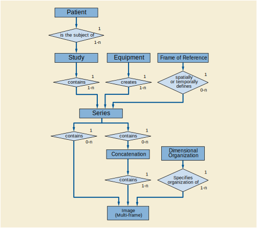

.. _chapter_7:

DICOM Model of the Real World
=============================

`figure_title <#figure_7-1a>`__, `figure_title <#figure_7-1b>`__ and
`figure_title <#figure_7-3>`__ depict the DICOM view of the Real-World
that identifies the relevant Real-World Objects and their relationships
within the scope of the DICOM Standard. It provides a common framework
to ensure consistency between the various Information Objects defined by
the DICOM Standard.

.. figure:: figures/PS3.3_7-3.svg
   :alt: Model of the Real World for the Purpose of Modality-IS
   Interface
   :name: figure_7-3

   Model of the Real World for the Purpose of Modality-IS Interface

.. _sect_7.1:

DICOM Information Model
-----------------------

The DICOM Information Model is derived from the DICOM Model of the Real
World. The DICOM Information Model presented by
`figure_title <#figure_7-2b>`__, `figure_title <#figure_7-2c>`__ and
`figure_title <#figure_7-2d>`__ identify the various IODs specified by
this Standard and their relationships. There is not always a one-to-one
correspondence between DICOM Information Object Definitions and
Real-World Objects. For example a Composite IOD contains Attributes of
multiple real-world objects such as Series, Equipment, Frame of
Reference, Study and Patient.

The entities in `figure_title <#figure_7-2b>`__,
`figure_title <#figure_7-2c>`__ and `figure_title <#figure_7-2d>`__
correspond to IODs defined in `Composite Information Object Definitions
(Normative) <#chapter_A>`__, `Normalized Information Object Definitions
(Normative) <#chapter_B>`__ and `Information Module Definitions
(Normative) <#chapter_C>`__.

.. _sect_7.2:

Organization of Annexes A, B and C
----------------------------------

`Composite Information Object Definitions (Normative) <#chapter_A>`__
defines Composite IODs (e.g., Images) acquired on a number of Modalities
(e.g., CT, MR, NM, US, CR, Secondary Capture). These Composite IODs
reference Modules found in `Information Module Definitions
(Normative) <#chapter_C>`__.

`Normalized Information Object Definitions (Normative) <#chapter_B>`__
defines Normalized IODs (e.g., Film Session, Print Job) for a number of
Service Classes specified in . These Normalized IODs reference Module
definitions found in `Information Module Definitions
(Normative) <#chapter_C>`__.

.. _sect_7.3:

Extension of the DICOM Model of the Real World
----------------------------------------------

For the purpose of the Basic Worklist Management Service Class and the
Modality Performed Procedure Step SOP Classes an enhancement of the
original DICOM Model of the Real World is made, as depicted in
`figure_title <#figure_7-3>`__.

discusses the relationship of this extension to the original DICOM model
of the real world.

`figure_title <#figure_7-3>`__ is an abstract description of the real
world objects invoked in the Modality-IS Interface. It is not to be seen
as a database scheme for an implementation.

.. _sect_7.3.1:

Definition of the Extensions of the DICOM Real World Model
~~~~~~~~~~~~~~~~~~~~~~~~~~~~~~~~~~~~~~~~~~~~~~~~~~~~~~~~~~

.. _sect_7.3.1.1:

Patient
^^^^^^^

A Patient is a human or animal receiving, or registered to receive,
healthcare services, or the subject of one or more Studies for some
other purpose, such as research.

.. note::

   In some circumstances, multiple humans or animals may be studied
   simultaneously, and for the purpose of the model are identified as a
   single Patient. E.g., a mother and one or more fetuses during
   antepartum obstetric ultrasound, multiple specimens in a single
   tissue microarray, or a group of multiple research small animals
   imaged simultaneously.

.. _sect_7.3.1.2:

Service Episode and Visit
^^^^^^^^^^^^^^^^^^^^^^^^^

A Service Episode is a collection of events, aggregated during an
interval bounded by start and stop times. A Service Episode is the
context in which the treatment or management of an arbitrary subset of a
Patient's medical conditions occurs. The definition of the start time,
stop time, and included events of a Service Episode is entirely
arbitrary; it may include a single outpatient visit or a
hospitalization, or extend over significant period of time, e.g., the
duration of a pregnancy, or an oncology treatment regimen, or a cardiac
episode from infarction through rehabilitation. A Service Episode may
involve one or more Healthcare Organizations (administrative entities
that authorize Healthcare Providers to provide services within their
legal administrative domain, e.g., hospitals, private physician's
offices, multispecialty clinics, nursing homes).

A subset of Service Episode, the Visit, is the collection of events that
fall under the accountability of a particular Healthcare Organization in
a single facility. A Visit may be associated with one or more physical
locations (e.g., different rooms, departments, or buildings) within the
Healthcare Organization's definition of a facility, with admission and
discharge diagnoses and with time boundaries of the visit.

.. note::

   1. The Visit is a part of the Service Episode. The Service Episode
      describes several administrative aspects of healthcare, while the
      Visit is limited to the description of one visit of a Patient to a
      facility.

   2. In the context of the Modality Worklist SOP Class, the Attributes
      of the Service Episode are defined in the Visit Modules.

   3. The Attributes for Visit often use the term "admission" for
      historical reasons, although a visit in an ambulatory clinic does
      not involve an admission as an in-patient.

.. _sect_7.3.1.3:

Imaging Service Request
^^^^^^^^^^^^^^^^^^^^^^^

An Imaging Service Request is a set of one or more Requested Procedures
selected from a list of Procedure Types. An Imaging Service Request is
submitted by one authorized imaging service requester to one authorized
imaging service provider in the context of one Service Episode. An
Imaging Service Request includes pertinent specific and general
information. Each instance of an Imaging Service Request carries the
information common to one or more Requested Procedures requested at the
same moment. An Imaging Service Request may be associated with one or
more Visits that occur within the same Service Episode. The existence of
an Imaging Service Request will typically result in the creation of one
or more Imaging Service Reports and the distribution of Imaging Service
Reports to one or more destinations.

In the context of the Modality Worklist the information provided by the
Imaging Service Request aims at performing one or more imaging
procedures, i.e., at acquiring new images.

.. _sect_7.3.1.4:

Procedure Type
^^^^^^^^^^^^^^

A Procedure Type identifies a class of procedures. In the context of
imaging services, a Procedure Type is an item in a catalog of imaging
procedures that can be requested and reported upon in an imaging service
facility. An instance of a Procedure Type typically has a name and one
or more other identifiers. A Procedure Type is associated with one or
more Procedure Plans.

.. note::

   The information content of this entity relates to the general
   identification of a Procedure Type rather than to its decomposition
   into the protocol(s) required to perform a specific instance of a
   Requested Procedure for a particular Patient.

.. _sect_7.3.1.5:

Requested Procedure
^^^^^^^^^^^^^^^^^^^

A Requested Procedure is an instance of a Procedure of a given Procedure
Type. An instance of a Requested Procedure includes all of the items of
information that are specified by an instance of a Procedure Plan that
is selected for the Requested Procedure by the imaging service provider.
This Procedure Plan is defined by the imaging service provider on the
basis of the Procedure Plan templates associated with the considered
Procedure Type. An Imaging Service Request may include requests for
several different Requested Procedures. The purpose of this entity is to
establish the association between Imaging Service Requests and Procedure
Types, to convey the information that belongs to this association and to
establish the relationships between Requested Procedures and the other
entities that are needed to describe them. A single Requested Procedure
of one Procedure Type is the smallest unit of service that can be
requested, reported, coded and billed. Performance of one instance of a
Requested Procedure is specified by exactly one Procedure Plan. A
Requested Procedure leads to one or more Scheduled Procedure Steps
involving Protocols as specified by a Procedure Plan. A Requested
Procedure may be associated with one or more Visits. A Requested
Procedure may involve one or more pieces of equipment.

.. _sect_7.3.1.6:

Scheduled Procedure Step
^^^^^^^^^^^^^^^^^^^^^^^^

A Modality Scheduled Procedure Step is an arbitrarily defined scheduled
unit of service, that is specified by the Procedure Plan for a Requested
Procedure. A Modality Scheduled Procedure Step prescribes a Protocol,
which may be identified by one or more protocol codes. A Modality
Scheduled Procedure Step involves equipment (e.g., imaging Modality
equipment, anesthesia equipment, surgical equipment, transportation
equipment), human resources, consumable supplies, location, and time
(e.g., start time, stop time, duration). While in the context of imaging
services the scheduling of a Modality Scheduled Procedure Step might
include only a general designation of imaging Modality that could be
satisfied by multiple pieces of the same equipment type, the performance
of one instance of a Modality Scheduled Procedure Step involves one and
only one piece of imaging Modality equipment.

The performance of a Modality Scheduled Procedure Step may result in the
creation of zero or more Modality Performed Procedure Step Instances.

.. note::

   1. The Procedure Step entity is provided to support management of the
      logistical aspects of procedures (e.g., materials management,
      human resources, scheduling). The full definition of the contents
      of Procedure Steps and protocols according to which they are
      performed is implementation dependent and is beyond the scope of
      this Standard.

   2. A Modality Scheduled Procedure Step may contribute to more than
      one Requested Procedure (e.g., a Modality Scheduled Procedure Step
      requiring an intravenous iodine contrast injection might be shared
      by an intravenous pyelogram and a CT examination). However, for
      billing purposes an Instance of a Modality Scheduled Procedure
      Step is typically considered to be a part of only one Requested
      Procedure.

.. _sect_7.3.1.7:

Procedure Plan
^^^^^^^^^^^^^^

A Procedure Plan is a specification that defines the set of Protocols
that must be done in order to perform the Scheduled Procedure Steps of a
Requested Procedure. Each Scheduled Procedure Step is performed
according to a single Protocol, which may be identified by one or more
Protocol Codes and may be described in a Defined Procedure Protocol. The
Protocols actually performed during a Procedure Step may be recorded in
a Performed Procedure Protocol and may differ from those prescribed in
the related Procedure Plan. Audit of actually performed Protocols versus
the prescribed Procedure Plan is an important element of quality
control.

.. _sect_7.3.1.8:

Protocol
^^^^^^^^

A Protocol is a specification of actions prescribed by a Procedure Plan
to perform a specific Procedure Step. A Scheduled Procedure Step
contains only one Protocol, which may be conveyed by one or more
Protocol Codes.

A Protocol may be specified by a Defined Procedure Protocol to be used
on any appropriate Patient.

A Protocol can be documented, once a Procedure Step has been performed,
in a Performed Procedure Protocol.

.. _sect_7.3.1.8.1:

Defined Procedure Protocol
''''''''''''''''''''''''''

A Defined Procedure Protocol describes a set of parameters and
associated details for the prescribed action. The Defined Procedure
Protocol may provide specific values for relevant parameters, or may
provide constraints on those parameters (such as an acceptable range) to
guide the choice of specific values.

Defined Procedure Protocol is not associated with any particular Patient
or Scheduled Procedure Step. A Defined Procedure Protocol may contain
parameters specific to a particular model or version of device, or it
may be generic in that it only describes parameters common to multiple
device models.

A Defined Procedure Protocol may include information such as the
clinical purpose, indications, and appropriate device models, intended
for selection and management.

.. _sect_7.3.1.8.2:

Performed Procedure Protocol
''''''''''''''''''''''''''''

A Performed Procedure Protocol encodes the parameter values used. A
Performed Procedure Protocol is always associated with a specific
Patient and Performed Procedure Step. The Performed Procedure Protocol
may reference the Defined Procedure Protocol on which it was based, but
does not otherwise record the orginal constraints and whether or not
they were satisfied by the final values as recorded in the Performed
Procedure Protocol.

.. _sect_7.3.1.9:

Modality Performed Procedure Step
^^^^^^^^^^^^^^^^^^^^^^^^^^^^^^^^^

A Performed Procedure Step is an arbitrarily defined unit of service
that has actually been performed (not just scheduled). Logically it
corresponds to a Scheduled Procedure Step, but real-world conditions may
dictate that what is actually performed does not correspond exactly with
what was requested or scheduled.

.. note::

   For example, two or more Scheduled Procedure Steps, Requested
   Procedures or Imaging Service Requests may have been generated by
   different Referring Physicians but may be satisfied be a single
   Performed Procedure Step at the discretion of a Performing Physician
   or Operator. Alternatively, a single Scheduled Procedure Step may
   need to be satisfied by multiple Performed Procedure Steps on
   different types or instances of equipment, due to clinical need or
   failure conditions, or over extended periods of time.

It contains information describing the type of procedure actually
performed. This information is represented by the Performed Protocol
that may be defined by one or more Protocol Codes.

A Requested Procedure results in the creation of zero or more Performed
Procedure Steps.

A Scheduled Procedure Step results in the creation of zero or more
Performed Procedure Steps.

The Performed Procedure Step contains information about its state (e.g.,
in progress, discontinued or completed).

A Modality Performed Procedure Step is a Performed Procedure Step that
results from activity (such as the acquisition of images from a Patient
or other Imaging Subject) on a Modality.

It contains information describing the performance of a step of an
imaging procedure, including data about the performance of the procedure
itself, and data for billing and material management.

The Modality Performed Procedure Step contains references to zero or
more Series of Images and other Composite SOP Instances that may be
created as part of the procedure step. A particular Series is part of
only one Modality Performed Procedure Step.

The purpose of the Modality Performed Procedure Step is to report what
was performed; it does not imply any storage semantics. While the MPPS
represents a unit of service within a workflow, the specification of the
workflow itself is beyond the scope of the Standard, and the MPPS does
not identify or control any subsequent activities to be performed.

.. note::

   1. For example, a modality may create both "for processing" images
      for automated analysis and "for presentation" images for human
      review from the same acquisition. The Standard does not specify
      whether the production of these is a single unit of service, or
      two. A single Modality Performed Procedure Step Instance could
      list both the "for processing" images and the "for presentation"
      images, regardless of whether or not both sets of images were
      stored to the same or different AEs, or indeed were stored at all,
      since the MPPS is independent of the storage semantics.
      Alternatively, the modality may treat these two sets of images as
      two separate units of service, and send two separate MPPS
      Instances.

      A Radiation Dose SR from the irradiation events of an acquisition
      could be referenced in the same MPPS Instance as that of the
      acquired images, again irrespective of where such a Radiation Dose
      Structured Report might be transmitted, if at all. Alternatively,
      the modality may treat the production of the Radiation Dose SR as
      a separate unit of service, and report it in a distinct MPPS.

      Another example is the case of thin and thick slice CT images
      acquired from the same acquisition (raw) data. When the
      reconstruction of both sets of images is prospectively defined and
      automatically initiated by the protocol selection, then both sets
      might be referenced from a single MPPS Instance. However, if the
      reconstruction of one or the other set is performed
      retrospectively by manual intervention some time after the
      acquisition MPPS had been completed, the subsequent Instances will
      necessarily be referenced in a new MPPS Instance, since the
      acquisition MPPS cannot be modified once completed.

   2. The completion of an MPPS may be a significant event that triggers
      or enables downstream activity, but it is not the intent to
      require the modality to be configured to "manage" such activity.
      The "units of service" that the modality describes in an MPPS, and
      how the modality relates those Performed Procedure Steps to
      Scheduled Procedure Steps, are implementation decisions beyond the
      scope of the Standard. The IHE Radiology Scheduled Workflow
      Profile provides additional guidance for implementation.

   3. An MPPS may describe Instances that were acquired but that have
      not been, nor may ever be, stored. For example, a modality may be
      capable of storing a CT acquisition as multiple single-frame CT
      Image Storage SOP Instances, as a single multi-frame Enhanced CT
      Image Storage SOP Instance, or as several Enhanced CT Image
      Storage SOP Instances that together comprise a Concatenation. An
      MPPS may describe all three possibilities, even though only one
      choice may ultimately be stored, perhaps depending on the
      negotiated capabilities of the storage recipient. Alternatively,
      separate MPPS Instances could be used for different storage SOP
      Classes.

   4. The MPPS contains only the Instances that the modality created,
      not Instances converted and created subsequently in response to a
      query (e.g., during legacy conversion).

   5. The MPPS is not a substitute for, nor is equivalent to, a Storage
      Commitment request, nor an Instance Availability Notification.

.. _sect_7.3.1.10:

General Purpose Scheduled Procedure Step (Retired)
^^^^^^^^^^^^^^^^^^^^^^^^^^^^^^^^^^^^^^^^^^^^^^^^^^

Retired. See
`PS3.3-2011 <ftp://medical.nema.org/MEDICAL/Dicom/2011/11_03pu.pdf>`__.

.. _sect_7.3.1.11:

General Purpose Performed Procedure Step (Retired)
^^^^^^^^^^^^^^^^^^^^^^^^^^^^^^^^^^^^^^^^^^^^^^^^^^

Retired. See
`PS3.3-2011 <ftp://medical.nema.org/MEDICAL/Dicom/2011/11_03pu.pdf>`__.

.. _sect_7.3.1.12:

Workitem (Retired)
^^^^^^^^^^^^^^^^^^

Retired. See
`PS3.3-2011 <ftp://medical.nema.org/MEDICAL/Dicom/2011/11_03pu.pdf>`__.

.. _sect_7.3.1.13:

Clinical Document
^^^^^^^^^^^^^^^^^

A Clinical Document is a part of the medical record of a Patient. A
Clinical Document is a documentation of clinical observations and
services and has the following characteristics:

-  Persistence - A clinical document continues to exist in an unaltered
   state, for a time period defined by local and regulatory
   requirements.

-  Stewardship - A clinical document is maintained by an organization
   entrusted with its care.

-  Potential for authentication - A clinical document is an assemblage
   of information that is intended to be legally authenticated.

-  Context - A clinical document establishes the default context for its
   contents.

-  Wholeness - Authentication of a clinical document applies to the
   whole and does not apply to portions of the document without the full
   context of the document.

-  Human readability - A clinical document is human readable.

.. note::

   This definition is from ANSI/HL7 CDA R1.0-2000, and HL7 v3 CDA
   R2-2005.

Clinical Documents may provide significant context for the performance
of imaging and related procedures, e.g., patient clinical history,
pre-imaging-procedure lab test results, or patient advance medical
directives.

Clinical Documents may be associated with Service Episodes, Service
Requests, Requested Procedures, or other entities subsidiary to the
Patient in the Real-World Model. Such associations are not explicitly
modeled for the purposes of the Modality-IS context.

Clinical Documents are one sub-class of the class of healthcare
Structured Documents; Structured Documents, in general, are not
necessarily related to a Patient. Structured Documents may be used for
imaging procedure operational instructions, e.g., in product labeling,
Procedure Plans, or patient care plans.

.. note::

   1. The format and semantics of Structured Documents, including
      Clinical Documents, are defined outside the scope of the DICOM
      Standard (e.g., by HL7). DICOM provides the means to reference
      Structured Documents within the Modality-IS context.

   2. The general class of Structured Documents is not modeled in the
      Real-World Model; only specific sub-classes, e.g., Clinical
      Documents, are modeled.

.. _sect_7.4:

Extension of the DICOM Model of the Real World for the General Purpose Worklist (Retired)
-----------------------------------------------------------------------------------------

Retired. See
`PS3.3-2011 <ftp://medical.nema.org/MEDICAL/Dicom/2011/11_03pu.pdf>`__.

.. _sect_7.5:

Organizing Large Sets of Information
------------------------------------

For the purpose of accommodating large sets of frames in Multi-frame
Image SOP Instances the Real-World Entity Relationship Diagram has been
extended to describe the relationships of these instances: Concatenation
(see `Concatenation <#sect_7.5.1>`__) and Dimension Organization (see
`Dimension Organization <#sect_7.5.2>`__).
`figure_title <#figure_7.5-1>`__ depicts the additions to
`figure_title <#figure_7-1a>`__.

   Dimensions
   :name: figure_7.5-1

   Extension of the Real World Model with Concatenations and Dimensions

.. _sect_7.5.1:

Concatenation
~~~~~~~~~~~~~

For implementation specific reasons (such as practical limits on the
maximum size of an individual SOP Instance) the content of a multi-frame
image may need to be split into more than one SOP Instance. These SOP
Instances together form a Concatenation, which is a group of SOP
Instances within a Series that is uniquely identified by Concatenation
UID (0020,9161).

.. _sect_7.5.2:

Dimension Organization
~~~~~~~~~~~~~~~~~~~~~~

The Dimension Organization contains a set of dimensions. A dimension is
a set of Attributes that change on a per-frame basis in a manner that is
known before the image is acquired, are defined by the generating
application and are especially intended for presentation. Other
Attributes may also change on a per-frame basis but if they are not
present in the Dimension Organization, they are not considered
significant as a dimension for organizational purposes.

Receiving applications shall use the order of dimensions for guidance
when presenting images if the `Multi-frame Dimension
Module <#sect_C.7.6.17>`__ is present. The first Item of the Dimension
Index Sequence shall be the slowest varying index.

.. note::

   See `Multi-frame Dimension Module <#sect_C.7.6.17>`__ for an example.

.. _sect_7.6:

Extension of the DICOM Model of the Real World for Clinical Trials and Research
-------------------------------------------------------------------------------

The DICOM Model of the Real World is extended for Clinical Trials and
research with the addition of several objects whose relationships to
each other and existing DICOM Real World objects are shown in
`figure_title <#figure_7.6-1>`__.

Attributes of the Clinical Trial Sponsor, Clinical Trial Protocol,
Clinical Trial Subject, and Clinical Trial Site objects are represented
in the `Clinical Trial Subject Module <#sect_C.7.1.3>`__ within the
Patient IOD. Attributes of the Clinical Trial Time Point object are
represented in the `Clinical Trial Study Module <#sect_C.7.2.3>`__
within the Study IOD. The Clinical Trial Coordinating Center Attribute
is represented in the `Clinical Trial Series Module <#sect_C.7.3.2>`__
within Image IODs.

.. _sect_7.6.1:

Clinical Trial and Research Information Entities
~~~~~~~~~~~~~~~~~~~~~~~~~~~~~~~~~~~~~~~~~~~~~~~~

For the purpose of Clinical Trial and Research Information, an extension
of the DICOM Model of the Real World is made, as depicted in
`figure_title <#figure_7.6-1>`__.

.. _sect_7.6.1.1:

Clinical Trial Sponsor
^^^^^^^^^^^^^^^^^^^^^^

A Clinical Trial Sponsor identifies the agency, group, or institution
responsible for conducting and/or funding the clinical trial or
research, and for assigning a Protocol Identifier.

.. _sect_7.6.1.2:

Clinical Trial Protocol
^^^^^^^^^^^^^^^^^^^^^^^

A Clinical Trial Protocol identifies the investigational Protocol in
which the Subject has been enrolled. The Protocol has a Protocol
Identifier and Protocol Name, as well as information related to Ethics
Committee, Institutional Review Board (IRB) or Institutional Animal Care
and Use Committees (IACUC) approval.

.. _sect_7.6.1.3:

Clinical Trial Subject
^^^^^^^^^^^^^^^^^^^^^^

A Clinical Trial Subject identifies the Patient who is enrolled as a
Subject in the investigational Protocol.

.. _sect_7.6.1.4:

Clinical Trial Site
^^^^^^^^^^^^^^^^^^^

A Clinical Trial Site identifies the location or institution at which
the Subject is treated or evaluated and that is responsible for
submitting clinical trial or research data. Images and/or clinical trial
data may be collected for a given Subject at alternate institutions,
e.g., follow-up scans at a satellite imaging center, but the Clinical
Trial Site represents the primary location for Patient management and
data submission in the context of a clinical trial or research. In
pre-clinical research with small animals, it is typically the single
laboratory or shared resource facility.

.. _sect_7.6.1.5:

Clinical Trial Time Point
^^^^^^^^^^^^^^^^^^^^^^^^^

The Clinical Trial Time Point identifies an imaging Study within the
context of a series of longitudinal data acquisitions in an
investigational protocol. A Time Point defines a set of Studies that are
grouped together as a clinical time point or submission in a clinical
trial or for other research.

.. _sect_7.6.1.6:

Clinical Trial Coordinating Center
^^^^^^^^^^^^^^^^^^^^^^^^^^^^^^^^^^

The Clinical Trial Coordinating Center identifies the institution
responsible for coordinating the collection, management, processing,
and/or analysis of images and associated data for Subjects enrolled in a
clinical trial or research. Within a given Clinical Trial Protocol,
there may be multiple Clinical Trial Coordinating Centers, each handling
different aspects of the clinical data submitted by the Clinical Trial
Sites. In pre-clinical research with small animals, it may be a facility
where post processing is performed, separate from the laboratory where
the data is acquired.

.. _sect_7.7:

Extension of the DICOM Model of the Real World for Hanging Protocols
--------------------------------------------------------------------

See `DICOM Model of the Real World for Non-Patient-Related
Information <#sect_7.13>`__.

.. note::

   The specifications of this section have been consolidated into the
   Real World Model for Non-Patient-Related Information.

.. _sect_7.8:

Extension of the DICOM Model of the Real World for Color Palettes
-----------------------------------------------------------------

See `DICOM Model of the Real World for Non-Patient-Related
Information <#sect_7.13>`__.

.. note::

   The specifications of this section have been consolidated into the
   Real World Model for Non-Patient-Related Information.

.. _sect_7.9:

Extension of the DICOM Model of the Real World for Specimens
------------------------------------------------------------

The DICOM Model of the Real World is extended for Specimens with the
addition of several objects whose relationships to each other and
existing DICOM Real World objects are shown in
`figure_title <#figure_7.9-1>`__.

Attributes of the Specimen, Container, Component and Preparation Step
objects are represented in the `Specimen Module <#sect_C.7.6.22>`__
within the Image IODs.

.. _sect_7.9.1:

Specimen
~~~~~~~~

A physical object (or a collection of objects) is a specimen when the
laboratory considers it a single discrete, uniquely identified unit that
is the subject of one or more steps in the laboratory (diagnostic)
workflow.

.. _sect_7.9.2:

Container
~~~~~~~~~

Specimen containers (or just "containers") play an important role in
laboratory (diagnostic) processes. In most, but not all, process steps,
specimens are held in containers, and a container often carries its
specimen's ID. Sometimes the container becomes intimately involved with
the specimen (e.g., a paraffin block), and in some situations (such as
examining tissue under the microscope) the container (the slide and
coverslip) become part of the optical path.

.. _sect_7.9.3:

Container Component
~~~~~~~~~~~~~~~~~~~

Containers are often made up of components. For example, a "slide" is
container that is made up of the glass slide, the coverslip and the
"glue" the binds them together.

.. _sect_7.9.4:

Preparation Step
~~~~~~~~~~~~~~~~

Before a slide is imaged, the preparation of the specimen (including
sampling, processing and staining) will take place. Specimen preparation
is described as a sequence of time-stamped process steps. Multiple steps
are possible, and may include sampling from ancestor specimens.

.. _sect_7.10:

Extension of DICOM Model of the Real World for Implant Templates
----------------------------------------------------------------

See `DICOM Model of the Real World for Non-Patient-Related
Information <#sect_7.13>`__.

.. note::

   The specifications of this section have been consolidated into the
   Real World Model for Non-Patient-Related Information.

.. _sect_7.11:

Extension of the DICOM Model of the Real World for the Unified Procedure Step (UPS)
-----------------------------------------------------------------------------------

The DICOM Model of the Real World is extended with the addition of a
Unified Procedure Step object whose relationship to existing DICOM Real
World objects is shown in `figure_title <#figure_7.11-1>`__.

.. _sect_7.11.1:

Unified Procedure Step
~~~~~~~~~~~~~~~~~~~~~~

A Unified Procedure Step (UPS) represents an arbitrary unit of service.
Unified Procedure Steps are generally scheduled in response to a
Requested Procedure, although a UPS may be triggered by other events,
such as a scheduled calibration, completion of prior work in a pipeline,
etc.

The Unified Procedure Step (UPS) unifies the details of the procedure
step that has been requested, the progress details during performance,
and the details of the procedure step actually performed. The details
can describe the specific service activity, the subject and/or data
acted on, the originator and context of the request, the
human/equipment/application resources involved, the priority, date, time
and location of the activity, and references to resulting output data.

Normally the details about the activity as performed correspond to the
details of the activity as requested, however real-world conditions may
dictate that what is actually performed does not correspond exactly with
what was requested or scheduled.

.. _sect_7.11.2:

Worklist
~~~~~~~~

A Worklist is an arbitrary collection of Unified Procedure Steps that
share a common worklist label.

.. _sect_7.12:

Extension of The DICOM Model of The Real World For Display System
-----------------------------------------------------------------

The DICOM Model of the Real World is extended for Display System with
the addition of an entity that is separate from the rest of the DICOM
Real World objects, as shown in `figure_title <#figure_7.12-1>`__. A
Display System is not associated with any specific objects in the
existing DICOM Information model, because it is not associated with a
specific Patient. One Display System object is included in a Display
System IOD.

A Display Subsystem represents the target of a Display QA task such as
calibration. For example, a PACS reading station with one color
controller driving one display, and 4 grayscale displays each driven by
two controllers is modeled as 5 Display Subsystems, each of which can be
the target of a Display QA task. A tablet represents one Display System
with a Display Device but no externally exposed controller. Although
Display Subsystem may include components beyond the Display Device, this
Model focuses on the Display Device only.

`figure_title <#figure_7.12-2>`__ illustrates how the composition of
Display Subsystems is represented in the Display System IOD.

.. _sect_7.13:

DICOM Model of the Real World for Non-Patient-Related Information
-----------------------------------------------------------------

The DICOM Model of the Real World is extended for a variety of
non-patient-related information with the specification of entities that
are generally separate from the rest of the DICOM Real World Information
Model. These information entities are not associated with a specific
Patient. While there may be entity relationships, there is no hierarchy
applied to these entities.

.. _sect_7.13.1:

Hanging Protocol Information Entity
~~~~~~~~~~~~~~~~~~~~~~~~~~~~~~~~~~~

A Hanging Protocol Information Entity specifies the viewing preferences
of a specific user or group, for a specific type of Study (Modality,
Anatomy, Laterality combination, and optionally Procedure, and/or
Reason). A Hanging Protocol definition includes descriptors that
identify the Hanging Protocol, the creator, the type of Study it
addresses, the type of image sets to display, the intended display
environment, and the intended layout for the screen(s).

The Hanging Protocol IE does not have any relationships with other
Information Entities. See `figure_title <#figure_7.13-1>`__.

.. _sect_7.13.2:

Color Palette Information Entity
~~~~~~~~~~~~~~~~~~~~~~~~~~~~~~~~

A Color Palette Information Entity specifies a color palette suitable
for application to an image with a single channel of information
(grayscale) to render it in color, i.e., pseudo-coloring.

The Color Palette IE may be referenced by Image or Presentation State
Information Entities. See `figure_title <#figure_7.13-2>`__.

The Color Palette IOD instantiates the Color Palette IE only.

.. _sect_7.13.3:

Implant Related Information Entities
~~~~~~~~~~~~~~~~~~~~~~~~~~~~~~~~~~~~

.. _sect_7.13.3.1:

Implant Template Information Entity
^^^^^^^^^^^^^^^^^^^^^^^^^^^^^^^^^^^

An Implant Template Information Entity specifies a 2D- and/or
3D-template representing a physical implant. The IE specifies mechanisms
for implant assembly, i.e., the rigid connection of two or more
implants.

The Implant Template IE may be related to a Surface IE (see `Surface
IE <#sect_A.1.2.18>`__) or to an Encapsulated Document IE (see
`Encapsulated Document IE <#sect_A.1.2.16>`__) for the specification of
the 2D- or 3D-template.

The Implant Template IE may be related to a Frame of Reference IE (see
`Frame of Reference IE <#sect_A.1.2.5>`__) to support registration of
the template with Patient anatomical landmarks in a separate Frame of
Reference.

The Implant Template IE may be related to an Implant Assembly Template
IE for the specification of multi-part assemblies. The Implant Template
IE may be related to an Implant Template Group IE for shared management
of a set of templates.

See `figure_title <#figure_7.13-3>`__.

.. _sect_7.13.3.2:

Implant Assembly Template Information Entity
^^^^^^^^^^^^^^^^^^^^^^^^^^^^^^^^^^^^^^^^^^^^

An Implant Assembly Template Information Entity specifies how to combine
several implants to fulfill a certain purpose.

The Implant Assembly Template IE is related to Implant Template IEs.

.. _sect_7.13.3.3:

Implant Template Group Information Entity
^^^^^^^^^^^^^^^^^^^^^^^^^^^^^^^^^^^^^^^^^

An Implant Template Group Information Entity specifies a set of Implant
Templates for shared specification and management. It facilitates
browsing through a set of similar implants by providing similar matching
coordinates, and by ordering the referenced templates by dimensional
size or similar attributes.

The Implant Template Group IE is related to Implant Template IEs.

.. _sect_7.13.4:

Extension of The DICOM Model of The Real World For Protocol Storage
~~~~~~~~~~~~~~~~~~~~~~~~~~~~~~~~~~~~~~~~~~~~~~~~~~~~~~~~~~~~~~~~~~~

The DICOM Model of the Real World is extended with the addition of
Defined Procedure Protocol and Performed Procedure Protocol objects
whose whose relationship to existing DICOM Real World objects is shown
in `figure_title <#figure_7.13.4-1>`__.

Note that the information in the Equipment IE describes the equipment
that created the Instance. The information in the Protocol Parameters
may describe the equipment on which the protocol is intended to be
executed which may or may not be the same as the equipment that created
the Instance.

.. _sect_7.13.5:

Approval Information Entity
~~~~~~~~~~~~~~~~~~~~~~~~~~~

An Approval Information Entity describes an approval of an Instance.

.. _sect_7.14:

Extension of The DICOM Model of The Real-world for Radiotherapy Second Generation Information Objects
-----------------------------------------------------------------------------------------------------

For the purpose of RT Second Generation SOP Classes the DICOM Model of
the Real-World is described in this section. This subset of the
real-world model covers the requirements for transferring information
about planned and performed radiotherapeutic treatments and associated
data.

`figure_title <#figure_7.14-1>`__ describes the most important elements
involved in the radiotherapy domain in DICOM.

.. note::

   1. IODs which contain a representation of Volumes, Surfaces, Lines,
      Points can be annotated by an RT Segment Annotation.

   2. For better readability the diagram only contains the most
      important relationships, e.g. all objects have a relation to the
      Patient, but not all of these relationships are part of this
      diagram.

.. _sect_7.14.1:

RT Course
~~~~~~~~~

The RT Course is a top-level entity that represents a radiotherapy
treatment course, usually specified in one or more RT Prescriptions,
generally for a defined tumor or group of tumors. A patient undergoing
treatments of radiotherapy has one treatment course at a time. The RT
Course may consist of several RT Treatment Phases (possibly with breaks
of treatment in between them). Each treatment phase may consist of one
or more RT Treatment Sessions. An RT Treatment Session is delivered in
one patient visit to a venue with a treatment machine and will typically
deliver a fraction of one or more RT Radiation Sets. A new RT Course is
administered, when the patient is treated for a re-occurrence or a new
tumor site - typically after a period of a year or more after the
previous RT Course has been finished.

The RT Course can be thought of as a container collecting all major
objects which are relevant to this course. The RT Physician Intent and
RT Radiation Sets reference other companion objects necessary to
prepare, conduct and review the treatment. Timing information (start
dates and phasing of treatment, breaks etc.) are also part of the RT
Course information. Additionally it contains information of the ongoing
status in treatment planning and delivery. The RT Course is a dynamic
object that represents the current status of the patient"s treatment.

The RT Course may also include information about previously conducted
treatments by referencing previous RT Course objects or by directly
recording the information in Attributes.

.. _sect_7.14.2:

RT Physician Intent
~~~~~~~~~~~~~~~~~~~

The RT Physician Intent describes how the physician wishes to achieve
curative or palliative therapy. This information includes, but is not
limited to the use of external radiation therapy or brachytherapy, total
and fractional doses and fractionation schemes, treatment sites,
Dosimetric Objectives, envisioned treatment technique, beam energy or
isotopes, and patient setup notes.

.. _sect_7.14.3:

Conceptual Volume
~~~~~~~~~~~~~~~~~

The Conceptual Volume is a reference to a certain anatomical region or
point. Conceptual Volumes may or may not have a representation in
segmented images. In most cases they will be related to one or more
volumetric representations in various image sets taken at different
times.

For example, during a radiotherapy course at the time of prescription,
physicians specify regions to which dose is prescribed. Subsequently
these regions are referenced in other objects in order to track
calculated and delivered dose in the course of treatment. This
referencing capability is provided by the Conceptual Volume.

.. _sect_7.14.4:

RT Segment Annotation
~~~~~~~~~~~~~~~~~~~~~

The RT Segment Annotation annotates segmented regions defined in other
SOP Instances with radiotherapy-specific information about the role and
RT-specific types of the regions (e.g. clinical target volume, organ at
risk, bolus) , and other information such as density definitions. An RT
Segment Annotation SOP Instance may reference any geometric
general-purpose representation entity defined by DICOM.

.. _sect_7.14.5:

RT Radiation Set
~~~~~~~~~~~~~~~~

An RT Radiation Set is a collection of RT Radiations. An RT Radiation
Set defines a Radiotherapy treatment fraction, which will be applied one
or more times. The RT Radiation Set is delivered by delivering the
radiation of all referenced RT Radiations.

Parallel and intermittent fractionation schemes, e.g. treatment of
several target sites with different timing schemes, are represented by
multiple RT Radiation Sets.

.. _sect_7.14.6:

RT Radiation
~~~~~~~~~~~~

An RT Radiation is a contiguous set of Control Points, describing
machine and positioning parameters to be applied during treatment
delivery. An RT Radiation describes one portion of an RT Radiation Set
and represents an single-fraction delivery of therapeutic radiation
intended to be delivered in an indivisible manner. An RT Radiation is
typically referred to in end-user terminology as a beam (in external
beam treatment) or a catheter (in brachytherapy).

.. _sect_7.14.7:

RT Radiation Record
~~~~~~~~~~~~~~~~~~~

The RT Radiation Record records actual treatment parameters that have
been applied during the delivery of an RT Radiation in the context of a
specific fraction. Typically, those parameters are the same as those
described within an RT Radiation, but may differ due to therapist
decisions and/or circumstances of the delivery technology and/or for
various other reasons.

.. _sect_7.14.8:

RT Treatment Phase
~~~~~~~~~~~~~~~~~~

An RT Course may be divided into multiple RT Treatment Phases. Each RT
Treatment Phase represents a period of time during which a defined
number of RT Treatment Fractions are delivered by RT Radiation Sets in
order to reach a specific treatment goal (see `RT Fractionation, RT
Fractionation Scheme <#sect_7.14.9>`__ and `RT Treatment Session, RT
Treatment Fraction <#sect_7.14.10>`__).

An RT Treatment Phase also defines the chronological relationship
between RT Radiation Sets that are concurrently and/or subsequently
treated.

.. _sect_7.14.9:

RT Fractionation, RT Fractionation Scheme
~~~~~~~~~~~~~~~~~~~~~~~~~~~~~~~~~~~~~~~~~

Fractionation describes the splitting of a course of therapeutic
radiation delivery into multiple sessions. Each session may consist of
the delivery of one or more RT Radiation Sets. The temporal pattern of
session is called a fractionation scheme.

Further descriptions and examples of this such schemes can seen in `RT
Treatment Session, RT Treatment Fraction <#sect_7.14.10>`__.

.. _sect_7.14.10:

RT Treatment Session, RT Treatment Fraction
~~~~~~~~~~~~~~~~~~~~~~~~~~~~~~~~~~~~~~~~~~~

An RT Treatment Session is a collection of RT treatment events which are
performed in a contiguous manner without any break in-between (other
than time needed for required preparations) during a single Visit. It
denotes the time period between the patient entering the treatment room
and leaving the treatment room. In a treatment session one or more RT
Radiation Sets (RSet in `figure_title <#figure_7.14-2>`__) may be
treated. An RT Treatment Session may also include imaging. A group of
radiation deliveries that are separated by an intentional delay to
accommodate radiobiological recovery effects are considered separate
Treatment Sessions.

Each treatment of an RT Radiation Set is labeled as an RT Treatment
Fraction (often abbreviated as Fx) with a fraction number starting with
1 at the first RT Treatment Session in which the RT Radiation Set is
delivered, incremented by 1 at each subsequent treatment session.

An RT Treatment Fraction is the delivery of a portion of the total dose
(whose delivery is defined by an RT Radiation Set) which has been
divided equally into smaller doses to be delivered over a period of time
(e.g. daily for 4-6 weeks). In radiotherapy, this division of dose over
a period of time is known as dose fractionation.

Partial treatments annotate RT Treatment Fractions, that are not
completely performed for any reason (e.g. patient sickness, delivery
device breakdown). The remainder of the RT Treatment Session is usually
delivered at a later time.This remaining portion has the same fraction
number as the one of the Partial Treatment Session. Further treatments
will start a new RT Treatment Fraction with an incremented fraction
number.

In `figure_title <#figure_7.14-3>`__, the shaded areas of each Radiation
Set represent the portion where dose is actually delivered. Partially
shaded Radiation Sets therefore represents a partial treatment.

.. _sect_7.14.11:

Dosimetric Objective
~~~~~~~~~~~~~~~~~~~~

The Dosimetric Objective Macro specifies an intended goal to be used in
the definition of the dosimetric plan for plan optimization etc.
Dosimetric Objectives may define limits which affect the dose, such as
dose volume constraints, minimum or maximum dose, treatment time or MU
limits, and radiobiologic effects.

