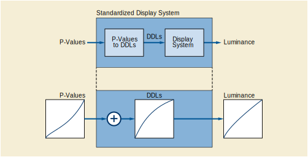

.. _chapter_6:

Overview
========

PS3.14 defines, mathematically, the Grayscale Standard Display Function
of Standardized Display Systems. These systems may be printers producing
hard-copies viewed on light-boxes or electronic Display Systems for
soft-copies.

Hard-copies may consist of transmissive films as well as reflective
prints. The image in these prints is represented by optical density
variations in transmission or diffuse reflection. To an observer, every
element of the image appears with a certain Luminance depending on the
Illuminance and the optical density of the image element.

Soft-copies may be produced by emissive Display Systems (such as CRT
monitors) or electronic light valves (such as light sources and liquid
crystal displays).

For the purpose of PS3.14, Display Systems take a Digital Driving Level
and produce Luminance or optical density variations that represent the
image. Predictable application of image transformations, such as the
modality, value-of-interest, and presentation look-up tables specified
in the DICOM Standard, requires knowledge of the Characteristic Curve of
the Display System. Standardizing the response function expected of the
Display System simplifies the application of such image transformations
across several different Display Systems such as encountered in a
network environment.

PS3.14 does not define when conformance with the Grayscale Standard
Display Function is achieved or how to characterize the degree of
conformance reached.

.. note::

   A definition of conformance would require thorough evaluations of
   human visual system sensitivity to deviations of Display Functions
   from the Grayscale Standard Display Function for medical images.

`figure_title <#figure_6-1>`__ and `figure_title <#figure_6-2>`__ show
the context for the Grayscale Standard Display Function. The Grayscale
Standard Display Function is part of the image presentation. There will
be a number of other modifications to the image before the Grayscale
Standard Display Function is applied. The image acquisition device will
adjust the image as it is formed. Other elements may perform a "window
and level" to select a part of the dynamic range of the image to be
presented. Yet other elements can adjust the selected dynamic range in
preparation for display. The Presentation LUT outputs P-Values
(presentation values). These P-Values become the Digital Driving Levels
for Standardized Display Systems. The Grayscale Standard Display
Function maps P-Values to the log-luminance output of the Standardized
Display System. How a Standardized Display System performs this mapping
is implementation dependent.

The boundary between the DICOM model of the image acquisition and
presentation chain, and the Standardized Display System, expressed in
P-Values, is intended to be both device independent and conceptually (if
not actually) perceptually linear. In other words, regardless of the
capabilities of the Standardized Display System, the same range of
P-Values will be presented ìsimilarlyî.

   P-Values to Luminance via an intermediate transformation to Digital
   Driving Levels of an unstandardized Display System.
   :name: figure_6-2

   The conceptual model of a Standardized Display System maps P-Values
   to Luminance via an intermediate transformation to Digital Driving
   Levels of an unstandardized Display System.

The main objective of PS3.14 is to define mathematically an appropriate
Grayscale Standard Display Function for all image presentation systems.
The purpose of defining this Grayscale Standard Display Function is to
allow applications to know *a priori*\ how P-Values are transformed to
viewed Luminance values by a Standardized Display System. In essence,
defining the Grayscale Standard Display Function fixes the "units" for
the P-Values output from the Presentation LUT and used as Digital
Driving Levels to Standardized Display Systems.

A second objective of PS3.14 is to select a Display Function that
provides some level of similarity in grayscale perception or basic
appearance for a given image between Display Systems of different
Luminance and that facilitates good use of the available Digital Driving
Levels of a Display System. While many different functions could serve
the primary objective, this Grayscale Standard Display Function was
chosen to meet the second objective. With such a function, P-Values are
approximately linearly related to human perceptual response. Similarity
does not guarantee equal information content. Display Systems with a
wider Luminance Range and/or higher Luminance will be capable of
presenting more just-noticeable Luminance differences to an observer.
Similarity also does not imply strict perceptual linearity, since
perception is dependent on image content and on the viewer. In order to
achieve strict perceptual linearity, applications would need to adjust
the presentation of images to match user expectations through the other
constructs defined in the DICOM Standard (e.g., VOI and Presentation
LUT). Without a defined Display Function, such adjustments on the wide
variety of Display Systems encountered on a network would be difficult.

The choice of the function is based on several ideas that are discussed
further in `Derivation of the Grayscale Standard Display Function
(Informative) <#chapter_A>`__.

`Table of the Grayscale Standard Display Function
(Informative) <#chapter_B>`__ contains the Grayscale Standard Display
Function in tabular form.

Informative `Measuring the Accuracy With Which a Display System Matches
the Grayscale Standard Display Function (Informative) <#chapter_C>`__
provides an example procedure for comparing mathematically the shape of
the actual Display Function with the Grayscale Standard Display Function
and for quantifying how well the actual discrete Luminance intervals
match those of the Grayscale Standard Display Function.

Display Systems often will have Characteristic Curves different from the
Grayscale Standard Display Function. These devices may contain means for
incorporating externally defined transformations that make the devices
conform with the Grayscale Standard Display Function. PS3.14 provides
examples of test patterns for Display Systems with which their behavior
can be measured and the approximation to the Grayscale Standard Display
Function evaluated (see Informative `Emissive Display
Systems <#sect_D.1>`__, `Transparent Hardcopy Devices <#sect_D.2>`__ and
`Reflective Display Systems <#sect_D.3>`__).

