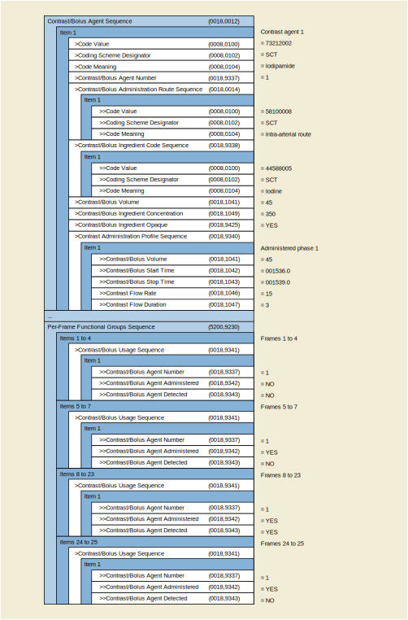
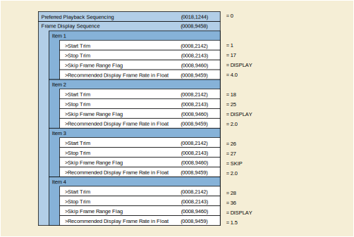
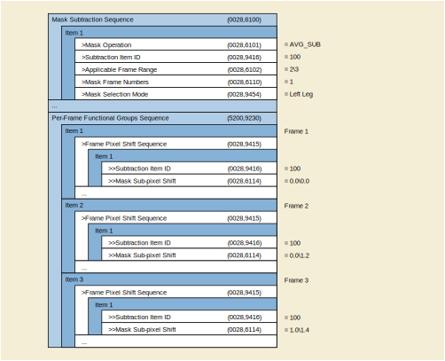
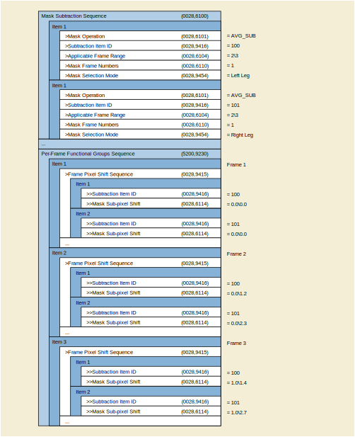
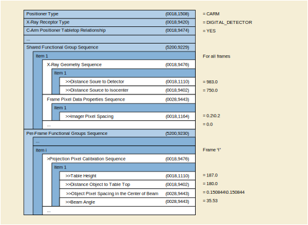
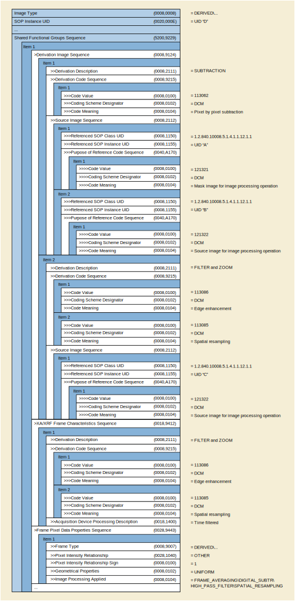

.. _chapter_FFF:

Enhanced XA/XRF Encoding Examples (Informative)
===============================================

.. _sect_FFF.1:

General Concepts of X-Ray Angiography
-------------------------------------

This chapter describes the general concepts of the X-Ray Angiography
equipment and the way these concepts can be encoded in SOP Instances of
the Enhanced XA SOP Class. It covers the time relationships during the
image acquisition, the X-Ray generation parameters, the conic projection
geometry in X-Ray Angiography, the pixel size calibration as well as the
display pipeline.

The following general concepts provide better understanding of the
examples for the different application cases in the rest of this Annex.

.. _sect_FFF.1.1:

Time Relationships
~~~~~~~~~~~~~~~~~~

.. _sect_FFF.1.1.1:

Time Relationships of A Multi-frame Image
^^^^^^^^^^^^^^^^^^^^^^^^^^^^^^^^^^^^^^^^^

The following figure shows the time-related Attributes of the
acquisition of X-Ray Multi-frame Images. The image and frame time
Attributes are defined as absolute times, the duration of the entire
image acquisition can be then calculated.

.. _sect_FFF.1.1.2:

Time Relationships of One Frame
^^^^^^^^^^^^^^^^^^^^^^^^^^^^^^^

The following figure shows the time-related Attributes of the
acquisition of an individual frame "i" and the relationship with the
X-Ray detector reading time and simultaneous ECG waveform acquisition.

.. note::

   1. Positioner angle values, table position values etc… are measured
      at the Frame Reference DateTime.

   2. Dose of the frame is the cumulative dose: PRE-FRAME + FRAME.

.. _sect_FFF.1.2:

Acquisition Geometry
~~~~~~~~~~~~~~~~~~~~

This chapter illustrates the relationships between the geometrical
models of the patient, the table, the positioner, the detector and the
pixel data.

The following figure shows the different steps in the X-Ray acquisition
that influences the geometrical relationship between the patient and the
pixel data.

.. _sect_FFF.1.2.1:

Patient Description
^^^^^^^^^^^^^^^^^^^

Refer to `Explanation of Patient Orientation (Normative) <#chapter_A>`__
for the definition of the patient orientation.

A point of the patient is represented as: P = (P\ :sub:`left`,
P\ :sub:`posterior`, P\ :sub:`head`).

.. _sect_FFF.1.2.2:

Patient Position
^^^^^^^^^^^^^^^^

.. _sect_FFF.1.2.2.1:

Table Description
'''''''''''''''''

The table coordinates are defined in .

The table coordinate system is represented as: (O\ :sub:`t`,
X\ :sub:`t`, Y\ :sub:`t`, Z\ :sub:`t`) where the origin O\ :sub:`t` is
located on the tabletop and is arbitrarily defined for each system.

.. _sect_FFF.1.2.2.2:

Options For Patient Position On The X-Ray Table
'''''''''''''''''''''''''''''''''''''''''''''''

The position of the patient in the X-Ray table is described in .

The table below shows the direction cosines for each of the three
patient directions (Left, Posterior, Head) related to the Table
coordinate system (X\ :sub:`t`, Y\ :sub:`t`, Z\ :sub:`t`), for each
patient position on the X-Ray table:

+----------------+----------------+----------------+----------------+
| **Patient      | **Patient left | **Patient      | **Patient head |
| Position**     | direction**    | posterior      | direction**    |
|                |                | direction**    |                |
+================+================+================+================+
| Recumbent -    | (1, 0, 0)      | (0, 1, 0)      | (0, 0, 1)      |
| Head First -   |                |                |                |
| Supine         |                |                |                |
+----------------+----------------+----------------+----------------+
| Recumbent -    | (-1, 0, 0)     | (0, -1, 0)     | (0, 0, 1)      |
| Head First -   |                |                |                |
| Prone          |                |                |                |
+----------------+----------------+----------------+----------------+
| Recumbent -    | (0, -1, 0)     | (1, 0, 0)      | (0, 0, 1)      |
| Head First -   |                |                |                |
| Decubitus      |                |                |                |
| Right          |                |                |                |
+----------------+----------------+----------------+----------------+
| Recumbent -    | (0, 1, 0)      | (-1, 0, 0)     | (0, 0, 1)      |
| Head First -   |                |                |                |
| Decubitus Left |                |                |                |
+----------------+----------------+----------------+----------------+
| Recumbent -    | (-1, 0, 0)     | (0, 1, 0)      | (0, 0, -1)     |
| Feet First -   |                |                |                |
| Supine         |                |                |                |
+----------------+----------------+----------------+----------------+
| Recumbent -    | (1, 0, 0)      | (0, -1, 0)     | (0, 0, -1)     |
| Feet First -   |                |                |                |
| Prone          |                |                |                |
+----------------+----------------+----------------+----------------+
| Recumbent -    | (0, -1, 0)     | (-1, 0, 0)     | (0, 0, -1)     |
| Feet First-    |                |                |                |
| Decubitus      |                |                |                |
| Right          |                |                |                |
+----------------+----------------+----------------+----------------+
| Recumbent -    | (0, 1, 0)      | (1, 0, 0)      | (0, 0, -1)     |
| Feet First     |                |                |                |
| -Decubitus     |                |                |                |
| Left           |                |                |                |
+----------------+----------------+----------------+----------------+

.. _sect_FFF.1.2.3:

Table Movement
^^^^^^^^^^^^^^

.. _sect_FFF.1.2.3.1:

Isocenter Coordinate System
'''''''''''''''''''''''''''

The Isocenter coordinate system is defined in .

.. _sect_FFF.1.2.3.2:

Table Movement in The Isocenter Coordinate System
'''''''''''''''''''''''''''''''''''''''''''''''''

The table coordinate system is defined in where the table translation is
represented as (T\ :sub:`X`,T\ :sub:`Y`,T\ :sub:`Z`). The table rotation
is represented as (At\ :sub:`1`, At\ :sub:`2`, At\ :sub:`3`).

A point (P\ **Xt**, P\ **Yt**, P\ **Zt**) in the table coordinate system
(see `figure_title <#figure_FFF.1.2-7>`__) can be expressed as a point
(P\ **X**, P\ **Y**, P\ **Z**) in the Isocenter coordinate system by
applying the following transformation:

**(P\ X, P\ Y, P\ Z)\ T\ = (R\ 3 .\ R\ 2 .\ R\ 1)\ T .\ (P\ Xt, P\ Yt,
P\ Zt)\ T\ + (T\ X, T\ Y, T\ Z)\ T**

And inversely, a point (P\ **X**, P\ **Y**, P\ **Z**) in the Isocenter
coordinate system can be expressed as a point (P\ **Xt**, P\ **Yt**,
P\ **Zt**) in the table coordinate system by applying the following
transformation:

**(P\ Xt, P\ Yt, P\ Zt)\ T\ = (R\ 3 .\ R\ 2 .\ R\ 1)\ .\ ((P\ X, P\ Y,
P\ Z)\ T- (T\ X, T\ Y, T\ Z)\ T)**

Where **R\ 1**, **R\ 2** and **R\ 3** are defined in
`figure_title <#figure_FFF.1.2-7>`__.

.. _sect_FFF.1.2.4:

Positioner Movement
^^^^^^^^^^^^^^^^^^^

.. _sect_FFF.1.2.4.1:

Positioner Movement in The Isocenter Coordinate System
''''''''''''''''''''''''''''''''''''''''''''''''''''''

The positioner coordinate system is defined in where the positioner
angles are represented as (Ap\ :sub:`1`, Ap\ :sub:`2`, Ap\ :sub:`3`).

A point (P\ **Xp**, P\ **Yp**, P\ **Zp**) in the positioner coordinate
system can be expressed as a point (P\ **X**, P\ **Y**, P\ **Z**) in the
Isocenter coordinate system by applying the following transformation:

**(P\ X, P\ Y, P\ Z)\ T\ = (R\ 2 .\ R\ 1)\ T .\ (R\ 3 T .\ (P\ Xp,
P\ Yp, P\ Zp)\ T)**

And inversely, a point (P\ **X**, P\ **Y**, P\ **Z**) in the Isocenter
coordinate system can be expressed as a point (P\ **Xp**, P\ **Yp**,
P\ **Zp**) in the positioner coordinate system by applying the following
transformation:

**(P\ Xp, P\ Yp, P\ Zp)\ T\ = R\ 3 .\ ((R\ 2 .\ R\ 1)\ .\ (P\ X, P\ Y,
P\ Z)\ T)**

Where **R\ 1**,\ **R\ 2** and\ **R\ 3** are defined as follows:

.. _sect_FFF.1.2.4.2:

X-Ray Incidence and Image Coordinate System
'''''''''''''''''''''''''''''''''''''''''''

The following concepts illustrate the model of X-Ray cone-beam
projection:

The **X-Ray incidence** represents the vector going from the X-Ray
source to the Isocenter.

The **receptor plane** represents the plane perpendicular to the X-Ray
Incidence, at distance SID from the X-Ray source. Applies for both image
intensifier and digital detector. In case of digital detector it is
equivalent to the detector plane.

The **image coordinate system** is represented by (o, u, v), where "o"
is the projection of the Isocenter on the receptor plane.

The **source to isocenter distance** is called ISO. The **source image
receptor distance** is called SID.

The projection of a point (P\ **Xp**, P\ **Yp**, P\ **Zp**) in the
positioner coordinate system is represented as a point (P\ **u**,
P\ **v**) in the image coordinate system.

A point (P\ **Xp**, P\ **Yp**, P\ **Zp**) in the positioner coordinate
system (O\ :sub:`p`, X\ :sub:`p`, Y\ :sub:`p`, Z\ :sub:`p`) can be
expressed as a point (P\ **u**, P\ :sub:`v`) in the image coordinate
system by applying the following transformation:

P\ :sub:`u` = (SID / (ISO - P\ :sub:`Yp`) )\ :sup:`.`\ P\ :sub:`Xp`

P\ :sub:`v` = (SID / (ISO - P\ :sub:`Yp`) )\ :sup:`.`\ P\ :sub:`Zp`

The ratio SID / (ISO - P\ :sub:`Yp`) is also called magnification ratio
of this particular point.

.. _sect_FFF.1.2.5:

Field of View Transformations
^^^^^^^^^^^^^^^^^^^^^^^^^^^^^

.. _sect_FFF.1.2.5.1:

Detector
''''''''

The following concepts illustrate the model of the X-Ray detector:

**Physical detector array** (or physical detector matrix) is the matrix
composed of **physical detector elements**.

.. note::

   Not all the detector elements are activated during an X-Ray exposure.
   The active detector elements are in the detector active area, which
   can be equal to or smaller than the physical detector area.

**Physical detector element coordinates** represented as (i\ :sub:`det,`
j\ :sub:`det`) are columns and rows of the physical detector element in
the physical detector array.

**Detector TLHC element** is the detector element in the Top Left Hand
Corner of the physical detector array and corresponds to (i\ :sub:`det,`
j\ :sub:`det`) = (0,0).

The Attribute **Detector Element Physical Size** (0018,7020) represents
the physical dimensions in mm of a detector element in the row and
column directions.

The Attribute **Detector Element Spacing** (0018,7022) contains the two
values D\ :sub:`jdet` and D\ :sub:`idet`, which represent the physical
distance in mm between the centers of each physical detector element:

-  D\ :sub:`idet` = detector element spacing between two adjacent
   columns;

-  D\ :sub:`jdet` = detector element spacing between two adjacent rows.

The Attribute Detector Element Physical Size (0018,7020) may be
different from the Detector Element Spacing (0018,7022) due to the
presence of spacing material between detector elements.

The Attribute **Position of Isocenter Projection** (0018,9430) contains
the point (ISO_P\ :sub:`idet,` ISO_P\ :sub:`jdet`), which represents the
projection of the Isocenter on the detector plane, measured as the
offset from the center of the detector TLHC element. It is measured in
physical detector elements.

The Attribute **Imager Pixel Spacing** (0018,1164) contains the two
values D\ :sub:`j` and D\ :sub:`i`, which represent the physical
distance measured at the receptor plane between the centers of each
pixel of the FOV image:

-  D\ :sub:`i` =imager pixel spacing between two adjacent columns;

-  D\ :sub:`j` =imager pixel spacing between two adjacent rows.

The **zoom factor** represents the ratio between Imager Pixel Spacing
(0018,1164) and Detector Element Spacing (0018,7022). It may be
different from the detector binning (e.g., when a digital zoom has been
applied to the pixel data).

-  Zoom factor (columns) = D\ :sub:`i` / D\ :sub:`idet`;

-  Zoom factor (rows) = D\ :sub:`j` / D\ :sub:`jdet`.

.. _sect_FFF.1.2.5.2:

Field of View
'''''''''''''

The following concepts illustrate the model of the field of view:

The **field of view** (FOV) corresponds to a region of the physical
detector array that has been irradiated.

The **field of view image** is the matrix of pixels of a rectangle
circumscribing the field of view. Each pixel of the field of view image
may be generated by multiple physical detector elements.

The Attribute **FOV Origin** (0018,7030) contains the two values
(FOV\ **idet,** FOV\ **jdet**), which represent the offset of the center
of the detector element at the TLHC of the field of view image, before
rotation or flipping, from the center of the detector TLHC element. It
is measured in physical detector elements. FOV Origin = (0,0) means that
the detector TLHC element is at the TLHC of a rectangle circumscribing
the field of view.

The Attribute **FOV Dimension** (0018,9461) contains the two values FOV
row dimension and FOV column dimension, which represent the dimension of
the FOV in mm:

-  FOV row dimension =dimension in mm of the field of view in the row
   direction;

-  FOV column dimension = dimension in mm of the field of view in the
   column direction.

**FOV pixel coordinates** represented as (i\ :sub:`,` j) are columns and
rows of the pixels in the field of view image.

**FOV TLHC** **pixel** is the pixel in the Top Left Hand Corner of the
field of view image and corresponds to (i\ :sub:`,` j) = (0,0).

As an example, the point (ISO_P\ :sub:`i,` ISO_P\ :sub:`j`) representing
the projection of the Isocenter on the field of view image, and measured
in FOV pixels as the offset from the center of the FOV TLHC pixel, can
be calculated as follows:

ISO_P\ :sub:`i` = (ISO_P\ :sub:`idet` - FOV\ :sub:`idet`).D\ :sub:`idet`
/ D\ :sub:`i` - (1 - D\ :sub:`idet` / D\ :sub:`i`) / 2

ISO_P\ :sub:`j` = (ISO_P\ :sub:`jdet` - FOV\ :sub:`jdet`).D\ :sub:`jdet`
/ D\ :sub:`j` - (1 - D\ :sub:`jdet` / D\ :sub:`j`) / 2

.. _sect_FFF.1.2.5.3:

Field of View Rotation and Flip
'''''''''''''''''''''''''''''''

The Attribute **FOV Rotation** (0018,7032) represents the clockwise
rotation in degrees of field of view relative to the physical detector.

The Attribute **FOV Horizontal Flip** (0018,7034) defines whether or not
a horizontal flip has been applied to the field of view after rotation
relative to the physical detector.

The Attribute **Pixel Data** (7FE0,0010) contains the FOV image after
rotation and/or flipping.

**Pixel data coordinates** is the couple (c,r) where c is the column
number and r is the row number.

.. _sect_FFF.1.3:

Calibration
~~~~~~~~~~~

The X-Ray Projection Pixel Calibration Macro of the specifies the
Attributes of the image pixel size calibration model in X-Ray conic
projection, applicable to the Enhanced XA SOP Class.

In this model, the table plane is specified relative to the Isocenter.
As default value for the Attribute Distance Object to Table Top
(0018,9403), the half distance of the patient thickness may be used.

Oblique projections are considered in this model by the encoding of the
Attribute Beam Angle (0018,9449), which can be calculated from
Positioner Primary Angle (0018,1510) and Positioner Secondary Angle
(0018,1511) as follows:

For Patient Positions HFS, FFS, HFP, FFP:Beam Angle = arcos(
\|cos(Positioner Primary Angle) \| \* \|cos(Positioner Secondary Angle)
\| ).

For Patient Positions HFDR, FFDR, HFDL, FFDL:Beam Angle = arcos(
\|sin(Positioner Primary Angle) \| \* \|cos(Positioner Secondary Angle)
\| ).

The resulting pixel spacing, defined as D *Px \* SOD / SID*, is encoded
in the Attribute Object Pixel Spacing in Center of Beam (0018,9404). Its
accuracy is practically limited to a beam angle range of +/- 60 degrees.

.. _sect_FFF.1.4:

X-Ray Generation
~~~~~~~~~~~~~~~~

This chapter illustrates the relationships between the X-Ray generation
parameters:

Values **per frame** are represented by the following symbols in this
section:

In the Frame Content Sequence (0020,9111):

· Frame Acquisition Duration (0018,9220) in ms of frame « i »
=Dt\ :sub:`i`

In the Frame Acquisition Sequence (0018,9417):

· KVP (0018,0060) of frame « i » = kVp\ :sub:`i`

· X-Ray Tube Current in mA (0018,9330) of frame « i » = mA\ :sub:`i`

The following shows an example of calculation of the cumulative and
average values per image relative to the values per-frame:

-  Number of Frames (0028,0008) = N

-  Exposure Time (0018,9328) in ms = SUM\ :sub:`N` (Dt\ :sub:`i`)

-  X-Ray Tube Current (0018,9330) in mA = 1/N \* SUM\ :sub:`N`
   (mA\ :sub:`i`)

-  Average Pulse Width (0018,1454) in ms = 1/N \* SUM\ :sub:`N`
   (Dt\ :sub:`i`)

-  KVP (0018,0060) = 1/N \* SUM\ :sub:`N` (kVp\ :sub:`i`)

-  Exposure (0018,9332) in mAs = SUM\ :sub:`N` (Dt\ :sub:`i` \*
   mA\ :sub:`i` / 1000)

.. _sect_FFF.1.5:

Pixel Data Properties and Display Pipeline
~~~~~~~~~~~~~~~~~~~~~~~~~~~~~~~~~~~~~~~~~~

This chapter describes the concepts of the display pipeline.

The X-Ray intensity (I) at the image receptor is inversely proportional
to the exponential function of the product of the object's thickness (x)
traversed by the X-Ray beam and its effective absorption coefficient
(m): I ~ e\ :sup:`-` :sup:`m` :sup:`x`.

The X-Ray intensity that comes into contact with the image receptor is
converted to the stored pixel data by applying specific signal
processing. As a first step in this conversion, the amplitude of the
digital signal out of the receptor is linearly proportional to the X-Ray
intensity. In further steps, this digital signal is processed in order
to optimize the rendering of the objects of interest present on the
image.

The Enhanced XA IOD includes Attributes that describe the
characteristics of the stored pixel data, allowing to relate the stored
pixel data to the original X-Ray intensity independently from the fact
that the image is "original" or "derived".

When the Attribute Pixel Intensity Relationship (0028,1040) equals LIN:

-  P ~ I: The pixel values (P) are approximately proportional to X-Ray
   beam intensity (I).

When the Attribute Pixel Intensity Relationship (0028,1040) equals LOG:

-  P ~ x: The pixel values (P) are approximately proportional to the
   object thickness (x).

In order to ensure consistency of the displayed stored pixel data, the
standard display pipeline is defined.

On the other side, the stored pixel data is also used by applications
for further analysis like segmentation, structure detection and
measurement, or for display optimization like mask subtraction. For this
purpose, the Pixel Intensity Relationship LUT described in defines a
transformation LUT enabling the conversion from the stored pixel data
values to linear, logarithmic or other relationship.

For instance, if the image processing applied to the X-Ray intensity
before storing the Pixel Data allows returning to LIN, then a Pixel
Intensity Relationship LUT with the function "TO_LINEAR" is provided.
The following figure shows some examples of image processing, and the
corresponding description of the relationship between the stored pixel
data and the X-Ray intensity.

No solution is proposed in the Enhanced XA SOP Class to standardize the
subtractive display pipeline. As the Enhanced XA image is not required
to be stored in a LOG relationship, the Pixel Intensity Relationship LUT
may be provided to convert the images to the logarithmic space before
subtraction. The creation of subtracted data to be displayed is a
manufacturer-dependent function.

As an example of subtractive display, the pixel values are first
transformed to a LOG relationship, and then subtracted to bring the
background level to zero and finally expanded to displayable levels by
using a non-linear function EXP similar to an exponential.

.. _sect_FFF.2:

Application Cases
-----------------

This chapter describes different scenarios and application cases
organized by domains of application. Each application case is basically
structured in four sections:

1) **User Scenario**: Describes the user needs in a specific clinical
context, and/or a particular system configuration and equipment type.

2) **Encoding Outline**: Describes the specificities of the XA SOP Class
and the Enhanced XA SOP Class related to this scenario, and highlights
the key aspects of the Enhanced XA SOP Class to address it.

3) **Encoding Details**: Provides detailed recommendations of the key
Attributes of the object(s) to address this particular scenario.

4) **Example**: Presents a typical example of the scenario, with
realistic sample values, and gives details of the encoding of the key
Attributes of the object(s) to address this particular scenario. In the
values of the Attributes, the text in bold face indicates specific
Attribute values; the text in italic face gives an indication of the
expected value content.

.. _sect_FFF.2.1:

Acquisition
~~~~~~~~~~~

.. _sect_FFF.2.1.1:

ECG Recording at Acquisition Modality
^^^^^^^^^^^^^^^^^^^^^^^^^^^^^^^^^^^^^

This application case is related to the results of an X-Ray acquisition
and parallel ECG data recording on the same equipment.

.. _sect_FFF.2.1.1.1:

User Scenario
'''''''''''''

The image acquisition system records ECG signals simultaneously with the
acquisition of the Enhanced XA Multi-frame Image. All the ECG signals
are acquired at the same sampling rate.

The acquisition of both image and ECG data are not triggered by an
external signal.

The information can be exchanged via Offline Media or Network.

Synchronization between the ECG Curve and the image frames allows
synchronized navigation.

.. _sect_FFF.2.1.1.2:

Encoding Outline
''''''''''''''''

The General ECG IOD is used to store the waveform data recorded in
parallel to the image acquisition encoded as Enhanced XA IOD.

The Synchronization Module is used to specify a common time-base.

The option of encoding trigger information is not recommended by this
case.

The solution assumes implementation on a single imaging modality and
therefore the mutual UID references between the General ECG and Enhanced
XA objects is recommended. This will allow faster access to the related
object.

.. _sect_FFF.2.1.1.3:

Encoding Details
''''''''''''''''

This section provides detailed recommendations of the key Attributes to
address this particular scenario.

.. _sect_FFF.2.1.1.3.1:

Enhanced XA Image
                 

.. table:: Enhanced X-Ray Angiographic Image IOD Modules

   +----------------+----------------+----------------+----------------+
   | IE             | Module         | PS3.3          | Usage          |
   |                |                | Reference      |                |
   +================+================+================+================+
   | Series         | General Series |                | The General    |
   |                |                |                | Series Module  |
   |                |                |                | Modality       |
   |                |                |                | (0008,0060)    |
   |                |                |                | Attribute      |
   |                |                |                | description in |
   |                |                |                | enforces the   |
   |                |                |                | storage of     |
   |                |                |                | waveform and   |
   |                |                |                | pixel data in  |
   |                |                |                | different      |
   |                |                |                | Series IE.     |
   +----------------+----------------+----------------+----------------+
   | Frame of       | S              |                | Specifies that |
   | Reference      | ynchronization |                | the image      |
   |                |                |                | acquisition is |
   |                |                |                | synchronized.  |
   |                |                |                | Will have the  |
   |                |                |                | same content   |
   |                |                |                | as the General |
   |                |                |                | ECG SOP        |
   |                |                |                | Instance.      |
   +----------------+----------------+----------------+----------------+
   | Equipment      | General        |                | Same as in the |
   |                | Equipment      |                | General ECG    |
   |                |                |                | SOP Instance.  |
   +----------------+----------------+----------------+----------------+
   | Image          | Cardiac        |                | Contains       |
   |                | S              |                | information of |
   |                | ynchronization |                | the type of    |
   |                |                |                | relationship   |
   |                |                |                | between the    |
   |                |                |                | ECG waveform   |
   |                |                |                | and the image. |
   +----------------+----------------+----------------+----------------+
   |                | Enhanced       |                | Contains UID   |
   |                | XA/XRF Image   |                | references to  |
   |                |                |                | the related    |
   |                |                |                | General ECG    |
   |                |                |                | SOP Instance.  |
   +----------------+----------------+----------------+----------------+

.. table:: Enhanced XA Image Functional Group Macros

   +------------------------+-----------------+------------------------+
   | Functional Group Macro | PS3.3 Reference | Usage                  |
   +========================+=================+========================+
   | Frame Content          |                 | Provides timing        |
   |                        |                 | information to         |
   |                        |                 | correlate each frame   |
   |                        |                 | to the recorded ECG    |
   |                        |                 | samples.               |
   +------------------------+-----------------+------------------------+
   | Cardiac                |                 | Provides time          |
   | Synchronization        |                 | relationships between  |
   |                        |                 | the angiographic       |
   |                        |                 | frames and the cardiac |
   |                        |                 | cycle.                 |
   +------------------------+-----------------+------------------------+

.. _sect_FFF.2.1.1.3.1.1:

Synchronization Module Recommendations
                                      

The usage of this Module is recommended to encode a "synchronized time"
condition.

The specialty of Synchronization Triggers is not part of this scenario.

.. table:: Synchronization Module Recommendations

   +--------------------------+-------------+--------------------------+
   | **Attribute Name**       | **Tag**     | **Comment**              |
   +==========================+=============+==========================+
   | Synchronization Frame of | (0020,0200) | Same UID as in the       |
   | Reference UID            |             | related General ECG SOP  |
   |                          |             | Instance.                |
   +--------------------------+-------------+--------------------------+
   | Synchronization Trigger  | (0018,106A) | In this scenario with no |
   |                          |             | external trigger signal, |
   |                          |             | the value "NO TRIGGER"   |
   |                          |             | is used.                 |
   +--------------------------+-------------+--------------------------+
   | Acquisition Time         | (0018,1800) | The value "Y" is used in |
   | Synchronized             |             | this scenario.           |
   +--------------------------+-------------+--------------------------+

.. _sect_FFF.2.1.1.3.1.2:

General Equipment Module Recommendations
                                        

The usage of this Module is recommended to assure that the image
contains identical equipment identification information as the
referenced General ECG SOP Instance.

.. _sect_FFF.2.1.1.3.1.3:

Cardiac Synchronization Module Recommendations
                                              

The usage of this module is recommended to indicate that the ECG is not
used to trig the X-Ray acquisition, rather to time relate the frames to
the ECG signal.

.. table:: Cardiac Synchronization Module Recommendations

   +--------------------------+-------------+--------------------------+
   | **Attribute Name**       | **Tag**     | **Comment**              |
   +==========================+=============+==========================+
   | Cardiac Synchronization  | (0018,9037) | The value "REAL TIME" is |
   | Technique                |             | used in this scenario.   |
   +--------------------------+-------------+--------------------------+
   | Cardiac Signal Source    | (0018,9085) | In this scenario, the    |
   |                          |             | value "ECG" is used to   |
   |                          |             | indicate that the        |
   |                          |             | cardiac waveform is an   |
   |                          |             | electrocardiogram.       |
   +--------------------------+-------------+--------------------------+

.. _sect_FFF.2.1.1.3.1.4:

Enhanced XA/XRF Image Module Recommendations
                                            

The usage of this module is recommended to reference from the image
object to the related General ECG SOP Instance that contains the ECG
data recorded simultaneously.

.. table:: Enhanced XA/XRF Image Module Recommendations

   +--------------------------+-------------+--------------------------+
   | **Attribute Name**       | **Tag**     | **Comment**              |
   +==========================+=============+==========================+
   | Referenced Instance      | (0008,114A) | Reference to "General    |
   | Sequence                 |             | ECG SOP Instance"        |
   |                          |             | acquired in conjunction  |
   |                          |             | with this image.         |
   |                          |             | Contains a single item.  |
   +--------------------------+-------------+--------------------------+
   | >Referenced SOP Class    | (0008,1150) | "1.2.84                  |
   | UID                      |             | 0.10008.5.1.4.1.1.9.1.2" |
   |                          |             | i.e., reference to an    |
   |                          |             | General ECG SOP Instance |
   +--------------------------+-------------+--------------------------+
   | >Referenced SOP Instance | (0008,1155) | Instance UID of          |
   | UID                      |             | referenced waveform      |
   +--------------------------+-------------+--------------------------+
   | >Purpose of Reference    | (0040,A170) | is used; identify clear  |
   | Code Sequence            |             | reason for the           |
   |                          |             | Reference.               |
   +--------------------------+-------------+--------------------------+

.. _sect_FFF.2.1.1.3.1.5:

Cardiac Synchronization Macro Recommendations
                                             

If there is a specific ECG analysis that determines the time between the
R-peaks and the angiographic frames, the usage of this macro is
recommended.

As the frames are acquired at a frame rate independent of cardiac
phases, this macro is used in a "per frame functional group" to encode
the position of each frame relative to its prior R-peak.

.. _sect_FFF.2.1.1.3.1.6:

Frame Content Macro Recommendations
                                   

In this scenario the timing information is important to correlate each
frame to the recorded ECG.

If there is a specific ECG analysis, this macro allows the encoding of
the position in the cardiac cycle that is most representative of each
frame.

The following table gives recommendations for usage in this scenario.

.. table:: Frame Content Macro Recommendations

   +--------------------------+-------------+--------------------------+
   | **Attribute Name**       | **Tag**     | **Comment**              |
   +==========================+=============+==========================+
   | Frame Content Sequence   | (0020,9111) |                          |
   +--------------------------+-------------+--------------------------+
   | >Frame Reference         | (0018,9151) | Exact Time taken from    |
   | DateTime                 |             | the internal clock.      |
   +--------------------------+-------------+--------------------------+
   | >Frame Acquisition       | (0018,9074) | Exact Time taken from    |
   | DateTime                 |             | the internal clock.      |
   +--------------------------+-------------+--------------------------+
   | >Cardiac Cycle Position  | (0018,9236) | Optional, if ECG         |
   |                          |             | analysis is available.   |
   +--------------------------+-------------+--------------------------+

.. _sect_FFF.2.1.1.3.2:

General ECG Object
                  

This IOD will encode the recorded ECG waveform data, which is done by
the image acquisition system. Since this is not a dedicated waveform
modality device, appropriate defaults for most of the data have to be
recommended to fulfill the requirements according to .

.. table:: General ECG IOD Modules

   +----------------+----------------+----------------+----------------+
   | IE             | Module         | PS3.3          | Usage          |
   |                |                | Reference      |                |
   +================+================+================+================+
   | Series         | General Series |                | The General    |
   |                |                |                | Series Module  |
   |                |                |                | Modality       |
   |                |                |                | (0008,0060)    |
   |                |                |                | Attribute      |
   |                |                |                | description in |
   |                |                |                | enforces the   |
   |                |                |                | storage of     |
   |                |                |                | waveform and   |
   |                |                |                | pixel data in  |
   |                |                |                | different      |
   |                |                |                | Series IE.     |
   +----------------+----------------+----------------+----------------+
   | Frame of       | S              |                | Specifies that |
   | Reference      | ynchronization |                | the waveform   |
   |                |                |                | acquisition is |
   |                |                |                | synchronized.  |
   |                |                |                | Will have the  |
   |                |                |                | same content   |
   |                |                |                | as the image.  |
   +----------------+----------------+----------------+----------------+
   | Equipment      | General        |                | Same as in the |
   |                | Equipment      |                | image.         |
   +----------------+----------------+----------------+----------------+
   | Waveform       | Waveform       |                | Contains       |
   |                | Identification |                | references to  |
   |                |                |                | the related    |
   |                |                |                | image object.  |
   +----------------+----------------+----------------+----------------+
   |                | Waveform       |                | Contains one   |
   |                |                |                | multiplex      |
   |                |                |                | group with the |
   |                |                |                | same sampling  |
   |                |                |                | rate.          |
   +----------------+----------------+----------------+----------------+

.. _sect_FFF.2.1.1.3.2.1:

General Series Module Recommendations
                                     

A new Series is created to set the modality "ECG" for the waveform.

Most of the Attributes are aligned with the contents of the related
series level Attributes in the image object.

The Related Series Sequence (0008,1250) is not recommended because
instance level relationship can be applied to reference the image
instances.

.. table:: General Series Module Recommendations

   +----------------------+----------------------+----------------------+
   | **Attribute Name**   | **Tag**              | **Comment**          |
   +======================+======================+======================+
   | Modality             | (0008,0060)          | "ECG"                |
   +----------------------+----------------------+----------------------+
   | Series Instance UID  | (0020,000E)          | Different from the   |
   |                      |                      | one of the image     |
   |                      |                      | object.              |
   +----------------------+----------------------+----------------------+
   | Series Date          | (0008,0021)          | Identical to the     |
   |                      |                      | contents of related  |
   |                      |                      | image object         |
   +----------------------+----------------------+----------------------+
   | Series Time          | (0008,0031)          | Identical to the     |
   |                      |                      | contents of related  |
   |                      |                      | image object.        |
   +----------------------+----------------------+----------------------+
   | Other Attributes of  | Match contents of    |                      |
   | General Series       | related image        |                      |
   | Module               | object, if set       |                      |
   |                      | there.               |                      |
   +----------------------+----------------------+----------------------+

.. _sect_FFF.2.1.1.3.2.2:

Synchronization Module Recommendations
                                      

The usage of this Module is recommended to encode a "synchronized time"
condition, which was previously implicit when using the curve module.

.. table:: Synchronization Module Recommendations

   +--------------------------+-------------+--------------------------+
   | **Attribute Name**       | **Tag**     | **Comment**              |
   +==========================+=============+==========================+
   | Synchronization Frame of | (0020,0200) | Same UID as in the       |
   | Reference UID            |             | related image object.    |
   +--------------------------+-------------+--------------------------+
   | Synchronization Trigger  | (0018,106A) | The value "NO TRIGGER"   |
   |                          |             | is used in this scenario |
   |                          |             | with no external trigger |
   |                          |             | signal.                  |
   +--------------------------+-------------+--------------------------+
   | Acquisition Time         | (0018,1800) | The value "Y" is used to |
   | Synchronized             |             | allow synchronized       |
   |                          |             | navigation.              |
   +--------------------------+-------------+--------------------------+

.. _sect_FFF.2.1.1.3.2.3:

General Equipment Module Recommendations
                                        

The usage of this Module is recommended to assure that the General ECG
SOP Instance contains identical equipment identification information as
the referenced image objects.

.. _sect_FFF.2.1.1.3.2.4:

Waveform Identification Recommendations
                                       

The usage of this module is recommended to relate the acquisition time
of the waveform data to the image acquired simultaneously.

The module additionally includes an instance level reference to the
related image.

.. table:: Waveform Identification Module Recommendations

   +--------------------------+-------------+--------------------------+
   | **Attribute Name**       | **Tag**     | **Comment**              |
   +==========================+=============+==========================+
   | Acquisition DateTime     | (0008,002A) | Exact start of the       |
   |                          |             | waveform acquisition     |
   |                          |             | taken from common (or    |
   |                          |             | synchronized) clock.     |
   |                          |             |                          |
   |                          |             | .. note::                |
   |                          |             |                          |
   |                          |             |    In case the ECG       |
   |                          |             |    acquisition started   |
   |                          |             |    before the image      |
   |                          |             |    acquisition itself,   |
   |                          |             |    the given DateTime    |
   |                          |             |    value is not the same |
   |                          |             |    as for the image.     |
   +--------------------------+-------------+--------------------------+
   | Referenced Instance      | (0008,114A) | Only one item used in    |
   | Sequence                 |             | this application case.   |
   +--------------------------+-------------+--------------------------+
   | >Referenced SOP Class    | (0008,1150) | "1.2.840                 |
   | UID                      |             | .10008.5.1.4.1.1.12.1.1" |
   |                          |             | i.e., Enhanced XA        |
   +--------------------------+-------------+--------------------------+
   | >Referenced SOP Instance | (0008,1155) | Instance UID of Enhanced |
   | UID                      |             | XA Image Object to which |
   |                          |             | this parallel ECG        |
   |                          |             | recording is related.    |
   +--------------------------+-------------+--------------------------+
   | >Purpose of Reference    | (0040,A170) | The referenced image is  |
   | Code Sequence            |             | related to this ECG.     |
   +--------------------------+-------------+--------------------------+

.. _sect_FFF.2.1.1.3.2.5:

Waveform Module Recommendations
                               

The usage of this module is a basic requirement of the General ECG IOD.

Any application displaying the ECG is recommended to scale the ECG
contents to its output capabilities (esp. the amplitude resolution).

If more than one ECG signal needs to be recorded, the grouping of the
channels in multiplex groups depends on the ECG sampling rate. All the
channels encoded in the same multiplex group have identical sampling
rate.

.. table:: Waveform Module Recommendations

   +--------------------------+-------------+--------------------------+
   | **Attribute Name**       | **Tag**     | **Comment**              |
   +==========================+=============+==========================+
   | Waveform Sequence        | (5400,0100) | Only one item is used in |
   |                          |             | this application case,   |
   |                          |             | as all the ECG signals   |
   |                          |             | have the same sampling   |
   |                          |             | rate.                    |
   +--------------------------+-------------+--------------------------+
   | > Multiplex Group Time   | (0018,1068) | If needed, specify the   |
   | Offset                   |             | Group Offset from the    |
   |                          |             | Acquisition DateTime.    |
   +--------------------------+-------------+--------------------------+
   | > Waveform Originality   | (003A,0004) | The value "ORIGINAL" is  |
   |                          |             | used in this scenario.   |
   +--------------------------+-------------+--------------------------+

.. _sect_FFF.2.1.1.4:

Examples
''''''''

In the two following examples, the Image Modality acquires a Multi-frame
Image of the coronary arteries lasting 4 seconds, at 30 frames per
second.

Simultaneously, the same modality acquires two channels of ECG from a
2-Lead ECG (the first channel on Lead I and the second on Lead II)
starting one second before the image acquisition starts, and lasting 5
seconds, with a sampling frequency of 300 Hz on 16 bits signed encoding,
making up a number of 1500 samples per channel. The first ECG sample is
10 ms after the nominal start time of the ECG acquisition. Both ECG
channels are sampled simultaneously. The time skew of both channels is 0
ms.

.. _sect_FFF.2.1.1.4.1:

Enhanced XA Image Without Cardiac Synchronization
                                                 

In this example, the Enhanced XA image does not contain information of
the cardiac cycle phases.

The Attributes that define the two different SOP Instances (Enhanced XA
and General ECG) of this example are described in
`figure_title <#figure_FFF.2.1-3>`__.

**Enhanced XA SOP Instance**

+---+
|   |
+---+
|   |
+---+

.. _sect_FFF.2.1.1.4.2:

Enhanced XA Image With Cardiac Synchronization
                                              

In this example, the heart rate is 75 beats per minute. As the image is
acquired during a period of four seconds, it contains five heartbeats.

The ECG signal is analyzed to determine the R-peaks and to relate them
to the angiographic frames. Thus the Enhanced XA image contains
information of this relationship between the ECG signal and the frames.

The Attributes that define the two different SOP Instances (Enhanced XA
and General ECG) of this example are described in the figures of the
previous example, in addition to the Attributes described in
`figure_title <#figure_FFF.2.1-5>`__.

**Enhanced XA SOP Instance**

.. figure:: figures/PS3.17_FFF.2.1-5.svg
   :alt: Attributes of Cardiac Synchronization in ECG Recording at
   Acquisition Modality
   :name: figure_FFF.2.1-5

   Attributes of Cardiac Synchronization in ECG Recording at Acquisition
   Modality

.. _sect_FFF.2.1.2:

Multi-modality Waveform Synchronization
^^^^^^^^^^^^^^^^^^^^^^^^^^^^^^^^^^^^^^^

These application cases are related to the results of an X-Ray
acquisition and simultaneous ECG data recording on different equipment.
The concepts of synchronized time and triggers are involved.

The two modalities may share references on the various entity levels
below the Study, i.e., Series and Image UID references using
non-standard mechanisms. Nothing in the workflow requires such
references. For more details about UID referencing, refer to the
previous application case "ECG Recording at Acquisition Modality" (see
`ECG Recording at Acquisition Modality <#sect_FFF.2.1.1>`__).

If both modalities share a common data store, a dedicated
post-processing station can be used for combined display of waveform and
image information, and/or combined functional analysis of signals and
pixel data to time relate the cardiac cycle phases to the angiographic
frames. The storage of the waveform data and images to PACS or media
will preserve the combined functional capabilities.

In these application cases, this post-processing activity is outside the
scope of the acquisition modalities. For more details about the
relationship between cardiac cycle and angiographic frames, refer to the
previous application case "ECG Recording at Acquisition Modality" (see
`ECG Recording at Acquisition Modality <#sect_FFF.2.1.1>`__).

.. _sect_FFF.2.1.2.1:

Both Modalities Synchronized Via NTP
''''''''''''''''''''''''''''''''''''

.. _sect_FFF.2.1.2.1.1:

User Scenario
             

Image runs are taken by the image acquisition modality. Waveforms are
recorded by the waveform acquisition modality. Both modalities are time
synchronized via NTP. The time server may be one of the modalities or an
external server. The resulting objects will include the time
synchronization concept.

.. _sect_FFF.2.1.2.1.2:

Encoding Outline
                

Dedicated Waveform IODs exist to store captured waveforms. In this case,
General ECG IOD is used to store the waveform data.

Depending on the degree of coupling of the modalities involved, the
usage of references on the various entity levels can vary. While there
is a standard DICOM service to share Study Instance UID between
modalities (i.e., Worklist), there are no standard DICOM services for
sharing references below the Study level, so any UID reference to the
Series and Image levels is shared in a proprietary manner.

With the Synchronization Module information, the method to implement the
common time-base can be documented.

The Enhanced XA IOD provides a detailed "per frame" timing to encode
timing information related to each frame.

.. _sect_FFF.2.1.2.1.3:

Encoding Details
                

This section provides detailed recommendations of the key Attributes to
address this particular scenario.

.. _sect_FFF.2.1.2.1.3.1:

Enhanced XA Image
                 

.. table:: Enhanced X-Ray Angiographic Image IOD Modules

   +----------------+----------------+----------------+----------------+
   | **IE**         | **Module**     | **PS3.3        | **Usage**      |
   |                |                | Reference**    |                |
   +================+================+================+================+
   | Frame of       | S              |                | Specifies that |
   | Reference      | ynchronization |                | the image      |
   |                |                |                | acquisition is |
   |                |                |                | time           |
   |                |                |                | synchronized   |
   |                |                |                | with the ECG   |
   |                |                |                | acquisition.   |
   |                |                |                | Will have the  |
   |                |                |                | same content   |
   |                |                |                | as the General |
   |                |                |                | ECG SOP        |
   |                |                |                | Instance.      |
   +----------------+----------------+----------------+----------------+
   | Image          | Enhanced       |                | Specifies the  |
   |                | XA/XRF Image   |                | date and time  |
   |                |                |                | of the image   |
   |                |                |                | acquisition.   |
   +----------------+----------------+----------------+----------------+

.. table:: Enhanced XA Image Functional Group Macros

   +----------------------+---------------------+----------------------+
   | **Functional Group   | **PS3.3 Reference** | **Usage**            |
   | Macro**              |                     |                      |
   +======================+=====================+======================+
   | Frame Content        |                     | Provides timing      |
   |                      |                     | information to       |
   |                      |                     | correlate each frame |
   |                      |                     | to any externally    |
   |                      |                     | recorded waveform.   |
   +----------------------+---------------------+----------------------+

.. _sect_FFF.2.1.2.1.3.1.1:

Synchronization Module Recommendations
                                      

This Module is used to document the synchronization of the two
modalities.

.. table:: Synchronization Module Recommendations

   +--------------------------+-------------+--------------------------+
   | **Attribute Name**       | **Tag**     | **Comment**              |
   +==========================+=============+==========================+
   | Synchronization Frame of | (0020,0200) | The UTC Synchronization  |
   | Reference UID            |             | UID                      |
   |                          |             | "1.2.840.10008.15.1.1"   |
   |                          |             | is used in this case.    |
   +--------------------------+-------------+--------------------------+
   | Synchronization Trigger  | (0018,106A) | The value "NO TRIGGER"   |
   |                          |             | is used for the case of  |
   |                          |             | time synchronization via |
   |                          |             | NTP.                     |
   +--------------------------+-------------+--------------------------+
   | Acquisition Time         | (0018,1800) | The value "Y" is used in |
   | Synchronized             |             | this scenario.           |
   +--------------------------+-------------+--------------------------+
   | Time Source              | (0018,1801) | The same value as in the |
   |                          |             | related General ECG SOP  |
   |                          |             | Instance is used in this |
   |                          |             | scenario.                |
   +--------------------------+-------------+--------------------------+
   | Time Distribution        | (0018,1802) | The value "NTP" is used  |
   | Protocol                 |             | in this scenario.        |
   +--------------------------+-------------+--------------------------+
   | NTP Source Address       | (0018,1803) | The same value as in the |
   |                          |             | related General ECG SOP  |
   |                          |             | Instance is used in this |
   |                          |             | scenario.                |
   +--------------------------+-------------+--------------------------+

.. _sect_FFF.2.1.2.1.3.1.2:

Enhanced XA/XRF Image Module Recommendations
                                            

This module includes the acquisition date and time of the image, which
is in the same time basis as the acquisition date and time of the ECG in
this scenario.

.. _sect_FFF.2.1.2.1.3.1.3:

Frame Content Macro Recommendations
                                   

In this scenario the timing information is important to correlate each
frame to any externally recorded waveform.

.. table:: Frame Content Macro Recommendations

   +--------------------------+-------------+--------------------------+
   | **Attribute Name**       | **Tag**     | **Comment**              |
   +==========================+=============+==========================+
   | Frame Content Sequence   | (0020,9111) |                          |
   +--------------------------+-------------+--------------------------+
   | >Frame Reference         | (0018,9151) | Exact date and time      |
   | DateTime                 |             | taken from the           |
   |                          |             | synchronized clock.      |
   +--------------------------+-------------+--------------------------+
   | >Frame Acquisition       | (0018,9074) | Exact date and time      |
   | DateTime                 |             | taken from the           |
   |                          |             | synchronized clock.      |
   +--------------------------+-------------+--------------------------+

.. _sect_FFF.2.1.2.1.3.2:

Waveform Object
               

The ECG recording system will take care of filling in the
waveform-specific contents in the General ECG SOP Instance. This section
will address only the specifics for Attributes related to
synchronization.

.. table:: Waveform IOD Modules

   +----------------+----------------+----------------+----------------+
   | **IE**         | **Module**     | **PS3.3        | **Usage**      |
   |                |                | Reference**    |                |
   +================+================+================+================+
   | Frame of       | S              |                | Specifies that |
   | Reference      | ynchronization |                | the ECG        |
   |                |                |                | acquisition is |
   |                |                |                | time           |
   |                |                |                | synchronized   |
   |                |                |                | with the image |
   |                |                |                | acquisition.   |
   |                |                |                | Will have the  |
   |                |                |                | same content   |
   |                |                |                | as the         |
   |                |                |                | Enhanced XA    |
   |                |                |                | SOP Instance.  |
   |                |                |                | See            |
   |                |                |                | `S             |
   |                |                |                | ynchronization |
   |                |                |                | Module         |
   |                |                |                | Rec            |
   |                |                |                | ommendations < |
   |                |                |                | #sect_FFF.2.1. |
   |                |                |                | 2.1.3.1.1>`__. |
   +----------------+----------------+----------------+----------------+
   | Waveform       | Waveform       |                | Provides       |
   |                | Identification |                | timing         |
   |                |                |                | information to |
   |                |                |                | correlate the  |
   |                |                |                | waveform data  |
   |                |                |                | to any         |
   |                |                |                | externally     |
   |                |                |                | recorded       |
   |                |                |                | image.         |
   +----------------+----------------+----------------+----------------+

**FFF.2.1.2.1.3.2.1 Waveform Identification Recommendations**

The usage of this module is recommended to relate the acquisition time
of the waveform data to the related image(s).

.. table:: Waveform Identification Module Recommendations

   +----------------------+-------------+--------------------------+
   | **Attribute Name**   | **Tag**     | **Comment**              |
   +======================+=============+==========================+
   | Acquisition DateTime | (0008,002A) | Exact start of the       |
   |                      |             | waveform acquisition:    |
   |                      |             | taken from synchronized  |
   |                      |             | clock.                   |
   +----------------------+-------------+--------------------------+

.. _sect_FFF.2.1.2.1.4:

Example
       

In this example, there are two modalities that are synchronized with an
external clock via NTP. The Image Modality acquires three Multi-frame
Images within the same Study and same Series. Simultaneously, the
Waveform Modality acquires the ECG non-stop during the same period,
leading to one single Waveform SOP Instance on a different Study.

In this example, there is no UID referencing capability between the two
modalities.

The Attributes that define the relevant content in the two different SOP
Instances (Enhanced XA and General ECG) are described in
`figure_title <#figure_FFF.2.1-8>`__.

.. _sect_FFF.2.1.2.2:

One Modality Sends Trigger to The Other Modality
''''''''''''''''''''''''''''''''''''''''''''''''

.. _sect_FFF.2.1.2.2.1:

User Scenario
             

Image runs are taken by the image acquisition modality. Waveforms are
recorded by waveform recording modality. Both modalities are time
synchronized via NTP. The acquisition in one modality is triggered by
the other modality. The resulting objects will include the time
synchronization and trigger synchronization concepts.

There are two cases depending on the triggering modality:

1- At X-Ray start, the image modality sends a trigger signal to the
waveform modality.

2- The waveform modality sends trigger signals to the image modality to
start the acquisition of each frame.

.. _sect_FFF.2.1.2.2.2:

Encoding Outline
                

Dedicated Waveform IODs exist to store captured waveforms. In this case,
General ECG IOD is used to store the waveform data.

With the Synchronization Module information, the method to implement the
triggers can be documented.

The Enhanced XA IOD provides per-frame encoding of the timing
information related to each frame.

.. _sect_FFF.2.1.2.2.3:

Encoding Details
                

This section provides detailed recommendations of the key Attributes to
address this particular scenario.

.. _sect_FFF.2.1.2.2.3.1:

Enhanced XA Image
                 

.. table:: Enhanced X-Ray Angiographic Image IOD Modules

   +----------------+----------------+----------------+----------------+
   | **IE**         | **Module**     | **PS3.3        | **Usage**      |
   |                |                | Reference**    |                |
   +================+================+================+================+
   | Frame of       | S              |                | Specifies that |
   | Reference      | ynchronization |                | the image      |
   |                |                |                | acquisition    |
   |                |                |                | triggers (or   |
   |                |                |                | is triggered   |
   |                |                |                | by) the ECG    |
   |                |                |                | acquisition,   |
   |                |                |                | and that they  |
   |                |                |                | are time       |
   |                |                |                | synchronized.  |
   +----------------+----------------+----------------+----------------+
   | Image          | Enhanced       |                | Specifies the  |
   |                | XA/XRF Image   |                | date and time  |
   |                |                |                | of the image   |
   |                |                |                | acquisition.   |
   |                |                |                |                |
   |                |                |                | .              |
   +----------------+----------------+----------------+----------------+

.. table:: Enhanced XA Image Functional Group Macros

   +----------------------+---------------------+----------------------+
   | **Functional Group   | **PS3.3 Reference** | **Usage**            |
   | Macro**              |                     |                      |
   +======================+=====================+======================+
   | Frame Content        |                     | Provides timing      |
   |                      |                     | information of each  |
   |                      |                     | frame.               |
   +----------------------+---------------------+----------------------+

.. _sect_FFF.2.1.2.2.3.1.1:

Synchronization Module Recommendations
                                      

The usage of this Module is recommended to document the triggering role
of the image modality.

.. table:: Synchronization Module Recommendations

   +--------------------------+-------------+--------------------------+
   | **Attribute Name**       | **Tag**     | **Comment**              |
   +==========================+=============+==========================+
   | Synchronization Frame of | (0020,0200) | The UTC Synchronization  |
   | Reference UID            |             | UID                      |
   |                          |             | "1.2.840.10008.15.1.1"   |
   |                          |             | is used in this case.    |
   +--------------------------+-------------+--------------------------+
   | Synchronization Trigger  | (0018,106A) | The value "SOURCE" is    |
   |                          |             | used when the image      |
   |                          |             | modality sends a trigger |
   |                          |             | signal to the waveform   |
   |                          |             | modality.                |
   |                          |             |                          |
   |                          |             | The value "EXTERNAL" is  |
   |                          |             | used when the image      |
   |                          |             | modality receives a      |
   |                          |             | trigger signal from the  |
   |                          |             | waveform modality.       |
   +--------------------------+-------------+--------------------------+
   | Trigger Source or Type   | (0018,1061) | If Synchronization       |
   |                          |             | Trigger (0018,106A)      |
   |                          |             | equals SOURCE, then ID   |
   |                          |             | of image equipment.      |
   |                          |             |                          |
   |                          |             | If Synchronization       |
   |                          |             | Trigger (0018,106A)      |
   |                          |             | equals EXTERNAL, then ID |
   |                          |             | of waveform equipment if |
   |                          |             | it is known.             |
   +--------------------------+-------------+--------------------------+
   | Acquisition Time         | (0018,1800) | The value "Y" is used in |
   | Synchronized             |             | this scenario.           |
   +--------------------------+-------------+--------------------------+
   | Time Source              | (0018,1801) | The same value as in the |
   |                          |             | related General ECG SOP  |
   |                          |             | Instance is used in this |
   |                          |             | scenario.                |
   +--------------------------+-------------+--------------------------+
   | Time Distribution        | (0018,1802) | The value "NTP" is used  |
   | Protocol                 |             | in this scenario.        |
   +--------------------------+-------------+--------------------------+
   | NTP Source Address       | (0018,1803) | The same value as in the |
   |                          |             | related General ECG SOP  |
   |                          |             | Instance is used in this |
   |                          |             | scenario.                |
   +--------------------------+-------------+--------------------------+

.. _sect_FFF.2.1.2.2.3.1.2:

Enhanced XA/XRF Image Module Recommendations
                                            

This module includes the acquisition date and time of the image.

.. table:: Enhanced XA/XRF Image Module Recommendations

   +----------------------+-------------+--------------------------+
   | **Attribute**        | **Tag**     | **Comment**              |
   +======================+=============+==========================+
   | Acquisition DateTime | (0008,002A) | Exact date and time      |
   |                      |             | taken from the           |
   |                      |             | synchronized clock.      |
   +----------------------+-------------+--------------------------+

.. _sect_FFF.2.1.2.2.3.1.3:

Frame Content Macro Recommendations
                                   

In this scenario the timing information does not allow relating each
frame to any externally recorded waveform.

.. table:: Frame Content Macro Recommendations

   +--------------------------+-------------+--------------------------+
   | **Attribute Name**       | **Tag**     | **Comment**              |
   +==========================+=============+==========================+
   | Frame Content Sequence   | (0020,9111) |                          |
   +--------------------------+-------------+--------------------------+
   | >Frame Reference         | (0018,9151) | Exact date and time      |
   | DateTime                 |             | taken from the           |
   |                          |             | synchronized clock.      |
   +--------------------------+-------------+--------------------------+
   | >Frame Acquisition       | (0018,9074) | Exact date and time      |
   | DateTime                 |             | taken from the           |
   |                          |             | synchronized clock.      |
   +--------------------------+-------------+--------------------------+

.. _sect_FFF.2.1.2.2.3.2:

Waveform Object
               

The recording system will take care of filling in the waveform-specific
contents, based on the IOD relevant for the type of system (e.g., EP,
Hemodynamic, etc.). This section will address only the specifics for
Attributes related to synchronization.

.. table:: Waveform IOD Modules

   +----------------+----------------+----------------+----------------+
   | **IE**         | **Module**     | **PS3.3        | **Usage**      |
   |                |                | Reference**    |                |
   +================+================+================+================+
   | Frame of       | S              |                | Specifies that |
   | Reference      | ynchronization |                | the ECG        |
   |                |                |                | acquisition    |
   |                |                |                | triggers (or   |
   |                |                |                | is triggered   |
   |                |                |                | by) the image  |
   |                |                |                | acquisition,   |
   |                |                |                | and that they  |
   |                |                |                | are time       |
   |                |                |                | synchronized.  |
   +----------------+----------------+----------------+----------------+
   | Waveform       | Waveform       |                | Specifies the  |
   |                | Identification |                | date and time  |
   |                |                |                | of the ECG     |
   |                |                |                | acquisition.   |
   +----------------+----------------+----------------+----------------+
   |                | Waveform       |                | Specifies the  |
   |                |                |                | time           |
   |                |                |                | relationship   |
   |                |                |                | between the    |
   |                |                |                | trigger signal |
   |                |                |                | and the ECG    |
   |                |                |                | samples.       |
   +----------------+----------------+----------------+----------------+

.. _sect_FFF.2.1.2.2.3.2.2:

Synchronization Module Recommendations
                                      

The usage of this Module is recommended to document the triggering role
of the waveform modality.

.. table:: Synchronization Module Recommendations

   +--------------------------+-------------+--------------------------+
   | **Attribute Name**       | **Tag**     | **Comment**              |
   +==========================+=============+==========================+
   | Synchronization Frame of | (0020,0200) | The UTC Synchronization  |
   | Reference UID            |             | UID                      |
   |                          |             | "1.2.840.10008.15.1.1"   |
   |                          |             | is used in this case.    |
   +--------------------------+-------------+--------------------------+
   | Synchronization Trigger  | (0018,106A) | The value "EXTERNAL" is  |
   |                          |             | used when the waveform   |
   |                          |             | modality receives a      |
   |                          |             | trigger signal from the  |
   |                          |             | image modality.          |
   |                          |             |                          |
   |                          |             | The value "SOURCE" is    |
   |                          |             | used when the waveform   |
   |                          |             | modality sends a trigger |
   |                          |             | signal to the image      |
   |                          |             | modality.                |
   +--------------------------+-------------+--------------------------+
   | Trigger Source or Type   | (0018,1061) | If Synchronization       |
   |                          |             | Trigger (0018,106A)      |
   |                          |             | equals SOURCE, then ID   |
   |                          |             | of Waveform equipment.   |
   |                          |             |                          |
   |                          |             | If Synchronization       |
   |                          |             | Trigger (0018,106A)      |
   |                          |             | equals EXTERNAL, then ID |
   |                          |             | of image equipment if it |
   |                          |             | is known.                |
   +--------------------------+-------------+--------------------------+
   | Synchronization Channel  | (0018,106C) | Number or ID of          |
   |                          |             | Synchronization channel  |
   |                          |             | recorded in this         |
   |                          |             | waveform.                |
   +--------------------------+-------------+--------------------------+
   | Acquisition Time         | (0018,1800) | The value "Y" is used in |
   | Synchronized             |             | this scenario.           |
   +--------------------------+-------------+--------------------------+
   | Time Source              | (0018,1801) | The same value as in the |
   |                          |             | related image SOP        |
   |                          |             | Instance is used in this |
   |                          |             | scenario.                |
   +--------------------------+-------------+--------------------------+
   | Time Distribution        | (0018,1802) | The value "NTP" is used  |
   | Protocol                 |             | in this scenario.        |
   +--------------------------+-------------+--------------------------+
   | NTP Source Address       | (0018,1803) | The same value as in the |
   |                          |             | related image SOP        |
   |                          |             | Instance is used in this |
   |                          |             | scenario.                |
   +--------------------------+-------------+--------------------------+

.. _sect_FFF.2.1.2.2.3.2.3:

Waveform Identification Module Recommendations
                                              

This module includes the acquisition date and time of the waveform,
which may be different than the acquisition date and time of the image
in this scenario.

.. table:: Waveform Identification Module Recommendations

   +----------------------+-------------+--------------------------+
   | **Attribute Name**   | **Tag**     | **Comment**              |
   +======================+=============+==========================+
   | Acquisition DateTime | (0008,002A) | Exact date and time      |
   |                      |             | taken from the internal  |
   |                      |             | clock of the Waveform    |
   |                      |             | modality.                |
   |                      |             |                          |
   |                      |             | It may be different from |
   |                      |             | the Acquisition DateTime |
   |                      |             | of the Enhanced XA SOP   |
   |                      |             | instance.                |
   +----------------------+-------------+--------------------------+

.. _sect_FFF.2.1.2.2.3.2.4:

Waveform Module Recommendations
                               

The usage of this module is recommended to encode the time relationship
between the trigger signal and the ECG samples.

.. table:: Waveform Module Recommendations

   +--------------------------+-------------+--------------------------+
   | **Attribute Name**       | **Tag**     | **Comment**              |
   +==========================+=============+==========================+
   | Waveform Sequence        | (5400,0100) | Only one item is used in |
   |                          |             | this application case,   |
   |                          |             | as all the ECG signals   |
   |                          |             | have the same sampling   |
   |                          |             | rate.                    |
   +--------------------------+-------------+--------------------------+
   | >Multiplex Group Time    | (0018,1068) | If needed, specify the   |
   | Offset                   |             | Group Offset from the    |
   |                          |             | Acquisition DateTime.    |
   +--------------------------+-------------+--------------------------+
   | >Waveform Originality    | (003A,0004) | The value "ORIGINAL" is  |
   |                          |             | used in this scenario.   |
   +--------------------------+-------------+--------------------------+
   | >Trigger Time Offset     | (0018,1069) | In case the waveform     |
   |                          |             | recording started with a |
   |                          |             | synchronization trigger  |
   |                          |             | from the image modality, |
   |                          |             | this value allows        |
   |                          |             | specifying the time      |
   |                          |             | relationship between the |
   |                          |             | trigger and the ECG      |
   |                          |             | samples.                 |
   +--------------------------+-------------+--------------------------+
   | >Trigger Sample Position | (0018,106E) | In case the waveform     |
   |                          |             | recording started with a |
   |                          |             | synchronization trigger  |
   |                          |             | from the image modality, |
   |                          |             | this value allows        |
   |                          |             | specifying the waveform  |
   |                          |             | sample corresponding to  |
   |                          |             | the trigger sent from    |
   |                          |             | the image modality.      |
   +--------------------------+-------------+--------------------------+

.. _sect_FFF.2.1.2.2.4:

Examples
        

.. _sect_FFF.2.1.2.2.4.1:

Image modality sends trigger to the waveform modality
                                                     

In this example, there are two modalities that are synchronized with an
external clock via NTP. The Image Modality acquires three Multi-frame
Images within the same Study and same Series. Simultaneously, the
Waveform Modality acquires the ECG non-stop during the same period,
leading to one single Waveform SOP Instance on a different Study. The
ECG sampling frequency is 300 Hz on 16 bits signed encoding, making up a
number of 1500 samples per channel. The first ECG sample is acquired at
nominal start time of the ECG acquisition.

The image modality sends a trigger to the waveform modality at the start
time of each of the three images. This signal is stored in one channel
of the waveform modality, together with the ECG signal.

In this example, there is no UID referencing capability between the two
modalities.

The Attributes that define the relevant content in the two different SOP
Instances (Enhanced XA and General ECG) are described in
`figure_title <#figure_FFF.2.1-11>`__.

.. _sect_FFF.2.1.2.2.4.2:

Waveform modality sends trigger to the image modality
                                                     

In this example, there are two modalities that are synchronized with an
external clock via NTP.

The Image Modality starts the X-Ray image acquisition and simultaneously
the Waveform Modality acquires the ECG and analyzes the signal to
determine the phases of the cardiac cycles. At each cycle, the waveform
modality sends a trigger to the image modality to start the acquisition
of a frame. This trigger is stored in one channel of the waveform
modality, together with the ECG signal.

The ECG sampling frequency is 300 Hz on 16 bits signed encoding, making
up a number of 1500 samples per channel. The first ECG sample is
acquired 10 ms after the nominal start time of the ECG acquisition.

In this example, there is no UID referencing capability between the two
modalities.

The Attributes that define the relevant content in the two different SOP
Instances (Enhanced XA and General ECG) are described in
`figure_title <#figure_FFF.2.1-13>`__.

.. _sect_FFF.2.1.3:

Mechanical Movement
^^^^^^^^^^^^^^^^^^^

.. _sect_FFF.2.1.3.1:

Rotational Acquisition
''''''''''''''''''''''

This section provides information on the encoding of the movement of the
X-Ray Positioner during the acquisition of a rotational angiography.

The related image presentation parameters of the rotational acquisition
that are defined in the Enhanced XA SOP Class, such as the mask
information of subtracted display, are described in further sections of
this annex.

.. _sect_FFF.2.1.3.1.1:

User Scenario
             

The Multi-frame Image acquisition is performed during a continuous
rotation of the X-Ray Positioner, starting from the initial incidence
and acquiring frames in a given angular direction at variable angular
steps and variable time intervals.

Typically such rotational acquisition is performed with the purpose of
further 3D reconstruction. The rotation axis is not necessarily the
patient head-feet direction, which may lead to images where the patient
is not heads-up oriented.

There may be one or more rotations of the X-Ray Positioner during the
same image acquisition, performed by following different patterns, such
as:

-  One rotation for non-subtracted angiography;

-  Two rotations in the same or in opposite angular directions, for
   subtracted angiography;

-  Several rotations at different time intervals for cardiac triggered
   acquisitions.

.. _sect_FFF.2.1.3.1.2:

Encoding Outline
                

The XA SOP Class encodes the absolute positioner angles as the sum of
the angle of the first frame and the increments relative to the first
frame. The Enhanced XA SOP Class encodes per-frame absolute angles.

In the XA SOP Class, the encoding of the angles is always with respect
to the patient, so-called anatomical angles, and the image is assumed to
be patient-oriented (i.e., heads-up display). In case of positioner
rotation around an axis oblique to the patient, not aligned with the
head-feet axis, it is not possible to encode the rotation of the image
necessary for 3D reconstruction.

The Enhanced XA SOP Class encodes the positioner angles with respect to
the patient as well as with respect to a fixed coordinate system of the
equipment.

.. _sect_FFF.2.1.3.1.3:

Encoding Details
                

This section provides detailed recommendations of the key Attributes to
address this particular scenario.

.. table:: Enhanced X-Ray Angiographic Image IOD Modules

   +-------+--------------------+-----------------+-----------------------------------+
   | IE    | Module             | PS3.3 Reference | Usage                             |
   +=======+====================+=================+===================================+
   | Image | XA/XRF Acquisition |                 | Specifies the type of positioner. |
   +-------+--------------------+-----------------+-----------------------------------+

.. table:: Enhanced XA Image Functional Group Macros

   +------------------------+-----------------+------------------------+
   | Functional Group Macro | PS3.3 Reference | Usage                  |
   +========================+=================+========================+
   | X-Ray Positioner       |                 | Specifies the          |
   |                        |                 | anatomical angles      |
   |                        |                 | per-frame.             |
   +------------------------+-----------------+------------------------+
   | X-Ray Isocenter        |                 | Specifies the angles   |
   | Reference System       |                 | of the positioner      |
   |                        |                 | per-frame in equipment |
   |                        |                 | coordinates for        |
   |                        |                 | further applications   |
   |                        |                 | based on the           |
   |                        |                 | acquisition geometry   |
   |                        |                 | (e.g., 3D              |
   |                        |                 | reconstruction,        |
   |                        |                 | registration…).        |
   +------------------------+-----------------+------------------------+

.. _sect_FFF.2.1.3.1.3.1:

XA/XRF Acquisition Module Recommendations
                                         

The usage of this module is recommended to define the type of
positioner.

.. table:: XA/XRF Acquisition Module Example

   +--------------------------+-------------+--------------------------+
   | **Attribute Name**       | **Tag**     | **Comment**              |
   +==========================+=============+==========================+
   | Positioner Type          | (0018,1508) | The value CARM is used   |
   |                          |             | in this scenario.        |
   +--------------------------+-------------+--------------------------+
   | C-arm Positioner         | (0018,9474) | Both values YES and NO   |
   | Tabletop Relationship    |             | are applicable to this   |
   |                          |             | scenario.                |
   |                          |             |                          |
   |                          |             | .. note::                |
   |                          |             |                          |
   |                          |             |    On mobile systems     |
   |                          |             |    where this Attribute  |
   |                          |             |    equals NO, it is      |
   |                          |             |    possible to do        |
   |                          |             |    rotation and 3D       |
   |                          |             |    reconstruction. In    |
   |                          |             |    such case, the table  |
   |                          |             |    is assumed to be      |
   |                          |             |    static during the     |
   |                          |             |    acquisition.          |
   +--------------------------+-------------+--------------------------+

.. _sect_FFF.2.1.3.1.3.2:

X-Ray Positioner Macro Recommendations
                                      

This macro is used in the per-frame context in this scenario.

.. table:: X-Ray Positioner Macro Example

   +--------------------------+-------------+--------------------------+
   | **Attribute Name**       | **Tag**     | **Comment**              |
   +==========================+=============+==========================+
   | Positioner Position      | (0018,9405) |                          |
   | Sequence                 |             |                          |
   +--------------------------+-------------+--------------------------+
   | >Positioner Primary      | (0018,1510) | Angle with respect to    |
   | Angle                    |             | the patient coordinate   |
   |                          |             | system.                  |
   +--------------------------+-------------+--------------------------+
   | >Positioner Secondary    | (0018,1511) | Angle with respect to    |
   | Angle                    |             | the patient coordinate   |
   |                          |             | system.                  |
   +--------------------------+-------------+--------------------------+

.. _sect_FFF.2.1.3.1.3.3:

X-Ray Isocenter Reference System Macro Recommendations
                                                      

If the value of the C-arm Positioner Tabletop Relationship (0018,9474)
is NO, the following macro may not be provided by the acquisition
modality. This macro is used in the per-frame context in this scenario.

.. table:: X-Ray Isocenter Reference System Macro Example

   +--------------------------+-------------+--------------------------+
   | **Attribute Name**       | **Tag**     | **Comment**              |
   +==========================+=============+==========================+
   | Isocenter Reference      | (0018,9462) |                          |
   | System Sequence          |             |                          |
   +--------------------------+-------------+--------------------------+
   | >Positioner Isocenter    | (0018,9463) | Angle with respect to    |
   | Primary Angle            |             | the Isocenter coordinate |
   |                          |             | system, independent of   |
   |                          |             | table angulations and    |
   |                          |             | how the patient is       |
   |                          |             | positioned on the table. |
   +--------------------------+-------------+--------------------------+
   | >Positioner Isocenter    | (0018,9464) | Angle with respect to    |
   | Secondary Angle          |             | the Isocenter coordinate |
   |                          |             | system, independent of   |
   |                          |             | table angulations and    |
   |                          |             | how the patient is       |
   |                          |             | positioned on the table. |
   +--------------------------+-------------+--------------------------+
   | >Positioner Isocenter    | (0018,9465) | Angle with respect to    |
   | Detector Rotation Angle  |             | the Isocenter coordinate |
   |                          |             | system, independent of   |
   |                          |             | table angulations and    |
   |                          |             | how the patient is       |
   |                          |             | positioned on the table. |
   +--------------------------+-------------+--------------------------+

.. _sect_FFF.2.1.3.1.4:

Example
       

In this example, the patient is on the table, in position "Head First
Prone". The table horizontal, tilt and rotation angles are equal to
zero.

The positioner performs a rotation of 180 deg from the left to the right
side of the patient, with the image detector going above the back of the
patient, around an axis parallel to the head-feet axis of the patient.

The encoded values of the key Attributes of this example are shown in
`figure_title <#figure_FFF.2.1-15>`__.

.. _sect_FFF.2.1.3.2:

Peripheral/stepping Acquisition
'''''''''''''''''''''''''''''''

This section provides information on the encoding of the movement of the
X-Ray Table during the acquisition of a stepping angiography.

The related image presentation parameters of the stepping acquisition
that are defined in the Enhanced XA SOP Class, such as the mask
information of subtracted display, are described in further sections of
this annex.

.. _sect_FFF.2.1.3.2.1:

User Scenario
             

The Multi-frame Image acquisition is performed during a movement of the
X-Ray Table, starting from the initial position and acquiring frames in
a given direction along the Z axis of the table at variable steps and
variable time intervals.

There may be one or more "stepping movements" of the X-Ray Table during
the same image acquisition, leading to one or more instances of the
Enhanced XA SOP Class. The stepping may be performed by different
patterns, such as:

-  One stepping for non-subtracted angiography;

-  Two stepping acquisitions, one for each leg, for non-subtracted
   angiography, stored in two different Multi-frame Images;

-  Two or more stepping acquisitions for subtracted angiography, in the
   same or in opposite directions.

.. _sect_FFF.2.1.3.2.2:

Encoding Outline
                

The XA SOP Class encodes table position as increments relative to the
position of the first frame, while the position of the first frame is
not encoded.

The Enhanced XA SOP Class encodes per-frame absolute table vertical,
longitudinal and lateral position, as well as table horizontal rotation
angle, table head tilt angle and table cradle tilt angle.

This allows registration between separate Multi-frame Images in the same
table frame of reference, as well as accounting for magnification ratio
and other aspects of geometry during registration. Issues of patient
motion during acquisition of the images is not addressed in this
scenario.

.. _sect_FFF.2.1.3.2.3:

Encoding Details
                

This section provides detailed recommendations of the key Attributes to
address this particular scenario.

.. table:: Enhanced X-Ray Angiographic Image IOD Modules

   +-------+-------------------+-----------------+-------------------+
   | IE    | Module            | PS3.3 Reference | Usage             |
   +=======+===================+=================+===================+
   | Image | XA/XRF            |                 | Specifies the     |
   |       | Acquisition       |                 | relationship      |
   |       |                   |                 | between the table |
   |       |                   |                 | and the           |
   |       |                   |                 | positioner.       |
   +-------+-------------------+-----------------+-------------------+

.. table:: Enhanced XA Image Functional Group Macros

   +------------------------+-----------------+------------------------+
   | Functional Group Macro | PS3.3 Reference | Usage                  |
   +========================+=================+========================+
   | X-Ray Table Position   |                 | Specifies the table    |
   |                        |                 | position per-frame in  |
   |                        |                 | three dimensions.      |
   +------------------------+-----------------+------------------------+
   | X-Ray Isocenter        |                 | Specifies the position |
   | Reference System       |                 | and the angles of the  |
   |                        |                 | table per-frame in     |
   |                        |                 | equipment coordinates, |
   |                        |                 | for further            |
   |                        |                 | applications based on  |
   |                        |                 | the acquisition        |
   |                        |                 | geometry (e.g.,        |
   |                        |                 | registration…).        |
   +------------------------+-----------------+------------------------+

.. _sect_FFF.2.1.3.2.3.1:

XA/XRF Acquisition Module Recommendations
                                         

The usage of this module is recommended to specify the relationship
between the table and the positioner.

.. table:: XA/XRF Acquisition Module Example

   +--------------------------+-------------+--------------------------+
   | **Attribute Name**       | **Tag**     | **Comment**              |
   +==========================+=============+==========================+
   | C-arm Positioner         | (0018,9474) | Both values YES and NO   |
   | Tabletop Relationship    |             | are applicable to this   |
   |                          |             | scenario.                |
   |                          |             |                          |
   |                          |             | .. note::                |
   |                          |             |                          |
   |                          |             |    On mobile systems     |
   |                          |             |    where this Attribute  |
   |                          |             |    equals NO, it is      |
   |                          |             |    possible to do table  |
   |                          |             |    stepping. In such     |
   |                          |             |    case, the system is   |
   |                          |             |    not able to determine |
   |                          |             |    the absolute table    |
   |                          |             |    position relative to  |
   |                          |             |    the Isocenter, which  |
   |                          |             |    is necessary for      |
   |                          |             |    2D-2D registration.   |
   +--------------------------+-------------+--------------------------+

.. _sect_FFF.2.1.3.2.3.2:

X-Ray Table Position Macro Recommendations
                                          

This macro is used in the per-frame context in this scenario.

.. table:: X-Ray Table Position Macro Example

   +--------------------------+-------------+--------------------------+
   | **Attribute Name**       | **Tag**     | **Comment**              |
   +==========================+=============+==========================+
   | Table Position Sequence  | (0018,9406) |                          |
   +--------------------------+-------------+--------------------------+
   | >Table Top Vertical      | (300A,0128) | The same value for all   |
   | Position                 |             | frames.                  |
   +--------------------------+-------------+--------------------------+
   | >Table Top Longitudinal  | (300A,0129) | The same value for all   |
   | Position                 |             | frames.                  |
   +--------------------------+-------------+--------------------------+
   | >Table Top Lateral       | (300A,012A) | Different values per     |
   | Position                 |             | frame, corresponding to  |
   |                          |             | the "stepping" intervals |
   |                          |             | in the table plane.      |
   +--------------------------+-------------+--------------------------+
   | >Table Horizontal        | (0018,9469) | The same value for all   |
   | Rotation Angle           |             | frames.                  |
   +--------------------------+-------------+--------------------------+
   | >Table Head Tilt Angle   | (0018,9470) | The same value for all   |
   |                          |             | frames.                  |
   +--------------------------+-------------+--------------------------+
   | >Table Cradle Tilt Angle | (0018,9471) | The same value for all   |
   |                          |             | frames.                  |
   +--------------------------+-------------+--------------------------+

.. _sect_FFF.2.1.3.2.3.3:

X-Ray Isocenter Reference System Macro Recommendations
                                                      

If the value of the C-arm Positioner Tabletop Relationship (0018,9474)
is NO, the following macro may not be provided by the acquisition
modality. This macro is used in the per-frame context in this scenario.

.. table:: X-Ray Isocenter Reference System Macro Example

   +--------------------------+-------------+--------------------------+
   | **Attribute Name**       | **Tag**     | **Comment**              |
   +==========================+=============+==========================+
   | Isocenter Reference      | (0018,9462) |                          |
   | System Sequence          |             |                          |
   +--------------------------+-------------+--------------------------+
   | >Table X Position to     | (0018,9466) | X-position of a fixed    |
   | Isocenter                |             | point in the table top,  |
   |                          |             | it changes per-frame if  |
   |                          |             | table horizontal         |
   |                          |             | rotation is not zero     |
   +--------------------------+-------------+--------------------------+
   | >Table Y Position to     | (0018,9467) | Vertical position of a   |
   | Isocenter                |             | fixed point in the table |
   |                          |             | top, it changes          |
   |                          |             | per-frame if table head  |
   |                          |             | tilt is not zero         |
   +--------------------------+-------------+--------------------------+
   | >Table Z Position to     | (0018,9468) | Z-position of a fixed    |
   | Isocenter                |             | point in the table top,  |
   |                          |             | it changes per-frame     |
   +--------------------------+-------------+--------------------------+
   | >Table Horizontal        | (0018,9469) | The same value for all   |
   | Rotation Angle           |             | frames.                  |
   +--------------------------+-------------+--------------------------+
   | >Table Head Tilt Angle   | (0018,9470) | The same value for all   |
   |                          |             | frames.                  |
   +--------------------------+-------------+--------------------------+
   | >Table Cradle Tilt Angle | (0018,9471) | The same value for all   |
   |                          |             | frames.                  |
   +--------------------------+-------------+--------------------------+

.. _sect_FFF.2.1.3.2.4:

Example
       

In this example, the patient is on the table in position "Head First
Supine". The table is tilted of -10 degrees, with the head of the
patient below the feet, and the image detector is parallel to the
tabletop plane. The table cradle and rotation angles are equal to zero.

The image acquisition is performed during a movement of the X-Ray Table
in the tabletop plane, at constant speed and of one meter of distance,
acquiring frames from the abdomen to the feet of the patient in one
stepping movement for non-subtracted angiography.

The table is related to the C-arm positioner so that the coordinates of
the table position are known in the isocenter reference system. This
allows determining the projection magnification of the table top plane
with respect to the detector plane.

The encoded values of the key Attributes of this example are shown in
`figure_title <#figure_FFF.2.1-18>`__.

.. _sect_FFF.2.1.4:

Changes in X-Ray Controls
^^^^^^^^^^^^^^^^^^^^^^^^^

.. _sect_FFF.2.1.4.1:

Exposure Regulation Control
'''''''''''''''''''''''''''

This section provides information on the encoding of the "sensitive
areas" used for regulation control of the X-Ray generation of an image
that resulted from applying these X-Rays.

.. _sect_FFF.2.1.4.1.1:

User Scenario
             

The user a) takes previous selected regulation settings or b) manually
enters regulation settings or c) automatically gets computer-calculated
regulation settings from requested procedures.

Acquired images are networked or stored in offline media.

Later problems of image quality are determined and user wants to check
for reasons by assessing the positions of the sensing regions.

.. _sect_FFF.2.1.4.1.2:

Encoding Outline
                

The Enhanced XA IOD includes a module to supply information about active
regulation control sensing fields, their shape and position relative to
the pixel matrix.

.. _sect_FFF.2.1.4.1.3:

Encoding Details
                

This section provides detailed recommendations of the key Attributes to
address this particular scenario.

.. table:: Enhanced XA Image Functional Group Macros

   +------------------------+-----------------+------------------------+
   | Functional Group Macro | PS3.3 Reference | Usage                  |
   +========================+=================+========================+
   | X-Ray Exposure Control |                 | Specifies the shape    |
   | Sensing Regions        |                 | and size of the        |
   |                        |                 | sensing regions in     |
   |                        |                 | pixels, as well as     |
   |                        |                 | their position         |
   |                        |                 | relative to the top    |
   |                        |                 | left pixel of the      |
   |                        |                 | image.                 |
   +------------------------+-----------------+------------------------+

.. _sect_FFF.2.1.4.1.3.1:

X-Ray Exposure Control Sensing Regions Macro Recommendations
                                                            

This macro is recommended to encode details about sensing regions.

If the position of the sensing regions is fixed during the multi-frame
acquisition, the usage of this macro is shared.

If the position of the sensing regions was changed during the
multi-frame acquisition, this macro is encoded per-frame to reflect the
individual positions.

The same number of regions is typically used for all the frames of the
image. However it is technically possible to activate or deactivate some
of the regions during a given range of frames, in which case this macro
is encoded per-frame.

.. table:: X-Ray Exposure Control Sensing Regions Macro Recommendations

   +--------------------------+-------------+--------------------------+
   | **Attribute Name**       | **Tag**     | **Comment**              |
   +==========================+=============+==========================+
   | Exposure Control Sensing | (0018,9434) | As many items as number  |
   | Regions Sequence         |             | of regions.              |
   +--------------------------+-------------+--------------------------+

.. _sect_FFF.2.1.4.1.4:

Example
       

In this section, two examples are given.

The first example shows how three sensing regions are encoded: 1)
central (circular), 2) left (rectangular) and 3) right (rectangular).

The encoded values of the key Attributes of this example are shown in
`figure_title <#figure_FFF.2.1-20>`__.

The second example shows the same regions, but the field of view region
encoded in the Pixel Data matrix has been shifted of 240 pixels right
and 310 pixels down, thus the left rectangular sensing region is outside
the Pixel Data matrix as well as both rectangular regions overlap the
top row of the image matrix.

The encoded values of the key Attributes of this example are shown in
`figure_title <#figure_FFF.2.1-22>`__.

.. _sect_FFF.2.1.5:

Image Detector and Field of View
^^^^^^^^^^^^^^^^^^^^^^^^^^^^^^^^

This section provides information on the encoding of the image detector
parameters and field of view applied during the X-Ray acquisition.

.. _sect_FFF.2.1.5.1:

User Scenario
'''''''''''''

The user selects a given size of the field of view before starting the
acquisition. This size can be smaller than the size of the Image
Detector.

The position of the field of view in the detector area changes during
the acquisition in order to focus on an object of interest.

Acquired image is networked or stored in offline media, then the image
is:

-  Displayed and reviewed in cine mode, and the field of view area needs
   to be displayed on the viewing screen;

-  Used for quality assurance, to relate the pixels of the stored image
   to the detector elements, for instance to understand the image
   artifacts due to detector defects;

-  Used to measure the dimension of organs or other objects of interest;

-  Used to determine the position in the 3D space of the projection of
   the objects of interest.

.. _sect_FFF.2.1.5.2:

Encoding Outline
''''''''''''''''

The XA SOP Class does not encode some information to fully characterize
the geometry of the conic projection acquisition, such as the position
of the Positioner Isocenter on the FOV area. Indeed, the XA SOP Class
assumes that the isocenter is projected in the middle of the FOV.

The Enhanced XA SOP Class encodes the position of the Isocenter on the
detector, as well as specific FOV Attributes (origin, rotation, flip)
per-frame or shared. It encodes some existing Attributes from DX to
specify information of the Digital Detector and FOV. It also allows
differentiating the image intensifier vs. the digital detector and then
defines conditions on Attributes depending on image intensifier or
digital detector.

.. _sect_FFF.2.1.5.3:

Encoding Details
''''''''''''''''

This section provides detailed recommendations of the key Attributes to
address this particular scenario.

.. table:: Enhanced X-Ray Angiographic Image IOD Modules

   +--------+------------------+------------------+------------------+
   | **IE** | **Module**       | **PS3.3          | **Usage**        |
   |        |                  | Reference**      |                  |
   +========+==================+==================+==================+
   | Image  | XA/XRF           |                  | Specifies the    |
   |        | Acquisition      |                  | type of          |
   |        |                  |                  | detector.        |
   +--------+------------------+------------------+------------------+
   |        | X-Ray Image      |                  | Conditional to   |
   |        | Intensifier      |                  | type of          |
   |        |                  |                  | detector.        |
   |        |                  |                  | Applicable in    |
   |        |                  |                  | case of          |
   |        |                  |                  | IMG_INTENSIFIER. |
   +--------+------------------+------------------+------------------+
   |        | X-Ray Detector   |                  | Conditional to   |
   |        |                  |                  | type of          |
   |        |                  |                  | detector.        |
   |        |                  |                  | Applicable in    |
   |        |                  |                  | case of          |
   |        |                  |                  | D                |
   |        |                  |                  | IGITAL_DETECTOR. |
   +--------+------------------+------------------+------------------+

.. table:: Enhanced XA Image Functional Group Macros

   +----------------------+---------------------+----------------------+
   | **Functional Group   | **PS3.3 Reference** | **Usage**            |
   | Macro**              |                     |                      |
   +======================+=====================+======================+
   | X-Ray Field of View  |                     | Specifies the field  |
   |                      |                     | of view.             |
   +----------------------+---------------------+----------------------+
   | XA/XRF Frame Pixel   |                     | Specifies the Imager |
   | Data Properties      |                     | Pixel Spacing.       |
   +----------------------+---------------------+----------------------+

.. _sect_FFF.2.1.5.3.1:

XA/XRF Acquisition Module Recommendations
                                         

The usage of this module is recommended to specify the type and details
of the receptor.

.. table:: XA/XRF Acquisition Module Recommendations

   +--------------------------+-------------+--------------------------+
   | Attribute Name           | Tag         | Comment                  |
   +==========================+=============+==========================+
   | X-Ray Receptor Type      | (0018,9420) | Two values are           |
   |                          |             | applicable to this       |
   |                          |             | scenario:                |
   |                          |             |                          |
   |                          |             | IMG_INTENSIFIER          |
   |                          |             |                          |
   |                          |             | or                       |
   |                          |             |                          |
   |                          |             | DIGITAL_DETECTOR         |
   +--------------------------+-------------+--------------------------+
   | Distance Receptor Plane  | (0018,9426) | Applicable to this       |
   | to Detector Housing      |             | scenario, regardless the |
   |                          |             | type of receptor.        |
   +--------------------------+-------------+--------------------------+

Distance Receptor Plane to Detector Housing (0018,9426) is a positive
value except in the case of an image intensifier where the receptor
plane is a virtual plane located outside the detector housing, which
depends on the magnification factor of the intensifier.

The Distance Receptor Plane to Detector Housing (0018,9426) may be used
to calculate the pixel size of the plane in the patient when markers are
placed on the detector housing.

.. _sect_FFF.2.1.5.3.2:

X-Ray Image Intensifier Module Recommendations
                                              

When the X-Ray Receptor Type (0018,9420) equals "IMG_INTENSIFIER" this
module specifies the type and characteristics of the image intensifier.

The Intensifier Size (0018,1162) is defined as the physical diameter of
the maximum active area of the image intensifier. The active area is the
region of the input phosphor screen that is projected on the output
phosphor screen. The image intensifier device may be configured for
several predefined active areas to allow different levels of
magnification.

The active area is described by the Intensifier Active Shape (0018,9427)
and the Intensifier Active Dimension(s) (0018,9428).

The field of view area is a region equal to or smaller than the active
area, and is defined as the region that is effectively irradiated by the
X-Ray beam when there is no collimation. The stored image is the image
resulting from digitizing the field of view area.

There is no Attribute that relates the FOV origin to the intensifier. It
is commonly assumed that the FOV area is centered in the intensifier.

The position of the projection of the isocenter on the active area is
undefined. It is commonly understood that the X-Ray positioner is
calibrated so that the isocenter is projected in the approximate center
of the active area, and the field of view area is centered in the active
area.

.. _sect_FFF.2.1.5.3.3:

X-Ray Detector Module Recommendations
                                     

When the X-Ray Receptor Type (0018,9420) equals "DIGITAL_DETECTOR" this
module specifies the type and characteristics of the image detector.

The size and pixel spacing of the digital image generated at the output
of the digital detector are not necessarily equal to the size and
element spacing of the detector matrix. The detector binning is defined
as the ratio between the pixel spacing of the detector matrix and the
pixel spacing of the digital image.

If the detector binning is higher than 1.0 several elements of the
detector matrix contribute to the generation of one single digital
pixel.

The digital image may be processed, cropped and resized in order to
generate the stored image. The schema below shows these two steps of the
modification of the pixel spacing between the detector physical elements
and the stored image:

.. table:: X-Ray Detector Module Recommendations

   +--------------------------+-------------+--------------------------+
   | Attribute Name           | Tag         | Comment                  |
   +==========================+=============+==========================+
   | Detector Binning         | (0018,701A) | The ratio between the    |
   |                          |             | pixel spacing of the     |
   |                          |             | detector matrix and the  |
   |                          |             | pixel spacing of the     |
   |                          |             | digital image. It does   |
   |                          |             | not describe any further |
   |                          |             | post-processing to       |
   |                          |             | resize the pixels to     |
   |                          |             | generate the stored      |
   |                          |             | image.                   |
   +--------------------------+-------------+--------------------------+
   | Detector Element Spacing | (0018,7022) | Pixel spacing of the     |
   |                          |             | detector matrix.         |
   +--------------------------+-------------+--------------------------+
   | Position of Isocenter    | (0018,9430) | Relates the position of  |
   | Projection               |             | the detector elements to |
   |                          |             | the isocenter reference  |
   |                          |             | system. It is            |
   |                          |             | independent from the     |
   |                          |             | detector binning and     |
   |                          |             | from the field of view   |
   |                          |             | origin.                  |
   |                          |             |                          |
   |                          |             | This Attribute is        |
   |                          |             | defined if the Isocenter |
   |                          |             | Reference System         |
   |                          |             | Sequence (0018,9462) is  |
   |                          |             | present.                 |
   +--------------------------+-------------+--------------------------+

.. _sect_FFF.2.1.5.3.4:

X-Ray Field of View Macro Recommendations
                                         

The usage of this macro is recommended to specify the characteristics of
the field of view.

When the field of view characteristics change across the Multi-frame
Image, this macro is encoded on a per-frame basis.

The field of view region is defined by a shape, origin and dimension.
The region of irradiated pixels corresponds to the interior of the field
of view region.

When the X-Ray Receptor Type (0018,9420) equals "IMG_INTENSIFIER", the
intensifier TLHC is undefined. Therefore the field of view origin cannot
be related to the physical area of the receptor. It is commonly
understood that the field of view area corresponds to the intensifier
active area, but there is no definition in the DICOM Standard that
forces a manufacturer to do so. As a consequence, it is impossible to
relate the position of the pixels of the stored area to the isocenter
reference system.

.. table:: X-Ray Field of View Macro Recommendations

   +--------------------------+-------------+--------------------------+
   | Attribute Name           | Tag         | Comment                  |
   +==========================+=============+==========================+
   | Field of View Sequence   | (0018,9432) |                          |
   +--------------------------+-------------+--------------------------+
   | >Field of View Shape     | (0018,1147) | Applicable in this       |
   |                          |             | scenario.                |
   +--------------------------+-------------+--------------------------+
   | >Field of View           | (0018,9461) | Applicable in this       |
   | Dimension(s) in Float    |             | scenario.                |
   +--------------------------+-------------+--------------------------+
   | >Field of View Origin    | (0018,7030) | Applicable only in the   |
   |                          |             | case of digital          |
   |                          |             | detector.                |
   +--------------------------+-------------+--------------------------+
   | >Field of View Rotation  | (0018,7032) | Applicable regardless    |
   |                          |             | the type of receptor.    |
   +--------------------------+-------------+--------------------------+
   | >Field of View           | (0018,7034) | Applicable regardless    |
   | Horizontal Flip          |             | the type of receptor.    |
   +--------------------------+-------------+--------------------------+
   | >Field of View           | (0018,9433) | Free text defining the   |
   | Description              |             | type of field of view as |
   |                          |             | displayed by the         |
   |                          |             | manufacturer on the      |
   |                          |             | acquisition system. For  |
   |                          |             | display purposes.        |
   +--------------------------+-------------+--------------------------+

.. _sect_FFF.2.1.5.3.5:

XA/XRF Frame Pixel Data Properties Macro Recommendations
                                                        

The usage of this macro is recommended to specify the Imager Pixel
Spacing.

When the field of view characteristics change across the Multi-frame
Image, this macro is encoded on a per-frame basis.

.. table:: XA/XRF Frame Pixel Data Properties Macro Recommendations

   +--------------------------+-------------+--------------------------+
   | Attribute Name           | Tag         | Comment                  |
   +==========================+=============+==========================+
   | Frame Pixel Data         | (0028,9443) |                          |
   | Properties Sequence      |             |                          |
   +--------------------------+-------------+--------------------------+
   | >Imager Pixel Spacing    | (0018,1164) | Applicable regardless    |
   |                          |             | the type of receptor.    |
   +--------------------------+-------------+--------------------------+

In case of image intensifier, the Imager Pixel Spacing (0018,1164) may
be non-uniform due to the pincushion distortion, and this Attribute
corresponds to a manufacturer-defined value (e.g., average, or value at
the center of the image).

.. _sect_FFF.2.1.5.4:

Examples
''''''''

.. _sect_FFF.2.1.5.4.1:

Field of View On Image Intensifier
                                  

This example illustrates the encoding of the dimensions of the
intensifier device, the intensifier active area and the field of view in
case of image intensifier.

In this example, the diameter of the maximum active area is 410 mm. The
image acquisition is performed with an electron lens that focuses the
photoelectron beam inside the intensifier so that an active area of 310
mm of diameter is projected on the output phosphor screen.

The X-Ray beam is projected on an area of the input phosphor screen of
300 mm of diameter, and the corresponding area on the output phosphor
screen is digitized on a matrix of 1024 x1024 pixels. This results on a
pixel spacing of the digitized matrix of 0.3413 mm.

The distance from the Receptor Plane to the Detector Housing in the
direction from the intensifier to the X-Ray tube is 40 mm.

The encoded values of the key Attributes of this example are shown in
`figure_title <#figure_FFF.2.1-25>`__.

.. _sect_FFF.2.1.5.4.2:

Field of View On Digital Detector
                                 

The following examples show three different ways to create the stored
image from the same detector matrix.

In the figures below:

-  The blue dotted-line squares |image1| represent the physical detector
   pixels;

-  The blue square |image2| represents the TLHC pixel of the physical
   detector area;

-  The purple square |image3| represents the physical detector pixel in
   whose center the Isocenter is projected;

-  The dark green square |image4| represents the TLHC pixel of the
   region of the physical detector that is exposed to X-Ray when there
   is no collimation inside the field of view;

-  The light green square |image5| represents the TLHC pixel of the
   stored image;

-  The thick black straight line square |image6| represents the stored
   image, which is assumed to be the field of view area. The small thin
   black straight line squares represent the pixels of the stored image;

-  The blue dotted-line arrow |image7| represents Field Of View Origin
   (0018,7030);

-  The purple arrow |image8| represents the position of the Isocenter
   Projection (0018,9430).

Note that the detector active dimension is not necessarily the FOV
dimension.

In all the examples,

-  The physical detector area is a matrix of 10x10 square detector
   elements, the TLHC element being the element (1,1);

-  The detector elements irradiated during this acquisition (defining
   the field of view) are in a matrix of 8x8 whose TLHC element is the
   element (3,3) of the physical detector area.

In the first example, there is neither binning nor resizing between the
detector matrix and the stored image.

The encoded values of the key Attributes of this example are shown in
`figure_title <#figure_FFF.2.1-26>`__.

In the second example, there is a binning factor of 2 between the
detector matrix and the digital image. There is no resizing between the
digital image (binned) and the stored image.

The encoded values of the key Attributes of this example are shown in
`figure_title <#figure_FFF.2.1-27>`__.

In the third example, in addition to the binning factor of 2 between the
detector matrix and the digital image, there is a resizing of 0.5
(downsizing) between the digital image (binned) and the stored image.

The encoded values of the key Attributes of this example are shown in
`figure_title <#figure_FFF.2.1-28>`__.

Note that the description of the field of view Attributes (dimension,
origin) is the same in these three examples. The field of view
definition is independent from the binning and resizing processes.

.. _sect_FFF.2.1.6:

Acquisitions With Contrast
^^^^^^^^^^^^^^^^^^^^^^^^^^

This section provides information on the encoding of the presence and
type of contrast bolus administered during the X-Ray acquisition.

.. _sect_FFF.2.1.6.1:

User Scenario
'''''''''''''

The user performs image acquisition with injection of contrast agent
during the X-Ray acquisition. Some frames are acquired without contrast,
some others with contrast.

The type of contrast agent can be radio-opaque (e.g., iodine) or
radio-transparent (e.g., CO2).

The information of the type of contrast and its presence or absence in
the frames can be used by post-processing applications to set up e.g.,
vessel detection or image quality algorithms automatically.

.. _sect_FFF.2.1.6.2:

Encoding Outline
''''''''''''''''

The Enhanced XA SOP Class encodes the characteristics of the contrast
agent(s) used during the acquisition of the image, including the type of
absorption (radio-opaque or radio-transparent).

The Enhanced XA SOP Class also allows encoding the presence of contrast
in a particular frame or set of frames, by encoding the Contrast/Bolus
Usage per-frame.

.. _sect_FFF.2.1.6.3:

Encoding Details
''''''''''''''''

This section provides detailed recommendations of the key Attributes to
address this particular scenario.

.. table:: Enhanced X-Ray Angiographic Image IOD Modules

   +--------+------------------+------------------+------------------+
   | **IE** | **Module**       | **PS3.3          | **Usage**        |
   |        |                  | Reference**      |                  |
   +========+==================+==================+==================+
   | Image  | Enhanced         | C.7.6.4b         | Specifies the    |
   |        | Contrast/Bolus   |                  | characteristics  |
   |        |                  |                  | of the contrast  |
   |        |                  |                  | agent(s)         |
   |        |                  |                  | administered.    |
   +--------+------------------+------------------+------------------+

.. table:: Enhanced XA Image Functional Group Macros

   +----------------------+---------------------+----------------------+
   | **Functional Group   | **PS3.3 Reference** | **Usage**            |
   | Macro**              |                     |                      |
   +======================+=====================+======================+
   | Contrast/Bolus Usage |                     | Specifies the        |
   |                      |                     | presence of contrast |
   |                      |                     | in the frame(s).     |
   +----------------------+---------------------+----------------------+

.. _sect_FFF.2.1.6.3.1:

Enhanced Contrast/bolus Module Recommendations
                                              

The usage of this module is recommended to specify the type and
characteristics of the contrast agent administered.

.. _sect_FFF.2.1.6.3.2:

Contrast/bolus Usage Macro Recommendations
                                          

The usage of this macro is recommended to specify the characteristics of
the contrast per-frame.

.. table:: Contrast/Bolus Usage Macro Recommendations

   +--------------------------+-------------+--------------------------+
   | Attribute Name           | Tag         | Comment                  |
   +==========================+=============+==========================+
   | Contrast/Bolus Usage     | (0018,9341) | One item per contrast    |
   | Sequence                 |             | agent used in this       |
   |                          |             | frame.                   |
   +--------------------------+-------------+--------------------------+
   | >Contrast/Bolus Agent    | (0018,9337) | Contains the internal    |
   | Number                   |             | number of the agent      |
   |                          |             | administered as          |
   |                          |             | specified in the         |
   |                          |             | Enhanced Contrast/Bolus  |
   |                          |             | Module.                  |
   +--------------------------+-------------+--------------------------+
   | >Contrast/Bolus Agent    | (0018,9342) | The value "YES"          |
   | Administered             |             | indicates that the       |
   |                          |             | contrast *may* be        |
   |                          |             | visible on the frame,    |
   |                          |             | but not necessarily if   |
   |                          |             | the frame is acquired    |
   |                          |             | before the contrast      |
   |                          |             | reaches the imaged       |
   |                          |             | region.                  |
   +--------------------------+-------------+--------------------------+
   | >Contrast/Bolus Agent    | (0018,9343) | The value "YES" is used  |
   | Detected                 |             | if the contrast is       |
   |                          |             | visible on that          |
   |                          |             | particular frame.        |
   |                          |             |                          |
   |                          |             | Note that it is not      |
   |                          |             | expected to be YES if    |
   |                          |             | Contrast/Bolus Agent     |
   |                          |             | Administered (0018,9342) |
   |                          |             | equals NO.               |
   +--------------------------+-------------+--------------------------+

.. _sect_FFF.2.1.6.4:

Example
'''''''

In this example, the user starts the X-Ray acquisition at 4 frames per
second at 3:35pm. After one second the user starts the injection of 45
milliliters of contrast media Iodipamide (350 mg/ml Cholographin
(Bracco) ) at a flow rate of 15 ml/sec during three seconds, in
intra-arterial route. When the injection of contrast agent is finished,
the user continues the X-Ray acquisition for two seconds until wash out
of the contrast agent.

There could be two ways to determine the presence of contrast agent on
the frames:

-  The injector is connected to the X-Ray acquisition system, the
   presence of contrast agent is determined based on the injector
   start/stop signals and a preconfigured delay to allow the contrast to
   reach the artery of interest, or.

-  The X-Ray system processes the images in real time and detects the
   presence or absence of contrast agent on the images.

In this example, the image acquired contains 25 frames: From frames 5 to
17, the contrast is being injected. From frames 8 to 23, the contrast is
visible on the pixel data.

The figure below shows the Attributes of this example in a graphical
representation of the multi-frame acquisition.

The encoded values of the key Attributes of this example are shown in
`figure_title <#figure_FFF.2.1-30>`__.

   Attributes of Contrast Agent Injection

.. _sect_FFF.2.1.7:

Acquisition Parameters For X-Ray Generation (kVp, mA, …)
^^^^^^^^^^^^^^^^^^^^^^^^^^^^^^^^^^^^^^^^^^^^^^^^^^^^^^^^

This section provides information on the encoding of the parameters
related to the X-Ray generation.

.. _sect_FFF.2.1.7.1:

User Scenario
'''''''''''''

The user performs X-Ray acquisitions during the examination. Some of
them are dynamic acquisitions where the positioner and/or the table have
moved between frames of the Multi-frame Image, the acquisition
parameters such as kVp, mA and pulse width may change per-frame to be
adapted to the different anatomy characteristics.

Later quality assurance wants to assess the X-Ray generation techniques
in order to understand possible degradation of image quality, or to
estimate the level of irradiation at different skin areas and body parts
examined.

.. _sect_FFF.2.1.7.2:

Encoding Outline
''''''''''''''''

The XA SOP Class encodes the Attributes kVp, mA and pulse duration as a
unique value for the whole Multi-frame Image. For systems that can
provide only average values of these Attributes, this SOP Class is more
appropriate.

The Enhanced XA SOP Class encodes per-frame kVp, mA and pulse duration,
thus the estimated dose per frame can be now correlated to the
positioner angles and table position of each frame.

In order to accurately estimate the dose per body area, other Attributes
are needed such as positioner angles, table position, SID, ISO
distances, Field of View, etc.

.. _sect_FFF.2.1.7.3:

Encoding Details
''''''''''''''''

This section provides detailed recommendations of the key Attributes to
address this particular scenario.

.. table:: Enhanced X-Ray Angiographic Image IOD Modules

   +--------+------------------+------------------+------------------+
   | **IE** | **Module**       | **PS3.3          | **Usage**        |
   |        |                  | Reference**      |                  |
   +========+==================+==================+==================+
   | Image  | XA/XRF           |                  | Specifies        |
   |        | Acquisition      |                  | average values   |
   |        |                  |                  | for the X-Ray    |
   |        |                  |                  | generation       |
   |        |                  |                  | techniques.      |
   +--------+------------------+------------------+------------------+

.. table:: Enhanced XA Image Functional Group Macros

   +----------------------+---------------------+----------------------+
   | **Functional Group   | **PS3.3 Reference** | **Usage**            |
   | Macro**              |                     |                      |
   +======================+=====================+======================+
   | Frame Content        |                     | Specifies the frame  |
   |                      |                     | duration.            |
   +----------------------+---------------------+----------------------+
   | X-Ray Frame          |                     | Specifies the kVp    |
   | Acquisition          |                     | and mA per frame.    |
   +----------------------+---------------------+----------------------+

.. _sect_FFF.2.1.7.3.1:

XA/XRF Acquisition Module Recommendations
                                         

The usage of this module is recommended to specify the average values of
time, voltage and current applied during the acquisition of the
Multi-frame Image.

It gives general information of the X-Ray radiation during the
acquisition of the image. In case of dynamic acquisitions, this module
is not sufficient to estimate the radiation per body area and additional
per-frame information is needed.

.. table:: XA/XRF Acquisition Module Recommendations

   +--------------------------+-------------+--------------------------+
   | Attribute Name           | Tag         | Comment                  |
   +==========================+=============+==========================+
   | KVP                      | (0018,0060) | Recommended in this      |
   |                          |             | scenario.                |
   +--------------------------+-------------+--------------------------+
   | Radiation Setting        | (0018,1155) | The values "SC" and "GR" |
   |                          |             | give a rough indication  |
   |                          |             | of the level of the dose |
   |                          |             | such as "low" or "high", |
   |                          |             | nevertheless they are    |
   |                          |             | used more for quality    |
   |                          |             | assurance and/or display |
   |                          |             | purposes, not for        |
   |                          |             | estimation of radiation  |
   |                          |             | values.                  |
   +--------------------------+-------------+--------------------------+
   | X-Ray Tube Current in mA | (0018,9330) | Recommended in this      |
   |                          |             | scenario.                |
   +--------------------------+-------------+--------------------------+
   | Exposure Time in ms      | (0018,9328) | Recommended in this      |
   |                          |             | scenario.                |
   +--------------------------+-------------+--------------------------+
   | Exposure in mAs          | (0018,9332) | Recommended in this      |
   |                          |             | scenario.                |
   +--------------------------+-------------+--------------------------+
   | Average Pulse Width      | (0018,1154) | Recommended in this      |
   |                          |             | scenario.                |
   +--------------------------+-------------+--------------------------+
   | Radiation Mode           | (0018,115A) | The value of this        |
   |                          |             | Attribute is used more   |
   |                          |             | for quality assurance    |
   |                          |             | and/or display purposes, |
   |                          |             | not for estimation of    |
   |                          |             | radiation values.        |
   +--------------------------+-------------+--------------------------+

Note that the three Attributes X-Ray Tube Current in mA (0018,9330),
Exposure Time in ms (0018,9328) and Exposure in mAs (0018,9332) are
mutually conditional to each other but all three may be present. In this
scenario it is recommended to include the three Attributes.

.. _sect_FFF.2.1.7.3.2:

Frame Content Macro Recommendations
                                   

The usage of this macro is recommended to specify the duration of each
frame of the Multi-frame Image.

Note that this macro is allowed to be used only in a per-frame context,
even if the pulse duration is constant for all the frames.

.. _sect_FFF.2.1.7.3.3:

X-Ray Frame Acquisition Macro Recommendations
                                             

The usage of this macro is recommended to specify the values of voltage
(kVp) and current (mA) applied for the acquisition of each frame of the
Multi-frame Image.

If the system can provide only average values of kVp and mA, the usage
of the X-Ray Frame Acquisition macro is not recommended, only the XA/XRF
Acquisition Module is recommended.

If the system predefines the values of the kVp and mA to be constant
during the acquisition, the usage of the X-Ray Frame Acquisition macro
in a shared context is recommended in order to indicate that the value
of kVp and mA is identical for each frame.

If the system is able to change dynamically the kVp and mA during the
acquisition, the usage of the X-Ray Frame Acquisition macro in a
per-frame context is recommended.

.. table:: X-Ray Frame Acquisition Macro Recommendations

   +--------------------------+-------------+--------------------------+
   | Attribute Name           | Tag         | Comment                  |
   +==========================+=============+==========================+
   | Frame Acquisition        | (0018,9417) | Recommended in this      |
   | Sequence                 |             | scenario if both values  |
   |                          |             | kVp and mA are known for |
   |                          |             | each frame.              |
   +--------------------------+-------------+--------------------------+

.. _sect_FFF.2.1.7.4:

Example
'''''''

For more details, refer to the `X-Ray Generation <#sect_FFF.1.4>`__

.. _sect_FFF.2.2:

Review
~~~~~~

.. _sect_FFF.2.2.1:

Variable Frame-rate Acquisition With Skip Frames
^^^^^^^^^^^^^^^^^^^^^^^^^^^^^^^^^^^^^^^^^^^^^^^^

This application case provides information on how X-Ray acquisitions
with variable time between frames can be organized by groups of frames
to be reviewed with individual group settings.

.. _sect_FFF.2.2.1.1:

User Scenario
'''''''''''''

The image acquisition system performs complex acquisition protocols with
groups of frames to be displayed at different frame rates and others to
be skipped.

Allow frame-rates in viewing applications to be different than acquired
rates.

.. _sect_FFF.2.2.1.2:

Encoding Outline
''''''''''''''''

The XA IOD provides only one group of frames between start and stop
trim.

The Enhanced XA/XRF IOD allows encoding of multiple groups of frames
(frame collections) with dedicated display parameters.

The Enhanced XA IOD provides an exact acquisition time for each frame.

.. _sect_FFF.2.2.1.3:

Encoding Details
''''''''''''''''

This section provides detailed recommendations of the key Attributes to
address this particular scenario.

.. table:: Enhanced X-Ray Angiographic Image IOD Modules

   +--------+------------------+------------------+------------------+
   | **IE** | **Module**       | **PS3.3          | **Usage**        |
   |        |                  | Reference**      |                  |
   +========+==================+==================+==================+
   | Image  | XA/XRF           |                  | Specifies the    |
   |        | Multi-frame      |                  | groups of frames |
   |        | Presentation     |                  | and their        |
   |        |                  |                  | display          |
   |        |                  |                  | parameters.      |
   +--------+------------------+------------------+------------------+

.. _sect_FFF.2.2.1.3.1:

XA/XRF Multi-frame Presentation Module Recommendations
                                                      

The usage of this module is recommended to encode the grouping of frames
(one or more groups) for display purposes and the related parameters for
each group.

.. table:: XA/XRF Multi-frame Presentation Module Recommendations

   +--------------------------+-------------+--------------------------+
   | Attribute Name           | Tag         | Comment                  |
   +==========================+=============+==========================+
   | Preferred Playback       | (0018,1244) | Specifies the direction  |
   | Sequencing               |             | of the playback.         |
   +--------------------------+-------------+--------------------------+
   | Frame Display Sequence   | (0008,9458) | Specifies the details on |
   |                          |             | how frames are grouped   |
   |                          |             | for display purposes.    |
   +--------------------------+-------------+--------------------------+

.. _sect_FFF.2.2.1.4:

Example
'''''''

An example of a 4 position peripheral stepping acquisition with
different frame-rates is provided. One group is only 2 Frames (e.g., due
to fast contrast bolus) and will be skipped for display purposes.

The whole image is reviewed in looping mode:

-  The first group, from frames 1 to 17, is to be reviewed at 4 frames
   per second;

-  The second group, from frames 18 to 25, is to be reviewed at 2 frames
   per second;

-  The third group, of frames 26 and 27, is not to be displayed;

-  The fourth group, from frames 28 to 36, is to be reviewed at 1.5
   frames per second.

The encoded values of the key Attributes of this example are shown in
`figure_title <#figure_FFF.2.2-1>`__.

   Acquisition with Skip Frames
   :name: figure_FFF.2.2-1

   Attributes of the Example of the Variable Frame-rate Acquisition with
   Skip Frames

.. _sect_FFF.2.3:

Display
~~~~~~~

.. _sect_FFF.2.3.1:

Standard Pipeline With Enhanced XA
^^^^^^^^^^^^^^^^^^^^^^^^^^^^^^^^^^

This section provides information on the encoding of the density and
geometry characteristics of the stored pixel data and the ways to
display it.

.. _sect_FFF.2.3.1.1:

User Scenario
'''''''''''''

The image acquisition may be performed with a variety of settings on the
detector image pre-processing component that modifies the way the gray
levels are stored in the pixel data.

In particular, it may impact the relationship between the X-Ray
intensity and the gray level stored (e.g., non-linear function), as well
as the geometry of the X-Ray beam (e.g., pincushion distortion).

Based on the characteristics of the stored pixel data, the acquisition
system determines automatically an optimal way to display the pixel data
on a frame-by-frame basis, which is expected to be applied by the
viewing applications.

.. _sect_FFF.2.3.1.2:

Encoding Outline
''''''''''''''''

The XA SOP Class encodes the VOI settings to be common to all the frames
of the image. It also restricts the Photometric Interpretation
(0028,0004) to MONOCHROME2.

The Enhanced XA SOP Class encodes per-frame VOI settings. Additionally
it allows the Photometric Interpretation (0028,0004) to be MONOCHROME1
in order to display low pixel values in white while using window width
and window center VOI. Other characteristics and settings can be
defined, such as:

-  Relationship between X-Ray intensity and the pixel value stored;

-  Edge Enhancement filter strength;

-  Geometrical properties.

.. _sect_FFF.2.3.1.3:

Encoding Details
''''''''''''''''

This section provides detailed recommendations of the key Attributes to
address this particular scenario.

.. table:: Enhanced X-Ray Angiographic Image IOD Modules

   +--------+------------------+------------------+------------------+
   | **IE** | **Module**       | **PS3.3          | **Usage**        |
   |        |                  | Reference**      |                  |
   +========+==================+==================+==================+
   | Image  | Enhanced XA/XRF  |                  | Specifies the    |
   |        | Image            |                  | sign of the      |
   |        |                  |                  | slope of the VOI |
   |        |                  |                  | transformation   |
   |        |                  |                  | to be applied    |
   |        |                  |                  | during display.  |
   +--------+------------------+------------------+------------------+
   |        | XA/XRF           |                  | Specifies the    |
   |        | Multi-frame      |                  | subtractive mode |
   |        | Presentation     |                  | and the edge     |
   |        |                  |                  | enhancement      |
   |        |                  |                  | filter           |
   |        |                  |                  | characteristics  |
   |        |                  |                  | to be applied    |
   |        |                  |                  | during display.  |
   +--------+------------------+------------------+------------------+

.. table:: Enhanced XA Image Functional Group Macros

   +----------------------+---------------------+----------------------+
   | **Functional Group   | **PS3.3 Reference** | **Usage**            |
   | Macro**              |                     |                      |
   +======================+=====================+======================+
   | Frame VOI LUT        |                     | Specifies the VOI    |
   |                      |                     | transformation to be |
   |                      |                     | applied during       |
   |                      |                     | display.             |
   +----------------------+---------------------+----------------------+
   | Pixel Intensity      |                     | Specifies the        |
   | Relationship LUT     |                     | different LUTs to    |
   |                      |                     | transform the stored |
   |                      |                     | pixel values to a    |
   |                      |                     | given function of    |
   |                      |                     | the X-Ray intensity. |
   +----------------------+---------------------+----------------------+
   | XA/XRF Frame Pixel   |                     | Specifies            |
   | Data Properties      |                     | geometrical          |
   |                      |                     | characteristics of   |
   |                      |                     | the pixel data.      |
   +----------------------+---------------------+----------------------+

.. _sect_FFF.2.3.1.3.1:

Enhanced XA/XRF Image Module Recommendations
                                            

The usage of this module is recommended to specify the sign of the slope
of the VOI transformation to be applied during display of the
Multi-frame Image.

.. table:: Enhanced XA/XRF Image Module Recommendations

   +--------------------------+-------------+--------------------------+
   | Attribute Name           | Tag         | Comment                  |
   +==========================+=============+==========================+
   | Photometric              | (0028,0004) | The value MONOCHROME1    |
   | Interpretation           |             | indicates negative slope |
   |                          |             | (i.e., minimum pixel     |
   |                          |             | value is intended to be  |
   |                          |             | displayed as white), and |
   |                          |             | the value MONOCHROME2    |
   |                          |             | indicates positive slope |
   |                          |             | (i.e., minimum pixel     |
   |                          |             | value is intended to be  |
   |                          |             | displayed as black).     |
   +--------------------------+-------------+--------------------------+
   | Presentation LUT Shape   | (2050,0020) | The values IDENTITY and  |
   |                          |             | INVERSE are applicable.  |
   +--------------------------+-------------+--------------------------+

.. _sect_FFF.2.3.1.3.2:

XA/XRF Multi-frame Presentation Module Recommendations
                                                      

The usage of this module is recommended to specify some presentation
settings:

-  Whether the viewing mode is subtracted or not by using the
   Recommended Viewing Mode (0028,1090), and.

-  The recommended edge enhancement filter as a percentage of subjective
   sensitivity by using the Display Filter Percentage (0028,9411).

The recommended filter percentage does not guaranty a full consistency
of the image presentation across applications, rather gives an
indication of the user sensitivity to such filtering to be applied
consistently. To optimize the consistency of the filtering perception,
the applications sharing the same images should be customized to
calibrate the highest filtering (i.e., 100%) to similar perception by
the users. Setting the application to the lowest filtering (i.e., 0%)
means that no filter is applied at all.

.. _sect_FFF.2.3.1.3.3:

Frame VOI LUT Macro Recommendations
                                   

The usage of this macro is recommended to specify the windowing to be
applied to the pixel data in native mode, i.e., non-subtracted.

.. _sect_FFF.2.3.1.3.4:

Pixel Intensity Relationship LUT Macro Recommendations
                                                      

The usage of this macro is recommended to enable the applications to get
the values of the stored pixel data back to a linear relationship with
the X-Ray intensity.

When the value of Pixel Intensity Relationship (0028,1040) equals LOG, a
LUT to get back to linear relationship (TO_LINEAR) is present to allow
applications to handle linear pixel data.

Other LUTs can be added, for instance to transform to logarithmic
relationship for subtraction (TO_LOG) in case the relationship of the
stored pixel data is linear. Other LUTs with manufacturer-defined
relationships are also allowed.

The LUTs of this macro are not used for the standard display pipeline.

.. _sect_FFF.2.3.1.3.5:

XA/XRF Frame Pixel Data Properties Macro Recommendations
                                                        

The usage of this macro is recommended to specify some properties of the
values of the stored pixel data with respect to the X-Ray intensity
(i.e., gray level properties) and with respect to the geometry of the
detector (i.e., pixel geometrical properties).

.. _sect_FFF.2.3.1.4:

Example
'''''''

In this example, two different systems perform an X-Ray Acquisition of
the coronary arteries injected with radio-opaque contrast agent.

The system A is equipped with a digital detector, and stores the pixel
data with the lower level corresponding to the lower X-Ray intensity.
Then the user creates two instances: one to display the injected vessels
as black, and other to display the injected vessels as white.

The system B is equipped with an image intensifier configured to store
the pixel data with the lower level corresponding to the higher X-Ray
intensity. Then the user creates two instances: one to display the
injected vessels as black, and other to display the injected vessels as
white.

The figure below illustrates, for the two systems, the gray levels of
the injected vessels on both the stored pixel data and the displayed
pixels, which depend on the value of the Attributes Pixel Intensity
Relationship Sign (0028,1041), Photometric Interpretation (0028,0004),
and Presentation LUT Shape (2050,0020).

.. _sect_FFF.2.3.2:

Mask Subtraction
^^^^^^^^^^^^^^^^

This section provides information on the usage of Attributes to encode
an image acquisition in subtracted display mode.

.. _sect_FFF.2.3.2.1:

User Scenario
'''''''''''''

A straightforward DSA acquisition is performed. The first few frames do
not contain contrast, then the rest of frames contain contrast. An
"averaged mask" may be selected to average some of the first frames
without contrast.

A peripheral stepping DSA acquisition is performed. The acquisition is
running in N steps and is timed to perform a mask run (e.g., from feet
to abdomen) and then perform contrast runs at the positions of each
mask, as triggered by the user.

One or more ranges of contrast frames will be used for subtraction from
the mask for loop display. During the display, some ranges are to be
fully subtracted, some others may be partially subtracted allowing a
certain degree of visibility of the anatomical background visible on the
mask, and finally some ranges are to be displayed un-subtracted.

.. _sect_FFF.2.3.2.2:

Encoding Outline
''''''''''''''''

The Enhanced XA SOP Class allows the encoding of the mask Attributes
similar to what the XA SOP Class provides.

The Enhanced XA SOP Class allows defining of specific display settings
to be applied to a subset of frames, for instance the recommended
viewing mode and the degree of visibility of the mask.

.. _sect_FFF.2.3.2.3:

Encoding Details
''''''''''''''''

This section provides detailed recommendations of the key Attributes to
address this particular scenario.

.. table:: Enhanced X-Ray Angiographic Image IOD Modules

   +--------+------------------+------------------+------------------+
   | **IE** | **Module**       | **PS3.3          | **Usage**        |
   |        |                  | Reference**      |                  |
   +========+==================+==================+==================+
   | Image  | Mask             |                  | Specifies the    |
   |        |                  |                  | subtraction      |
   |        |                  |                  | parameters.      |
   +--------+------------------+------------------+------------------+
   |        | XA/XRF           |                  | Specifies        |
   |        | Multi-frame      |                  | display settings |
   |        | Presentation     |                  | of the groups of |
   |        |                  |                  | frames.          |
   +--------+------------------+------------------+------------------+

.. _sect_FFF.2.3.2.3.1:

Mask Module Recommendations
                           

This module is used to specify the subtraction parameters. The number of
Items depends on the number of Subtractions to be encoded. Typically, in
case of AVG_SUB, the number of Items is at least the number of ranges of
contrast frames to be subtracted from a different mask.

.. table:: Mask Module Recommendations

   +--------------------------+-------------+--------------------------+
   | Attribute Name           | Tag         | Comment                  |
   +==========================+=============+==========================+
   | Recommended Viewing Mode | (0028,1090) | Recommended in this      |
   |                          |             | scenario, a value of     |
   |                          |             | "SUB" is used in this    |
   |                          |             | case.                    |
   +--------------------------+-------------+--------------------------+
   | Mask Subtraction         | (0028,6100) | Recommended in this      |
   | Sequence                 |             | scenario. Items can be   |
   |                          |             | used to specify:         |
   |                          |             |                          |
   |                          |             | -  A range of contrast   |
   |                          |             |    frames is to be       |
   |                          |             |    subtracted from a     |
   |                          |             |    generated mask;       |
   |                          |             |                          |
   |                          |             | -  A different set of    |
   |                          |             |    pixel-shift pairs is  |
   |                          |             |    to be applied to a    |
   |                          |             |    range of contrast     |
   |                          |             |    frames.               |
   +--------------------------+-------------+--------------------------+

.. _sect_FFF.2.3.2.3.2:

XA/XRF Multi-frame Presentation Module Recommendations
                                                      

The frame ranges of this module typically include all the masks and
contrast frames defined in the Mask Module, and their presentation
settings are consistent with the Mask Module definitions.

The mask frames are typically displayed non-subtracted, i.e.,
Recommended Viewing Mode (0028,1090) equals NAT.

If there is a frame range without mask association, the value "NAT" is
used for Recommended Viewing Mode (0028,1090) in the item of the Frame
Display Sequence (0008,9458) of that frame range.

In case where Recommended Viewing Mode (0028,1090) equals "NAT", the
display is expected to be un-subtracted even if the Recommended Viewing
Mode (0028,1090) of the Mask module equals "SUB".

.. _sect_FFF.2.3.2.4:

Examples
''''''''

The user performs an X-Ray acquisition in three steps:

-  First step of 5 frames for mask acquisition, without contrast agent
   injection;

-  Second step of 20 frames to assess the arterial phase, with contrast
   agent injection, to be subtracted to the average of the 5 mask frames
   acquired in the first phase;

-  Third step of 10 frames to assess the venous phase, without further
   contrast agent injection, to be subtracted to a new mask related to
   that phase and with a 20% of mask visibility.

In the three steps, the system automatically identifies the mask
frame(s) to be associated with the contrast frames.

The encoded values of the key Attributes of this example are shown in
`figure_title <#figure_FFF.2.3-2>`__.

   Attributes of Mask Subtraction and Display

.. _sect_FFF.2.3.3:

Pixel-shift
^^^^^^^^^^^

This section provides information on the Attribute encoding for use with
image acquisitions that require subtracted display modes with multiple
pixel shift ranges e.g., multiple subtracted views on a DSA acquisition.

.. _sect_FFF.2.3.3.1:

User Scenario
'''''''''''''

When performing DSA acquisitions, the acquisition system may choose a
default subtraction pixel-shift to allow review of the whole
multi-frame, as acquired.

With advanced post-processing function the medical user may add further
subtraction pixel-shifts to carve out certain details or improve
contrast bolus visualization of a part of the anatomy that suffered from
different movement during the acquisition.

.. _sect_FFF.2.3.3.2:

Encoding Outline
''''''''''''''''

The Mask Module is used to encode the various subtractions applicable to
a Multi-frame Image.

The Enhanced XA IOD allows creating groups of mask-contrast pairs in the
Mask Module, each group identified by a unique Subtraction Item ID
within the Multi-frame Image.

The Enhanced XA IOD, with per frame macro encoding, supports multiple
and different pixel-shift values per frame, each pixel-shift value is
related to a given Subtraction Item ID.

It has to be assured that all the frames in the scope of a Subtraction
Item ID have the pixel-shift values defined under that Subtraction Item
ID.

In case a frame does not belong to any Subtraction Item ID, that frame
does not necessarily have a pixel shift value encoded.

.. _sect_FFF.2.3.3.3:

Encoding Details
''''''''''''''''

This section provides detailed recommendations of the key Attributes to
address this particular scenario. The usage of the "Frame Pixel Shift"
macro in a 'per frame' context is recommended. Only the usage of Mask
Module and the Frame Pixel Shift Macro is further detailed.

.. table:: Enhanced X-Ray Angiographic Image IOD Modules

   +--------+------------+---------------------+----------------------+
   | **IE** | **Module** | **PS3.3 Reference** | **Usage**            |
   +========+============+=====================+======================+
   | Image  | Mask       |                     | Specifies the groups |
   |        |            |                     | of mask-contrast     |
   |        |            |                     | pairs identified by  |
   |        |            |                     | a Subtraction Item   |
   |        |            |                     | ID.                  |
   +--------+------------+---------------------+----------------------+

.. table:: Enhanced XA Image Functional Group Macros

   +----------------------+---------------------+----------------------+
   | **Functional Group   | **PS3.3 Reference** | **Usage**            |
   | Macro**              |                     |                      |
   +======================+=====================+======================+
   | Frame Pixel Shift    |                     | Specifies the pixel  |
   |                      |                     | shift associated     |
   |                      |                     | with the Subtraction |
   |                      |                     | IDs.                 |
   +----------------------+---------------------+----------------------+

.. _sect_FFF.2.3.3.3.1:

Mask Module Recommendations
                           

This module is recommended to specify the subtraction parameters. The
number of Items depends on the number of Subtractions to be applied (see
`Mask Subtraction <#sect_FFF.2.3.2>`__).

.. table:: Mask Module Recommendations

   +--------------------------+-------------+--------------------------+
   | Attribute Name           | Tag         | Comment                  |
   +==========================+=============+==========================+
   | Recommended Viewing Mode | (0028,1090) | Recommended in this      |
   |                          |             | scenario, a value of     |
   |                          |             | "SUB" is used in this    |
   |                          |             | case.                    |
   +--------------------------+-------------+--------------------------+
   | Mask Subtraction         | (0028,6100) | Recommended in this      |
   | Sequence                 |             | scenario. Item can be    |
   |                          |             | used to specify:         |
   |                          |             |                          |
   |                          |             | -  A range of contrast   |
   |                          |             |    frames is to be       |
   |                          |             |    subtracted from a     |
   |                          |             |    generated mask;       |
   |                          |             |                          |
   |                          |             | -  A different set of    |
   |                          |             |    pixel-shift pairs is  |
   |                          |             |    to be applied to a    |
   |                          |             |    range of contrast     |
   |                          |             |    frames.               |
   +--------------------------+-------------+--------------------------+

.. _sect_FFF.2.3.3.3.2:

Frame Pixel Shift Macro Recommendations
                                       

The usage in this scenario is on a "per frame" context to allow
individual pixel shift factors for each Subtraction Item ID.

The Subtraction Item ID specified in the Mask Subtraction Sequence
(0028,6100) as well as in the Frame Pixel Shift Sequence (0028,9415)
allows creating a relationship between the subtraction (mask and
contrast frames) and a corresponding set of pixel shift values.

The Pixel Shift specified for a given frame in the Frame Pixel Shift
Macro is the shift to be applied when this frame is subtracted to its
associated mask for the given Subtraction Item ID.

Not all frames may have the same number of Items in the Frame Pixel
Shift Macro, but all frames that are in the scope of a Subtraction Item
ID and identified as "contrast" frames in the Mask module are
recommended to have a Frame Pixel Shift Sequence item with the related
Subtraction Item ID.

.. table:: Frame Pixel Shift Macro Recommendations

   +--------------------------+-------------+--------------------------+
   | Attribute Name           | Tag         | Comment                  |
   +==========================+=============+==========================+
   | Frame Pixel Shift        | (0008,9415) | Recommended in this      |
   | Sequence                 |             | scenario. The number of  |
   |                          |             | Items may differ for     |
   |                          |             | each frame.              |
   +--------------------------+-------------+--------------------------+

.. _sect_FFF.2.3.3.4:

Examples
''''''''

.. _sect_FFF.2.3.3.4.1:

Usage of Pixel Shift Macro in Shared Context
                                            

In this example, the pixel shift -0.3\2.0 is applied to the frames 2 and
3 when they are subtracted to the mask frame 1 as defined in the Mask
Subtraction Sequence.

.. figure:: figures/PS3.17_FFF.2.3-3.svg
   :alt: Example of Shared Frame Pixel Shift Macro
   :name: figure_FFF.2.3-3

   Example of Shared Frame Pixel Shift Macro

.. _sect_FFF.2.3.3.4.2:

Usage of Pixel Shift Macro in "per Frame" Context
                                                 

The usage in a per-frame context is expected in a typical clinical
scenario where the shift between the mask and the contrast frames is not
constant across the frames of the Multi-frame Image to compensate for
patient/organ movement.

The encoded values of the key Attributes of this example are shown in
`figure_title <#figure_FFF.2.3-4>`__.

   Example of Per-Frame Frame Pixel Shift Macro

.. _sect_FFF.2.3.3.4.3:

Usage of Pixel Shift Macro in "per Frame" Context For Multiple Shifts
                                                                     

The usage in a per-frame context is also appropriate to specify more
than one set of shifts in case of more than one region of interest
suffered from patient/organ movement independently, like in case of the
two legs imaged simultaneously.

In this example, two Subtraction Item IDs are defined in the Mask
Subtraction Sequence.

The encoded values of the key Attributes of this example are shown in
`figure_title <#figure_FFF.2.3-5>`__.

   Shifts
   :name: figure_FFF.2.3-5

   Example of Per-Frame Frame Pixel Shift Macro for Multiple Shifts

.. _sect_FFF.2.4:

Processing
~~~~~~~~~~

.. _sect_FFF.2.4.1:

Projection Pixel Calibration
^^^^^^^^^^^^^^^^^^^^^^^^^^^^

This section provides information on the encoding of the projection
pixel size calibration and the underlying geometry.

.. _sect_FFF.2.4.1.1:

User Scenario
'''''''''''''

The user wants to measure the size of objects in the patient with a
default system calibration based on the acquisition geometry and the
default distance from the table to the object. In order to have more
accurate measurements than this default calibration, the user may
provide information of the distance from the table to the object to be
measured.

The image is stored in an archive system and retrieved by a second user
who wants to re-use the calibration and needs to know which object this
calibration applies to.

This second user may need to re-calibrate based on another object at a
different geometry.

.. _sect_FFF.2.4.1.2:

Encoding Outline
''''''''''''''''

In conic projection imaging, the pixel size in the patient is not
constant. If a value of Pixel Spacing (0028,0030) is provided, it is
best appropriate at a given distance from the X-Ray source to the object
of interest in the patient (patient plane). It is less exact for other
objects at other distances.

In addition, the distance from the X-Ray source to the object of
interest may change per frame in case of gantry or table motion. In this
case the Enhanced XA SOP Class allows the pixel size in the patient to
be defined per-frame.

A macro provides a compound set of all relevant Attributes.

The value "Table to Object Height" can be used for individual patient
plane definition.

Automatic isocenter calibration method is supported.

Values of gantry and table positions are provided to complete all
necessary Attributes for a later re-calibration.

.. _sect_FFF.2.4.1.3:

Encoding Details
''''''''''''''''

This section provides detailed recommendations of the key Attributes to
address this particular scenario. See for detailed description of the
Attributes involved in the calculation of the calibration.

.. table:: Enhanced X-Ray Angiographic Image IOD Modules

   +--------+------------------+------------------+------------------+
   | **IE** | **Module**       | **PS3.3          | **Usage**        |
   |        |                  | Reference**      |                  |
   +========+==================+==================+==================+
   | Image  | XA/XRF           |                  | Specifies system |
   |        | Acquisition      |                  | characteristics  |
   |        |                  |                  | relevant for     |
   |        |                  |                  | this scenario.   |
   +--------+------------------+------------------+------------------+

.. table:: Enhanced XA Image Functional Group Macros

   +----------------------+---------------------+----------------------+
   | **Functional Group   | **PS3.3 Reference** | **Usage**            |
   | Macro**              |                     |                      |
   +======================+=====================+======================+
   | XA/XRF Frame Pixel   |                     | Specifies the pixel  |
   | Data Properties      |                     | spacing on the       |
   |                      |                     | receptor plane.      |
   +----------------------+---------------------+----------------------+
   | X-Ray Projection     |                     | Specifies the        |
   | Pixel Calibration    |                     | calibration-specific |
   |                      |                     | Attributes.          |
   +----------------------+---------------------+----------------------+
   | X-Ray Geometry       |                     | Specifies the        |
   |                      |                     | distances of the     |
   |                      |                     | conic projection.    |
   +----------------------+---------------------+----------------------+

.. _sect_FFF.2.4.1.3.1:

XA/XRF Acquisition Module Recommendations
                                         

In order to check if a calibration is appropriate, certain values have
to be set in the XA/XRF Acquisition Module.

.. table:: XA/XRF Acquisition Module Recommendations

   +--------------------------+-------------+--------------------------+
   | Attribute Name           | Tag         | Comment                  |
   +==========================+=============+==========================+
   | X-Ray Receptor Type      | (0018,9420) | Recommended in this      |
   |                          |             | scenario. The values     |
   |                          |             | IMG_INTENSIFIER or       |
   |                          |             | DIGITAL_DETECTOR can     |
   |                          |             | provide information      |
   |                          |             | about exactness of the   |
   |                          |             | image plane.             |
   +--------------------------+-------------+--------------------------+
   | Positioner Type          | (0018,1508) | Recommended in this      |
   |                          |             | scenario. The value of   |
   |                          |             | CARM is typically        |
   |                          |             | expected for equipment   |
   |                          |             | providing geometry       |
   |                          |             | information required for |
   |                          |             | calibration.             |
   +--------------------------+-------------+--------------------------+
   | C-arm Positioner         | (0018,9474) | A value of YES is        |
   | Tabletop Relationship    |             | recommended in this      |
   |                          |             | scenario, to allow use   |
   |                          |             | of related information   |
   |                          |             | for calibration because  |
   |                          |             | table and gantry are     |
   |                          |             | geometrically aligned.   |
   +--------------------------+-------------+--------------------------+

.. _sect_FFF.2.4.1.3.2:

XA/XRF Frame Pixel Data Properties Macro Recommendations
                                                        

This macro is recommended to provide the Pixel Spacing in the receptor
plane. Typically the Image Pixel Spacing is identical for all frames.
Future acquisition system techniques may result in per frame individual
values.

.. table:: XA/XRF Frame Pixel Data Properties Macro Recommendations

   +--------------------------+-------------+--------------------------+
   | Attribute Name           | Tag         | Comment                  |
   +==========================+=============+==========================+
   | Frame Pixel Data         | (0028,9443) |                          |
   | Properties Sequence      |             |                          |
   +--------------------------+-------------+--------------------------+
   | >Imager Pixel Spacing    | (0018,1164) | Recommended for this     |
   |                          |             | scenario, regardless the |
   |                          |             | type of receptor.        |
   +--------------------------+-------------+--------------------------+

.. _sect_FFF.2.4.1.3.3:

X-Ray Projection Pixel Calibration Macro Recommendations
                                                        

This macro contains the core inputs and results of calibration.

When there is no movement of the gantry and table, the macro is
typically used in shared functional group context.

The Attribute Beam Angle (0018,9449) is supplementary for the purpose of
calibration; it is derived from the Primary and Secondary Positioner
Angles but is not intended to replace them as they provide information
for other purposes.

.. table:: X-Ray Projection Pixel Calibration Macro Recommendations

   +--------------------------+-------------+--------------------------+
   | Attribute Name           | Tag         | Comment                  |
   +==========================+=============+==========================+
   | Projection Pixel         | (0018,9401) |                          |
   | Calibration Sequence     |             |                          |
   +--------------------------+-------------+--------------------------+
   | >Distance Object to      | (0018,9403) | Recommended in this      |
   | Table Top                |             | scenario.                |
   +--------------------------+-------------+--------------------------+
   | >Object Pixel Spacing in | (0018,9404) | Recommended in this      |
   | Center of Beam           |             | scenario. The value pair |
   |                          |             | corresponds to the       |
   |                          |             | patient plane defined by |
   |                          |             | the other parameters in  |
   |                          |             | this macro.              |
   +--------------------------+-------------+--------------------------+
   | >Table Height            | (0018,1130) | Recommended in this      |
   |                          |             | scenario.                |
   +--------------------------+-------------+--------------------------+
   | >Beam Angle              | (0018,9449) | Recommended in this      |
   |                          |             | scenario.                |
   +--------------------------+-------------+--------------------------+

.. _sect_FFF.2.4.1.3.4:

X-Ray Geometry Macro Recommendations
                                    

When there is no change of the geometry, the macro is used in shared
functional group context.

.. _sect_FFF.2.4.1.4:

Example
'''''''

The user performs an X-Ray acquisition with movement of the positioner
during the acquisition. The patient is in Head First Supine position.
During the review of the Multi-frame Image, a measurement of the object
of interest in the frame "i" needs to be performed, which requires the
calculation of the pixel spacing at the object location for that frame.

For the frame "i", the Positioner Primary Angle is -30.0 degrees, and
the Positioner Secondary Angle is 20.0 degrees. According to the
definition of the positioner angles and given the patient position, the
Beam Angle is calculated as follows:

**Beam Angle** = arcos( \|cos(-30.0) \| \* \|cos(20.0) \| ) = 35.53
degrees

The value of the other Attributes defining the geometry of the
acquisition for the frame "i" are the following:

**ISO** = 750 mm **SID** = 983 mm **TH** = 187 mm

**ΔPx** (Imager Pixel Spacing) = 0.2 mm/pix

The user provides, via the application interface, an estimated value of
the distance from the object of interest to the tabletop: **TO** = 180
mm. This value can be encoded in the Attribute Distance Object to Table
Top (0018,9403) of the Projection Pixel Calibration Sequence (0018,9401)
for further usage.

This results in an **SOD** of 741.4 mm (according to the equation SOD =
750mm - [(187mm-180mm) / cos(35.53°) ] ), and in a magnification ratio
of SID/SOD of 1.32587.

The resulting pixel spacing at the object location and related to the
center of the X-Ray beam is calculated as **ΔPx \* SOD / SID** =
0.150844 mm/pix. This value can be encoded in the Attribute Object Pixel
Spacing in Center of Beam (0018,9404) of the Projection Pixel
Calibration Sequence (0018,9401) for further usage.

The encoded values of the key Attributes of this example are shown in
`figure_title <#figure_FFF.2.4-1>`__.

   Attributes of X-Ray Projection Pixel Calibration

.. _sect_FFF.2.4.2:

Image Derivation and Pixel Data Properties
^^^^^^^^^^^^^^^^^^^^^^^^^^^^^^^^^^^^^^^^^^

This section provides information on the encoding of the derivation
process and the characteristics of the stored pixel data.

.. _sect_FFF.2.4.2.1:

User Scenario
'''''''''''''

An acquisition system performs several processing steps on an original
image, and then it creates a derived image with the processed pixel
data.

A viewing application applies post-processing algorithms to that derived
image, e.g., measurements, segmentation etc. This application needs to
know what kind of post-processing can or cannot be applied depending on
the characteristics of the derived image.

.. _sect_FFF.2.4.2.2:

Encoding Outline
''''''''''''''''

The XA SOP Class does not encode any specific Attribute values to
characterize the type of derivation.

The Enhanced XA SOP Class encodes defined terms for processing applied
to the Pixel Data, and allows getting back to linear relationship
between pixel values and X-Ray intensity. Viewing applications can
consistently interpret the stored pixel data and enable/disable
applications like edge detection algorithms, subtraction, filtering,
etc.

.. _sect_FFF.2.4.2.3:

Encoding Details
''''''''''''''''

This section provides detailed recommendations of the key Attributes to
address this particular scenario.

.. table:: Enhanced X-Ray Angiographic Image IOD Modules

   +--------+------------------+------------------+------------------+
   | **IE** | **Module**       | **PS3.3          | **Usage**        |
   |        |                  | Reference**      |                  |
   +========+==================+==================+==================+
   | Image  | Enhanced XA/XRF  |                  | Specifies the    |
   |        | Image            |                  | image type:      |
   |        |                  |                  | ORIGINAL or      |
   |        |                  |                  | DERIVED.         |
   +--------+------------------+------------------+------------------+

.. table:: Enhanced XA Image Functional Group Macros

   +----------------------+---------------------+----------------------+
   | **Functional Group   | **PS3.3 Reference** | **Usage**            |
   | Macro**              |                     |                      |
   +======================+=====================+======================+
   | Derivation Image     |                     | Specifies the        |
   |                      |                     | different derivation |
   |                      |                     | steps (including the |
   |                      |                     | latest step) that    |
   |                      |                     | led to this          |
   |                      |                     | instance.            |
   +----------------------+---------------------+----------------------+
   | Pixel Intensity      |                     | Specifies the        |
   | Relationship LUT     |                     | relationship between |
   |                      |                     | the stored pixel     |
   |                      |                     | data values and the  |
   |                      |                     | X-Ray intensity of   |
   |                      |                     | the resulting        |
   |                      |                     | derived instance.    |
   +----------------------+---------------------+----------------------+
   | XA/XRF Frame         |                     | Specifies the latest |
   | Characteristics      |                     | derivation step that |
   |                      |                     | led to this          |
   |                      |                     | instance.            |
   +----------------------+---------------------+----------------------+
   | XA/XRF Frame Pixel   |                     | Specifies the        |
   | Data Properties      |                     | characteristics of   |
   |                      |                     | the derived pixel    |
   |                      |                     | data, both geometric |
   |                      |                     | and densitometric.   |
   +----------------------+---------------------+----------------------+

.. _sect_FFF.2.4.2.3.1:

Enhanced XA/XRF Image Module Recommendations
                                            

The usage of this module is recommended to specify the image type.

.. table:: Enhanced XA/XRF Image Module Recommendations

   ============== =========== ============================================
   Attribute Name Tag         Comment
   ============== =========== ============================================
   Image Type     (0008,0008) The first value is DERIVED in this scenario.
   ============== =========== ============================================

.. _sect_FFF.2.4.2.3.2:

Derivation Image Macro Recommendations
                                      

The usage of this macro is recommended to encode the information of the
different derivation processes and steps, as well as the source SOP
instance(s) when the image or frame are derived from other SOP
Instance(s).

.. table:: Derivation Image Macro Recommendations

   +--------------------------+-------------+--------------------------+
   | Attribute Name           | Tag         | Comment                  |
   +==========================+=============+==========================+
   | Derivation Image         | (0008,9124) | Contains one item per    |
   | Sequence                 |             | derivation process that  |
   |                          |             | led to this SOP          |
   |                          |             | Instance.                |
   +--------------------------+-------------+--------------------------+
   | >Derivation Description  | (0008,2111) | Free text description of |
   |                          |             | this derivation process, |
   |                          |             | typically for display    |
   |                          |             | purposes.                |
   +--------------------------+-------------+--------------------------+
   | >Derivation Code         | (0008,9215) | Contains as many items   |
   | Sequence                 |             | as derivation steps in   |
   |                          |             | this derivation process. |
   +--------------------------+-------------+--------------------------+
   | >Source Image Sequence   | (0008,2112) | Contains one item per    |
   |                          |             | source SOP Instance used |
   |                          |             | in this derivation       |
   |                          |             | process.                 |
   +--------------------------+-------------+--------------------------+

If this image is not derived from source SOP Instances, the Derivation
Image macro is not present, and the XA/XRF Frame Characteristics macro
is used instead.

.. _sect_FFF.2.4.2.3.3:

Pixel Intensity Relationship LUT Macro Recommendations
                                                      

The usage of this macro is recommended to enable the applications to get
the pixel values back to a linear relationship with the X-Ray intensity.

If readers of the image do not recognize the Pixel Intensity
Relationship value, readers can use the value "OTHER" as default.

The number of bits in the LUT Data Attribute (0028,3006) may be
different from the value of Bits Stored Attribute (0028,0101).

.. _sect_FFF.2.4.2.3.4:

XA/XRF Frame Characteristics Macro Recommendations
                                                  

The usage of this macro is recommended to specify the derivation
characteristics

.. table:: XA/XRF Frame Characteristics Macro Recommendations

   +--------------------------+-------------+--------------------------+
   | Attribute Name           | Tag         | Comment                  |
   +==========================+=============+==========================+
   | XA/XRF Frame             | (0018,9412) |                          |
   | Characteristics Sequence |             |                          |
   +--------------------------+-------------+--------------------------+
   | >Derivation Description  | (0008,2111) | Contains the description |
   |                          |             | of the latest derivation |
   |                          |             | process.                 |
   +--------------------------+-------------+--------------------------+
   | >Derivation Code         | (0008,9215) | Contains as many items   |
   | Sequence                 |             | as derivation steps in   |
   |                          |             | this derivation process. |
   +--------------------------+-------------+--------------------------+
   | >Acquisition Device      | (0018,1400) | Specifies the derivation |
   | Processing Description   |             | made at the acquisition  |
   |                          |             | system.                  |
   +--------------------------+-------------+--------------------------+
   | >Acquisition Device      | (0018,1401) | Specifies the derivation |
   | Processing Code          |             | made at the acquisition  |
   |                          |             | system.                  |
   +--------------------------+-------------+--------------------------+

If the image is derived from one or more SOP Instances, the XA/XRF Frame
Characteristics Sequence always contains the same values as the last
item of the Derivation Image Sequence.

If the image is derived but not from other SOP Instances, it means that
the derivation was performed on the Acquisition system, and the
Acquisition Device Processing Description (0018,1400) and the
Acquisition Device Processing Code (0018,1401) contain the information
of that derivation.

An image derived from a derived image will change the Derivation
Description but not the Acquisition Device Processing Description.

.. _sect_FFF.2.4.2.3.5:

XA/XRF Frame Pixel Data Properties Macro Recommendations
                                                        

The usage of this macro is recommended to specify the type of processing
applied to the stored pixel data of the derived frames.

.. table:: XA/XRF Frame Pixel Data Properties Macro Recommendations

   +--------------------------+-------------+--------------------------+
   | Attribute Name           | Tag         | Comment                  |
   +==========================+=============+==========================+
   | Frame Pixel Data         | (0028,9443) | Recommended in this      |
   | Properties Sequence      |             | scenario.                |
   +--------------------------+-------------+--------------------------+
   | >Frame Type              | (0008,9007) | The first value is       |
   |                          |             | DERIVED in this scenario |
   +--------------------------+-------------+--------------------------+
   | >Image Processing        | (0028,9446) | In case of derivation    |
   | Applied                  |             | from a derived image,    |
   |                          |             | this Attribute contains  |
   |                          |             | a concatenation of the   |
   |                          |             | previous values plus the |
   |                          |             | new value(s) of the      |
   |                          |             | latest derivation        |
   |                          |             | process.                 |
   +--------------------------+-------------+--------------------------+

.. _sect_FFF.2.4.2.4:

Examples
''''''''

.. _sect_FFF.2.4.2.4.1:

Various Successive Derivations
                              

In this example, the acquisition modality creates two instances of the
Enhanced XA object: the instance "A" with mask frames and the instance
"B" with contrast frames. A temporal filtering has been applied by the
modality before the creation of the instances.

The workstation 1 performs a digital subtraction of the frames of the
instance "B" by using the frames of the instance "A" as mask, then the
resulting subtracted frames are stored in a new instance "C".

Finally the workstation 2 processes the instance "C" by applying a zoom
and edge enhancement, and the resulting processed frames are stored in a
new instance "D".

`figure_title <#figure_FFF.2.4-3>`__ shows the values of the Attributes
of the instance "D" in the corresponding modules and macros related to
derivation information. The Source Image Sequence (0008,2112) of the
Derivation Image Sequence (0008,9124) does not contain the Attribute
Referenced Frame Number (0008,1160) because all the frames of the source
images are used to generate the derived images.

   Attributes of the Example of Various Successive Derivations

.. _sect_FFF.2.4.2.4.2:

Derivation by Applying A Square Root Transformation
                                                   

In this example, the acquisition modality creates the instance "A" of
the Enhanced XA object with 14 bits stored where the relationship
between the pixel intensity and the X-Ray intensity is linear.

A workstation reads the instance "A", transforms the pixel values of the
stored pixel data by applying a square root function and stores the
resulting frames on the instance "B" with 8 bits stored.

The following figure shows the values of the Attributes of the instance
"B" in the corresponding modules and macros related to derivation
information.

Note that the Derivation Code Sequence (0008,9215) is present when the
Derivation Image Sequence (0008,9124) includes one or more items, even
if the derivation code is not defined in the .

The Pixel Intensity Relationship LUT Sequence (0028,9422) contains a LUT
with the function "TO_LINEAR" to allow the calculation of the gray level
intensity to be linear to the X-Ray intensity. Since the instance "B"
has 8 bits stored, this LUT contains 256 entries (starting the mapping
at pixel value 0) and is encoded in 16 bits.

The value of the Pixel Intensity Relationship (0028,1040) in the Frame
Pixel Data Properties Sequence (0028,9443) could be "OTHER" as it is
described in the defined terms. However, a more explicit term like
"SQRT" is also allowed and will have the same effect in the reading
application.

In the case of a modification of the pixel intensity relationship of an
image, the value of the Attribute Image Processing Applied (0028,9446)
in the Frame Pixel Data Properties Sequence (0028,9443) can be "NONE" in
order to indicate to the reading applications that there was no image
processing applied to the original image that could modify the spatial
or temporal characteristics of the pixels.

.. figure:: figures/PS3.17_FFF.2.4-5.svg
   :alt: Attributes of the Example of Derivation by Square Root
   Transformation
   :name: figure_FFF.2.4-5

   Attributes of the Example of Derivation by Square Root Transformation

.. _sect_FFF.2.5:

Registration
~~~~~~~~~~~~

.. _sect_FFF.2.5.1:

Tracking An Object of Interest On Multiple 2d Images
^^^^^^^^^^^^^^^^^^^^^^^^^^^^^^^^^^^^^^^^^^^^^^^^^^^^

This section provides information on the encoding of the acquisition
geometry in a fixed reference system.

.. _sect_FFF.2.5.1.1:

User Scenario
'''''''''''''

The operator identifies the position of an object of interest projected
on the stored pixel data of an image A, and estimates the magnification
of the conic projection by a calibration process.

The operator wants to know the position of the projection of such object
of interest on a second image B acquired under different geometry,
assuming that the patient does not move between image A and image B
(i.e., the images share the same frame of reference).

.. _sect_FFF.2.5.1.2:

Encoding Outline
''''''''''''''''

The XA SOP Class encodes the information in a patient-related coordinate
system.

The Enhanced XA SOP Class additionally encodes the geometry of the
acquisition system with respect to a fixed reference system defined by
the manufacturer, so-called Isocenter reference system. Therefore, it
allows encoding the absolute position of an object of interest and to
track the projection of such object across the different images acquired
under different geometry.

.. _sect_FFF.2.5.1.3:

Encoding Details
''''''''''''''''

This section provides detailed recommendations of the key Attributes to
address this particular scenario.

.. table:: Enhanced X-Ray Angiographic Image IOD Modules

   +--------+------------------+------------------+------------------+
   | **IE** | **Module**       | **PS3.3          | **Usage**        |
   |        |                  | Reference**      |                  |
   +========+==================+==================+==================+
   | Image  | Image Pixel      |                  | Specifies the    |
   |        |                  |                  | dimension of the |
   |        |                  |                  | pixel array of   |
   |        |                  |                  | the frames.      |
   +--------+------------------+------------------+------------------+
   |        | XA/XRF           |                  | Describes some   |
   |        | Acquisition      |                  | characteristics  |
   |        |                  |                  | of the           |
   |        |                  |                  | acquisition      |
   |        |                  |                  | system that      |
   |        |                  |                  | enables this     |
   |        |                  |                  | scenario.        |
   +--------+------------------+------------------+------------------+
   |        | X-Ray Detector   |                  | Specifies the    |
   |        |                  |                  | type and         |
   |        |                  |                  | characteristics  |
   |        |                  |                  | of the image     |
   |        |                  |                  | detector.        |
   +--------+------------------+------------------+------------------+

.. table:: Enhanced XA Image Functional Group Macros

   +----------------------+---------------------+----------------------+
   | **Functional Group   | **PS3.3 Reference** | **Usage**            |
   | Macro**              |                     |                      |
   +======================+=====================+======================+
   | X-Ray Field of View  |                     | Specifies the        |
   |                      |                     | dimension of the     |
   |                      |                     | Field of View as     |
   |                      |                     | well as the flip and |
   |                      |                     | rotation             |
   |                      |                     | transformations.     |
   +----------------------+---------------------+----------------------+
   | X-Ray Isocenter      |                     | Specifies the        |
   | Reference System     |                     | acquisition geometry |
   |                      |                     | in a fixed reference |
   |                      |                     | system.              |
   +----------------------+---------------------+----------------------+
   | X-Ray Geometry       |                     | Specifies the        |
   |                      |                     | distances of the     |
   |                      |                     | conic projection.    |
   +----------------------+---------------------+----------------------+
   | XA/XRF Frame Pixel   |                     | Specifies the        |
   | Data Properties      |                     | dimensions of the    |
   |                      |                     | pixels at the image  |
   |                      |                     | reception plane.     |
   +----------------------+---------------------+----------------------+

.. _sect_FFF.2.5.1.3.1:

Image Pixel Module Recommendations
                                  

The usage of this module is recommended to specify the number of rows
and columns of the Pixel Data, as well as the aspect ratio.

.. _sect_FFF.2.5.1.3.2:

XA/XRF Acquisition Module Recommendations
                                         

The usage of this module is recommended to give the necessary conditions
to enable the calculations of this scenario.

.. table:: XA/XRF Acquisition Module Recommendations

   +--------------------------+-------------+--------------------------+
   | Attribute Name           | Tag         | Comment                  |
   +==========================+=============+==========================+
   | X-Ray Receptor Type      | (0018,9420) | DIGITAL_DETECTOR is used |
   |                          |             | in this scenario.        |
   +--------------------------+-------------+--------------------------+
   | Positioner Type          | (0018,1508) | CARM is used in this     |
   |                          |             | scenario.                |
   +--------------------------+-------------+--------------------------+
   | C-arm Positioner         | (0018,9474) | YES is necessary in this |
   | Tabletop Relationship    |             | scenario.                |
   +--------------------------+-------------+--------------------------+

In case of X-Ray Receptor Type (0018,9420) equals "IMG_INTENSIFIER",
there are some limitations that prevent the calculations described on
this scenario:

-  The position of the projection of the isocenter on the intensifier
   active area is undefined;

-  The Field of View Origin (0018,7030) cannot be related to the
   physical area of the receptor because the Intensifier TLHC is
   undefined.

As a consequence, in case of image intensifier it is impossible to
relate the position of the pixels of the stored area to the isocenter
reference system.

.. _sect_FFF.2.5.1.3.3:

X-Ray Detector Module Recommendations
                                     

In case of X-Ray Receptor Type (0018,9420) equals "DIGITAL_DETECTOR" the
usage of this module is recommended to specify the type and
characteristics of the image detector.

.. _sect_FFF.2.5.1.3.4:

X-Ray Field of View Macro Recommendations
                                         

The usage of this macro is recommended to specify the characteristics of
the field of view.

The field of view characteristics may change per-frame across the
Multi-frame Image.

.. _sect_FFF.2.5.1.3.5:

X-Ray Isocenter Reference System Macro Recommendations
                                                      

The usage of this macro is recommended to specify the fixed reference
system of the acquisition geometry.

.. _sect_FFF.2.5.1.3.6:

X-Ray Geometry Macro Recommendations
                                    

The usage of this macro is recommended to specify the distances between
the X-Ray source, isocenter and X-Ray detector.

.. _sect_FFF.2.5.1.3.7:

XA/XRF Frame Pixel Data Properties Macro Recommendations
                                                        

The usage of this macro is recommended to specify the dimensions of the
pixels at the image reception plane.

.. _sect_FFF.2.5.1.4:

Example
'''''''

In this example, the operator identifies the position (i, j) of an
object of interest projected on the stored pixel data of an image A, and
estimates the magnification of the conic projection by a calibration
process.

The operator wants to know the position of the projection of such object
of interest on a second image B acquired under different geometry.

The Attributes that define the geometry of both images A and B are
described in the following figure:

The following steps describe the process to calculate the position **(i,
j)\ B** of the projection of the object of interest in the Pixel Data of
the image B, assuming that **(i, j)\ A** is known and is the offset of
the projection of the object of interest from the TLHC of the Pixel Data
of the image A, measured in pixels of the Pixel Data matrix as a column
offset "i" followed by a row offset "j". TLHC is defined as (0,0).

*Step 1*: Calculate the point (i, j)\ :sub:`A` in FOV coordinates of the
image A.

*Step 2*: Calculate the point (i, j)\ :sub:`A` in physical detector
coordinates of the image A.

*Step 3*: Calculate the point (P\ :sub:`u`, P\ :sub:`v`)\ :sub:`A` in
positioner coordinates of the image A.

*Step 4*: Calculate the point (P\ :sub:`Xp`, P\ :sub:`Yp`,
P\ :sub:`Zp`)\ :sub:`A` in positioner coordinates of the image A.

*Step 5*: Calculate the point (P\ :sub:`X`, P\ :sub:`Y`,
P\ :sub:`Z`)\ :sub:`A` in Isocenter coordinates of the image A.

*Step 6*: Calculate the point (P\ :sub:`Xt`, P\ :sub:`Yt`,
P\ :sub:`Zt`)\ :sub:`A` in Table coordinates of the image A.

*Step 7*: Calculate the point (P\ :sub:`Xt`, P\ :sub:`Yt`,
P\ :sub:`Zt`)\ :sub:`B` in Table coordinates in mm of the image B.

*Step 8*: Calculate the point (P\ :sub:`X`, P\ :sub:`Y`,
P\ :sub:`Z`)\ :sub:`B` in Isocenter coordinates in mm of the image B.

*Step 9*: Calculate the point (P\ :sub:`Xp`, P\ :sub:`Yp`,
P\ :sub:`Zp`)\ :sub:`B` in positioner coordinates of the image B.

*Step 10*: Calculate the point (P\ :sub:`u`, P\ :sub:`v`)\ :sub:`B` in
positioner coordinates of the image B.

*Step 11*: Calculate the point (i, j)\ :sub:`B` in physical detector
coordinates of the image B.

*Step 12*: Calculate the point (i, j)\ :sub:`B` in FOV coordinates of
the image B.

*Step 13*: Calculate the point (i, j)\ :sub:`B` in Pixel Data of the
image B.

In this example let's assume:

**(i, j)\ A = (310,122)** pixels

**Magnification ratio = 1.3**

**Step 1**: **Image A: Point (i, j)\ A** **in FOV coordinates**

In this step, the FOV coordinates are calculated by taking into account
the FOV rotation and Horizontal Flip applied to the FOV matrix when the
Pixel Data were created:

**1.1: Horizontal Flip**: YES

new i = (columns -1) - i = 850 - 1 - 310 = 539

new j = j = 122

**1.2: Image Rotation**: 90 (clockwise)

new i = j = 122

new j = (columns -1) - i = 850 - 1 - 539 = 310

**(i, j)\ A = (122, 310)** in stored pixel data.

**Step 2: Image A: Point (i, j)\ A in physical detector coordinates**

In this step, the physical detector coordinates are calculated by taking
into account the FOV origin and the ratio between Imager Pixel Spacing
and Detector Element Spacing:

D\ :sub:`i` = Imager Pixel Spacing (column) = 0.2 mm

D\ :sub:`j` = Imager Pixel Spacing (row) = 0.2 mm

D\ :sub:`idet` = Detector Element Spacing between two adjacent columns =
0.2 mm

D\ :sub:`jdet` = Detector Element Spacing between two adjacent rows =
0.2 mm

Zoom Factor (column) = D\ :sub:`i` / D\ :sub:`idet` = 1.0

Zoom Factor (row) = D\ :sub:`j` / D\ :sub:`jdet` = 1.0

FOV Origin (column) = FOV\ :sub:`idet` = 600.0

FOV Origin (row) = FOV\ :sub:`jdet` = 600.0

new i = FOV\ :sub:`idet` + (i + (1 - D\ :sub:`idet` / D\ :sub:`i`) / 2)
\* D\ :sub:`j` / D\ :sub:`jdet` = 600 + 122 \* 1.0 = 722

new j = FOV\ :sub:`jdet` + (j + (1 - D\ :sub:`jdet` / D\ :sub:`j`) / 2)
\* D\ :sub:`i` / D\ :sub:`idet` = 600 + 310 \* 1.0 = 910

**(i, j)\ A = (722, 910)** in detector elements.

**Step 3: Image A: Point (** **P\ u,** **P\ v)\ A in positioner
coordinates**

In this step, the (P\ :sub:`u`, P\ :sub:`v`)\ :sub:`A` coordinates in mm
are calculated from (i, j)\ :sub:`A` by taking into account the
projection of the Isocenter in physical detector coordinates, and the
Detector Element Spacing:

ISO_P\ :sub:`idet` = Position of Isocenter Projection (column) = 1024.5

ISO_P\ :sub:`jdet` = Position of Isocenter Projection (row) = 1024.5

D\ :sub:`idet` = Detector Element Spacing between two adjacent columns =
0.2 mm

D\ :sub:`jdet` = Detector Element Spacing between two adjacent rows =
0.2 mm

Pu = (i - ISO_P\ :sub:`idet`) \* D\ :sub:`idet` = (722 - 1024.5) \* 0.2
= -60.5 mm

Pv = (ISO_P\ :sub:`jdet` - j) \* D\ :sub:`jdet` = (1024.5 - 910) \* 0.2
= 22.9 mm

**(** **P\ u,** **P\ v)\ A** **= (-60.5, 22.9)** in mm.

**Step 4: Image A: Point (PXp, PYp, PZp)A in positioner coordinates**

In this step, the positioner coordinates (P\ :sub:`Xp`, P\ :sub:`Yp`,
P\ :sub:`Zp`)\ :sub:`A` are calculated from (P\ :sub:`u`,
P\ :sub:`v`)\ :sub:`A` by taking into account the magnification ratio,
the Distance Source to Detector and the Distance Source to Isocenter:

SID = Distance Source to Detector = 1300 mm

ISO = Distance Source to Isocenter = 780 mm

Magnification ratio = SID / (ISO - P\ **Yp**) = 1.3

P\ **Yp** = ISO - SID / 1.3 = 780 - 1300/1.3 = -220 mm

P\ **Xp** = Pu / Magnification ratio = -60.5 / 1.3 = -46.54 mm

P\ **Zp** = Pv / Magnification ratio = 22.9 / 1.3 = 17.62 mm

**(P\ Xp, P\ Yp, P\ Zp)\ A** **= (-46.54, -220, 17.62)** in mm.

**Step 5: Image A: Point** **(P\ X, P\ Y, P\ Z)\ A in Isocenter
coordinates**

In this step, the isocenter coordinates (P\ :sub:`X`, P\ :sub:`Y`,
P\ :sub:`Z`)\ :sub:`A` are calculated from the positioner coordinates
(P\ :sub:`Xp`, P\ :sub:`Yp`, P\ :sub:`Zp`)\ :sub:`A` by taking into
account the positioner angles of the image A in the Isocenter coordinate
system:

Ap\ :sub:`1` = Positioner Isocenter Primary Angle = 60.0 deg

Ap\ :sub:`2` = Positioner Isocenter Secondary Angle = 20.0 deg

Ap\ :sub:`3` = Positioner Isocenter Detector Rotation Angle = 0.0 deg

(P\ :sub:`X`, P\ :sub:`Y`, P\ :sub:`Z`)\ :sup:`T`\ = (R\ :sub:`2`
·R\ :sub:`1`)\ :sup:`T`\ ·(R\ :sub:`3` :sup:`T`\ ·(P\ :sub:`Xp`,
P\ :sub:`Yp`, P\ :sub:`Zp`)\ :sup:`T`)

**(P\ X, P\ Y, P\ Z)\ A** **= (150.55, -65.41, 91.80)** in mm.

**Step 6: Image A: Point** **(P\ Xt, P\ Yt, P\ Zt)\ A in Table
coordinates**

In this step, the table coordinates (P\ :sub:`Xt`, P\ :sub:`Yt`,
P\ :sub:`Zt`)\ :sub:`A` are calculated from the isocenter coordinates
(P\ :sub:`X`, P\ :sub:`Y`, P\ :sub:`Z`)\ :sub:`A` by taking into account
the table position and angles of the image A in the Isocenter coordinate
system:

Tx =Table X Position to Isocenter = 10.0 mm

Ty =Table Y Position to Isocenter = 30.0 mm

Tz =Table Z Position to Isocenter = 100.0 mm

At\ :sub:`1` = Table Horizontal Rotation Angle = -10.0 deg

At\ :sub:`2` = Table Head Tilt Angle = 0.0 deg

At\ :sub:`3` = Table Cradle Tilt Angle = 0.0 deg

(P\ :sub:`Xt`, P\ :sub:`Yt`, P\ :sub:`Zt`)\ :sup:`T`\ = (R\ :sub:`3` ·
R\ :sub:`2` · R\ :sub:`1`) · ((P\ :sub:`X`, P\ :sub:`Y`,
P\ :sub:`Z`)\ :sup:`T`- (T\ :sub:`X`, T\ :sub:`Y`,
T\ :sub:`Z`)\ :sup:`T`)

**(P\ Xt, P\ Yt, P\ Zt)\ A** **= (136.99, -95.41, -32.48)** in mm.

**Step 7: Image B: Point** **(P\ Xt, P\ Yt, P\ Zt)\ B in Table
coordinates**

In this step, the table has moved from image A to image B. The table
coordinates of the object of interest are the same on image A and image
B because it is assumed that the patient is fixed on the table.

**(P\ Xt, P\ Yt, P\ Zt)\ B** **= (136.99, -95.41, -32.48)** in mm.

**Step 8: Image B: Point** **(P\ X, P\ Y, P\ Z)\ B in Isocenter
coordinates**

In this step, the isocenter coordinates (P\ :sub:`X`, P\ :sub:`Y`,
P\ :sub:`Z`)\ :sub:`B` are calculated from the table coordinates
(P\ :sub:`Xt`, P\ :sub:`Yt`, P\ :sub:`Zt`)\ :sub:`B` by taking into
account the table position and angles of the image B in the Isocenter
coordinate system:

Tx =Table X Position to Isocenter = 20.0 mm

Ty =Table Y Position to Isocenter = 100.0 mm

Tz =Table Z Position to Isocenter = 0.0 mm

At\ :sub:`1` = Table Horizontal Rotation Angle = 0.0 deg

At\ :sub:`2` = Table Head Tilt Angle = 10.0 deg

At\ :sub:`3` = Table Cradle Tilt Angle = 0.0 deg

(P\ :sub:`X`, P\ :sub:`Y`, P\ :sub:`Z`)\ :sup:`T`\ = (R\ :sub:`3` ·
R\ :sub:`2` · R\ :sub:`1`)\ :sup:`T`\ · (P\ :sub:`Xt`, P\ :sub:`Yt`,
P\ :sub:`Zt`)\ :sup:`T`\ + (T\ :sub:`X`, T\ :sub:`Y`,
T\ :sub:`Z`)\ :sup:`T`

**(P\ X, P\ Y, P\ Z)\ B** **= (156.99, -12.11, -48.55)** in mm.

**Step 9: Image B: Point** **(P\ Xp, P\ Yp, P\ Zp)\ B in positioner
coordinates**

In this step, the positioner coordinates (P\ :sub:`Xp`, P\ :sub:`Yp`,
P\ :sub:`Zp`)\ :sub:`B` are calculated from the isocenter coordinates
(P\ :sub:`X`, P\ :sub:`Y`, P\ :sub:`Z`)\ :sub:`B` by taking into account
the positioner angles of the image B in the Isocenter coordinate system:

Ap\ :sub:`1` = Positioner Isocenter Primary Angle = -30.0 deg

Ap\ :sub:`2` = Positioner Isocenter Secondary Angle = 0.0 deg

Ap\ :sub:`3` = Positioner Isocenter Detector Rotation Angle = 0.0 deg

(P\ :sub:`Xp`, P\ :sub:`Yp`, P\ :sub:`Zp`)\ :sup:`T`\ = R\ :sub:`3` ·
((R\ :sub:`2` · R\ :sub:`1`) · (P\ :sub:`X`, P\ :sub:`Y`,
P\ :sub:`Z`)\ :sup:`T`)

**(P\ Xp, P\ Yp, P\ Zp)\ B = (142.01, 68.00, -48.55)** in mm.

**Step 10: Image B: Point (** **P\ u,** **P\ v)\ B in positioner
coordinates**

In this step, the (P\ :sub:`u`, P\ :sub:`v`)\ :sub:`B` coordinates in mm
are calculated from the positioner coordinates (P\ :sub:`Xp`,
P\ :sub:`Yp`, P\ :sub:`Zp`)\ :sub:`B` by taking into account the
Distance Source to Detector and the Distance Source to Isocenter of the
image B:

SID = Distance Source to Detector = 1000 mm

ISO = Distance Source to Isocenter = 800 mm

Magnification ratio = SID / (ISO - P\ **Yp**) = 1200/(800-68) = 1.366

Pu = P\ **Xp** \* Magnification ratio = 142.01 \* 1.64 = 194.00 mm

Pv = P\ **Z** p \* Magnification ratio = -48.55 \* 1.64 = -66.33 mm

**(** **P\ u,** **P\ v)\ B = (194.00, -66.33)** in mm.

**Step 11: Image B: Point (i, j)\ B in physical detector coordinates**

In this step, the physical detector coordinates **(i, j)\ B** are
calculated from the positioner coordinates **(** **P\ u,** **P\ v)\ B**
by taking into account the projection of the Isocenter in physical
detector coordinates, and the Detector Element Spacing of the image B:

ISO_P\ :sub:`idet` = Position of Isocenter Projection (column) = 1024.5

ISO_P\ :sub:`jdet` = Position of Isocenter Projection (row) = 1024.5

D\ :sub:`idet` =Detector Element Spacing between two adjacent columns =
0.2

D\ :sub:`jdet` =Detector Element Spacing between two adjacent rows = 0.2

i = ISO_P\ :sub:`idet` + Pu / D\ :sub:`idet` = 1024.5 + 194.00 / 0.2 =
1994.5

j = ISO_P\ :sub:`idet` - Pv / D\ :sub:`idet` = 1024.5 - (-66.33) / 0.2 =
1356.2

**(i, j)\ B = (1994.5, 1356.2)** in detector elements.

**Step 12**: **Image B: Point (i, j)\ B** **in FOV coordinates**

In this step, the FOV coordinates are calculated from the physical
detector coordinates by taking into account the FOV origin and the ratio
between Imager Pixel Spacing and Detector Element Spacing of the image
B:

D\ :sub:`i` = Imager Pixel Spacing (column) = 0.4 mm

D\ :sub:`j` = Imager Pixel Spacing (row) = 0.4 mm

D\ :sub:`idet` = Detector Element Spacing between two adjacent columns =
0.2 mm

D\ :sub:`jdet` = Detector Element Spacing between two adjacent rows =
0.2 mm

Zoom Factor (column) = D\ :sub:`i` / D\ :sub:`idet` = 2.0

Zoom Factor (row) = D\ :sub:`j` / D\ :sub:`jdet` = 2.0

FOV Origin (column) = FOV\ :sub:`idet` = 25.0

FOV Origin (row) = FOV\ :sub:`jdet` = 25.0

new i = (i - FOV\ :sub:`idet`).D\ :sub:`idet` / D\ :sub:`i` - (1 -
D\ :sub:`idet` / D\ :sub:`i`) / 2 = (1994.5 - 25.0) / 2.0 - 0.25 = 984.5

new j = (j - FOV\ :sub:`jdet`).D\ :sub:`jdet` / D\ :sub:`j` - (1 -
D\ :sub:`jdet` / D\ :sub:`j`) / 2 = (1356.2 - 25.0) / 2.0 - 0.25 =
665.35

**(i, j)\ B = (984.50, 665.35)** in stored pixel data.

**Step 13**: **Image B: Point (i, j)\ B** **in Pixel Data**

In this step, the position **(i, j)\ B** of the projection of the object
of interest in the Pixel Data of the image B is calculated from the FOV
coordinates by taking into account the FOV rotation and Horizontal Flip
applied to the FOV matrix when the Pixel Data were created:

**1.1: Horizontal Flip**: NO

new i = i = 984.50

new j = j = 665.35

**1.2: Image Rotation**: 180 (clockwise)

new i = (columns -1) - i = 1000 - 1 - 984.50 = 14.50

new j = (rows -1) - j = 1000 - 1 - 665.35 = 333.65

**(i, j)\ B = (14.50, 333.65)** in stored pixel data.

