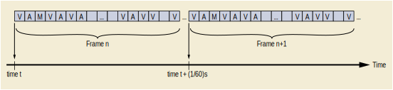

.. _chapter_PPPP:

Real-Time Video Use Cases (Informative)
=======================================

.. _sect_PPPP.1:

Introduction
------------

.. figure:: part17_fromword_files/image001_sup202.png
   :alt: Overview diagram of operating room
   :name: figure_PPPP.1-1
   :width: 100.0%

   Overview diagram of operating room

As shown in `figure_title <#figure_PPPP.1-1>`__, the DICOM Real-Time
Video (DICOM-RTV) communication is used to connect various video or
multi-frame sources to various destinations, through a standard IP
switch, instead of using a video switch. In the future, the equipment
producing video will support DICOM-RTV natively but it is anticipated
that the first implementations will rely on the use of converters to
create a DICOM-RTV stream from the video stream (e.g., SDI) and
associated metadata coming from information systems, through existing
mechanisms (e.g., DICOM Worklist). Such converters have to be
synchronized with the Grand Master which is delivering a very precise
universal time. Similarly, the video receivers (e.g., monitors) will be
connected to the central switch via a converter which has also to be
synchronized via the Grand Master. The different DICOM-RTV streams can
be displayed, recorded, converted or combined together for different use
cases. The medical metadata in the DICOM-RTV streams can be used to
improve the quality of the whole system, as explained in the following
use cases.

.. figure:: part17_fromword_files/image002_sup202.png
   :alt: Real-Time Video stream content overview
   :name: figure_PPPP.1-2
   :width: 100.0%

   Real-Time Video stream content overview

As shown in `figure_title <#figure_PPPP.1-2>`__, the DICOM Real-Time
Video stream is comprised of typically three different flows
("essences") for respectively video, audio and medical metadata
information, using the intrinsic capability of IP to convey different
flows on the same medium, multiplexing three kinds of blocks. There will
be thousands of blocks for each video frame, hundreds for each audio
sample and one for the medical metadata associated to each video frame,
respectively represented as "V" (video) , "A" (audio) and "M" (metadata)
on the `figure_title <#figure_PPPP.1-3>`__, which is the network view of
the real-time streaming.

   Real-Time Video transmission details

.. _sect_PPPP.2:

Use Case: Duplicating Video On Additional Monitors
--------------------------------------------------

In the context of image guided surgery, two operators are directly
contributing to the procedure:

-  a surgeon performing the operation itself, using relevant
   instruments;

-  an assistant controlling the imaging system (e.g., laparoscope).

In some situations, both operators cannot stand on the same side of the
patient. Because the control image has to be in front of each operator,
two monitors are required, a primary one, directly connected to the
imaging system, and the second one on the other side of the patient.

Additional operators (e.g., surgery nurse) might also have to see what
is happening on additional monitors in order to anticipate actions
(e.g., providing instrument).

.. figure:: part17_fromword_files/image004_sup202.png
   :alt: Duplicating on additional monitor
   :name: figure_PPPP.2-1
   :width: 100.0%

   Duplicating on additional monitor

The live video image has to be transferred to additional monitors with a
minimal latency, without modifying the image itself (resolution…). The
latency between the two monitors (see
`figure_title <#figure_PPPP.2-1>`__) should be compatible with
collaborative activity for surgery where the surgeon is, for example,
operating based on the primary monitor and the assistant is controlling
the endoscope based on the second monitor. All equipment is synchronized
with the Grand Master. The DICOM-RTV generation capability might be
either an integrated part of the laparoscope product, or the laparoscope
might send an HD video signal to the DICOM-RTV generator (Video-to-DICOM
converter on the `figure_title <#figure_PPPP.2-1>`__). It is important
that the converter be able to send video with or without a metadata
overlay to the assistant monitor. This supplement addresses only the
communication aspects, not the presentation.

.. _sect_PPPP.3:

Use Case: Post Review by Senior
-------------------------------

A junior surgeon performs a procedure which apparently goes well. The
next day, the patient experiences a complication requiring the surgeon
to refer the patient to a senior surgeon.

In order to decide what to do, the senior surgeon:

-  reviews and understands what happened;

-  takes the decision to re-operate on the patient or not;

-  accesses the videos of the first operation, if a new operation is
   performed.

Moreover, the junior surgeon has to review her/his own work in order to
prevent against a new mistake.

.. figure:: part17_fromword_files/image005_sup202.png
   :alt: Recording multiple video sources
   :name: figure_PPPP.3-1
   :width: 100.0%

   Recording multiple video sources

A good quality recording of video needs to be kept, at least for a
certain duration, including all the video information (endoscopy,
overhead, monitoring, …) and associated metadata from the surgery (see
`figure_title <#figure_PPPP.3-1>`__). In this case, the metadata is
coming directly from each device.. The recording has to maintain time
consistency between the different video channels. Section PPPP.8.1
describes how the video could be captured and stored as a DICOM IOD
using the present DICOM Store Service, as shown in
`figure_title <#figure_PPPP.3-1>`__, however the video could also be
stored in another format. Such IODs could be retrieved and displayed
using conventional DICOM workstation as shown in
`figure_title <#figure_PPPP.3-1>`__. They could also be played back
using DICOM-RTV as described in section PPPP.8.2.

.. _sect_PPPP.4:

Use Case: Automatic Display in Operating Room (or)
--------------------------------------------------

.. figure:: part17_fromword_files/image006_sup202.png
   :alt: Displaying multiple source on one unique monitor
   :name: figure_PPPP.4-1
   :width: 100.0%

   Displaying multiple source on one unique monitor

Some ORs have large monitors displaying a variety of necessary
information. Depending on the stage of the procedure, the information to
display changes. To improve the quality of the real-time information
shared inside the OR, it is relevant to automate the changes of layout
and content of such a display, based on the metadata conveyed along with
the video (e.g., displaying the endoscope image only when the endoscope
is inside the patient body).

All the video streams have to be transferred with the relevant metadata
(patient, study, equipment…) , as shown in
`figure_title <#figure_PPPP.4-1>`__. Mechanisms to select and execute
the layout of images on the large monitor are not defined. Only the
method for conveying the multiple synchronized videos along with the
metadata, used as parameters for controlling the layout, is specified.

.. _sect_PPPP.5:

Use Case: Augmented Reality
---------------------------

.. figure:: part17_fromword_files/image007_sup202.png
   :alt: Application combining multiple real-time video sources
   :name: figure_PPPP.5-1
   :width: 100.0%

   Application combining multiple real-time video sources

For image guided surgery, Augmented Reality (AR) applications enrich the
live images by adding information as overlay, either 3D display of
patient anatomy reconstructed from MR or CT scans, or 3D projections of
other real-time medical imaging (3D ultrasound typically). In the second
case, display devices (glasses, tablets…) show a real-time
"combination" image merging the primary live imaging (endoscopy,
overhead, microscopy…) and the real-time secondary live imaging
(ultrasound, X-Ray…). The real-time "combination" image could also be
exported as a new video source, through the DICOM Real-Time Video
protocol.

All video streams have to be transferred with ultra-low latency and very
strict synchronization between frames (see
`figure_title <#figure_PPPP.5-1>`__). Metadata associated with the video
has to be updated at the frame rate (e.g., 3D position of the US probe).
The mechanisms used for generating augmented reality views or to detect
and follow 3D position of devices are out of scope. Only the method for
conveying the multiple synchronized video/multi-frame sources along with
the parameters, that may change at every frame, is specified.

.. _sect_PPPP.6:

Use Case: Robotic Aided Surgery
-------------------------------

Robotic assisted surgery involves using image guided robots or "cobots"
(collaborative robots) for different kinds of procedures. Different
devices use the information provided by the robot (actual position,
pressure feedback…) synchronized with the video produced by imaging
sources. For effective haptic feedback, it may be necessary to convey
such information at a frequency higher than the video frequency, i.e.;
400 Hz vs. 60 Hz for present HD video.

.. _sect_PPPP.7:

Example of DICOM Real-Time Video Implementation
-----------------------------------------------

The following example illustrates a specific implementation of the
Generic Use Case 4: Augmented Reality described above.

.. figure:: part17_fromword_files/image008_sup202.png
   :alt: Example of implementation for Augmented reality based on
   optical image
   :name: figure_PPPP.7-1
   :width: 100.0%

   Example of implementation for Augmented reality based on optical
   image

The described use case is the replacement of the lens in cataract
surgery (capsulorhexis). The lenses are manufactured individually,
taking into account the patient's astigmatism. The best places for the
incision, the position where the capsule bag should be torn and the
optimal alignment for the new lens are calculated and a graphical plane
is overlaid onto the optical path of the microscope to assist the
surgeon, as shown in `figure_title <#figure_PPPP.7-1>`__.

Some solutions consist of a frame grabber in ophthalmology microscopes
which grab video frames at 50 / 60 Hz. These frames are analyzed to
identify the position and orientation of the eye and then a series of
graphical objects are superimposed as a graphical plane onto the optical
path to show the surgeon the best place to perform the incisions and how
to orient the new lens to compensate the astigmatism.

Practically, the video frame grabbing takes 3 frames to be accessible to
the image processor computing the series of graphical objects to be
drawn as overlays on the optical image. It results in a delay between
the frame used to create the objects and the one on which these objects
are drawn. For safety reasons, it is important to record what the
surgeon has seen. Due to the latency of the frame grabbing and the
calculation of the positions of these graphical objects, the digital
images are delayed in memory to also blend these objects onto the right
digital image for the recording made in parallel.

DICOM Real-Time Video enables the storage of the recorded video and the
frame by frame positions of these graphical objects separately. It might
also be used to store other values associated with the streams such as
the microscope's zoom, focus and light intensity values or the phaco's
various settings, pressure, in the DICOM-RTV Metadata Flow. These
separately stored flows could be later mixed together to aid in
post-operative analysis or for teaching purposes. It would be possible
to re-play the overlay either on the later image where the surgeon saw
it, or on the image it was calculated from, to improve the algorithm. It
would also reduce the workload of the machine during the operation
because the blending of the video together with the display aids would
be performed later during the post-operative analysis phase, and also
maintain the original images.

The RTP Timestamp (RTS) of both video and DICOM-RTV Metadata Flows must
match. Frame Origin Timestamp (FOTS) contained in DICOM-RTV Metadata
must be consistent with RTP Timestamp, enabling the proper
synchronization between flows. As shown in
`figure_title <#figure_PPPP.7-2>`__, it is expected that the Frame
Origin Timestamp relative of both the digital image and the overlays are
set to T6 when the Image Datetime is T3 and the Referenced Image
Datetime of the Mask is T0, represented as the T0 MASK.

.. figure:: part17_fromword_files/image009_sup202.png
   :alt: Example of implementation for Augmented reality based on
   optical image
   :name: figure_PPPP.7-2
   :width: 100.0%

   Example of implementation for Augmented reality based on optical
   image

.. note::

   In the case the surgeon is viewing the digital image and not the
   optical image, the approach could be different, as shown in
   `figure_title <#figure_PPPP.7-3>`__.

.. figure:: part17_fromword_files/image010_sup202.png
   :alt: Example of implementation for Augmented reality based on
   digital image
   :name: figure_PPPP.7-3
   :width: 100.0%

   Example of implementation for Augmented reality based on digital
   image

.. _sect_PPPP.8:

Storage Considerationa
----------------------

.. _sect_PPPP.8.1:

Creating IOD From DICOM-RTV Streams
~~~~~~~~~~~~~~~~~~~~~~~~~~~~~~~~~~~

It is reasonable to take some or all of an DICOM-RTV stream to create
storage DICOM IOD. Transcoding the patient metadata and video content
should be relatively straightforward. Some of the issues that have to be
considered include how to get information describing origin equipment,
etc.

Storage of video data, even received in real-time, is possible. However,
how to initiate a DICOM-RTV stream based on a stored video is presently
not described in the standard. Also, how to encode directly a received
DICOM-RTV stream into a DICOM Video Instance is not fully described. An
external decision (manual or automatic) is required to specify at least
the start time and the end time of the portion of the stream to be
stored. However, some principles can be established to ensure that
receiving applications will actually find in the DICOM-RTV flow all the
data items needed for the replay or storage of this data using DICOM
Storage services. Regarding storage of this data using DICOM Storage
services:

-  "Pixel Data" and "Waveform Data" attributes of the DICOM (video)
   Composite Objects should be mapped from the corresponding payloads in
   media (e.g., video and audio) flows and associated SDP objects;

-  The metadata attributes of the DICOM composite objects should be
   mapped from the DICOM-RTV metadata flows; attributes applicable to
   all frames (e.g., included in the Current Frame Functional Group
   Sequence) should be mapped from the static part of the DICOM-RTV
   metadata; attributes applicable to a single frame (e.g., Per-frame
   Functional Group Sequence) should be mapped from the dynamic part of
   the DICOM-RTV Metadata;

-  The "Cine" and "Multi-frame" modules, as well as the "Number of
   Waveform Samples" attribute, not present in the DICOM-RTV Metadata,
   are built from the values of the RTV Meta Information (e.g., Sample
   Rate) , the dynamic payload of the relevant flows (e.g., Frame
   Numbers) and the external decisions (e.g., Start Time) ;

-  Based on the choice of the application and on the possible presence
   of a DICOM-RTV Rendition flow, the DICOM composite object to be
   stored may gather or not the individual essences of the DICOM-RTV
   flows (e.g., video and audio contents in a single SOP instance using
   a MPEG2 Transfer syntax).

.. _sect_PPPP.8.2:

Streaming DICOM-RTV From Stored IOD
~~~~~~~~~~~~~~~~~~~~~~~~~~~~~~~~~~~

Regarding initiating a DICOM-RTV stream from a stored instance, the
application should be able to regenerate the different DICOM-RTV flows,
with the same synchronization characteristics, in compliance with SMPTE
ST 2110-10.

-  Subcase 1 is conventional video IODs e.g., ultrasound
   video/multi-frame or angio video/multi-frame.

-  Subcase 2 is one or more video IODs that were previously DICOM-RTV,
   e.g., stored like PPPP.8.1.

-  If the multiple stored IOD of the subcase 2 contain synchronization
   information extracted from DICOM, it should be possible to playback
   them with a good synchronization.

.. _sect_PPPP.9:

Example of Engineering Implementation
-------------------------------------

An example of implementation of the Video-to-DICOM converter presented
in the use cases PPPP.2 above could respect the following approach:

-  The metadata are sent from the Departmental System to the
   Video-to-DICOM converter through TCP/IP using classical protocols as
   DICOM Worklist or HL7 ORM.

-  The video/multi-frame is sent through coaxial cable using classical
   video protocol (e.g., uncompressed HD video over Serial Digital
   Interface SDI).

-  The time ("timestamp") is sent through IP respecting PTP, for
   synchronizing all the senders and receivers, through "time alignment"
   mechanism described in SMPTE ST 2110-10.

-  All this information is used to produce several RTP sessions over IP:

   -  SMPTE ST 2110-20 compliant video flow.

   -  SMPTE ST 2110-10 compliant DICOM Metadata Flow, including payload
      header (RTV Meta Information) as well as dynamic payload part
      (DICOM Current Frame Functional Groups Module) for every frame,
      and including additionally the static payload part (DICOM
      Real-Time Video Endoscopic/Photographic Image IOD Modules) at
      least every second.

   -  If sound is provided:

      -  SMPTE ST 2110-30 compliant audio flow.

      -  SMPTE ST 2110-10 compliant DICOM Metadata Flow, including
         payload header (RTV Meta Information) as well as dynamic
         payload part (DICOM Current Frame Functional Groups Module) for
         every sample, and including additionally the static payload
         part (DICOM Real-Time Audio Waveform IOD Modules) at least
         every second.

      -  SMPTE ST 2110-10 compliant DICOM Metadata Flow, including
         payload header and static payload part (DICOM Rendition
         Selection Document IOD Modules) , at least every second, in
         order to associate the two flows above.

.. note::

   Eventually, the laparoscope systems will embed the Video-to-DICOM
   converter, as shown in the Integrated Product box of the
   `figure_title <#figure_PPPP.2-1>`__.

.. _sect_PPPP.20:

Transmitting a Stereo Video
---------------------------

The particular case of stereo vision, may either be solved by combining
the contents into a single flow (Multiview video Coding) with inclusion
of the in the metadata, or by separating contents into two flows (left
content apart from right content) and then pairing them by using a (RTV
Stereo Video) Rendition.

