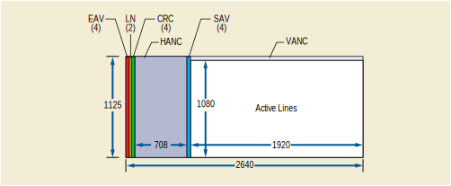

.. _chapter_QQQQ:

Transport of Elementary Stream over IP (Informative)
====================================================

Carriage of audiovisual signals in their digital form across television
plants has historically been achieved using coaxial cables that
interconnect equipment through Serial Digital Interface (SDI) ports. The
SDI technology provides a reliable transport method to carry a multiplex
of video, audio and metadata with strict timing relationships.

The features and throughput of IP networking equipment having improved
steadily, it has become practical to use IP switching and routing
technology to convey and switch video, audio, and metadata essence
within television facilities.

Existing standards such as SMPTE ST 2022-6:2012 have seen a significant
adoption in this type of application where they have brought distinct
advantages over SDI, albeit only performing Circuit Emulation of SDI
(i.e.; Perfect bit-accurate transport of the SDI signal contents).

However, the essence multiplex proposed by the SDI technology may be
considered as somewhat inefficient in many situations where a
significant part of the signal is left unused if little or no audio
and/or ancillary data has to be carried along with the video raster, as
depicted in `figure_title <#figure_QQQQ-1>`__ below:

   Structure of a High Definition SDI signal

.. note::

   Acronyms on the `figure_title <#figure_QQQQ-1>`__ stand for: LN: line
   number; EAV: end of active video; SAV: start of active video; CRC:
   Cyclic Redundancy Code; HANC & VANC: horizontal & vertical ancillary
   data. The parentheses indicate the number of 8, 10 or 12 bits words
   used for each information.

As new image formats such as UHD get introduced, the corresponding SDI
bit-rates increase, way beyond 10Gb/s and the cost of equipment at
different points in a video system to embed, de-embed, process,
condition, distribute, etc. the SDI signals becomes a major concern.

Consequently there has been a desire in the industry to switch and
process different essence elements separately, leveraging the
flexibility and cost-effectiveness of commodity networking gear and
servers.

The Video Services Forum (VSF) has authored its Technical Recommendation
#3 (a.k.a. VSF-TR03) describing the principles of a system where streams
of different essences (namely video, audio, metadata to begin with) can
be carried over an IP-based infrastructure whilst preserving their
timing characteristics.

The TR03 work prepared by VSF has been handed off to the Society of
Motion Picture & Television Engineers (SMPTE) for due standardization
process, resulting in the SMPTE ST 2110 family of standards. SMPTE ST
2110-10, 20 and 30 were approved on September 18, 2017:

-  ST 2110-10: System Timing and definitions;

-  ST 2110-20: Uncompressed active video;

-  ST 2110-21: Traffic Shaping Uncompressed Video;

-  ST 2110-30: Uncompressed PCM audio;

-  ST 2110-40: Ancillary data.

The ST 2110 family of standards expands over time and the corresponding
DICOM components may consider adopting these extensions (e.g.,
compressed video, large metadata support…).

The system is intended to be extensible to a variety of essence types,
its pivotal point being the use of the RTP protocol. In this system,
essence streams are encapsulated separately into RTP before being
individually forwarded through the IP network.

A system is built from devices that have senders and/or receivers.
Streams of RTP packets flow from senders to receivers, however senders
have no explicit awareness or coordination with the receivers. RTP
streams can be either unicast or multicast, in which case multiple
receivers can receive the stream over the network.

Devices may be adapters that convert from/to existing standard
interfaces like HDMI or SDI, or they may be processors that receive one
or more streams from the IP network, transform them in some way and
transmit the resulting stream(s) to the IP network. Cameras and monitors
may transmit and receive elementary RTP streams directly through an
IP-connected interface, eliminating the need for legacy video
interfaces.

Proper operation of the ST 2110 environment relies on a reliable timing
infrastructure that has been largely inspired by the one used in AES67
for Audio over IP.

Inter-stream synchronization relies on timestamps in the RTP packets
that are sourced by the senders from a common Reference Clock. The
Reference Clock is distributed over the IP network to all participating
senders and receivers via PTP (Precision Time Protocol version 2, IEEE
1588-2008).

Synchronization at the receiving device is achieved by the comparison of
RTP timestamps with the common Reference Clock.

DICOM devices, which typically support NTP, will need to handle PTP to
use this functionality, which may involve hardware changes. Each device
maintains a Media Clock which is frequency locked to its internal
time-base and advances at an exact rate specified for the specific media
type. The media clock is used by senders to sample media and by
receivers when recovering digital media streams. For video and ancillary
data, the rate of the media clock is 90 kHz, whereas for audio it can be
44.1 kHz, 48 kHz, or 96 kHz.

For each specific media type RTP stream, the RTP Clock operates at the
same rate as the Media Clock.

ST 2110-20 specifies a very generic mechanism for RTP encapsulation of a
video raster. It supports arbitrary resolutions, frame rates, and
introduces a clever pixel packing accommodating an extremely wide
variety of bit depths and sampling modes. It is very heavily inspired
from IETF RFC4175.

ST 2110-21 specifies traffic shaping and delivery timing of uncompressed
video, in order to enable transport of multiple videos on the same
physical network.

ST 2110-30 specifies a method to encapsulate PCM digital audio using
AES67 to which it applies a number of constraints. AES67 is a technical
standard for audio over IP and audio over Ethernet. The standard was
developed by the Audio Engineering Society.

ST 2110-40 specifies a simple method to tunnel packets of SDI ancillary
data present in a signal over the IP network and enables a receiver to
reconstruct an SDI signal that will embed the ancillary data at the
exact same places it occupied in the original stream.

Sender devices construct one SDP (Session Description Protocol) object
per RTP Stream. These SDP objects are made available through the
management interface of the device, thereby publishing the
characteristics of the stream they encapsulate, however no method is
specified to convey the SDP object to the receiver. Implementations can
rely on web URLs, files or documentation on media, or it can be
configured on the receiver from product documentation since it can be
relatively static. This SDP object provides the basic information a
system needs in order to identify the available signal sources on the
network.

It is worth noting that although ST 2110 currently describes the method
for transporting video and audio, the same principles may be applied to
other types of media by selecting the appropriate RTP payload
encapsulation scheme, and complying to the general principles defined by
ST 2110-10.

Some details of the ST 2110-10 are reproduced below for convenience.
Refer to the original specifications for implementation.

The RTP header bits have the following format:

.. figure:: figures/PS3.17_QQQQ-2.svg
   :alt: RTP Header
   :name: figure_QQQQ-2

   RTP Header

With:

version (V) : 2 bits
   Version of RTP as specified in IETF RFC 3550.

padding (P) : 1 bit
   When set the packet contains padding octets at the end as specified
   in IETF RFC 3550.

extension (X) : 1 bit
   When set the fixed header is followed by an RTP header extension.

CSRC (CC) : 4 bits
   Number of CSRC identifiers as specified in IETF RFC 3550.

marker (M) : 1 bit
   For video it is set to 1 when the RTP packet is carrying the last
   video essence of a frame or the last part of a field as specified in
   SMPTE ST 2110-20.

payload type (PT)
   Identifies the format of the payload. For a video or audio payload it
   is as specified in SMPTE ST 2110-10.

sequence number
   Increments by one for each RTP data packet sent. It is as specified
   in IETF RFC 3550.

   Increments by one for each RTP data packet sent. It is as specified
   in IETF RFC 3550.

timestamp
   Reflects the sampling instant of the first octet in the RTP data
   packet. It contains the timestamp as specified in SMPTE ST 2110-10.

SSRC
   Identifies the synchronization source. It is as specified in IETF RFC
   3550.

The RTP header extension bits have the following format:

.. figure:: figures/PS3.17_QQQQ-3.svg
   :alt: RTP Header Extension
   :name: figure_QQQQ-3

   RTP Header Extension

With:

defined by profile: 16 bits
   It is defined by the type of header extension used.

length: 16 bits
   Size of the header extension in 32-bits units. It does not include
   the 4 byte header extension ("defined by profile" + "length").

header extension
   The one-byte header extension form is described below. The total size
   of the header extension is a multiple of 4 bytes.

In complement to the SMPTE ST 2110 family of standards, AMWA (Advanced
Media Workflow Association) has authored a recommendation called NMOS
(Networked Media Open Specifications) which specifies the following
header extensions:

PTP Sync Timestamp
   provides an absolute capture or playback timestamp for the Grain
   essence data, which consists of a 48-bit seconds field followed by a
   32-bit nanosecond field. The length value in the extension header is
   9.

PTP Origin Timestamp
   provides an absolute capture timestamp for the Grain essence data,
   which consists of a 48-bit seconds field followed by a 32-bit
   nanosecond field. The length value in the extension header is 9.

Flow Identifier
   a UUID which uniquely identifies the flow. The value is 16 bytes and
   therefore the length value in the extension header is 15.

Source Identifier
   a UUID which uniquely identifies the source. The value is 16 bytes
   and therefore the length value in the extension header is 15.

Grain Duration
   identifies the time period for which the video essence within the
   Grain should be displayed or the time period for which the audio
   essence should be played back, describing the length of a consistent
   video or audio sequence. It is a rational number consisting of a 4
   byte numerator and 4 byte denominator. The value is 8 bytes and
   therefore the length value in the extension header is 7. Use of Grain
   Duration is optional.

Grain Flags
   The Grain Flags are a single byte with the following form:

   .. figure:: figures/PS3.17_QQQQ-4.svg
      :alt: RTP Grain Flags
      :name: figure_QQQQ-4

      RTP Grain Flags

   Start flag (S) : 1 bit
      This bit shall be set to 1 in the first packet of the Grain.
      Otherwise it shall be set to 0.

   End flag (E) : 1 bit
      This bit shall be set to 1 in the last packet of the Grain.
      Otherwise it shall be set to 0.

   Reserved: 6 bits
      These bits are reserved for future use and should be set to 0. The
      length value of this extension header is 0.

