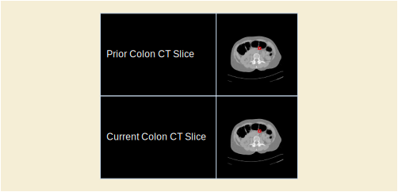

.. _chapter_SS:

Colon CAD (Informative)
=======================

.. _sect_SS.1:

Colon CAD SR Content Tree Structure
-----------------------------------

The templates for the Colon CAD SR IOD are defined in . All
relationships defined in the Colon CAD SR IOD templates are by-value.
Content items referenced from another SR object instance, such as a
prior Colon CAD SR, are inserted by-value in the new SR object instance,
with appropriate original source observation context. It is necessary to
update Rendering Intent, and referenced content item identifiers for
by-reference relationships, within content items paraphrased from
another source.

The Document Root, Image Set Properties, CAD Processing and Findings
Summary, and Summaries of Detections and Analyses sub-trees together
form the content tree of the Colon CAD SR IOD. See `Mammography CAD
(Informative) <#chapter_E>`__ for additional explanation of the
Summaries of Detections and Analyses sub-trees.

The identification of a polyp within an image set is considered to be a
Detection. The temporal correlation of a polyp in two image sets taken
at different times is considered Analysis. This distinction is used in
determining whether to place algorithm identification information in the
Summary of Detections or Summary of Analyses sub-trees.

Once a Single Image Finding or Composite Feature has been instantiated,
it may be referenced by any number of Composite Features higher in the
CAD Processing and Findings Summary sub-tree.

.. _sect_SS.2:

Colon CAD SR Observation Context Encoding
-----------------------------------------

Any content item in the Content tree that has been inserted (i.e.,
duplicated) from another SR object instance has a HAS OBS CONTEXT
relationship to one or more content items that describe the context of
the SR object instance from which it originated. This mechanism may be
used to combine reports (e.g., Colon CAD SR 1, Colon CAD SR 2, Human).

The CAD Processing and Findings Summary section of the SR Document
Content tree of a Colon CAD SR IOD may contain a mixture of current and
prior single image findings and composite features. The content items
from current and prior contexts are target content items that have a
by-value INFERRED FROM relationship to a Composite Feature content item.
Content items that come from a context other than the Initial
Observation Context have a HAS OBS CONTEXT relationship to target
content items that describe the context of the source document.

In `figure_title <#figure_SS.2-1>`__, Composite Feature and Single Image
Finding are current, and Single Image Finding (from Prior) is duplicated
from a prior document.

.. _sect_SS.3:

Colon CAD SR Examples
---------------------

The following is a simple and non-comprehensive illustration of an
encoding of the Colon CAD SR IOD for colon computer aided detection
results. For brevity, some mandatory content items are not included.

.. _sect_SS.3.1:

Example 1: Colon Polyp Detection With No Findings
~~~~~~~~~~~~~~~~~~~~~~~~~~~~~~~~~~~~~~~~~~~~~~~~~

A colon CAD device processes a typical screening colon case, i.e., there
are several hundred images and no polyp findings. Colon CAD runs polyp
detection successfully and finds nothing.

The colon radiograph resembles:

.. figure:: figures/PS3.17_SS.3-1.svg
   :alt: Colon Radiograph as Described in Example 1
   :name: figure_SS.3-1

   Colon Radiograph as Described in Example 1

The content tree structure would resemble:

+-----------+------------------------+------------------------+-----+
| Node      | Code Meaning of        | Code Meaning or        | TID |
|           | Concept Name           | Example Value          |     |
+===========+========================+========================+=====+
| 1         | Colon CAD Report       |                        |     |
+-----------+------------------------+------------------------+-----+
| 1.1       | Language of Content    | English                |     |
|           | Item and Descendants   |                        |     |
+-----------+------------------------+------------------------+-----+
| 1.2       | Image Set Properties   |                        |     |
+-----------+------------------------+------------------------+-----+
| 1.2.1     | Frame of Reference UID | 1.2.840.114191.123     |     |
+-----------+------------------------+------------------------+-----+
| 1.2.2     | Study Instance UID     | 1.2.840.114191.456     |     |
+-----------+------------------------+------------------------+-----+
| 1.2.3     | Study Date             | 20060924               |     |
+-----------+------------------------+------------------------+-----+
| 1.2.4     | Study Time             | 090807                 |     |
+-----------+------------------------+------------------------+-----+
| 1.2.5     | Modality               | CT                     |     |
+-----------+------------------------+------------------------+-----+
| 1.2.6     | Horizontal Pixel       | 0.80 mm                |     |
|           | Spacing                |                        |     |
+-----------+------------------------+------------------------+-----+
| 1.2.7     | Vertical Pixel Spacing | 0.80 mm                |     |
+-----------+------------------------+------------------------+-----+
| 1.2.8     | Slice Thickness        | 2.5 mm                 |     |
+-----------+------------------------+------------------------+-----+
| 1.2.9     | Spacing between slices | 1.5 mm                 |     |
+-----------+------------------------+------------------------+-----+
| 1.2.10    | Recumbent Patient      | Prone                  |     |
|           | Position with respect  |                        |     |
|           | to gravity             |                        |     |
+-----------+------------------------+------------------------+-----+
| 1.3       | CAD Processing and     | All algorithms         |     |
|           | Findings Summary       | succeeded; without     |     |
|           |                        | findings               |     |
+-----------+------------------------+------------------------+-----+
| 1.4       | Summary of Detections  | Succeeded              |     |
+-----------+------------------------+------------------------+-----+
| 1.4.1     | Successful Detections  |                        |     |
+-----------+------------------------+------------------------+-----+
| 1.4.1.1   | Detection Performed    | Nodule                 |     |
+-----------+------------------------+------------------------+-----+
| 1.4.1.1.1 | Algorithm Name         | "Colon Polyp Detector" |     |
+-----------+------------------------+------------------------+-----+
| 1.4.1.1.2 | Algorithm Version      | "V1.3"                 |     |
+-----------+------------------------+------------------------+-----+
| 1.4.1.1.3 | Series Instance UID    | 1.2.840.114191.789     |     |
+-----------+------------------------+------------------------+-----+
| 1.5       | Summary of Analyses    | Not Attempted          |     |
+-----------+------------------------+------------------------+-----+

.. _sect_SS.3.2:

Example 2: Colon Polyp Detection With Findings
~~~~~~~~~~~~~~~~~~~~~~~~~~~~~~~~~~~~~~~~~~~~~~

A colon CAD device processes a screening colon case with several hundred
images, and a colon polyp detected. The colon radiograph resembles:

.. figure:: figures/PS3.17_SS.3-2.svg
   :alt: Colon radiograph as Described in Example 2
   :name: figure_SS.3-2

   Colon radiograph as Described in Example 2

The content tree structure in this example is complex. Structural
illustrations of portions of the content tree are placed within the
content tree table to show the relationships of data within the tree.
Some content items are duplicated (and shown in boldface) to facilitate
use of the diagrams.

The content tree structure would resemble:

+------+--------------------------+--------------------------+-----+
| Node | Code Meaning of Concept  | Code Meaning or Example  | TID |
|      | Name                     | Value                    |     |
+======+==========================+==========================+=====+
| 1    | Colon CAD Report         |                          |     |
+------+--------------------------+--------------------------+-----+
| 1.1  | Language of Content Item | English                  |     |
|      | and Descendants          |                          |     |
+------+--------------------------+--------------------------+-----+
| 1.2  | Image Set Properties     |                          |     |
+------+--------------------------+--------------------------+-----+
| 1.3  | CAD Processing and       | All algorithms           |     |
|      | Findings Summary         | succeeded; with findings |     |
+------+--------------------------+--------------------------+-----+
| 1.4  | Summary of Detections    | Succeeded                |     |
+------+--------------------------+--------------------------+-----+
| 1.5  | Summary of Analyses      | Not Attempted            |     |
+------+--------------------------+--------------------------+-----+

+--------+-------------------------+-------------------------+-----+
| Node   | Code Meaning of Concept | Code Meaning or Example | TID |
|        | Name                    | Value                   |     |
+========+=========================+=========================+=====+
| 1.2    | Image Set Properties    |                         |     |
+--------+-------------------------+-------------------------+-----+
| 1.2.1  | Frame of Reference UID  | 1.2.840.114191.1122     |     |
+--------+-------------------------+-------------------------+-----+
| 1.2.2  | Study Instance UID      | 1.2.840.114191.3344     |     |
+--------+-------------------------+-------------------------+-----+
| 1.2.3  | Study Date              | 20070924                |     |
+--------+-------------------------+-------------------------+-----+
| 1.2.4  | Study Time              | 090807                  |     |
+--------+-------------------------+-------------------------+-----+
| 1.2.5  | Modality                | CT                      |     |
+--------+-------------------------+-------------------------+-----+
| 1.2.6  | Horizontal Pixel        | 0.80 mm                 |     |
|        | Spacing                 |                         |     |
+--------+-------------------------+-------------------------+-----+
| 1.2.7  | Vertical Pixel Spacing  | 0.80 mm                 |     |
+--------+-------------------------+-------------------------+-----+
| 1.2.8  | Slice Thickness         | 2.5 mm                  |     |
+--------+-------------------------+-------------------------+-----+
| 1.2.9  | Spacing between slices  | 1.5 mm                  |     |
+--------+-------------------------+-------------------------+-----+
| 1.2.10 | Recumbent Patient       | Prone                   |     |
|        | Position with respect   |                         |     |
|        | to gravity              |                         |     |
+--------+-------------------------+-------------------------+-----+

+-----------+------------------------+------------------------+-----+
| Node      | Code Meaning of        | Code Meaning or        | TID |
|           | Concept Name           | Example Value          |     |
+===========+========================+========================+=====+
| 1.3       | CAD Processing and     | All algorithms         |     |
|           | Findings Summary       | succeeded; with        |     |
|           |                        | findings               |     |
+-----------+------------------------+------------------------+-----+
| 1.3.1     | Composite Feature      | Polyp                  |     |
+-----------+------------------------+------------------------+-----+
| 1.3.1.1   | Rendering Intent       | Presentation           |     |
|           |                        | Required:…             |     |
+-----------+------------------------+------------------------+-----+
| 1.3.1.2   | Algorithm Name         | "Colon Polyp Detector" |     |
+-----------+------------------------+------------------------+-----+
| 1.3.1.3   | Algorithm Version      | "V1.3"                 |     |
+-----------+------------------------+------------------------+-----+
| 1.3.1.4   | Composite Type         | Target content items   |     |
|           |                        | are related spatially  |     |
+-----------+------------------------+------------------------+-----+
| 1.3.1.5   | Scope of Feature       | Feature detected on    |     |
|           |                        | multiple images        |     |
+-----------+------------------------+------------------------+-----+
| 1.3.1.6   | Center                 | SCOORD3D POINT         |     |
+-----------+------------------------+------------------------+-----+
| 1.3.1.7   | Outline                | SCOORD3D ELLIPSOID     |     |
+-----------+------------------------+------------------------+-----+
| 1.3.1.8   | Associated Morphology  | Pedunculated           |     |
+-----------+------------------------+------------------------+-----+
| 1.3.1.9   | Diameter               | 20 mm                  |     |
+-----------+------------------------+------------------------+-----+
| 1.3.1.9.1 | Path                   | SCOORD3D POLYLINE      |     |
+-----------+------------------------+------------------------+-----+

========= ============================ ============================= ===
Node      Code Meaning of Concept Name Code Meaning or Example Value TID
========= ============================ ============================= ===
1.4       Summary of Detections        Succeeded                     
1.4.1     Successful Detections                                      
1.4.1.1   Detection Performed          Polyp                         
1.4.1.1.1 Algorithm Name               "Colon Polyp Detector"        
1.4.1.1.2 Algorithm Version            "V1.3"                        
1.4.1.1.3 Series Instance UID          1.2.840.114191.111222         
========= ============================ ============================= ===

==== ============================ ============================= ===
Node Code Meaning of Concept Name Code Meaning or Example Value TID
==== ============================ ============================= ===
1.5  Summary of Analyses          Not Attempted                 
==== ============================ ============================= ===

.. _sect_SS.3.3:

Example 3: Colon Polyp Detection, Temporal Differencing With Findings
~~~~~~~~~~~~~~~~~~~~~~~~~~~~~~~~~~~~~~~~~~~~~~~~~~~~~~~~~~~~~~~~~~~~~

The patient in Example 2 returns for another colon radiograph. A more
comprehensive colon CAD device processes the current colon radiograph,
and analyses are performed that determine some temporally related
content items for Composite Features. Portions of the prior colon CAD
report (Example 2) are incorporated into this report. In the current
colon radiograph the colon polyp has increased in size.

   Colon radiographs as Described in Example 3

+--------+-------------------------+-------------------------+-----+
| Node   | Code Meaning of Concept | Code Meaning or Example | TID |
|        | Name                    | Value                   |     |
+========+=========================+=========================+=====+
| 1      | Colon CAD Report        |                         |     |
+--------+-------------------------+-------------------------+-----+
| 1.1    | Language of Content     | English                 |     |
|        | Item and Descendants    |                         |     |
+--------+-------------------------+-------------------------+-----+
| 1.2    | Image Set Properties    |                         |     |
+--------+-------------------------+-------------------------+-----+
| 1.2.1  | Frame of Reference UID  | 1.2.840.114191.5577     |     |
+--------+-------------------------+-------------------------+-----+
| 1.2.2  | Study Instance UID      | 1.2.840.114191.7788     |     |
+--------+-------------------------+-------------------------+-----+
| 1.2.3  | Study Date              | 20080924                |     |
+--------+-------------------------+-------------------------+-----+
| 1.2.4  | Study Time              | 101827                  |     |
+--------+-------------------------+-------------------------+-----+
| 1.2.5  | Modality                | CT                      |     |
+--------+-------------------------+-------------------------+-----+
| 1.2.6  | Horizontal Pixel        | 0.80 mm                 |     |
|        | Spacing                 |                         |     |
+--------+-------------------------+-------------------------+-----+
| 1.2.7  | Vertical Pixel Spacing  | 0.80 mm                 |     |
+--------+-------------------------+-------------------------+-----+
| 1.2.8  | Slice Thickness         | 2.5 mm                  |     |
+--------+-------------------------+-------------------------+-----+
| 1.2.9  | Spacing between slices  | 1.5 mm                  |     |
+--------+-------------------------+-------------------------+-----+
| 1.2.10 | Recumbent Patient       | Prone                   |     |
|        | Position with respect   |                         |     |
|        | to gravity              |                         |     |
+--------+-------------------------+-------------------------+-----+
| 1.3    | Image Set Properties    |                         |     |
+--------+-------------------------+-------------------------+-----+
| 1.3.1  | Frame of Reference UID  | 1.2.840.114191.1122     |     |
+--------+-------------------------+-------------------------+-----+
| 1.3.2  | Study Instance UID      | 1.2.840.114191.3344     |     |
+--------+-------------------------+-------------------------+-----+
| 1.3.3  | Study Date              | 20070924                |     |
+--------+-------------------------+-------------------------+-----+
| 1.3.4  | Study Time              | 090807                  |     |
+--------+-------------------------+-------------------------+-----+
| 1.3.5  | Modality                | CT                      |     |
+--------+-------------------------+-------------------------+-----+
| 1.3.6  | Horizontal Pixel        | 0.80 mm                 |     |
|        | Spacing                 |                         |     |
+--------+-------------------------+-------------------------+-----+
| 1.3.7  | Vertical Pixel Spacing  | 0.80 mm                 |     |
+--------+-------------------------+-------------------------+-----+
| 1.3.8  | Slice Thickness         | 2.5 mm                  |     |
+--------+-------------------------+-------------------------+-----+
| 1.3.9  | Spacing between slices  | 1.5 mm                  |     |
+--------+-------------------------+-------------------------+-----+
| 1.3.10 | Recumbent Patient       | Prone                   |     |
|        | Position with respect   |                         |     |
|        | to gravity              |                         |     |
+--------+-------------------------+-------------------------+-----+

The CAD processing and findings consist of one composite feature,
comprised of single image findings, one from each year. The temporal
relationship allows a quantitative temporal difference to be calculated:

+---------------+----------------------+----------------------+-----+
| Node          | Code Meaning of      | Code Meaning or      | TID |
|               | Concept Name         | Example Value        |     |
+===============+======================+======================+=====+
| 1.4           | CAD Processing and   | All algorithms       |     |
|               | Findings Summary     | succeeded; with      |     |
|               |                      | findings             |     |
+---------------+----------------------+----------------------+-----+
| 1.4.1         | Composite Feature    | Polyp                |     |
+---------------+----------------------+----------------------+-----+
| 1.4.1.1       | Rendering Intent     | Presentation         |     |
|               |                      | Required: …          |     |
+---------------+----------------------+----------------------+-----+
| 1.4.1.2       | Algorithm Name       | "Polyp Change"       |     |
+---------------+----------------------+----------------------+-----+
| 1.4.1.3       | Algorithm Version    | "V2.3"               |     |
+---------------+----------------------+----------------------+-----+
| 1.4.1.4       | Composite Type       | Target content items |     |
|               |                      | are related          |     |
|               |                      | temporally           |     |
+---------------+----------------------+----------------------+-----+
| 1.4.1.5       | Scope of Feature     | Feature detected on  |     |
|               |                      | multiple images      |     |
+---------------+----------------------+----------------------+-----+
| 1.4.1.6       | Certainty of Feature | 85%                  |     |
+---------------+----------------------+----------------------+-----+
| 1.4.1.7       | Associated           | Pedunculated         |     |
|               | Morphology           |                      |     |
+---------------+----------------------+----------------------+-----+
| 1.4.1.8       | Difference in size   | 2 mm                 |     |
+---------------+----------------------+----------------------+-----+
| 1.4.1.8.1     |                      | Reference to Node    |     |
|               |                      | 1.4.1.9.10           |     |
+---------------+----------------------+----------------------+-----+
| 1.4.1.8.2     |                      | Reference to Node    |     |
|               |                      | 1.4.1.10.10          |     |
+---------------+----------------------+----------------------+-----+
| 1.4.1.9       | Composite Feature    | Polyp                |     |
+---------------+----------------------+----------------------+-----+
| 1.4.1.9.1     | Rendering Intent     | Presentation         |     |
|               |                      | Required: …          |     |
+---------------+----------------------+----------------------+-----+
| 1.4.1.9.2     | Tracking Identifier  | "Watchlist #1"       |     |
+---------------+----------------------+----------------------+-----+
| 1.4.1.9.3     | Algorithm Name       | "Colon Polyp         |     |
|               |                      | Detector"            |     |
+---------------+----------------------+----------------------+-----+
| 1.4.1.9.4     | Algorithm Version    | "V1.3"               |     |
+---------------+----------------------+----------------------+-----+
| 1.4.1.9.5     | Composite Type       | Target content items |     |
|               |                      | are related          |     |
|               |                      | spatially            |     |
+---------------+----------------------+----------------------+-----+
| 1.4.1.9.6     | Scope of Feature     | Feature detected on  |     |
|               |                      | multiple images      |     |
+---------------+----------------------+----------------------+-----+
| 1.4.1.9.7     | Center               | SCOORD3D POINT       |     |
+---------------+----------------------+----------------------+-----+
| 1.4.1.9.8     | Outline              | SCOORD3D ELLIPSE     |     |
+---------------+----------------------+----------------------+-----+
| 1.4.1.9.9     | Associated           | Pedunculated         |     |
|               | Morphology           |                      |     |
+---------------+----------------------+----------------------+-----+
| 1.4.1.9.10    | Diameter             | 4 mm                 |     |
+---------------+----------------------+----------------------+-----+
| 1.4.1.9.10.1  | Path                 | SCOORD3D POLYLINE    |     |
+---------------+----------------------+----------------------+-----+
| 1.4.1.10      | Composite Feature    | Polyp                |     |
+---------------+----------------------+----------------------+-----+
| 1.4.1.10.1    | Rendering Intent     | Presentation         |     |
|               |                      | Required: …          |     |
+---------------+----------------------+----------------------+-----+
| 1.4.1.10.2    | [Observation Context |                      |     |
|               | content items]       |                      |     |
+---------------+----------------------+----------------------+-----+
| 1.4.1.10.3    | Algorithm Name       | "Colon Polyp         |     |
|               |                      | Detector"            |     |
+---------------+----------------------+----------------------+-----+
| 1.4.1.10.4    | Algorithm Version    | "V1.3"               |     |
+---------------+----------------------+----------------------+-----+
| 1.4.1.10.5    | Composite Type       | Target content items |     |
|               |                      | are related          |     |
|               |                      | spatially            |     |
+---------------+----------------------+----------------------+-----+
| 1.4.1.10.6    | Scope of Feature     | Feature detected on  |     |
|               |                      | multiple images      |     |
+---------------+----------------------+----------------------+-----+
| 1.4.1.10.7    | Center               | SCOORD3D POINT       |     |
+---------------+----------------------+----------------------+-----+
| 1.4.1.10.8    | Outline              | SCOORD3D ELLIPSE     |     |
+---------------+----------------------+----------------------+-----+
| 1.4.1.10.9    | Associated           | Pedunculated         |     |
|               | Morphology           |                      |     |
+---------------+----------------------+----------------------+-----+
| 1.4.1.10.10   | Diameter             | 2 mm                 |     |
+---------------+----------------------+----------------------+-----+
| 1.4.1.10.10.1 | Path                 | SCOORD3D POLYLINE    |     |
+---------------+----------------------+----------------------+-----+
| 1.5           | Summary of           | Succeeded            |     |
|               | Detections           |                      |     |
+---------------+----------------------+----------------------+-----+
| 1.5.1         | Successful           |                      |     |
|               | Detections           |                      |     |
+---------------+----------------------+----------------------+-----+
| 1.5.1.1       | Detection Performed  | Polyp                |     |
+---------------+----------------------+----------------------+-----+
| 1.5.1.1.1     | Algorithm Name       | "Colon Polyp         |     |
|               |                      | Detector"            |     |
+---------------+----------------------+----------------------+-----+
| 1.5.1.1.2     | Algorithm Version    | "V1.3"               |     |
+---------------+----------------------+----------------------+-----+
| 1.5.1.1.3     | Series Instance UID  | 1                    |     |
|               |                      | .2.840.114191.555666 |     |
+---------------+----------------------+----------------------+-----+
| 1.6           | Summary of Analyses  | Succeeded            |     |
+---------------+----------------------+----------------------+-----+
| 1.6.1         | Successful Analyses  |                      |     |
+---------------+----------------------+----------------------+-----+
| 1.6.1.1       | Analysis Performed   | "Temporal            |     |
|               |                      | correlation"         |     |
+---------------+----------------------+----------------------+-----+
| 1.6.1.1.1     | Algorithm Name       | "Polyp Change"       |     |
+---------------+----------------------+----------------------+-----+
| 1.6.1.1.2     | Algorithm Version    | "V2.3"               |     |
+---------------+----------------------+----------------------+-----+
| 1.6.1.1.3     | Series Instance UID  | 1                    |     |
|               |                      | .2.840.114191.111222 |     |
+---------------+----------------------+----------------------+-----+
| 1.6.1.1.4     | Series Instance UID  | 1                    |     |
|               |                      | .2.840.114191.555666 |     |
+---------------+----------------------+----------------------+-----+

