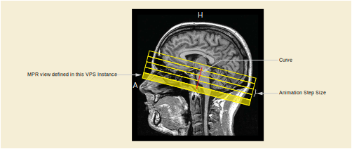

.. _chapter_XXX:

Volumetric Presentation States (Informative)
============================================

.. _sect_XXX.1:

Scope of Volumetric Presentation States
---------------------------------------

Volume data may be presented through a variety of display algorithms,
such as frame-by-frame viewing, multi-planar reconstruction, surface
rendering and volume rendering. The Volumetric Source Information
consists of one or more volumes (3D or 4D) used to form the
presentation. When a volume Presentation View is created through the use
of a Display Algorithm, it typically requires a set of Display
Parameters that determine the specific presentation to be obtained from
the volume data. Persistent storage of the Display Parameters used by a
Display Algorithm to obtain a presentation from a set of volume-related
data is called a Volumetric Presentation State (VPS):

Each Volumetric Presentation State describes a single view with optional
animation parameters. A Volumetric Presentation State may also indicate
that a particular view is intended to be displayed alongside the views
from other Volumetric Presentation States. However, descriptions of how
multiple views should be presented are not part of a Volumetric
Presentation State and should be specified by a Structured Display, a
Hanging Protocol or by another means.

The result of application of a Volumetric Presentation State is not
expected to be exactly reproducible on different systems. It is
difficult to describe the rendering algorithms in enough detail in an
interoperable manner, such that a presentation produced at a later time
is indistinguishable from that of the original presentation. While
Volumetric Presentation States use established DICOM concepts of
grayscale and color matching (GSDF and ICC color profiles) and provides
a generic description of the different types of display algorithms
possible, variations in algorithm implementations within display devices
are inevitable and an exact match of volume presentation on multiple
devices cannot be guaranteed. Nevertheless, reasonable consistency is
provided by specification of inputs, geometric descriptions of spatial
views, type of processing to be used, color mapping and blending, input
fusion, and many generic rendering parameters, producing what is
expected to be a clinically acceptable result.

.. _sect_XXX.1.1:

Volumetric Presentation States vs. Softcopy Presentation States
~~~~~~~~~~~~~~~~~~~~~~~~~~~~~~~~~~~~~~~~~~~~~~~~~~~~~~~~~~~~~~~

A Volumetric Presentation State is different from Softcopy Presentation
States in several ways:

1. Unlike Softcopy Presentation States, a Volumetric Presentation State
   describes the process of creating a new image rather than parameters
   for displaying an existing one

2. Volumetric Presentation State may not be displayed exactly the same
   way by all display systems due to differences in the implementations
   of rendering algorithms.

.. _sect_XXX.1.2:

Image Creation Process
~~~~~~~~~~~~~~~~~~~~~~

While both Volumetric Presentation States and Softcopy Presentation
States reference source images, a display application applying a
Volumetric Presentation State will not directly display the source
images. Instead, it will use the source data to construct a volume and
then create a new view of the volume data to be displayed. Depending on
the specific Volumetric Presentation State parameters, it is possible
that some portion of the inputs may not contribute to the generated
view.

.. _sect_XXX.1.3:

Volumetric Presentation State Display Consistency
~~~~~~~~~~~~~~~~~~~~~~~~~~~~~~~~~~~~~~~~~~~~~~~~~

Some types of volumetric views may be significantly influenced by the
hardware and software used to create them, and the industry has not yet
standardized the volume rendering pipelines to any great extent.

While volume geometry is consistent, other display characteristics such
as color, tissue opacity and lighting may vary slightly between display
systems.

The use of the Rendered Image Reference Sequence (0070,1104) to
associate the Volumetric Presentation State with a static rendering of
the same view is encouraged to facilitate the assessment of the view
consistency (see `Both Volumetric Presentation States and Linked Static
Images <#sect_XXX.2.3>`__).

.. _sect_XXX.2:

Volumetric Presentation States vs. Static Derived Images
--------------------------------------------------------

A Volumetric Presentation State creator is likely to be capable of also
creating a derived static image (such as a secondary capture image)
representing the same view. Depending on the use case, either a
Volumetric Presentation State or a Secondary Capture image or both may
be preferred.

.. _sect_XXX.2.1:

Static Derived Images
~~~~~~~~~~~~~~~~~~~~~

Static derived images are intended for direct viewing, and have the
following advantages:

-  supported by a wide variety of viewers

-  minimal display consistency issues - particularly when paired with a
   Softcopy Display Presentation State

-  no volumetric processing is required

and the following disadvantages

-  cannot be used to re-create the view from the volume data and then
   interactively manipulate the view

-  dynamic views may require the creation of a large number of
   individual instances

.. _sect_XXX.2.2:

Volumetric Presentation States
~~~~~~~~~~~~~~~~~~~~~~~~~~~~~~

Volumetric Presentation States have the following advantages:

-  can be used to re-create the view and allow interactive creation of
   additional views

-  supporting artifacts, such as Segmentation instances, are preserved
   and can be re-used

-  allows collaboration between dissimilar clinical applications (e.g.,
   a radiology application could create a view to be used as a starting
   point for a surgical planning application)

-  measurements and annotations can be linked to machine-readable
   structured context to allow integration with reporting and analysis
   applications

-  compact representation of dynamic views

and the following disadvantages:

-  not yet supported by legacy systems

-  consistency of presentation may vary

-  requires access to the original volumetric data and any associated
   objects (such as segmentation or spatial registration instances)

.. _sect_XXX.2.3:

Both Volumetric Presentation States and Linked Static Images
~~~~~~~~~~~~~~~~~~~~~~~~~~~~~~~~~~~~~~~~~~~~~~~~~~~~~~~~~~~~

A Volumetric Presentation State (VPS) creator can create a static
derived image at the same time and link it to the VPS by using the
Rendered Image Reference Sequence (0070,1104). This approach yields most
of the advantages of the individual formats. Additionally, it allows the
static images to be used to assess the display consistency of the view.

This approach also allows for a staged review where the static image is
reviewed first and the Volumetric Presentation State is only processed
if further interactivity is needed.

The main disadvantage to this approach is that it may add a significant
amount of data to an imaging study.

.. _sect_XXX.3:

Use Cases
---------

This section includes examples of volumetric views and how they can be
described with the Volumetric Presentation States to allow recreation of
those views on other systems. The illustrated use cases are examples
only and are by no means exhaustive.

Each use case is structured in three sections:

1. User Scenario: Describes the user needs in a specific clinical
   context, and/or a particular system configuration and equipment type.

2. Encoding Outline: Describes the Volumetric Presentation States
   related to this scenario, and highlights key aspects.

3. Encoding Details: Provides detailed recommendations of the key
   Attributes of the Volumetric Presentation States to address this
   particular scenario. The tables are similar to the IOD tables of .
   Only Attributes with specific recommendation in this particular
   scenario have been included.

.. _sect_XXX.3.1:

Simple Planar MPR View
~~~~~~~~~~~~~~~~~~~~~~

.. _sect_XXX.3.1.1:

User Scenario
^^^^^^^^^^^^^

A grayscale planar MPR view created from one input volume without
cropping is the most basic application of the Planar MPR VPS.

.. _sect_XXX.3.1.2:

Encoding Outline
^^^^^^^^^^^^^^^^

To create this view, the Volumetric Presentation State Relationship
Module refers to one input volume, and uses the Volumetric Presentation
State Display Module with a minimum set of Attributes, generating this
simple pipeline:

The parameters for computing the Multi-Planar Reconstruction are defined
in the Multi-Planar Reconstruction Geometry Module.

.. _sect_XXX.3.1.3:

Encoding Details
^^^^^^^^^^^^^^^^

.. _sect_XXX.3.1.3.1:

Volumetric Presentation State Relationship Module Recommendations
'''''''''''''''''''''''''''''''''''''''''''''''''''''''''''''''''

.. table:: Volumetric Presentation State Relationship Module
Recommendations

   +--------------------------+-------------+--------------------------+
   | Attribute Name           | Tag         | Comment                  |
   +==========================+=============+==========================+
   | Volumetric Presentation  | (0070,1201) | Set one item in this     |
   | State Input Sequence     |             | sequence.                |
   +--------------------------+-------------+--------------------------+
   | >Presentation Input Type | (0070,1202) | Set to "VOLUME".         |
   +--------------------------+-------------+--------------------------+
   | >Referenced Image        | (0008,1140) | Set reference(s) to the  |
   | Sequence                 |             | image(s) that make up    |
   |                          |             | the input volume.        |
   +--------------------------+-------------+--------------------------+
   | >Window Center           | (0028,1050) | Set either Window Center |
   |                          |             | and Window Width or VOI  |
   |                          |             | LUT Sequence             |
   |                          |             | (0028,3010).             |
   +--------------------------+-------------+--------------------------+
   | >Window Width            | (0028,1051) |                          |
   +--------------------------+-------------+--------------------------+
   | >Crop                    | (0070,1204) | Set to "NO".             |
   +--------------------------+-------------+--------------------------+

.. _sect_XXX.3.1.3.2:

Volumetric Presentation State Display Module Recommendations
''''''''''''''''''''''''''''''''''''''''''''''''''''''''''''

.. table:: Volumetric Presentation State Display Module Recommendations

   ====================== =========== ==============================
   Attribute Name         Tag         Comment
   ====================== =========== ==============================
   Pixel Presentation     (0008,9205) Set to "MONOCHROME"
   Presentation LUT Shape (2050,0020) Set to "IDENTITY" or "INVERSE"
   ====================== =========== ==============================

.. _sect_XXX.3.2:

Spatially Related Views (e.g., Orthogonal)
~~~~~~~~~~~~~~~~~~~~~~~~~~~~~~~~~~~~~~~~~~

.. _sect_XXX.3.2.1:

User Scenario
^^^^^^^^^^^^^

Planar MPR views are often displayed together with other spatially
related Planar MPR views. For example, a very common setup are three
orthogonal MPRs showing a lesion in transverse, coronal and sagittal
views of the data.

.. _sect_XXX.3.2.2:

Encoding Outline
^^^^^^^^^^^^^^^^

The storage of the view shown in `figure_title <#figure_XXX.3.2-1>`__
requires the generation of three Planar MPR VPS SOP instances and
normally a Basic Structured Display SOP instance which references the
Planar MPR VPS SOP instances.

In order to enable display applications which do not support the Basic
Structured Display SOP Class to create similar views of multiple related
Planar MPRs the Planar MPR VPS SOP Class supports marking instances as
spatially related in the Volumetric Presentation State Identification
Module.

This allows display applications to identify Volumetric Presentation
State instances for viewing together. Additionally, via the View
Modifier Code Sequence (0054, 0222) in the Presentation View Description
Module, display applications can determine which Volumetric Presentation
State instance to show at which position on the display depending on the
user preferences. Refer to `Uses of Presentation View Description in the
Identification Module <#sect_XXX.4>`__ for display layout
considerations.

.. _sect_XXX.3.2.3:

Encoding Details
^^^^^^^^^^^^^^^^

.. _sect_XXX.3.2.3.1:

Volumetric Presentation State Identification Module Recommendations
'''''''''''''''''''''''''''''''''''''''''''''''''''''''''''''''''''

.. table:: Volumetric Presentation State Identification Module
Recommendations

   +--------------------------+-------------+--------------------------+
   | Attribute Name           | Tag         | Comment                  |
   +==========================+=============+==========================+
   | Presentation Display     | (0070,1101) | Set to the same UID in   |
   | Collection UID           |             | all three Planar MPS VPS |
   |                          |             | SOP Instances.           |
   +--------------------------+-------------+--------------------------+

.. _sect_XXX.3.2.3.2:

Volumetric Presentation State Relationship Module Recommendations
'''''''''''''''''''''''''''''''''''''''''''''''''''''''''''''''''

.. table:: Volumetric Presentation State Relationship Module
Recommendations

   +--------------------------+-------------+--------------------------+
   | Attribute Name           | Tag         | Comment                  |
   +==========================+=============+==========================+
   | Volumetric Presentation  | (0070,1201) |                          |
   | State Input Sequence     |             |                          |
   +--------------------------+-------------+--------------------------+
   | >Referenced Image        | (0008,1140) | In this particular       |
   | Sequence                 |             | scenario usually all     |
   |                          |             | three VPS instances      |
   |                          |             | reference the same       |
   |                          |             | instances that create    |
   |                          |             | the volume from which    |
   |                          |             | the respective MPR is    |
   |                          |             | rendered.                |
   +--------------------------+-------------+--------------------------+

Display applications may want to implement mechanisms for detecting when
VPS SOP Instances reference exactly the same image instances within
their Volumetric Presentation State Input Sequence item which creates
the volume. This saves memory by loading the image instances that create
the volume only once.

The Volumetric Presentation States provide no mechanism to explicitly
specify the sharing of a volume by multiple VPS SOP instances.

.. _sect_XXX.3.2.3.3:

Presentation View Description Module Recommendations
''''''''''''''''''''''''''''''''''''''''''''''''''''

.. table:: Presentation View Description Module Recommendations

   +--------------------------+-------------+--------------------------+
   | Attribute Name           | Tag         | Comment                  |
   +==========================+=============+==========================+
   | View Code Sequence       | (0054,0220) | For this particular      |
   |                          |             | example, provides        |
   |                          |             | applicable values:       |
   +--------------------------+-------------+--------------------------+
   | >Code Value              | (0008,0100) | Set to "81654009",       |
   |                          |             | "30730003", or           |
   |                          |             | "62824007"               |
   +--------------------------+-------------+--------------------------+
   | >Coding Scheme           | (0008,0102) | Set to "SCT"             |
   | Designator               |             |                          |
   +--------------------------+-------------+--------------------------+
   | >Code Meaning            | (0008,0104) | Set to "Coronal",        |
   |                          |             | "Sagittal", or           |
   |                          |             | "Transverse",            |
   |                          |             | respectively             |
   +--------------------------+-------------+--------------------------+

.. _sect_XXX.3.3:

Replacing Set of Derived Images with Multiple Volumetric Presentation States
~~~~~~~~~~~~~~~~~~~~~~~~~~~~~~~~~~~~~~~~~~~~~~~~~~~~~~~~~~~~~~~~~~~~~~~~~~~~

.. _sect_XXX.3.3.1:

User Scenario
^^^^^^^^^^^^^

In the clinical routine radiologists often create a set of derived
images from Planar MPR views that cover a specific anatomic region. For
example from a head scan a range of oblique transverse Planar MPR views
are defined. These views are rendered into separate derived CT or
Secondary Capture SOP Class instances for conveying the relevant
information to the referring clinician.

However, these derived images depicting the specific anatomy cannot be
changed by the display application. The referring clinician cannot view
other anatomy not shown by the derived images and cannot alter the
orientation of the Planar MPR views.

Alternatively, a set of Planar MPR VPS SOP Instances can be created to
depict the slices through the volume. To indicate that these Volumetric
Presentation State instances are sequentially related, the Presentation
Sequence Collection UID (0070,1102) is used to associate the instances
to show the instances are to be displayed in sequence, and each VPS
instance is given a Presentation Sequence Position Index (0070,1103)
value to indicate the order in which the instances occur in the
collection (in this case, a spatial sequence). In this usage, no
animation is specified and it is at the discretion of the display
application how these views are to be presented, such as by frames in a
light-box format or by a manual control stepping through the
presentations in one display window.

.. _sect_XXX.3.3.2:

Encoding Outline
^^^^^^^^^^^^^^^^

For Planar MPR views that can be moved or rotated by the display
application, no special encodings in the Planar MPR VPS SOP Instance are
necessary.

.. figure:: figures/PS3.17_XXX.3.3-2.svg
   :alt: One Volumetric Presentations States is created for each of the
   MPR views. The VPS Instances have the same value of Presentation
   Display Collection UID (0070,1101)
   :name: figure_XXX.3.3-2

   One Volumetric Presentations States is created for each of the MPR
   views. The VPS Instances have the same value of Presentation Display
   Collection UID (0070,1101)

In general, the individual VPS instances may have any orientation and be
in any location.

.. _sect_XXX.3.3.3:

Encoding Details
^^^^^^^^^^^^^^^^

.. _sect_XXX.3.3.3.1:

Volumetric Presentation State Identification Module Recommendations
'''''''''''''''''''''''''''''''''''''''''''''''''''''''''''''''''''

.. table:: Volumetric Presentation State Identification Module
Recommendations

   +--------------------------+-------------+--------------------------+
   | Attribute Name           | Tag         | Comment                  |
   +==========================+=============+==========================+
   | Presentation Sequence    | (0070,1102) | Set to the same UID      |
   | Collection UID           |             | value in each of the     |
   |                          |             | Presentation State       |
   |                          |             | instances indicating the |
   |                          |             | views are sequentially   |
   |                          |             | ordered.                 |
   +--------------------------+-------------+--------------------------+
   | Presentation Sequence    | (0070,1103) | Set to a number          |
   | Position Index           |             | indicating the order of  |
   |                          |             | each VPS view in the     |
   |                          |             | sequentially-ordered     |
   |                          |             | set.                     |
   +--------------------------+-------------+--------------------------+

.. _sect_XXX.3.4:

Replacing Set of Derived Images With Single VPS Using Crosscurve Animation
~~~~~~~~~~~~~~~~~~~~~~~~~~~~~~~~~~~~~~~~~~~~~~~~~~~~~~~~~~~~~~~~~~~~~~~~~~

.. _sect_XXX.3.4.1:

User Scenario
^^^^^^^^^^^^^

Another technique for depicting a set of derived images is to have a
single Planar MPR VPS SOP Instance that describes an initial Planar MPR
view, and specify cross-curve animation to generate the other related
views. A straight-line curve is specified that begins at the center of
the initial Planar MPR view and ends at the intended center of the last
Planar MPR view of the set. A step size is specified to be the distance
between the first and last points of the line divided by the number of
desired slices minus one. A Recommended Animation Rate (0070,1A03) is
specified if the creator wishes to provide a hint to the display
application to scroll through the slices in the set, or could be omitted
to leave the animation method to the discretion of the display
application.

   defined in the VPS in Animation Step Size (0070,1A05) steps
   perpendicular along the curve
   :name: figure_XXX.3.4-1

   Additional MPR views are generated by moving the view that is defined
   in the VPS in Animation Step Size (0070,1A05) steps perpendicular
   along the curve

.. _sect_XXX.3.4.2:

Encoding Outline
^^^^^^^^^^^^^^^^

For this case, the curve is a straight line. In general, however, the
curve may have any form such as a circular curve to create radial MPR
views.

.. _sect_XXX.3.4.3:

Encoding Details
^^^^^^^^^^^^^^^^

.. _sect_XXX.3.4.3.1:

Presentation Animation Module Recommendations
'''''''''''''''''''''''''''''''''''''''''''''

.. table:: Presentation Animation Module Recommendations

   +--------------------------+-------------+--------------------------+
   | Attribute Name           | Tag         | Comment                  |
   +==========================+=============+==========================+
   | Presentation Animation   | (0070,1A01) | Set to "CROSSCURVE"      |
   | Style                    |             |                          |
   +--------------------------+-------------+--------------------------+
   | Recommended Animation    | (0070,1A03) | Set to provide a hint to |
   | Rate                     |             | the display application  |
   |                          |             | to automatically move    |
   |                          |             | the Planar MPR view      |
   |                          |             | along the curve through  |
   |                          |             | the volume, or omitted   |
   |                          |             | to leave the animation   |
   |                          |             | method to the discretion |
   |                          |             | of the display           |
   |                          |             | application.             |
   +--------------------------+-------------+--------------------------+
   | Animation Curve Sequence | (0070,1A04) | Set to the start point   |
   |                          |             | and end point of the     |
   |                          |             | straight-line curve.     |
   +--------------------------+-------------+--------------------------+
   | Animation Step Size      | (0070,1A05) | Set to (line length /    |
   |                          |             | (number of slices - 1))  |
   |                          |             | as the distance between  |
   |                          |             | MPR views along the      |
   |                          |             | straight-line curve.     |
   +--------------------------+-------------+--------------------------+

.. _sect_XXX.3.5:

Volumetric Annotations (example: Trajectory Planning)
~~~~~~~~~~~~~~~~~~~~~~~~~~~~~~~~~~~~~~~~~~~~~~~~~~~~~

.. _sect_XXX.3.5.1:

User Scenario
^^^^^^^^^^^^^

The Planar MPR Volumetric Presentation State makes it easy for the
receiving display application to enable the user to modify the initial
view for viewing nearby anatomy. This requires that display relative
annotations need to be removed when the initial view gets manipulated.
Otherwise there would be the risk that the annotations point to the
wrong anatomy.

To give the display application more control over when to show
annotations, the Planar MPR Volumetric Presentation State defines
annotations described by coordinates in the VPS-RCS.

As an example, during intervention trajectory planning one or more
straight lines representing the trajectories of a device (e.g., needle)
to be introduced during further treatment (e.g., cementoplasty, tumor
ablation…) are drawn by the user on a planar MPR view.

The Planar MPR VPS does not define how to render the text associated
with the annotation or how to connect it to the graphical representation
of the annotation. This is an implementation decision.

The creating application derives the 3D coordinates of the needle
trajectory from the Planar MPR view and creates a Planar MPR VPS SOP
instance with the needle trajectory as Volumetric Graphic Annotation.
When a user viewing the Presentation State manipulates the initial
Planar MPR view, the display application could control the visibility of
the needle trajectory based on the visibility of the part of the volume
which is crossed by the needle trajectory (e.g., by fading the
trajectory in and out, since the intersection of the graphic with the
plane may only appear as one point). Annotation Clipping (0070,1907)
controls whether the out-of-view portion of the 3D annotation is
displayed or not; see for details.

For handling multiple annotations in different areas of the volume,
applications might provide a list of the annotations which are
referenced in the Presentation State. When a user selects one of the
annotations the Planar MPR view could automatically be adjusted to
optimally show the part of the volume containing the annotation.

.. _sect_XXX.3.5.2:

Encoding Outline
^^^^^^^^^^^^^^^^

The Volumetric Presentation State provides the Volumetric Annotation
Sequence (0070,1901) for defining annotations by coordinates in the
VPS-RCS.

The needle trajectory is encoded as a line described by coordinates in
the VPS-RCS. Optionally a Structured Report can be referenced in order
to allow the display application to access additional clinical context.

.. _sect_XXX.3.5.3:

Encoding Details
^^^^^^^^^^^^^^^^

.. _sect_XXX.3.5.3.1:

Volumetric Graphic Annotation Module Recommendations
''''''''''''''''''''''''''''''''''''''''''''''''''''

.. table:: Volumetric Graphic Annotation Module Recommendations

   +--------------------------+-------------+--------------------------+
   | Attribute Name           | Tag         | Comment                  |
   +==========================+=============+==========================+
   | Volumetric Annotation    | (0070,1901) | Set multiple items in    |
   | Sequence                 |             | this sequence for        |
   |                          |             | multiple needle          |
   |                          |             | trajectories, one item   |
   |                          |             | for each needle          |
   |                          |             | trajectory.              |
   +--------------------------+-------------+--------------------------+
   | >Graphic Data            | (0070,0022) | Set to two (x,y,z)       |
   |                          |             | triplets, one for the    |
   |                          |             | start and one for the    |
   |                          |             | end of the needle        |
   |                          |             | trajectory line          |
   +--------------------------+-------------+--------------------------+
   | >Graphic Type            | (0070,0023) | Set to "POLYLINE"        |
   +--------------------------+-------------+--------------------------+
   | >Graphics Layer          | (0070,0002) | Set the same layer for   |
   |                          |             | all annotations of the   |
   |                          |             | same style.              |
   +--------------------------+-------------+--------------------------+
   | >Annotation Clipping     | (0070,1907) | Set to YES if only the   |
   |                          |             | portion of the 3D        |
   |                          |             | Annotation within the    |
   |                          |             | MPR slice or slab is to  |
   |                          |             | be displayed.            |
   |                          |             |                          |
   |                          |             | Set to NO if the 3D      |
   |                          |             | Annotation outside the   |
   |                          |             | MPR slice or slab should |
   |                          |             | also be projected into   |
   |                          |             | the view.                |
   +--------------------------+-------------+--------------------------+
   | >Unformatted Text Value  | (0070,0006) | Set "Needle trajectory"  |
   |                          |             | as the text to show as a |
   |                          |             | label next to the        |
   |                          |             | graphic annotation.      |
   +--------------------------+-------------+--------------------------+
   | >Referenced Structured   | (0070,1903) | Set to a reference to a  |
   | Context Sequence         |             | Structured Report and a  |
   |                          |             | Content Item providing   |
   |                          |             | clinical meaning of the  |
   |                          |             | annotation.              |
   |                          |             |                          |
   |                          |             | The display application  |
   |                          |             | could make additional    |
   |                          |             | text from the referenced |
   |                          |             | Structured Report        |
   |                          |             | concept separately       |
   |                          |             | available to the user    |
   |                          |             | (e.g., on mouse-over).   |
   +--------------------------+-------------+--------------------------+

.. _sect_XXX.3.6:

Highlighting Areas of Interest in MPR View
~~~~~~~~~~~~~~~~~~~~~~~~~~~~~~~~~~~~~~~~~~

.. _sect_XXX.3.6.1:

User Scenario
^^^^^^^^^^^^^

Lung nodules in a volume have been classified by a Computer Aided
Detection mechanism into different categories. E.g. small, medium,
large. In planar MPR views the nodules are colorized according to their
classification.

.. _sect_XXX.3.6.2:

Encoding Outline
^^^^^^^^^^^^^^^^

The classification of the lung nodules is stored in one or multiple
Segmentation IOD instances. For each lung nodule category one
Segmentation marks the corresponding areas in the volume.

For example, to create a Planar MPR view which shows 3 lung nodule
categories in different colors the Planar MPR VPS IOD instance defines
via the Volumetric Presentation State Display Module a volumetric
pipeline with 4 inputs.

The same volume data of the lung is used as input for all sub pipelines:

The first input to the Volumetric Presentation State (VPS) Display
Module provides the full (uncropped) MPR view of the anatomy in the
display, which will be left as grayscale in the VPS Display Module. This
will provide the backdrop to the colorized segmented inputs to be
subsequently overlaid by compositor components of the Volumetric
Presentation State Display pipeline.

The same input data and a single set of MPR geometry parameters defined
in the Multi-Planar Reconstruction Geometry Module are used to generate
each VPS Display Module input; only the cropping is different. The
Volume Cropping Module for each of the other inputs specifies the
included segments used to crop away all parts of the volume which do not
belong to a nodule of the corresponding nodule category.

From these cropped volumes Planar MPR views are generated, which are
then colorized and overlaid on the grayscale background within the
Volume Presentation State Display Module (see ).

In the Volumetric Presentation State Display Module the Presentation
State Classification Component Sequence (0070,1801) defines
scalar-to-RGB transformations for mapping each MPR view to RGBA. The
first MPR (anatomy) view is mapped to grayscale RGB by a RGB LUT
Transfer Function (0028,140F) value of EQUAL_RGB. Alpha LUT Transfer
Function (0028,1410) is set to NONE; i.e., the anatomy will be rendered
as completely opaque background.

For each of the three lung nodule MPR views an RGB transfer function
maps the view to the color corresponding the respective nodule category.
Alpha is set to 0 for black pixels, making them completely transparent.
Alpha for all other pixels is set to 1 (or a value between 0 and 1, if
some of the underlying anatomy shall be visible through the nodule
segmentation).

Presentation State Compositor Component Sequence (0070,1805) in the
Volumetric Presentation State Display Module then creates a chain of
three RGB Compositor Components which composite the four MPR views into
one. The first RGB Compositor performs "Partially Transparent A over B"
compositing as described in `Partially Transparent A Over B
Compositing <#sect_XXX.5.2>`__ by passing through the Alpha of input 2
as Weight-2 and 1-Alpha of input 2 as Weight-1.

The remaining two Compositor Components then perform "Pass Through"
compositing as described by `Pass-through Compositing <#sect_XXX.5.3>`__
by using Weighting LUTs which simply pass through Alpha-1 as Weight-1
and Alpha-2 as Weight-2, since the output of the previous Compositor
Components contains no Alpha, and therefore Alpha-1 will automatically
be set to one minus Alpha-2 by the Compositor.

`figure_title <#figure_XXX.3.6-3>`__ shows the complete pipeline for the
lung nodule example:

It is envisioned that display applications provide user interfaces for
manipulating the Alpha LUT Transfer Functions for each input of the
pipeline, allowing the user to control the visibility of the
highlighting of each lung nodule category.

.. _sect_XXX.3.6.3:

Encoding Details
^^^^^^^^^^^^^^^^

.. _sect_XXX.3.6.3.1:

Volumetric Presentation State Relationship Module Recommendations
'''''''''''''''''''''''''''''''''''''''''''''''''''''''''''''''''

.. table:: Volumetric Presentation State Relationship Module
Recommendations

   +--------------------------+-------------+--------------------------+
   | Attribute Name           | Tag         | Comment                  |
   +==========================+=============+==========================+
   | Volumetric Presentation  | (0070,1201) | Four items are this      |
   | State Input Sequence     |             | sequence.                |
   |                          |             |                          |
   |                          |             | Most Attributes of all 4 |
   |                          |             | items are set to exactly |
   |                          |             | the same values, except  |
   |                          |             | Crop (0070,1204) is set  |
   |                          |             | to "YES" for the last    |
   |                          |             | three items, and the     |
   |                          |             | segmentations for the    |
   |                          |             | different lung nodule    |
   |                          |             | classifications are      |
   |                          |             | referenced via the       |
   |                          |             | corresponding Cropping   |
   |                          |             | Specification Index      |
   |                          |             | (0070,1205).             |
   +--------------------------+-------------+--------------------------+
   | >ITEM 1                  |             |                          |
   +--------------------------+-------------+--------------------------+
   | >Presentation Input Type | (0070,1202) | Set to "VOLUME".         |
   +--------------------------+-------------+--------------------------+
   | >Referenced Image        | (0008,1140) | Set reference(s) to the  |
   | Sequence                 |             | image(s) that make up    |
   |                          |             | the input volume.        |
   +--------------------------+-------------+--------------------------+
   | >Crop                    | (0070,1204) | Set to "NO".             |
   +--------------------------+-------------+--------------------------+
   | >ITEM 2                  |             |                          |
   +--------------------------+-------------+--------------------------+
   | >Presentation Input Type | (0070,1202) | Set to "VOLUME".         |
   +--------------------------+-------------+--------------------------+
   | >Referenced Image        | (0008,1140) | Set reference(s) to the  |
   | Sequence                 |             | image(s) that make up    |
   |                          |             | the input volume.        |
   +--------------------------+-------------+--------------------------+
   | >Crop                    | (0070,1204) | Set to "YES".            |
   +--------------------------+-------------+--------------------------+
   | >Cropping Specification  | (0070,1205) | Set to "1" to identify   |
   | Index                    |             | the segmentation         |
   |                          |             | cropping of the large    |
   |                          |             | nodules.                 |
   +--------------------------+-------------+--------------------------+
   | >ITEM 3                  |             |                          |
   +--------------------------+-------------+--------------------------+
   | >Presentation Input Type | (0070,1202) | Set to "VOLUME".         |
   +--------------------------+-------------+--------------------------+
   | >Referenced Image        | (0008,1140) | Set reference(s) to the  |
   | Sequence                 |             | image(s) that make up    |
   |                          |             | the input volume.        |
   +--------------------------+-------------+--------------------------+
   | >Crop                    | (0070,1204) | Set to "YES".            |
   +--------------------------+-------------+--------------------------+
   | >Cropping Specification  | (0070,1205) | Set to "2" to identify   |
   | Index                    |             | the segmentation         |
   |                          |             | cropping of the medium   |
   |                          |             | nodules.                 |
   +--------------------------+-------------+--------------------------+
   | >ITEM 4                  |             |                          |
   +--------------------------+-------------+--------------------------+
   | >Presentation Input Type | (0070,1202) | Set to "VOLUME".         |
   +--------------------------+-------------+--------------------------+
   | >Referenced Image        | (0008,1140) | Set reference(s) to the  |
   | Sequence                 |             | image(s) that make up    |
   |                          |             | the input volume.        |
   +--------------------------+-------------+--------------------------+
   | >Crop                    | (0070,1204) | Set to "YES".            |
   +--------------------------+-------------+--------------------------+
   | >Cropping Specification  | (0070,1205) | Set to "3" to identify   |
   | Index                    |             | the segmentation         |
   |                          |             | cropping of the small    |
   |                          |             | nodules.                 |
   +--------------------------+-------------+--------------------------+

.. _sect_XXX.3.6.3.2:

Volumetric Presentation State Cropping Module Recommendations
'''''''''''''''''''''''''''''''''''''''''''''''''''''''''''''

.. table:: Volumetric Presentation State Cropping Module Recommendations

   +--------------------------+-------------+--------------------------+
   | Attribute Name           | Tag         | Comment                  |
   +==========================+=============+==========================+
   | Volume Cropping Sequence | (0070,1301) | The sequence contains    |
   |                          |             | three items, one for     |
   |                          |             | each segmented nodule    |
   |                          |             | type.                    |
   |                          |             |                          |
   |                          |             | For brevity only the     |
   |                          |             | first item of the        |
   |                          |             | sequence is shown in     |
   |                          |             | this table.              |
   +--------------------------+-------------+--------------------------+
   | >Volume Cropping Method  | (0070,1302) | Set to "INCLUDE_SEG"     |
   +--------------------------+-------------+--------------------------+
   | > Referenced Image       | (0008,1140) | Set references to        |
   | Sequence                 |             | segments depicting the   |
   |                          |             | areas that make up the   |
   |                          |             | nodules marked by the    |
   |                          |             | segmentation.            |
   +--------------------------+-------------+--------------------------+
   | >>Referenced SOP Class   | (0008,1150) | Set to                   |
   | UID                      |             | "1.2.840.1000            |
   |                          |             | 8.​5.​1.​4.​1.​1.​66.​4" |
   |                          |             | (Segmentation Storage    |
   |                          |             | SOP Class UID)           |
   +--------------------------+-------------+--------------------------+
   | >>Referenced SOP         | (0008,1155) | Set to the SOP Instance  |
   | Instance UID             |             | UID of the instance that |
   |                          |             | contains the             |
   |                          |             | Segmentation.            |
   +--------------------------+-------------+--------------------------+
   | >>Referenced Segment     | (0062,000B) | Set to the identifier of |
   | Number                   |             | the relevant segment     |
   |                          |             | within the Segmentation  |
   |                          |             | instance (e.g., "Large   |
   |                          |             | Nodules").               |
   +--------------------------+-------------+--------------------------+
   | …                        |             |                          |
   +--------------------------+-------------+--------------------------+

.. _sect_XXX.3.6.3.3:

Volumetric Presentation State Display Module Recommendations
''''''''''''''''''''''''''''''''''''''''''''''''''''''''''''

.. table:: Volumetric Presentation State Display Module Recommendations

   +--------------------------+-------------+--------------------------+
   | Attribute Name           | Tag         | Comment                  |
   +==========================+=============+==========================+
   | Pixel Presentation       | (0008,9205) | Set to "TRUE_COLOR"      |
   +--------------------------+-------------+--------------------------+
   | Presentation State       | (0070,1801) | Include four items, one  |
   | Classification Component |             | for each classification  |
   | Sequence                 |             | component.               |
   +--------------------------+-------------+--------------------------+
   | >ITEM 1                  |             |                          |
   +--------------------------+-------------+--------------------------+
   | >Component Type          | (0070,1802) | Set to "ONE_TO_RGBA"     |
   +--------------------------+-------------+--------------------------+
   | >Component Input         | (0070,1803) | Set only one item in     |
   | Sequence                 |             | this sequence since the  |
   |                          |             | component has only one   |
   |                          |             | input.                   |
   +--------------------------+-------------+--------------------------+
   | >>Input Set Index        | (0070,1804) | Set to "1" for the       |
   |                          |             | anatomy view.            |
   +--------------------------+-------------+--------------------------+
   | >RGB LUT Transfer        | (0028,140F) | Set to "EQUAL_RGB" to    |
   | Function                 |             | map to grayscale RGB     |
   |                          |             | values.                  |
   +--------------------------+-------------+--------------------------+
   | >Alpha LUT Transfer      | (0028,1410) | Set to "NONE". The       |
   | Function                 |             | anatomy is completely    |
   |                          |             | opaque.                  |
   +--------------------------+-------------+--------------------------+
   | >ITEM 2                  |             |                          |
   +--------------------------+-------------+--------------------------+
   | >Component Type          | (0070,1802) | Set to "ONE_TO_RGBA"     |
   +--------------------------+-------------+--------------------------+
   | >Component Input         | (0070,1803) | Set only one item in     |
   | Sequence                 |             | this sequence since the  |
   |                          |             | component has only one   |
   |                          |             | input.                   |
   +--------------------------+-------------+--------------------------+
   | >>Input Set Index        | (0070,1804) | Set to "2" for the large |
   |                          |             | nodules segmentation.    |
   +--------------------------+-------------+--------------------------+
   | >RGB LUT Transfer        | (0028,140F) | Set to "TABLE" to be     |
   | Function                 |             | able to map to "red"     |
   |                          |             | colors.                  |
   +--------------------------+-------------+--------------------------+
   | >Alpha LUT Transfer      | (0028,1410) | Set to "TABLE" to be     |
   | Function                 |             | able to set a            |
   |                          |             | transparency for the     |
   |                          |             | segmentation.            |
   +--------------------------+-------------+--------------------------+
   | …                        |             | Definitions of lookup    |
   |                          |             | tables left out for      |
   |                          |             | brevity.                 |
   +--------------------------+-------------+--------------------------+
   | >ITEM 3                  |             |                          |
   +--------------------------+-------------+--------------------------+
   | >Component Type          | (0070,1802) | Set to "ONE_TO_RGBA"     |
   +--------------------------+-------------+--------------------------+
   | >Component Input         | (0070,1803) | Set only one item in     |
   | Sequence                 |             | this sequence since the  |
   |                          |             | component has only one   |
   |                          |             | input.                   |
   +--------------------------+-------------+--------------------------+
   | >>Input Set Index        | (0070,1804) | Set to "3" for the large |
   |                          |             | nodules segmentation.    |
   +--------------------------+-------------+--------------------------+
   | >RGB LUT Transfer        | (0028,140F) | Set to "TABLE" to be     |
   | Function                 |             | able to map to "yellow"  |
   |                          |             | colors.                  |
   +--------------------------+-------------+--------------------------+
   | >Alpha LUT Transfer      | (0028,1410) | Set to "TABLE" to be     |
   | Function                 |             | able to set a            |
   |                          |             | transparency for the     |
   |                          |             | segmentation.            |
   +--------------------------+-------------+--------------------------+
   | …                        |             | Definitions of lookup    |
   |                          |             | tables left out for      |
   |                          |             | brevity.                 |
   +--------------------------+-------------+--------------------------+
   | >ITEM 4                  |             |                          |
   +--------------------------+-------------+--------------------------+
   | >Component Type          | (0070,1802) | Set to "ONE_TO_RGBA"     |
   +--------------------------+-------------+--------------------------+
   | >Component Input         | (0070,1803) | Set only one item in     |
   | Sequence                 |             | this sequence since the  |
   |                          |             | component has only one   |
   |                          |             | input.                   |
   +--------------------------+-------------+--------------------------+
   | >>Input Set Index        | (0070,1804) | Set to "4" for the small |
   |                          |             | nodules segmentation.    |
   +--------------------------+-------------+--------------------------+
   | >RGB LUT Transfer        | (0028,140F) | Set to "TABLE" to be     |
   | Function                 |             | able to map to "green"   |
   |                          |             | colors.                  |
   +--------------------------+-------------+--------------------------+
   | >Alpha LUT Transfer      | (0028,1410) | Set to "TABLE" to be     |
   | Function                 |             | able to set a            |
   |                          |             | transparency for the     |
   |                          |             | segmentation.            |
   +--------------------------+-------------+--------------------------+
   | …                        |             | Definitions of lookup    |
   |                          |             | tables left out for      |
   |                          |             | brevity.                 |
   +--------------------------+-------------+--------------------------+
   | Presentation State       | (0070,1805) | Include three items that |
   | Compositor Component     |             | define the chain of RGB  |
   | Sequence                 |             | Compositor components.   |
   +--------------------------+-------------+--------------------------+
   | >ITEM 1                  |             |                          |
   +--------------------------+-------------+--------------------------+
   | >Weighting Transfer      | (0070,1806) | Contains the two         |
   | Function Sequence        |             | Weighting LUTs from      |
   |                          |             | `Partially Transparent A |
   |                          |             | Over B                   |
   |                          |             | Compos                   |
   |                          |             | iting <#sect_XXX.5.2>`__ |
   |                          |             | to create the "Partially |
   |                          |             | Transparent A over B"    |
   |                          |             | composting from two RGBA |
   |                          |             | inputs.                  |
   +--------------------------+-------------+--------------------------+
   | …                        |             | Definitions of lookup    |
   |                          |             | tables left out for      |
   |                          |             | brevity.                 |
   +--------------------------+-------------+--------------------------+
   | >ITEM 2                  |             |                          |
   +--------------------------+-------------+--------------------------+
   | >Weighting Transfer      | (0070,1806) | Contains the two         |
   | Function Sequence        |             | Weighting LUTs from      |
   |                          |             | `Pass-through            |
   |                          |             | Compos                   |
   |                          |             | iting <#sect_XXX.5.3>`__ |
   |                          |             | to create the "A over B" |
   |                          |             | composting from one RGB  |
   |                          |             | and one RGBA input.      |
   +--------------------------+-------------+--------------------------+
   | …                        |             | Definitions of lookup    |
   |                          |             | tables left out for      |
   |                          |             | brevity.                 |
   +--------------------------+-------------+--------------------------+
   | >ITEM 3                  |             |                          |
   +--------------------------+-------------+--------------------------+
   | >Weighting Transfer      | (0070,1806) | Contains the two         |
   | Function Sequence        |             | Weighting LUTs from      |
   |                          |             | `Pass-through            |
   |                          |             | Compos                   |
   |                          |             | iting <#sect_XXX.5.3>`__ |
   |                          |             | to create the "A over B" |
   |                          |             | composting from one RGB  |
   |                          |             | and one RGBA input.      |
   +--------------------------+-------------+--------------------------+
   | …                        |             | Definitions of lookup    |
   |                          |             | tables left out for      |
   |                          |             | brevity.                 |
   +--------------------------+-------------+--------------------------+
   | ICC Profile              | (0028,2000) | Set to an ICC Profile    |
   |                          |             | describing the           |
   |                          |             | transformation of the    |
   |                          |             | resulting RGB image into |
   |                          |             | PCS-Values.              |
   +--------------------------+-------------+--------------------------+

.. _sect_XXX.3.7:

Ultrasound Color Flow MPR
~~~~~~~~~~~~~~~~~~~~~~~~~

.. _sect_XXX.3.7.1:

User Scenario
^^^^^^^^^^^^^

Ultrasound images and volumes are able to depict both anatomic tissue
information (usually shown as a grayscale image) along with functional
tissue motion or blood flow information (usually shown in colors
representing motion towards or away from the ultrasound transducer).

The sample illustration in `figure_title <#figure_XXX.3.7-1>`__ is
comprised of three Color Flow MPR presentations that are approximately
mutually orthogonal in the VPS Reference Coordinate System. Each
presentation is described by one Planar MPR Volumetric Presentation
State instance, with layout and overlay graphics provided by a Hanging
Protocol instance. The three VPS instances share the same value of
Presentation Display Collection UID (0070,1101) indicating that they are
intended to be displayed together.

.. _sect_XXX.3.7.2:

Encoding Outline
^^^^^^^^^^^^^^^^

Each of the planar MPR presentations in the display is specified by one
Planar MPR Volumetric Presentation State instance. The source volume in
this case is stored in an Enhanced US Volume instance, which uses two
sets of frames to construct the volume: one set contains tissue
intensity frames and one set contains flow velocity frames. Each set of
frames comprise one input to the VPS instance and is referenced in one
item of Volumetric Presentation State Input Sequence (0070,1201),
wherein the Referenced Image Sequence (0008,1140) contains one item per
frame of the Enhanced US Volume instance. Spatial Registration is not
necessary since both frame sets share the same Volume Frame of Reference
in the source instance. Cropping is usually not necessary for
multi-planar reconstruction, and both inputs use the same MPR geometry
specification.

Classification of the two data types is accomplished using Pixel
Presentation (0008,9205) of TRUE_COLOR and two items in Presentation
State Classification Component Sequence (0070,1801). The tissue
intensity MPR frame is classified using Component Type (0070,1802) of
ONE_TO_RGBA and RGB LUT Transfer Function (0028,140F) of EQUAL_RGB to
create a grayscale image, while the flow velocity MPR frame is colorized
by using Component Type (0070,1802) of ONE_TO_RGBA and RGB LUT Transfer
Function (0028,140F) of TABLE and mapping to colors in an RGB color
lookup table. Both inputs use Alpha LUT Transfer Function (0028,1410) of
IDENTITY so that the alpha represents the magnitude of the input value.

Compositing of the two classified data streams is accomplished using one
RGB compositor component, specified by one item in Presentation State
Compositor Component Sequence (0070,1805). The Weighting Transfer
Function Sequence (0070,1806) is used to accomplish "Threshold
Compositing" as described in `Threshold Compositing <#sect_XXX.5.4>`__,
a common method used for ultrasound color flow compositing.

`figure_title <#figure_XXX.3.7-2>`__ shows the complete pipeline for
Ultrasound Color Flow Planar MPR.

.. _sect_XXX.3.7.3:

Encoding Details
^^^^^^^^^^^^^^^^

.. _sect_XXX.3.7.3.1:

Volumetric Presentation State Relationship Module Recommendations
'''''''''''''''''''''''''''''''''''''''''''''''''''''''''''''''''

.. table:: Volumetric Presentation State Relationship Module
Recommendations

   +--------------------------+-------------+--------------------------+
   | Attribute Name           | Tag         | Comment                  |
   +==========================+=============+==========================+
   | Volumetric Presentation  | (0070,1201) | Two items are this       |
   | State Input Sequence     |             | sequence referencing one |
   |                          |             | volume for each data     |
   |                          |             | type                     |
   +--------------------------+-------------+--------------------------+
   | >ITEM 1                  |             |                          |
   +--------------------------+-------------+--------------------------+
   | >Volumetric Presentation | (0070,1207) | Set to 1                 |
   | Input Number             |             |                          |
   +--------------------------+-------------+--------------------------+
   | >Presentation Input Type | (0070,1202) | Set to "VOLUME".         |
   +--------------------------+-------------+--------------------------+
   | >Referenced Image        | (0008,1140) | Sequence of frames with  |
   | Sequence                 |             | Data Type (0018,9808)    |
   |                          |             | value of                 |
   |                          |             | TISSUE_INTENSITY         |
   +--------------------------+-------------+--------------------------+
   | *>>*                     |             |                          |
   +--------------------------+-------------+--------------------------+
   | >Crop                    | (0070,1204) | Set to "NO".             |
   +--------------------------+-------------+--------------------------+
   | >ITEM 2                  |             |                          |
   +--------------------------+-------------+--------------------------+
   | >Volumetric Presentation | (0070,1207) | Set to 2                 |
   | Input Number             |             |                          |
   +--------------------------+-------------+--------------------------+
   | >Presentation Input Type | (0070,1202) | Set to "VOLUME".         |
   +--------------------------+-------------+--------------------------+
   | >Referenced Image        | (0008,1140) | Sequence of frames with  |
   | Sequence                 |             | Data Type (0018,9808)    |
   |                          |             | value of FLOW_VELOCITY   |
   +--------------------------+-------------+--------------------------+
   | *>>*                     |             |                          |
   +--------------------------+-------------+--------------------------+
   | >Crop                    | (0070,1204) | Set to "NO".             |
   +--------------------------+-------------+--------------------------+

.. _sect_XXX.3.7.3.2:

Presentation View Description Module Recommendations
''''''''''''''''''''''''''''''''''''''''''''''''''''

.. table:: Presentation View Description Module Recommendations

   +--------------------------+-------------+--------------------------+
   | Attribute Name           | Tag         | Comment                  |
   +==========================+=============+==========================+
   | Anatomic Region Sequence | (0008,2218) | Set to `(80891009, SCT,  |
   |                          |             | "Heart") <http://sno     |
   |                          |             | med.info/id/80891009>`__ |
   +--------------------------+-------------+--------------------------+
   | View Code Sequence       | (0054,0220) | Set to the code triplet  |
   |                          |             | for the view.            |
   |                          |             |                          |
   |                          |             | Typical coded values:    |
   |                          |             |                          |
   |                          |             | -  `(399214001, SCT,     |
   |                          |             |    "Apical four          |
   |                          |             |                          |
   |                          |             |   chamber") <http://snom |
   |                          |             | ed.info/id/399214001>`__ |
   |                          |             |                          |
   |                          |             | -  `(399232001, SCT,     |
   |                          |             |    "Apical two           |
   |                          |             |                          |
   |                          |             |   chamber") <http://snom |
   |                          |             | ed.info/id/399232001>`__ |
   |                          |             |                          |
   |                          |             | -  `(443698002, SCT,     |
   |                          |             |    "Transesophageal      |
   |                          |             |    short axis            |
   |                          |             |    view") <http://snom   |
   |                          |             | ed.info/id/443698002>`__ |
   +--------------------------+-------------+--------------------------+

.. _sect_XXX.3.7.3.3:

Multi-Planar Reconstruction Geometry Module Recommendations
'''''''''''''''''''''''''''''''''''''''''''''''''''''''''''

.. table:: Multi-Planar Reconstruction Geometry Module Recommendations

   +--------------------------+-------------+--------------------------+
   | Attribute Name           | Tag         | Comment                  |
   +==========================+=============+==========================+
   | Multi-Planar             | (0070,1501) | Set to PLANAR            |
   | Reconstruction Style     |             |                          |
   +--------------------------+-------------+--------------------------+
   | MPR Thickness Type       | (0070,1502) | Set to THIN              |
   +--------------------------+-------------+--------------------------+
   | MPR View Width Direction | (0070,1507) | Set to the direction of  |
   |                          |             | the top row of the MPR   |
   |                          |             | view in the VPC-RCS      |
   +--------------------------+-------------+--------------------------+
   | MPR View Width           | (0070,1508) | Set to the width of the  |
   |                          |             | top row of the MPR view  |
   |                          |             | in the VPC-RCS           |
   +--------------------------+-------------+--------------------------+
   | MPR View Height          | (0070,1511) | Set to the direction of  |
   | Direction                |             | the leftmost column of   |
   |                          |             | the MPR view in the      |
   |                          |             | VPC-RCS                  |
   +--------------------------+-------------+--------------------------+
   | MPR View Height          | (0070,1512) | Set to the width of the  |
   |                          |             | leftmost column of the   |
   |                          |             | MPR view in the VPC-RCS  |
   +--------------------------+-------------+--------------------------+
   | MPR Top Left Hand Corner | (0070,1505) | Set to an (x,y,z) point  |
   |                          |             | in the VPC-RCS of the    |
   |                          |             | upper left corner of the |
   |                          |             | MPR view                 |
   +--------------------------+-------------+--------------------------+

.. _sect_XXX.3.7.3.4:

Volumetric Presentation State Display Module Recommendations
''''''''''''''''''''''''''''''''''''''''''''''''''''''''''''

.. table:: Volumetric Presentation State Display Module Recommendations

   +--------------------------+-------------+--------------------------+
   | Attribute Name           | Tag         | Comment                  |
   +==========================+=============+==========================+
   | Pixel Presentation       | (0008,9205) | Set to "TRUE_COLOR"      |
   +--------------------------+-------------+--------------------------+
   | Presentation State       | (0070,1801) | Contains two items, one  |
   | Classification Component |             | for each classification  |
   | Sequence                 |             | component.               |
   +--------------------------+-------------+--------------------------+
   | >ITEM 1                  |             |                          |
   +--------------------------+-------------+--------------------------+
   | >Component Type          | (0070,1802) | Set to "ONE_TO_RGBA"     |
   +--------------------------+-------------+--------------------------+
   | >Component Input         | (0070,1803) | Only one item in this    |
   | Sequence                 |             | sequence since the       |
   |                          |             | component has only one   |
   |                          |             | input.                   |
   +--------------------------+-------------+--------------------------+
   | >>Input Set Index        | (0070,1804) | Set to "1" for the MPR   |
   |                          |             | slice of the             |
   |                          |             | TISSUE_INTENSITY data    |
   +--------------------------+-------------+--------------------------+
   | >RGB LUT Transfer        | (0028,140F) | Set to "EQUAL_RGB" to    |
   | Function                 |             | map to grayscale RGB     |
   |                          |             | values.                  |
   +--------------------------+-------------+--------------------------+
   | >Alpha LUT Transfer      | (0028,1410) | Set to "IDENTITY"        |
   | Function                 |             |                          |
   +--------------------------+-------------+--------------------------+
   | >ITEM 2                  |             |                          |
   +--------------------------+-------------+--------------------------+
   | >Component Type          | (0070,1802) | Set to "ONE_TO_RGBA"     |
   +--------------------------+-------------+--------------------------+
   | >Component Input         | (0070,1803) | Only one item in this    |
   | Sequence                 |             | sequence since the       |
   |                          |             | component has only one   |
   |                          |             | input.                   |
   +--------------------------+-------------+--------------------------+
   | >>Input Set Index        | (0070,1804) | Set to "2" for the MPR   |
   |                          |             | slice of the             |
   |                          |             | FLOW_VELOCITY data       |
   +--------------------------+-------------+--------------------------+
   | >RGB LUT Transfer        | (0028,140F) | Set to "TABLE" to be     |
   | Function                 |             | able to map to colors    |
   |                          |             | representing the flow    |
   |                          |             | velocities towards and   |
   |                          |             | away from the ultrasound |
   |                          |             | transducer               |
   +--------------------------+-------------+--------------------------+
   | >Alpha LUT Transfer      | (0028,1410) | Set to "IDENTITY"        |
   | Function                 |             |                          |
   +--------------------------+-------------+--------------------------+
   | …                        |             | Definitions of lookup    |
   |                          |             | tables left out for      |
   |                          |             | brevity.                 |
   +--------------------------+-------------+--------------------------+
   | Presentation State       | (0070,1805) | Set to one item that     |
   | Compositor Component     |             | defines the threshold    |
   | Sequence                 |             | compositing of the two   |
   |                          |             | data types               |
   +--------------------------+-------------+--------------------------+
   | >Weighting Transfer      | (0070,1806) | Contains the two         |
   | Function Sequence        |             | Weighting LUTs from      |
   |                          |             | `Threshold               |
   |                          |             | Compos                   |
   |                          |             | iting <#sect_XXX.5.4>`__ |
   |                          |             | to create the threshold  |
   |                          |             | composting from two RGBA |
   |                          |             | inputs:                  |
   |                          |             |                          |
   |                          |             | -  If the magnitude of   |
   |                          |             |    the FLOW_VELOCITY     |
   |                          |             |    input is greater than |
   |                          |             |    the magnitude of the  |
   |                          |             |    TISSUE_INTENSITY      |
   |                          |             |    input, display the    |
   |                          |             |    MPR of the            |
   |                          |             |    FLOW_VELOCITY data.   |
   |                          |             |                          |
   |                          |             | -  Otherwise, display    |
   |                          |             |    the MPR of the        |
   |                          |             |    TISSUE_INTENSITY data |
   +--------------------------+-------------+--------------------------+
   | …                        |             | Definitions of lookup    |
   |                          |             | tables left out for      |
   |                          |             | brevity.                 |
   +--------------------------+-------------+--------------------------+
   | ICC Profile              | (0028,2000) | Set to an ICC Profile    |
   |                          |             | describing the           |
   |                          |             | transformation of the    |
   |                          |             | resulting RGB image into |
   |                          |             | PCS-Values.              |
   +--------------------------+-------------+--------------------------+

.. _sect_XXX.3.8:

Blending with Functional Data, e.g., PET/CT or Perfusion Data
~~~~~~~~~~~~~~~~~~~~~~~~~~~~~~~~~~~~~~~~~~~~~~~~~~~~~~~~~~~~~

.. _sect_XXX.3.8.1:

User Scenario
^^^^^^^^^^^^^

To aid in the exact localization of functional data, e.g., the
accumulation of a radioactive tracer which is measured with a position
emission tomography (PET) scan, the colorized functional data is blended
with e.g., a CT scan which shows the corresponding anatomy in detail.

.. _sect_XXX.3.8.2:

Encoding Outline
^^^^^^^^^^^^^^^^

To create a Planar MPR view which shows the colorized PET data blended
with the grayscale CT data the Planar MPR VPS IOD instance defines via
the Volumetric Presentation State Display Module a volumetric pipeline
with 2 inputs.

The first input to the Volumetric Presentation State (VPS) Display
pipeline provides the MPR view of the anatomy in the display, which will
be left as grayscale in the VPS Display pipeline. This will provide the
backdrop to the colorized PET input to be subsequently overlaid in the
second stage of the VPS pipeline.

Since PET and CT datasets usually have different resolutions and are not
aligned (even if they reference the same Frame of Reference IOD
instance) the datasets are spatially registered to the Volumetric
Presentation State RCS. From these registered volumes grayscale Planar
MPRs are generated using the same MPR geometry.

The Volume Presentation State Display pipeline then blends the MPRs into
one view (see ).

In the Volumetric Presentation State Display Module the Presentation
State Classification Component Sequence (0070,1801) defines
classification components for mapping the MPRs to RGBA.

The first MPR (CT) view is mapped to grayscale RGBA by an EQUAL_RGB RGB
LUT Transfer Function (0028,140F). Alpha LUT Transfer Function
(0028,1410) is set to NONE, since the anatomy will be rendered as
completely opaque background.

For the second MPR (functional, PET) view an RGBA transfer function maps
the tracer intensity values to a color range. Alpha-2 is set to 0 for
black pixels, making them completely transparent. Alpha-2 for all other
pixels is set to a single value between 0 and 1, depending on the
intended transparency of the functional data.

It is envisioned that display applications provide mechanisms to the
user for manipulating the Alpha-2 value which has been set in the
Presentation State, thereby allowing the user to control the visibility
of the anatomy vs. the functional data.

The RGB Compositor then performs "Partially Transparent A over B"
compositing as described in `Partially Transparent A Over B
Compositing <#sect_XXX.5.2>`__ by passing through Alpha-2 as Weight-2
and (1- Alpha-2) as Weight-1

`figure_title <#figure_XXX.3.8-3>`__ shows details of the classification
and compositing for the blended PET/CT Planar MPR.

.. _sect_XXX.3.8.3:

Encoding Details
^^^^^^^^^^^^^^^^

.. _sect_XXX.3.8.3.1:

Volumetric Presentation State Relationship Module Recommendations
'''''''''''''''''''''''''''''''''''''''''''''''''''''''''''''''''

.. table:: Volumetric Presentation State Relationship Module
Recommendations

   +--------------------------+-------------+--------------------------+
   | Attribute Name           | Tag         | Comment                  |
   +==========================+=============+==========================+
   | Volumetric Presentation  | (0070,1201) | Contains two items: one  |
   | State Input Sequence     |             | for the CT volume input  |
   |                          |             | and one for the PET      |
   |                          |             | volume input.            |
   +--------------------------+-------------+--------------------------+
   | >ITEM 1                  |             |                          |
   +--------------------------+-------------+--------------------------+
   | >Presentation Input Type | (0070,1202) | Set to "VOLUME".         |
   +--------------------------+-------------+--------------------------+
   | >Referenced Image        | (0008,1140) | Set reference(s) to the  |
   | Sequence                 |             | image(s) that make(s) up |
   |                          |             | the CT input volume.     |
   +--------------------------+-------------+--------------------------+
   | >Referenced Spatial      | (0070,0404) | Set to reference the     |
   | Registration Sequence    |             | Spatial Registration     |
   |                          |             | instance which registers |
   |                          |             | the CT input to the VPS  |
   |                          |             | RCS.                     |
   +--------------------------+-------------+--------------------------+
   | >Window Center           | (0028,1050) | Set either Window Center |
   |                          |             | and Window Width or VOI  |
   |                          |             | LUT Sequence             |
   |                          |             | (0028,3010).             |
   +--------------------------+-------------+--------------------------+
   | >Window Width            | (0028,1051) |                          |
   +--------------------------+-------------+--------------------------+
   | >Crop                    | (0070,1204) | Set to "NO".             |
   +--------------------------+-------------+--------------------------+
   | >ITEM 2                  |             |                          |
   +--------------------------+-------------+--------------------------+
   | >Presentation Input Type | (0070,1202) | Set to "VOLUME".         |
   +--------------------------+-------------+--------------------------+
   | >Referenced Image        | (0008,1140) | Set reference(s) to the  |
   | Sequence                 |             | image(s) that make(s) up |
   |                          |             | the PET input volume.    |
   +--------------------------+-------------+--------------------------+
   | >Referenced Spatial      | (0070,0404) | Set reference to the     |
   | Registration Sequence    |             | Spatial Registration     |
   |                          |             | instance which registers |
   |                          |             | the PET input to the VPS |
   |                          |             | RCS.                     |
   +--------------------------+-------------+--------------------------+
   | >Window Center           | (0028,1050) | Set either Window Center |
   |                          |             | and Window Width or VOI  |
   |                          |             | LUT Sequence             |
   |                          |             | (0028,3010).             |
   +--------------------------+-------------+--------------------------+
   | >Window Width            | (0028,1051) |                          |
   +--------------------------+-------------+--------------------------+
   | >Crop                    | (0070,1204) | Set to "NO".             |
   +--------------------------+-------------+--------------------------+

.. _sect_XXX.3.8.2.3:

Volumetric Presentation State Display Module Recommendations
''''''''''''''''''''''''''''''''''''''''''''''''''''''''''''

.. table:: Volumetric Presentation State Display Module Recommendations

   +--------------------------+-------------+--------------------------+
   | Attribute Name           | Tag         | Comment                  |
   +==========================+=============+==========================+
   | Pixel Presentation       | (0008,9205) | Set to "TRUE_COLOR"      |
   +--------------------------+-------------+--------------------------+
   | Presentation State       | (0070,1801) | Contains two items, one  |
   | Classification Component |             | for classifying the CT   |
   | Sequence                 |             | data and one for         |
   |                          |             | classifying the PET      |
   |                          |             | data.                    |
   +--------------------------+-------------+--------------------------+
   | >ITEM 1                  |             |                          |
   +--------------------------+-------------+--------------------------+
   | >Component Type          | (0070,1802) | Set to "ONE_TO_RGBA"     |
   +--------------------------+-------------+--------------------------+
   | >Component Input         | (0070,1803) | Contains one item in     |
   | Sequence                 |             | this sequence since the  |
   |                          |             | component has only one   |
   |                          |             | input.                   |
   +--------------------------+-------------+--------------------------+
   | >>Input Set Index        | (0070,1804) | Set to "1" for the       |
   |                          |             | anatomy view.            |
   +--------------------------+-------------+--------------------------+
   | >RGB LUT Transfer        | (0028,140F) | Set to "EQUAL_RGB" to    |
   | Function                 |             | map to grayscale RGB     |
   |                          |             | values.                  |
   +--------------------------+-------------+--------------------------+
   | >Alpha LUT Transfer      | (0028,1410) | Set to "NONE". The       |
   | Function                 |             | anatomy is completely    |
   |                          |             | opaque.                  |
   +--------------------------+-------------+--------------------------+
   | >ITEM 2                  |             |                          |
   +--------------------------+-------------+--------------------------+
   | >Component Type          | (0070,1802) | Set to "ONE_TO_RGBA"     |
   +--------------------------+-------------+--------------------------+
   | >Component Input         | (0070,1803) | Contains one item in     |
   | Sequence                 |             | this sequence since the  |
   |                          |             | component has only one   |
   |                          |             | input.                   |
   +--------------------------+-------------+--------------------------+
   | >>Input Set Index        | (0070,1804) | Set to "2" for the       |
   |                          |             | functional view.         |
   +--------------------------+-------------+--------------------------+
   | >RGB LUT Transfer        | (0028,140F) | Set to "TABLE" to be     |
   | Function                 |             | able to map functional   |
   |                          |             | data to a color range.   |
   +--------------------------+-------------+--------------------------+
   | >Alpha LUT Transfer      | (0028,1410) | Set to "TABLE" to be     |
   | Function                 |             | able to set a            |
   |                          |             | transparency for the     |
   |                          |             | segmentation.            |
   +--------------------------+-------------+--------------------------+
   | …                        |             | Definitions of lookup    |
   |                          |             | tables left out for      |
   |                          |             | brevity.                 |
   +--------------------------+-------------+--------------------------+
   | Presentation State       | (0070,1805) | Contains one item        |
   | Compositor Sequence      |             |                          |
   +--------------------------+-------------+--------------------------+
   | >Weighting Transfer      | (0070,1806) | Contains the two         |
   | Function Sequence        |             | Weighting LUTs from      |
   |                          |             | `Partially Transparent A |
   |                          |             | Over B                   |
   |                          |             | Compos                   |
   |                          |             | iting <#sect_XXX.5.2>`__ |
   |                          |             | to create the "Partially |
   |                          |             | Transparent A over B"    |
   |                          |             | composting of two RGBA   |
   |                          |             | inputs.                  |
   +--------------------------+-------------+--------------------------+
   | …                        |             | Definitions of lookup    |
   |                          |             | tables left out for      |
   |                          |             | brevity.                 |
   +--------------------------+-------------+--------------------------+
   | ICC Profile              | (0028,2000) | Set to an ICC Profile    |
   |                          |             | describing the           |
   |                          |             | transformation of the    |
   |                          |             | resulting RGB image into |
   |                          |             | PCS-Values.              |
   +--------------------------+-------------+--------------------------+

.. _sect_XXX.3.9:

Stent Stabilization
~~~~~~~~~~~~~~~~~~~

.. _sect_XXX.3.9.1:

User Scenario
^^^^^^^^^^^^^

When evaluating the placement of a coronary artery stent, the stent is
often viewed in each phase of a multiphase cardiac CT. An oblique Planar
MPR MIP slab is typically used. Because of cardiac motion the oblique
plane must be repositioned for each phase in order to yield the best
view of the stent in that phase, resulting in a sequence of Planar MPR
views with different geometry but identical display parameters.

.. _sect_XXX.3.9.2:

Encoding Outline
^^^^^^^^^^^^^^^^

The storage of the view shown in `figure_title <#figure_XXX.3.9-1>`__
requires the generation of one Planar MPR Volumetric Presentation State
per cardiac phase in the input data. These presentation states form a
Sequence Collection.

.. _sect_XXX.3.9.3:

Encoding Details
^^^^^^^^^^^^^^^^

.. _sect_XXX.3.9.3.1:

Volumetric Presentation State Identification Module Recommendations
'''''''''''''''''''''''''''''''''''''''''''''''''''''''''''''''''''

.. table:: Volumetric Presentation State Identification Module
Recommendations

   +--------------------------+-------------+--------------------------+
   | Attribute Name           | Tag         | Comment                  |
   +==========================+=============+==========================+
   | Presentation Sequence    | (0070,1102) | Set to the same UID      |
   | Collection UID           |             | value in each of the     |
   |                          |             | Presentation State       |
   |                          |             | instances indicating the |
   |                          |             | views are sequentially   |
   |                          |             | ordered.                 |
   +--------------------------+-------------+--------------------------+
   | Presentation Sequence    | (0070,1103) | Set to "1" for first     |
   | Position Index           |             | phase, "2" for second    |
   |                          |             | phase, etc.              |
   +--------------------------+-------------+--------------------------+

.. _sect_XXX.3.9.3.2:

Volumetric Presentation State Relationship Module Recommendations
'''''''''''''''''''''''''''''''''''''''''''''''''''''''''''''''''

.. table:: Volumetric Presentation State Relationship Module
Recommendations

   +--------------------------+-------------+--------------------------+
   | Attribute Name           | Tag         | Comment                  |
   +==========================+=============+==========================+
   | Volumetric Presentation  | (0070,1201) | Each VPS contains a      |
   | State Input Sequence     |             | single Input Sequence    |
   |                          |             | item referencing a       |
   |                          |             | single phase within a    |
   |                          |             | multiphase acquisition.  |
   +--------------------------+-------------+--------------------------+
   | >Referenced Image        | (0008,1140) | Set reference(s) to the  |
   | Sequence                 |             | image(s) that make up    |
   |                          |             | the input volume for     |
   |                          |             | this phase.              |
   +--------------------------+-------------+--------------------------+

.. _sect_XXX.3.9.3.3:

Presentation View Description Module Recommendations
''''''''''''''''''''''''''''''''''''''''''''''''''''

This Module is replicated in each of the created Volumetric Presentation
States.

.. table:: Presentation View Description Module Recommendations

   +--------------------------+-------------+--------------------------+
   | Attribute Name           | Tag         | Comment                  |
   +==========================+=============+==========================+
   | View Code Sequence       | (0054,0220) | For this particular      |
   |                          |             | example, provides        |
   |                          |             | applicable values:       |
   +--------------------------+-------------+--------------------------+
   | >Code Value              | (0008,0100) | Set to "21114003"        |
   +--------------------------+-------------+--------------------------+
   | >Coding Scheme           | (0008,0102) | Set to "SCT"             |
   | Designator               |             |                          |
   +--------------------------+-------------+--------------------------+
   | >>Code Meaning           | (0008,0104) | Set to "Oblique"         |
   +--------------------------+-------------+--------------------------+

.. _sect_XXX.3.9.3.4:

Presentation Animation Module Recommendations
'''''''''''''''''''''''''''''''''''''''''''''

This Module is replicated in each of the created Volumetric Presentation
States.

.. table:: Presentation Animation Module Recommendations

   ============================ =========== =============================
   Attribute Name               Tag         Comment
   ============================ =========== =============================
   Presentation Animation Style (0070,1A01) Set to "INPUT_SEQ"
   Recommended Animation Rate   (0070,1A03) Set to "4" (steps per second)
   ============================ =========== =============================

.. _sect_XXX.3.10:

Highlighting Areas of Interest in Volume Rendered View
~~~~~~~~~~~~~~~~~~~~~~~~~~~~~~~~~~~~~~~~~~~~~~~~~~~~~~

.. _sect_XXX.3.10.1:

User Scenario
^^^^^^^^^^^^^

The goal is the Identification and Annotation of a bilateral iliac
stenosis with an acquired CT scan. The objective is the visualization of
a leg artery with a three-dimensional annotation. There are also
informative two-dimensional annotations.

.. _sect_XXX.3.10.2:

Encoding Outline
^^^^^^^^^^^^^^^^

Specifying the classification transfer function, it is possible to
provide a color and adjust the opacity of the rendering of different
Hounsfield Units. The Render Shading Module is used to adjust parameters
like the shininess and the different reflections. The Volumetric Graphic
Annotation is used to display the active vessel selection. The
Volumetric Graphic Annotation is a projection in the 3D Voxel Data,
while the Graphic Annotation module provides annotation made directly in
the 2D pixel data. Both types of annotation specify a Graphic Layer in
which the annotation is displayed.

.. _sect_XXX.3.10.3:

Encoding Details
^^^^^^^^^^^^^^^^

.. _sect_XXX.3.10.3.1:

Volume Presentation State Relationship Module Recommendations
'''''''''''''''''''''''''''''''''''''''''''''''''''''''''''''

.. table:: Volume Presentation State Relationship Module Recommendations

   +------------------------+-----------------+------------------------+
   | Attribute Name         | Tag             | Comment                |
   +========================+=================+========================+
   | Volumetric             | (0070,120A)     |                        |
   | Presentation Input Set |                 |                        |
   | Sequence               |                 |                        |
   +------------------------+-----------------+------------------------+
   | Item #1                |                 |                        |
   +------------------------+-----------------+------------------------+
   | >Volumetric            | (0070,1209)     | Set to *UID1*          |
   | Presentation Input Set |                 |                        |
   | UID                    |                 |                        |
   +------------------------+-----------------+------------------------+
   | >Presentation Input    | (0070,1202)     | Set to VOLUME          |
   | Type                   |                 |                        |
   +------------------------+-----------------+------------------------+
   | >Referenced Image      | (0008,1140)     | Reference to CT volume |
   | Sequence               |                 |                        |
   +------------------------+-----------------+------------------------+
   | Volumetric             | (0070,1201)     |                        |
   | Presentation State     |                 |                        |
   | Input Sequence         |                 |                        |
   +------------------------+-----------------+------------------------+
   | Item #1                |                 |                        |
   +------------------------+-----------------+------------------------+
   | >Volumetric            | (0070,1207)     | Set to 1               |
   | Presentation Input     |                 |                        |
   | Number                 |                 |                        |
   +------------------------+-----------------+------------------------+
   | >Volumetric            | (0070,1209)     | Set to *UID1*,         |
   | Presentation Input Set |                 | referencing the first  |
   | UID                    |                 | item in the Volumetric |
   |                        |                 | Presentation Input Set |
   |                        |                 | Sequence (0070,120A)   |
   +------------------------+-----------------+------------------------+
   | >Include VOI LUT Macro | Set to identity |                        |
   | Table C.11-2B          |                 |                        |
   +------------------------+-----------------+------------------------+
   | >Crop                  | (0070,1204)     | Set to NO              |
   +------------------------+-----------------+------------------------+

.. _sect_XXX.3.10.3.2:

Volume Render Geometry Module Recommendations
'''''''''''''''''''''''''''''''''''''''''''''

.. table:: Volume Render Geometry Module Recommendations

   +-------------------------+-------------+--------------------------+
   | Attribute Name          | Tag         | Comment                  |
   +=========================+=============+==========================+
   | Render Projection       | (0070,1602) | Set to "ORTHOGRAPHIC"    |
   +-------------------------+-------------+--------------------------+
   | Viewpoint Position      | (0070,1603) | Defines the viewpoint    |
   |                         |             | specifying a standard    |
   |                         |             | anterior coronal view.   |
   +-------------------------+-------------+--------------------------+
   | Viewpoint Look At Point | (0070,1604) |                          |
   +-------------------------+-------------+--------------------------+
   | Viewpoint Up Direction  | (0070,1605) |                          |
   +-------------------------+-------------+--------------------------+
   | Render Field of View    | (0070,1606) | Defines a field of view  |
   |                         |             | that covers the entire   |
   |                         |             | range of the scan.       |
   +-------------------------+-------------+--------------------------+
   | Rendering Method        | (0070,120D) | Set to "VOLUME_RENDERED" |
   +-------------------------+-------------+--------------------------+

.. _sect_XXX.3.10.3.3:

Render Shading Module Recommendations
'''''''''''''''''''''''''''''''''''''

.. table:: Render Shading Module Recommendations

   ============================= =========== =======================
   Attribute Name                Tag         Comment
   ============================= =========== =======================
   Shading Style                 (0070,1701) Set to "DOUBLESIDED"
   Ambient Reflection Intensity  (0070,1702) Set to 0.5
   Light Direction               (0070,1703) Set to (0.0, 0.0, -1.0)
   Diffuse Reflection Intensity  (0070,1704) Set to 0.5
   Specular Reflection Intensity (0070,1705) Set to 0.5
   Shininess                     (0070,1706) Set to 0.2
   ============================= =========== =======================

.. _sect_XXX.3.10.3.4:

Render Display Module Recommendations
'''''''''''''''''''''''''''''''''''''

.. table:: Render Display Module Recommendations

   +--------------------------+-------------+--------------------------+
   | Attribute Name           | Tag         | Comment                  |
   +==========================+=============+==========================+
   | Pixel Presentation       | (0008,9205) | Set to "TRUE_COLOR"      |
   +--------------------------+-------------+--------------------------+
   | Volume Stream Sequence   | (0070,1A08) |                          |
   +--------------------------+-------------+--------------------------+
   | Item #1 of Volume Stream |             |                          |
   | Sequence                 |             |                          |
   +--------------------------+-------------+--------------------------+
   | >Volumetric Presentation | (0070,1209) | Set to *UID1*,           |
   | Input Set UID            |             | referencing the first    |
   |                          |             | item in the Volumetric   |
   |                          |             | Presentation Input Set   |
   |                          |             | Sequence (0070,120A)     |
   +--------------------------+-------------+--------------------------+
   | >Presentation State      | (0070,1801) |                          |
   | Classification Component |             |                          |
   | Sequence                 |             |                          |
   +--------------------------+-------------+--------------------------+
   | >Item #1 of Presentation |             |                          |
   | State Classification     |             |                          |
   | Component Sequence       |             |                          |
   +--------------------------+-------------+--------------------------+
   | >>Component Type         | (0070,1802) | Set to ONE_TO_RGBA       |
   +--------------------------+-------------+--------------------------+
   | >>Component Input        | (0070,1803) |                          |
   | Sequence                 |             |                          |
   +--------------------------+-------------+--------------------------+
   | >>Item #1 of Component   |             |                          |
   | Input Sequence           |             |                          |
   +--------------------------+-------------+--------------------------+
   | >>>Volumetric            | (0070,1804) | Set to 1 referencing the |
   | Presentation Input Index |             | first item in Volumetric |
   |                          |             | Presentation State Input |
   |                          |             | Sequence (0070,1201)     |
   +--------------------------+-------------+--------------------------+
   | >>RGB LUT Transfer       | (0028,140F) | Set to TABLE             |
   | Function                 |             |                          |
   +--------------------------+-------------+--------------------------+
   | >>Alpha LUT Transfer     | (0028,1410) | Set to TABLE             |
   | Function                 |             |                          |
   +--------------------------+-------------+--------------------------+
   | >>\ *RGB Palette Color   |             |                          |
   | Lookup Table Descriptors |             |                          |
   | and Data*                |             |                          |
   +--------------------------+-------------+--------------------------+
   | >>\ *Alpha Palette Color |             |                          |
   | Lookup Table Descriptor  |             |                          |
   | and Data*                |             |                          |
   +--------------------------+-------------+--------------------------+
   | Presentation State       | (0070,1805) | *empty*                  |
   | Compositor Component     |             |                          |
   | Sequence                 |             |                          |
   +--------------------------+-------------+--------------------------+
   | ICC Profile              | (0028,2000) | Value corresponding to   |
   |                          |             | IEC 61966-2-1:1999       |
   +--------------------------+-------------+--------------------------+
   | Color Space              | (0028,2002) | Set to SRGB              |
   +--------------------------+-------------+--------------------------+

.. _sect_XXX.3.10.3.5:

Volumetric Graphic Annotation Module Recommendations
''''''''''''''''''''''''''''''''''''''''''''''''''''

.. table:: Volumetric Graphic Annotation Module Recommendations

   +--------------------------+-------------+--------------------------+
   | Attribute Name           | Tag         | Comment                  |
   +==========================+=============+==========================+
   | Volumetric Annotation    | (0070,1901) |                          |
   | Sequence                 |             |                          |
   +--------------------------+-------------+--------------------------+
   | Item #1                  |             |                          |
   +--------------------------+-------------+--------------------------+
   | >Graphic Data            | (0070,0022) | Set to a sequence of     |
   |                          |             | (x,y,z) points that      |
   |                          |             | follow the right femoral |
   |                          |             | artery                   |
   +--------------------------+-------------+--------------------------+
   | >Graphic Type            | (0070,0023) | Set to MULTIPOINT        |
   +--------------------------+-------------+--------------------------+
   | >Graphic Layer           | (0070,0002) | Set to 1                 |
   +--------------------------+-------------+--------------------------+
   | >Annotation Clipping     | (0070,1907) | Set to NO                |
   +--------------------------+-------------+--------------------------+
   | >Text Object Sequence    | (0070,0008) |                          |
   +--------------------------+-------------+--------------------------+
   | >>Unformatted Text Value | (0070,0006) | Set to "Runoff"          |
   +--------------------------+-------------+--------------------------+

.. _sect_XXX.3.10.3.6:

Graphic Layer Module Recommendations
''''''''''''''''''''''''''''''''''''

.. table:: Graphic Layer Module Recommendations

   ====================== =========== =================
   Attribute Name         Tag         Comment
   ====================== =========== =================
   Graphic Layer Sequence (0070,0060) 
   >Graphic Layer         (0070,0002) Set to "Runoff R"
   >Graphic Layer Order   (0070,0062) Set to 1
   ====================== =========== =================

.. _sect_XXX.3.11:

Colorized Volume Rendering of Segmented Volume Data
~~~~~~~~~~~~~~~~~~~~~~~~~~~~~~~~~~~~~~~~~~~~~~~~~~~

.. _sect_XXX.3.11.1:

User Scenario
^^^^^^^^^^^^^

A tumor in a volume has been identified and segmented. In volume
rendered views the tumor is highlighted while preserving information
about its relationship to surrounding anatomy.

.. _sect_XXX.3.11.2:

Encoding Outline
^^^^^^^^^^^^^^^^

In this pipeline the different classifications for the segmented objects
are shown, followed by the blending operations. To visualize the
vessels, they are first classified with a special transfer function and
then blended over the background image. The segmented Tumor is also
classified and then blended over the Vessels + Bones. Generally the
classified segmented volumes are blended in lowest to highest priority
order using B-over-A blending of the RGB data and the corresponding
opacity (alpha) data.

.. _sect_XXX.3.11.3:

Encoding Details
^^^^^^^^^^^^^^^^

.. _sect_XXX.3.11.3.1:

Volumetric Presentation State Relationship Module Recommendations
'''''''''''''''''''''''''''''''''''''''''''''''''''''''''''''''''

.. table:: Volumetric Presentation State Relationship Module
Recommendations

   +------------------------+-----------------+------------------------+
   | Attribute Name         | Tag             | Comment                |
   +========================+=================+========================+
   | Volumetric             | (0070,120A)     | One item in this       |
   | Presentation Input Set |                 | sequence               |
   | Sequence               |                 |                        |
   +------------------------+-----------------+------------------------+
   | Item #1                |                 |                        |
   +------------------------+-----------------+------------------------+
   | >Volumetric            | (0070,1209)     | Set to *UID1*          |
   | Presentation Input Set |                 |                        |
   | UID                    |                 |                        |
   +------------------------+-----------------+------------------------+
   | >Presentation Input    | (0070,1202)     | Set to VOLUME          |
   | Type                   |                 |                        |
   +------------------------+-----------------+------------------------+
   | >Referenced Image      | (0070,1140)     | Set reference(s) to    |
   | Sequence               |                 | the image(s) that make |
   |                        |                 | up the input volume    |
   +------------------------+-----------------+------------------------+
   | Volumetric             | (0070, 1201)    | Three items are this   |
   | Presentation State     |                 | sequence.              |
   | Input Sequence         |                 |                        |
   +------------------------+-----------------+------------------------+
   | Item #1                |                 |                        |
   +------------------------+-----------------+------------------------+
   | >Volumetric            | (0070,1207)     | Set to 1               |
   | Presentation Input     |                 |                        |
   | Number                 |                 |                        |
   +------------------------+-----------------+------------------------+
   | >Volumetric            | (0070,1209)     | Set to *UID1*          |
   | Presentation Input Set |                 |                        |
   | UID                    |                 |                        |
   +------------------------+-----------------+------------------------+
   | >Include VOI LUT Macro | Set to identity |                        |
   | Table C.11-2B          |                 |                        |
   +------------------------+-----------------+------------------------+
   | >Crop                  | (0070, 1204)    | Set to 'NO'            |
   +------------------------+-----------------+------------------------+
   | >Item #2               |                 |                        |
   +------------------------+-----------------+------------------------+
   | >Volumetric            | (0070,1207)     | Set to 2               |
   | Presentation Input     |                 |                        |
   | Number                 |                 |                        |
   +------------------------+-----------------+------------------------+
   | >Volumetric            | (0070,1209)     | Set to *UID1*          |
   | Presentation Input Set |                 |                        |
   | UID                    |                 |                        |
   +------------------------+-----------------+------------------------+
   | >Include VOI LUT Macro | Set to identity |                        |
   | Table C.11-2B          |                 |                        |
   +------------------------+-----------------+------------------------+
   | >Crop                  | (0070, 1204)    | Set to 'NO'            |
   +------------------------+-----------------+------------------------+
   | >Item #3               |                 |                        |
   +------------------------+-----------------+------------------------+
   | >Volumetric            | (0070,1207)     | Set to 3               |
   | Presentation Input     |                 |                        |
   | Number                 |                 |                        |
   +------------------------+-----------------+------------------------+
   | >Volumetric            | (0070,1209)     | Set to *UID1*          |
   | Presentation Input Set |                 |                        |
   | UID                    |                 |                        |
   +------------------------+-----------------+------------------------+
   | >Include VOI LUT Macro | Set to identity |                        |
   | Table C.11-2B          |                 |                        |
   +------------------------+-----------------+------------------------+
   | >Crop                  | (0070, 1204)    | Set to 'NO'            |
   +------------------------+-----------------+------------------------+

.. _sect_XXX.3.11.3.2:

Volume Render Geometry Module Recommendations
'''''''''''''''''''''''''''''''''''''''''''''

.. table:: Volume Render Geometry Module Recommendations

   +-------------------------+-------------+--------------------------+
   | Attribute Name          | Tag         | Comment                  |
   +=========================+=============+==========================+
   | Render Projection       | (0070,1602) | Set to ORTHOGRAPHIC      |
   +-------------------------+-------------+--------------------------+
   | Viewpoint Position      | (0070,1603) | Viewpoint specifies a    |
   |                         |             | posterior coronal view   |
   +-------------------------+-------------+--------------------------+
   | Viewpoint Look At Point | (0070,1604) |                          |
   +-------------------------+-------------+--------------------------+
   | Viewpoint Up Direction  | (0070,1605) |                          |
   +-------------------------+-------------+--------------------------+
   | Render Field of View    | (0070,1606) | Field of view covers the |
   |                         |             | entire range of the      |
   |                         |             | scan.                    |
   +-------------------------+-------------+--------------------------+
   | Rendering Method        | (0070,120D) | Set to VOLUME_RENDERED   |
   +-------------------------+-------------+--------------------------+

.. _sect_XXX.3.11.3.3:

Render Shading Module Recommendations
'''''''''''''''''''''''''''''''''''''

.. table:: Render Shading Module Recommendations

   ============================= =========== =======================
   Attribute Name                Tag         Comment
   ============================= =========== =======================
   Shading Style                 (0070,1701) Set to "DOUBLESIDED"
   Ambient Reflection Intensity  (0070,1702) Set to 0.6
   Light Direction               (0070,1703) Set to (1.0, 0.0, -1.0)
   Diffuse Reflection Intensity  (0070,1704) Set to 0.6
   Specular Reflection Intensity (0070,1705) Set to 0.4
   Shininess                     (0070,1706) Set to 0.3
   ============================= =========== =======================

.. _sect_XXX.3.11.3.4:

Render Display Module Recommendations
'''''''''''''''''''''''''''''''''''''

.. table:: Render Display Module Recommendations

   +--------------------------+--------------+--------------------------+
   | Attribute Name           | Tag          | Comment                  |
   +==========================+==============+==========================+
   | Pixel Presentation       | (0008, 9205) | Set to 'TRUE_COLOR'      |
   +--------------------------+--------------+--------------------------+
   | Volume Stream Sequence   | (0070,1A08)  | One item in this         |
   |                          |              | sequence                 |
   +--------------------------+--------------+--------------------------+
   | Item #1 in Volume Stream |              |                          |
   | Sequence                 |              |                          |
   +--------------------------+--------------+--------------------------+
   | >Volumetric Presentation | (0070,1209)  | UID1                     |
   | Input Set UID            |              |                          |
   +--------------------------+--------------+--------------------------+
   | >Presentation State      | (0070,1801)  | Include three items, one |
   |                          |              | for each classification  |
   | Classification Component |              | component                |
   |                          |              |                          |
   | Sequence                 |              |                          |
   +--------------------------+--------------+--------------------------+
   | >Item #1 in Presentation |              |                          |
   | State Classification     |              |                          |
   | Component Sequence       |              |                          |
   +--------------------------+--------------+--------------------------+
   | >>Component Type         | (0070, 1802) | Set to 'ONE_TO_RGBA'     |
   +--------------------------+--------------+--------------------------+
   | >>Component Input        | (0070, 1803) | Set only one item in     |
   | Sequence                 |              | this sequence, since the |
   |                          |              |                          |
   |                          |              | component has only one   |
   |                          |              | input.                   |
   +--------------------------+--------------+--------------------------+
   | >>Item #1 in Component   |              |                          |
   | Input Sequence           |              |                          |
   +--------------------------+--------------+--------------------------+
   | >>>Volumetric            | (0070,1804)  | Set to '1' for the       |
   | Presentation Input Index |              | bones.                   |
   +--------------------------+--------------+--------------------------+
   | >>RGB LUT Transfer       | (0028,140F)  | Set to 'TABLE'.          |
   | Function                 |              |                          |
   +--------------------------+--------------+--------------------------+
   | >>Alpha LUT Transfer     | (0028,1410)  | Set to 'TABLE'.          |
   | Function                 |              |                          |
   +--------------------------+--------------+--------------------------+
   | >> RGB *Palette Color    |              |                          |
   | Lookup Table Descriptors |              |                          |
   | and Data*                |              |                          |
   +--------------------------+--------------+--------------------------+
   | >> Alpha *Palette Color  |              |                          |
   | Lookup Table Descriptor  |              |                          |
   | and Data*                |              |                          |
   +--------------------------+--------------+--------------------------+
   | >Item #2 in Presentation |              |                          |
   | State Classification     |              |                          |
   | Component Sequence       |              |                          |
   +--------------------------+--------------+--------------------------+
   | >>Component Type         | (0070, 1802) | Set to 'ONE_TO_RGBA'     |
   +--------------------------+--------------+--------------------------+
   | >>Component Input        | (0070, 1803) | Set only one item in     |
   | Sequence                 |              | this sequence, since the |
   |                          |              |                          |
   |                          |              | component has only one   |
   |                          |              | input.                   |
   +--------------------------+--------------+--------------------------+
   | >>Item #1 in Component   |              |                          |
   | Input Sequence           |              |                          |
   +--------------------------+--------------+--------------------------+
   | >>>Volumetric            | (0070,1804)  | Set to '2' for the       |
   | Presentation Input Index |              | segmented vessels and    |
   |                          |              | kidneys                  |
   +--------------------------+--------------+--------------------------+
   | >>RGB LUT Transfer       | (0028,140F)  | Set to 'TABLE'           |
   | Function                 |              |                          |
   +--------------------------+--------------+--------------------------+
   | >>Alpha LUT Transfer     | (0028,1410)  | Set to 'TABLE'.          |
   | Function                 |              |                          |
   +--------------------------+--------------+--------------------------+
   | >>RGB *Palette Color     |              |                          |
   | Lookup Table Descriptors |              |                          |
   | and Data*                |              |                          |
   +--------------------------+--------------+--------------------------+
   | >>Alpha *Palette Color   |              |                          |
   | Lookup Table Descriptor  |              |                          |
   | and Data*                |              |                          |
   +--------------------------+--------------+--------------------------+
   | >Item #3 in Presentation |              |                          |
   | State Classification     |              |                          |
   | Component Sequence       |              |                          |
   +--------------------------+--------------+--------------------------+
   | >>Component Type         | (0070, 1802) | Set to 'ONE_TO_RGBA'     |
   +--------------------------+--------------+--------------------------+
   | >>Component Input        | (0070, 1803) | Set only one item in     |
   | Sequence                 |              | this sequence, since the |
   |                          |              |                          |
   |                          |              | component has only one   |
   |                          |              | input.                   |
   +--------------------------+--------------+--------------------------+
   | >>Item #1 in Component   |              |                          |
   | Input Sequence           |              |                          |
   +--------------------------+--------------+--------------------------+
   | >>Volumetric             | (0070,1804)  | Set to '3' for the       |
   | Presentation Input Index |              | segmented tumor.         |
   +--------------------------+--------------+--------------------------+
   | >RGB LUT Transfer        | (0028,140F)  | Set to 'EQUAL_RGB'       |
   | Function                 |              |                          |
   +--------------------------+--------------+--------------------------+
   | >Alpha LUT Transfer      | (0028,1410)  | Set to "NONE".           |
   | Function                 |              |                          |
   +--------------------------+--------------+--------------------------+
   | Presentation State       | (0070,1805)  | *empty*                  |
   | Compositor Component     |              |                          |
   | Sequence                 |              |                          |
   +--------------------------+--------------+--------------------------+
   | ICC Profile              | (0028,2000)  | Value corresponding to   |
   |                          |              | IEC 61966-2-1:1999       |
   +--------------------------+--------------+--------------------------+
   | Color Space              | (0028,2002)  | Set to SRGB              |
   +--------------------------+--------------+--------------------------+

.. _sect_XXX.3.12:

Liver Resection Planning
~~~~~~~~~~~~~~~~~~~~~~~~

.. _sect_XXX.3.12.1:

User Scenario
^^^^^^^^^^^^^

A patient has been imaged by CT at arterial and portal venous contrast
phases in order to plan for a liver resection. The two phases are
rendered together to visualize the relationship of the tumor to the
portal vein, hepatic veins and hepatic arteries to ensure the resection
avoids these structures.

.. _sect_XXX.3.12.2:

Encoding Outline
^^^^^^^^^^^^^^^^

In this pipeline, volume streams from two volume inputs are blended
together. From the arterial phase volume input, segmented views of the
liver, tumor and hepatic arteries are blended in sequence (B over A).
From the venous phase volume input, segmented views of the hepatic veins
and the portal vein are blended in sequence (B over A). Outputs from
these operations are blended together with both given equal weight.

.. _sect_XXX.3.12.3:

Encoding Details
^^^^^^^^^^^^^^^^

.. _sect_XXX.3.12.3.1:

Volumetric Presentation State Relatonship Module Recommendations
''''''''''''''''''''''''''''''''''''''''''''''''''''''''''''''''

.. table:: Volumetric Presentation State Relatonship Module
Recommendations

   +------------------------+-----------------+------------------------+
   | Attribute Name         | Tag             | Comment                |
   +========================+=================+========================+
   | Volumetric             | (0070,120A)     |                        |
   | Presentation Input Set |                 |                        |
   | Sequence               |                 |                        |
   +------------------------+-----------------+------------------------+
   | Item #1                |                 |                        |
   +------------------------+-----------------+------------------------+
   | >Volumetric            | (0070,1209)     | Set to *UID1*          |
   | Presentation Input Set |                 |                        |
   | UID                    |                 |                        |
   +------------------------+-----------------+------------------------+
   | >Presentation Input    | (0070,1202)     | Set to VOLUME          |
   | Type                   |                 |                        |
   +------------------------+-----------------+------------------------+
   | >Referenced Image      | (0008,1140)     | Reference to Arterial  |
   | Sequence               |                 | phase CT volume        |
   +------------------------+-----------------+------------------------+
   | Item #2                |                 |                        |
   +------------------------+-----------------+------------------------+
   | >Volumetric            | (0070,1209)     | Set to *UID2*          |
   | Presentation Input Set |                 |                        |
   | UID                    |                 |                        |
   +------------------------+-----------------+------------------------+
   | >Presentation Input    | (0070,1202)     | Set to VOLUME          |
   | Type                   |                 |                        |
   +------------------------+-----------------+------------------------+
   | >Referenced Image      | (0008,1140)     | Reference to Portal    |
   | Sequence               |                 | Venous phase CT volume |
   +------------------------+-----------------+------------------------+
   | Volumetric             | (0070,1201)     |                        |
   | Presentation State     |                 |                        |
   | Input Sequence         |                 |                        |
   +------------------------+-----------------+------------------------+
   | Item #1                |                 |                        |
   +------------------------+-----------------+------------------------+
   | >Volumetric            | (0070,1207)     | Set to 1               |
   | Presentation Input     |                 |                        |
   | Number                 |                 |                        |
   +------------------------+-----------------+------------------------+
   | >Volumetric            | (0070,1209)     | Set to *UID1*          |
   | Presentation Input Set |                 |                        |
   | UID                    |                 |                        |
   +------------------------+-----------------+------------------------+
   | >Include VOI LUT Macro | Set to identity |                        |
   | Table C.11-2B          |                 |                        |
   +------------------------+-----------------+------------------------+
   | >Crop                  | (0070,1204)     | Set to YES             |
   +------------------------+-----------------+------------------------+
   | >Cropping              | (0070,1205)     | Set to 1               |
   | Specification Index    |                 |                        |
   +------------------------+-----------------+------------------------+
   | Item #2                |                 |                        |
   +------------------------+-----------------+------------------------+
   | >Volumetric            | (0070,1207)     | Set to 2               |
   | Presentation Input     |                 |                        |
   | Number                 |                 |                        |
   +------------------------+-----------------+------------------------+
   | >Volumetric            | (0070,1209)     | Set to *UID1*          |
   | Presentation Input Set |                 |                        |
   | UID                    |                 |                        |
   +------------------------+-----------------+------------------------+
   | >Include VOI LUT Macro | Set to identity |                        |
   | Table C.11-2B          |                 |                        |
   +------------------------+-----------------+------------------------+
   | >Crop                  | (0070,1204)     | Set to YES             |
   +------------------------+-----------------+------------------------+
   | >Cropping              | (0070,1205)     | Set to 2               |
   | Specification Index    |                 |                        |
   +------------------------+-----------------+------------------------+
   | Item #3                |                 |                        |
   +------------------------+-----------------+------------------------+
   | >Volumetric            | (0070,1207)     | Set to 3               |
   | Presentation Input     |                 |                        |
   | Number                 |                 |                        |
   +------------------------+-----------------+------------------------+
   | >Volumetric            | (0070,1209)     | Set to *UID1*          |
   | Presentation Input Set |                 |                        |
   | UID                    |                 |                        |
   +------------------------+-----------------+------------------------+
   | >Include VOI LUT Macro | Set to identity |                        |
   | Table C.11-2B          |                 |                        |
   +------------------------+-----------------+------------------------+
   | >Crop                  | (0070,1204)     | Set to YES             |
   +------------------------+-----------------+------------------------+
   | >Cropping              | (0070,1205)     | Set to 3               |
   | Specification Index    |                 |                        |
   +------------------------+-----------------+------------------------+
   | Item #4                |                 |                        |
   +------------------------+-----------------+------------------------+
   | >Volumetric            | (0070,1207)     | Set to 4               |
   | Presentation Input     |                 |                        |
   | Number                 |                 |                        |
   +------------------------+-----------------+------------------------+
   | >Volumetric            | (0070,1209)     | Set to *UID2*          |
   | Presentation Input Set |                 |                        |
   | UID                    |                 |                        |
   +------------------------+-----------------+------------------------+
   | >Include VOI LUT Macro | Set to identity |                        |
   | Table C.11-2B          |                 |                        |
   +------------------------+-----------------+------------------------+
   | >Crop                  | (0070,1204)     | Set to YES             |
   +------------------------+-----------------+------------------------+
   | >Cropping              | (0070,1205)     | Set to 4               |
   | Specification Index    |                 |                        |
   +------------------------+-----------------+------------------------+
   | Item #5                |                 |                        |
   +------------------------+-----------------+------------------------+
   | >Volumetric            | (0070,1207)     | Set to 5               |
   | Presentation Input     |                 |                        |
   | Number                 |                 |                        |
   +------------------------+-----------------+------------------------+
   | >Volumetric            | (0070,1209)     | Set to *UID2*          |
   | Presentation Input Set |                 |                        |
   | UID                    |                 |                        |
   +------------------------+-----------------+------------------------+
   | >Include VOI LUT Macro | Set to identity |                        |
   | Table C.11-2B          |                 |                        |
   +------------------------+-----------------+------------------------+
   | >Crop                  | (0070,1204)     | Set to YES             |
   +------------------------+-----------------+------------------------+
   | >Cropping              | (0070,1205)     | Set to 5               |
   | Specification Index    |                 |                        |
   +------------------------+-----------------+------------------------+

.. _sect_XXX.3.12.3.2:

Volume Cropping Module Recommendations
''''''''''''''''''''''''''''''''''''''

.. table:: Volume Cropping Module Recommendations

   +--------------------------+-------------+--------------------------+
   | Attribute Name           | Tag         | Comment                  |
   +==========================+=============+==========================+
   | Volume Cropping Sequence | (0070,1301) |                          |
   +--------------------------+-------------+--------------------------+
   | Item #1                  |             |                          |
   +--------------------------+-------------+--------------------------+
   | >Cropping Specification  | (0070,1309) | Set to 1                 |
   | Number                   |             |                          |
   +--------------------------+-------------+--------------------------+
   | >Volume Cropping Method  | (0070,1302) | Set to INCLUDE_SEG       |
   +--------------------------+-------------+--------------------------+
   | >Referenced Image        | (0008,1140) | Reference to Liver       |
   | Sequence                 |             | segment                  |
   +--------------------------+-------------+--------------------------+
   | Item #2                  |             |                          |
   +--------------------------+-------------+--------------------------+
   | >Cropping Specification  | (0070,1309) | Set to 2                 |
   | Number                   |             |                          |
   +--------------------------+-------------+--------------------------+
   | >Volume Cropping Method  | (0070,1302) | Set to INCLUDE_SEG       |
   +--------------------------+-------------+--------------------------+
   | >Referenced Image        | (0008,1140) | Reference to Tumor       |
   | Sequence                 |             | segment                  |
   +--------------------------+-------------+--------------------------+
   | Item #3                  |             |                          |
   +--------------------------+-------------+--------------------------+
   | >Cropping Specification  | (0070,1309) | Set to 3                 |
   | Number                   |             |                          |
   +--------------------------+-------------+--------------------------+
   | >Volume Cropping Method  | (0070,1302) | Set to INCLUDE_SEG       |
   +--------------------------+-------------+--------------------------+
   | >Referenced Image        | (0008,1140) | Reference to Hepatic     |
   | Sequence                 |             | arteries segment         |
   +--------------------------+-------------+--------------------------+
   | Item #4                  |             |                          |
   +--------------------------+-------------+--------------------------+
   | >Cropping Specification  | (0070,1309) | Set to 4                 |
   | Number                   |             |                          |
   +--------------------------+-------------+--------------------------+
   | >Volume Cropping Method  | (0070,1302) | Set to INCLUDE_SEG       |
   +--------------------------+-------------+--------------------------+
   | >Referenced Image        | (0008,1140) | Reference to Hepatic     |
   | Sequence                 |             | veins segment            |
   +--------------------------+-------------+--------------------------+
   | Item #5                  |             |                          |
   +--------------------------+-------------+--------------------------+
   | >Cropping Specification  | (0070,1309) | Set to 5                 |
   | Number                   |             |                          |
   +--------------------------+-------------+--------------------------+
   | >Volume Cropping Method  | (0070,1302) | Set to INCLUDE_SEG       |
   +--------------------------+-------------+--------------------------+
   | >Referenced Image        | (0008,1140) | Reference to Portal vein |
   | Sequence                 |             | segment                  |
   +--------------------------+-------------+--------------------------+

.. _sect_XXX.3.12.3.3:

Volume Cropping Module Recommendations
''''''''''''''''''''''''''''''''''''''

.. table:: Volume Cropping Module Recommendations

   +-------------------------+-------------+--------------------------+
   | Attribute Name          | Tag         | Comment                  |
   +=========================+=============+==========================+
   | Render Projection       | (0070,1602) | Set to ORTHOGRAPHIC      |
   +-------------------------+-------------+--------------------------+
   | Viewpoint Position      | (0070,1603) | Viewpoint specifies an   |
   |                         |             | oblique right-anterior   |
   |                         |             | view                     |
   +-------------------------+-------------+--------------------------+
   | Viewpoint Look At Point | (0070,1604) |                          |
   +-------------------------+-------------+--------------------------+
   | Viewpoint Up Direction  | (0070,1605) |                          |
   +-------------------------+-------------+--------------------------+
   | Render Field of View    | (0070,1606) | Field of view covers the |
   |                         |             | entire range of the      |
   |                         |             | scan.                    |
   +-------------------------+-------------+--------------------------+
   | Rendering Method        | (0070,120D) | Set to VOLUME_RENDERED   |
   +-------------------------+-------------+--------------------------+

.. _sect_XXX.3.12.3.4:

Render Shading Module Recommendations
'''''''''''''''''''''''''''''''''''''

.. table:: Render Shading Module Recommendations

   ============================ =========== ==================
   Attribute Name               Tag         Comment
   ============================ =========== ==================
   Shading Style                (0070,1701) Set to DOUBLESIDED
   Ambient Reflection Intensity (0070,1702) Set to 0.1
   ============================ =========== ==================

.. _sect_XXX.3.12.3.5:

Render Display Module Recommendations
'''''''''''''''''''''''''''''''''''''

.. table:: Render Display Module Recommendations

   +----------------------+----------------------+----------------------+
   | Attribute Name       | Tag                  | Comment              |
   +======================+======================+======================+
   | Pixel Presentation   | (0008,9205)          | Set to TRUE_COLOR    |
   +----------------------+----------------------+----------------------+
   | Volume Stream        | (0070,1A08)          |                      |
   | Sequence             |                      |                      |
   +----------------------+----------------------+----------------------+
   | Item #1 of Volume    |                      |                      |
   | Stream Sequence      |                      |                      |
   +----------------------+----------------------+----------------------+
   | >Volumetric          | (0070,1209)          | Set to *UID1*        |
   | Presentation Input   |                      |                      |
   | Set UID              |                      |                      |
   +----------------------+----------------------+----------------------+
   | >Presentation State  | (0070,1801)          |                      |
   | Classification       |                      |                      |
   | Component Sequence   |                      |                      |
   +----------------------+----------------------+----------------------+
   | >Item #1 of          |                      |                      |
   | Presentation State   |                      |                      |
   | Classification       |                      |                      |
   | Component Sequence   |                      |                      |
   +----------------------+----------------------+----------------------+
   | >>RGBA Transfer      | (0070,1A09)          | Set to "Liver,       |
   | Function Description |                      | semi-opaque"         |
   +----------------------+----------------------+----------------------+
   | >>Component Type     | (0070,1802)          | Set to ONE_TO_RGBA   |
   +----------------------+----------------------+----------------------+
   | >>Component Input    | (0070,1803)          |                      |
   | Sequence             |                      |                      |
   +----------------------+----------------------+----------------------+
   | >>> Volumetric       | (0070,1804)          | Set to 1             |
   | Presentation Input   |                      |                      |
   | Index                |                      |                      |
   +----------------------+----------------------+----------------------+
   | >>RGB LUT Transfer   | (0028,140F)          | TABLE                |
   | Function             |                      |                      |
   +----------------------+----------------------+----------------------+
   | >>Alpha LUT Transfer | (0028,1410)          | TABLE                |
   | Function             |                      |                      |
   +----------------------+----------------------+----------------------+
   | *>>Red, Green, Blue  | Orange tint          |                      |
   | Palette Color Lookup |                      |                      |
   | Table Descriptors    |                      |                      |
   | and Data*            |                      |                      |
   +----------------------+----------------------+----------------------+
   | *>>Alpha Palette     | Semi-transparent     |                      |
   | Color Lookup Table   | across liver         |                      |
   | Descriptor and Data* | H.U.range            |                      |
   +----------------------+----------------------+----------------------+
   | >Item #2 of          |                      |                      |
   | Presentation State   |                      |                      |
   | Classification       |                      |                      |
   | Component Sequence   |                      |                      |
   +----------------------+----------------------+----------------------+
   | >>RGBA Transfer      | (0070,1A09)          | Set to "Tumor mass,  |
   | Function Description |                      | solid"               |
   +----------------------+----------------------+----------------------+
   | >>Component Type     | (0070,1802)          | Set to ONE_TO_RGBA   |
   +----------------------+----------------------+----------------------+
   | >>Component Input    | (0070,1803)          |                      |
   | Sequence             |                      |                      |
   +----------------------+----------------------+----------------------+
   | >>> Volumetric       | (0070,1804)          | Set to 2             |
   | Presentation Input   |                      |                      |
   | Index                |                      |                      |
   +----------------------+----------------------+----------------------+
   | >>RGB LUT Transfer   | (0028,140F)          | TABLE                |
   | Function             |                      |                      |
   +----------------------+----------------------+----------------------+
   | >>Alpha LUT Transfer | (0028,1410)          | NONE                 |
   | Function             |                      |                      |
   +----------------------+----------------------+----------------------+
   | *>>Red, Green, Blue  | Yellow tints         |                      |
   | Palette Color Lookup |                      |                      |
   | Table Descriptors    |                      |                      |
   | and Data*            |                      |                      |
   +----------------------+----------------------+----------------------+
   | >Item #3 of          |                      |                      |
   | Presentation State   |                      |                      |
   | Classification       |                      |                      |
   | Component Sequence   |                      |                      |
   +----------------------+----------------------+----------------------+
   | >>RGBA Transfer      | (0070,1A09)          | Set to               |
   | Function Description |                      | "Contrast-enhanced   |
   |                      |                      | vessels, red"        |
   +----------------------+----------------------+----------------------+
   | >>Component Type     | (0070,1802)          | Set to ONE_TO_RGBA   |
   +----------------------+----------------------+----------------------+
   | >>Component Input    | (0070,1803)          |                      |
   | Sequence             |                      |                      |
   +----------------------+----------------------+----------------------+
   | >>> Volumetric       | (0070,1804)          | Set to 3             |
   | Presentation Input   |                      |                      |
   | Index                |                      |                      |
   +----------------------+----------------------+----------------------+
   | >>RGB LUT Transfer   | (0028,140F)          | TABLE                |
   | Function             |                      |                      |
   +----------------------+----------------------+----------------------+
   | >>Alpha LUT Transfer | (0028,1410)          | NONE                 |
   | Function             |                      |                      |
   +----------------------+----------------------+----------------------+
   | *>>Red, Green, Blue  | Red tints            |                      |
   | Palette Color Lookup |                      |                      |
   | Table Descriptors    |                      |                      |
   | and Data*            |                      |                      |
   +----------------------+----------------------+----------------------+
   | Item #2 of Volume    |                      |                      |
   | Stream Sequence      |                      |                      |
   +----------------------+----------------------+----------------------+
   | >Volumetric          | (0070,1209)          | Set to *UID2*        |
   | Presentation Input   |                      |                      |
   | Set UID              |                      |                      |
   +----------------------+----------------------+----------------------+
   | >Presentation State  | (0070,1801)          |                      |
   | Classification       |                      |                      |
   | Component Sequence   |                      |                      |
   +----------------------+----------------------+----------------------+
   | >Item #1 of          |                      |                      |
   | Presentation State   |                      |                      |
   | Classification       |                      |                      |
   | Component Sequence   |                      |                      |
   +----------------------+----------------------+----------------------+
   | >>RGBA Transfer      | (0070,1A09)          | Set to               |
   | Function Description |                      | "Contrast-enhanced   |
   |                      |                      | vessels, blue"       |
   +----------------------+----------------------+----------------------+
   | >>Component Type     | (0070,1802)          | Set to ONE_TO_RGBA   |
   +----------------------+----------------------+----------------------+
   | >>Component Input    | (0070,1803)          |                      |
   | Sequence             |                      |                      |
   +----------------------+----------------------+----------------------+
   | >>>Volumetric        | (0070,1804)          | Set to 4             |
   | Presentation Input   |                      |                      |
   | Index                |                      |                      |
   +----------------------+----------------------+----------------------+
   | >>RGB LUT Transfer   | (0028,140F)          | TABLE                |
   | Function             |                      |                      |
   +----------------------+----------------------+----------------------+
   | >>Alpha LUT Transfer | (0028,1410)          | NONE                 |
   | Function             |                      |                      |
   +----------------------+----------------------+----------------------+
   | *>>Red, Green, Blue  | Blue tints           |                      |
   | Palette Color Lookup |                      |                      |
   | Table Descriptors    |                      |                      |
   | and Data*            |                      |                      |
   +----------------------+----------------------+----------------------+
   | >Item #2 of          |                      |                      |
   | Presentation State   |                      |                      |
   | Classification       |                      |                      |
   | Component Sequence   |                      |                      |
   +----------------------+----------------------+----------------------+
   | >>RGBA Transfer      | (0070,1A09)          | Set to               |
   | Function Description |                      | "Contrast-enhanced   |
   |                      |                      | vessels, orange"     |
   +----------------------+----------------------+----------------------+
   | >>Component Type     | (0070,1802)          | Set to ONE_TO_RGBA   |
   +----------------------+----------------------+----------------------+
   | >>Component Input    | (0070,1803)          |                      |
   | Sequence             |                      |                      |
   +----------------------+----------------------+----------------------+
   | >>>Volumetric        | (0070,1804)          | Set to 5             |
   | Presentation Input   |                      |                      |
   | Index                |                      |                      |
   +----------------------+----------------------+----------------------+
   | >>RGB LUT Transfer   | (0028,140F)          | TABLE                |
   | Function             |                      |                      |
   +----------------------+----------------------+----------------------+
   | >>Alpha LUT Transfer | (0028,1410)          | NONE                 |
   | Function             |                      |                      |
   +----------------------+----------------------+----------------------+
   | *>>Red, Green, Blue  | Orange tints         |                      |
   | Palette Color Lookup |                      |                      |
   | Table Descriptors    |                      |                      |
   | and Data*            |                      |                      |
   +----------------------+----------------------+----------------------+
   | Presentation State   | (0070,1805)          |                      |
   | Compositor Component |                      |                      |
   | Sequence             |                      |                      |
   +----------------------+----------------------+----------------------+
   | Item #1              |                      |                      |
   +----------------------+----------------------+----------------------+
   | >Weighting Transfer  | (0070,1806)          | Specify tables that  |
   | Function Sequence    |                      | give equal weight to |
   |                      |                      | both volumes         |
   +----------------------+----------------------+----------------------+
   | ICC Profile          | (0028,2000)          | Value corresponding  |
   |                      |                      | to IEC               |
   |                      |                      | 61966-2-1:1999       |
   +----------------------+----------------------+----------------------+
   | Color Space          | (0028,2002)          | Set to SRGB          |
   +----------------------+----------------------+----------------------+

.. _sect_XXX.4:

Uses of Presentation View Description in the Identification Module
------------------------------------------------------------------

.. _sect_XXX.4.1:

Hanging Protocols
~~~~~~~~~~~~~~~~~

A Hanging Protocol Instance could select a set of orthogonal MPRs by use
of the Image Sets Sequence (0072,0020).

.. table:: Hanging Protocol Image Set Sequence Recommendations

   +--------------------------+-------------+--------------------------+
   | Attribute Name           | Tag         | Comment                  |
   +==========================+=============+==========================+
   | Image Sets Sequence      | (0072,0020) |                          |
   +--------------------------+-------------+--------------------------+
   | >Image Set Selector      | (0072,0022) |                          |
   | Sequence                 |             |                          |
   +--------------------------+-------------+--------------------------+
   | >>Image Set Selector     | (0072,0024) | Set to "MATCH"           |
   | Usage Flag               |             |                          |
   +--------------------------+-------------+--------------------------+
   | >>Selector Attribute     | (0072,0026) | Set to "0008,0016", the  |
   |                          |             | SOP Class UID Attribute  |
   |                          |             | Tag                      |
   +--------------------------+-------------+--------------------------+
   | >>Selector Attribute VR  | (0072,0050) | Set to "UI", the SOP     |
   |                          |             | Class UID Attribute VR   |
   +--------------------------+-------------+--------------------------+
   | >>Selector UI Value[i]   | (0072,XXXX) | Set to                   |
   |                          |             | "1.2.840.10008           |
   |                          |             | .​5.​1.​4.​1.​1.​11.​6", |
   |                          |             | SOP Class UID of the     |
   |                          |             | Planar MPR VPS SOP Class |
   +--------------------------+-------------+--------------------------+
   | >>Image Set Selector     | (0072,0024) | Set to "MATCH"           |
   | Usage Flag               |             |                          |
   +--------------------------+-------------+--------------------------+
   | >>Selector Attribute     | (0072,0026) | Set to "0054,0220", the  |
   |                          |             | View Code Sequence       |
   |                          |             | Attribute Tag            |
   +--------------------------+-------------+--------------------------+
   | >>Selector Attribute VR  | (0072,0050) | Set to "SQ", the View    |
   |                          |             | Code Sequence Attribute  |
   |                          |             | VR                       |
   +--------------------------+-------------+--------------------------+
   | >>Selector Code Value    | (0072,0080) | Set to `(81654009, SCT,  |
   |                          |             | "Coronal") <http://sno   |
   |                          |             | med.info/id/81654009>`__ |
   +--------------------------+-------------+--------------------------+
   | >>Image Set Number       | (0072,0032) | Set to "1" for Image Set |
   |                          |             | 1                        |
   +--------------------------+-------------+--------------------------+
   | >>Image Set Selector     | (0072,0024) | Set to "MATCH"           |
   | Usage Flag               |             |                          |
   +--------------------------+-------------+--------------------------+
   | >>Selector Attribute     | (0072,0026) | Set to "0008,0016", the  |
   |                          |             | SOP Class UID Attribute  |
   |                          |             | Tag                      |
   +--------------------------+-------------+--------------------------+
   | >>Selector Attribute VR  | (0072,0050) | Set to "UI", the SOP     |
   |                          |             | Class UID Attribute VR   |
   +--------------------------+-------------+--------------------------+
   | >>Selector UI Value      | (0072,XXXX) | Set to                   |
   |                          |             | "1.2.840.10008           |
   |                          |             | .​5.​1.​4.​1.​1.​11.​6", |
   |                          |             | SOP Class UID of the     |
   |                          |             | Planar MPR VPS SOP Class |
   +--------------------------+-------------+--------------------------+
   | >>Image Set Selector     | (0072,0024) | Set to "MATCH"           |
   | Usage Flag               |             |                          |
   +--------------------------+-------------+--------------------------+
   | >>Selector Attribute     | (0072,0026) | Set to "0054,0220", the  |
   |                          |             | View Code Sequence       |
   |                          |             | Attribute Tag            |
   +--------------------------+-------------+--------------------------+
   | >>Selector Attribute VR  | (0072,0050) | Set to "SQ", the View    |
   |                          |             | Code Sequence Attribute  |
   |                          |             | VR                       |
   +--------------------------+-------------+--------------------------+
   | >>Selector Code Value    | (0072,0080) | Set to `(30730003, SCT,  |
   |                          |             | "Sagittal") <http://sno  |
   |                          |             | med.info/id/30730003>`__ |
   +--------------------------+-------------+--------------------------+
   | >>Image Set Number       | (0072,0032) | Set to "2" for Image Set |
   |                          |             | 2                        |
   +--------------------------+-------------+--------------------------+
   | >>Image Set Selector     | (0072,0024) | Set to "MATCH"           |
   | Usage Flag               |             |                          |
   +--------------------------+-------------+--------------------------+
   | >>Selector Attribute     | (0072,0026) | Set to "0008,0016", the  |
   |                          |             | SOP Class UID Attribute  |
   |                          |             | Tag                      |
   +--------------------------+-------------+--------------------------+
   | >>Selector Attribute VR  | (0072,0050) | Set to "UI", the SOP     |
   |                          |             | Class UID Attribute VR   |
   +--------------------------+-------------+--------------------------+
   | >>Selector UI Value      | (0072,XXXX) | Set to                   |
   |                          |             | "1.2.840.10008           |
   |                          |             | .​5.​1.​4.​1.​1.​11.​6", |
   |                          |             | SOP Class UID of the     |
   |                          |             | Planar MPR VPS SOP Class |
   +--------------------------+-------------+--------------------------+
   | >>Image Set Selector     | (0072,0024) | Set to "MATCH"           |
   | Usage Flag               |             |                          |
   +--------------------------+-------------+--------------------------+
   | >>Selector Attribute     | (0072,0026) | Set to "0054,0220", the  |
   |                          |             | View Code Sequence       |
   |                          |             | Attribute Tag            |
   +--------------------------+-------------+--------------------------+
   | >>Selector Attribute VR  | (0072,0050) | Set to "SQ", the View    |
   |                          |             | Code Sequence Attribute  |
   |                          |             | VR                       |
   +--------------------------+-------------+--------------------------+
   | >>Selector Code Value    | (0072,0080) | Set to `(62824007, SCT,  |
   |                          |             | "                        |
   |                          |             | Transverse") <http://sno |
   |                          |             | med.info/id/62824007>`__ |
   +--------------------------+-------------+--------------------------+
   | >>Image Set Number       | (0072,0032) | Set to "3" for Image Set |
   |                          |             | 3                        |
   +--------------------------+-------------+--------------------------+

The display application would look for three Planar MPR Volumetric
Presentation States - one Coronal, one Sagittal and one Transverse - and
associate them with Image Sets in the view.

.. _sect_XXX.4.2:

Structured Displays
~~~~~~~~~~~~~~~~~~~

A Structured Display Instance could select a set of one or more
Volumetric Presentation States by defining an image box whose Image Box
Layout Type (0072,0304) has a Value of "VOLUME_VIEW" or "VOLUME_CINE"
and by specifying one or more Volumetric Presentation States using the
Referenced Presentation State Sequence (see ).

.. _sect_XXX.4.3:

Ad Hoc Display Layout
~~~~~~~~~~~~~~~~~~~~~

Layout could be accomplished in a display application by using the
Presentation Display Collection UID (0070,1101) to identify the
presentations to be displayed together, and the View Code Sequence
(0054,0220) to determine which presentation to display in each display
slot. This requires some clinical context at the exam level, which can
be obtained from the source images (for example, Performed Protocol Code
Sequence (0040,0260) ).

.. _sect_XXX.5:

Compositing and the Use of Weighting Transfer Functions
-------------------------------------------------------

The RGB Compositor described in utilizes two weighting transfer
functions of Alpha-1 and Alpha-2 to control the Compositor Function,
allowing compositing functions that would not be possible if each
weighting factor were based only on that input's Alpha value. These
weighting transfer functions are implemented as Weighting Look-Up Tables
(LUTs). Several examples of the use of these Weighting LUTs are
described in this section. The format of the examples is in the form of
a graph whose horizontal axis is the Alpha-1 input value and whose
vertical axis is the Alpha-2 input value. The Weight output value is
represented as a gray level, where 0.0=black and 1.0=white.

`Use Cases <#sect_XXX.3>`__ references these different weighting
function styles from real clinical use cases.

.. _sect_XXX.5.1:

Fixed Proportional Compositing
~~~~~~~~~~~~~~~~~~~~~~~~~~~~~~

In this example, a fixed proportion (in this case 2/3) of RGB-1 is added
to a fixed proportion (in this case 1/3) of RGB-2. Note that the
weighting factors are independent of Alpha values in this case:

.. _sect_XXX.5.2:

Partially Transparent A Over B Compositing
~~~~~~~~~~~~~~~~~~~~~~~~~~~~~~~~~~~~~~~~~~

In this example, the Compositor Component performs a Porter-Duff
"Partially Transparent A over B" compositing.

.. _sect_XXX.5.3:

Pass-through Compositing
~~~~~~~~~~~~~~~~~~~~~~~~

In this example, each channel's Alpha value becomes the weighting factor
for that channel.

.. _sect_XXX.5.4:

Threshold Compositing
~~~~~~~~~~~~~~~~~~~~~

In this example, the Alpha values are specified to be representative of
the magnitude of the corresponding input data, and the weighting tables
are designed such that the stronger of the two inputs are output at each
point. If Alpha-2 is less than Alpha-1 then the output consists solely
of RGB-1, while if Alpha-2 is greater than Alpha-1 then the output
consists solely of RGB-2. This approach is common with ultrasound tissue
intensity + flow velocity images, where each output pixel would be
either a grayscale tissue value if the flow value is less than the
tissue value or a colorized flow velocity value if the flow value is
greater than the tissue value:

.. _sect_XXX.6:

Usage of the Classification and Compositing Components
------------------------------------------------------

With these components, blending operations such as the following are
possible:

-  One input to P-Values output:

   -  Pixel Presentation (0008,9205) has a value of MONOCHROME

-  One input to PCS-Values output:

   -  Pixel Presentation (0008,9205) has a value of TRUE_COLOR

   -  One Input -> RGBA component (Component Type (0070,1802) =
      ONE_TO_RGBA)

-  Two inputs to PCS-Values output:

   -  Pixel Presentation (0008,9205) has a value of TRUE_COLOR

   -  Presentation State Classification Component Sequence (0070,1801)
      has two items:

      -  One Input -> RGBA component (Component Type (0070,1802) =
         ONE_TO_RGBA)

      -  One Input -> RGBA component (Component Type (0070,1802) =
         ONE_TO_RGBA)

   -  Presentation State Compositor Component Sequence (0070,1805) has
      one item:

      -  RGB Compositor component

-  Three inputs to PCS-Values output:

   -  Pixel Presentation (0008,9205) has a value of TRUE_COLOR

   -  Presentation State Classification Component Sequence (0070,1801)
      has three items:

      -  One Input -> RGBA component (Component Type (0070,1802) =
         ONE_TO_RGBA)

      -  One Input -> RGBA component (Component Type (0070,1802) =
         ONE_TO_RGBA)

      -  One Input -> RGBA component (Component Type (0070,1802) =
         ONE_TO_RGBA)

   -  Presentation State Compositor Component Sequence (0070,1805) has
      two items:

      -  RGB Compositor component that combines the outputs of the first
         two classification components into one RGB

      -  RGB Compositor component that combines the outputs of the
         previous RGB Compositor and the third classification component
         into one RGB. This RGB Compositor internally sets the missing
         Alpha to (1 - Alpha-3) since there is no Alpha output from the
         previous RGB Compositor

-  The Volumetric Presentation State Display Module provides
   functionality equivalent to the Enhanced Blending and Display
   Pipeline defined in :

   -  For P-Value output:

      -  Pixel Presentation (0008,9205) has a value of MONOCHROME

      -  Presentation LUT Shape (2050,0020) is present

   -  For PCS-Value output:

      -  Pixel Presentation (0008,9205) has a value of TRUE_COLOR

      -  Presentation State Classification Component Sequence
         (0070,1801) has two items:

         -  One Input -> RGBA component (Component Type (0070,1802) =
            ONE_TO_RGBA)

         -  Two Input -> RGBA component (Component Type (0070,1802) =
            TWO_TO_RGBA)

      -  o Presentation State Compositing Component Sequence (0070,1805)
         has one item:

         -  RGB Compositor component

