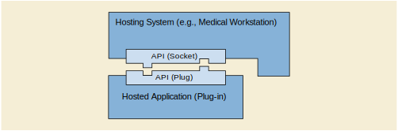

.. _chapter_1:

Scope and Field of Application
==============================

This Part of the DICOM Standard defines an interface between two
software applications. One application, the Hosting System, provides the
second application with data, such as a set of images and related data.
The second application, the Hosted Application, analyzes that data,
potentially returning the results of that analysis, for example in the
form of another set of images and/or structured reports, to the first
application. Such an Application Program Interface (API) differs in
scope from other portions of the DICOM Standard in that it standardizes
the data interchange between software components on the same system,
instead of data interchange between different systems. Hosted
Application programs written to that standardized interface can
'plug-into' (see `figure_title <#figure_1-1>`__) Hosting Systems. The
notion of software add-ons or 'plug-ins' is quite common in the
computing world, and has been successfully employed to extend the
capabilities of web browsers, media players, graphical editors,
publishing programs, etc. A Hosting System implementer needs only to
create the standardized API once in order to support a wide variety of
add-on Hosted Applications.

   Interface between Hosted Application and Hosting System.

In the traditional 'plug-in' model, the 'plug-in' is dedicated to a
particular host system (e.g., a web browsing program), and might not run
under other host systems (e.g., other web browsing programs). PS3.19
defines a standardized API that may be implemented by any Hosting
System. A 'plug-in' Hosted Application written to the standardized API
would be able to run on any Hosting System that implements that
standardized API (see `figure_title <#figure_1-2>`__).

The design goals and assumptions for the API include:

-  Language independence - the API is defined in such a way that
   programs written in any common programming language could utilize it.

-  Platform independence - the API is defined in such a way that it is
   not dependent on any particular computing platform or operating
   system.

-  Extensible - the API can be extended in a backward compatible
   fashion. Old applications still work even with new extensions in
   place, while new applications that are aware of the extensions can
   gain access to a richer set of functionality.

-  Protected - the API design is consistent with later additions of
   mechanisms to protect intellectual property rights, and mechanisms
   that assure appropriate permissions and licenses are in place. The
   API should not interfere with common licensing systems.

-  Secure - the Hosted Application's access to data on the Hosting
   System would be controlled via the API by the Hosting System. The
   Hosting System would be responsible for access controls and audit
   logging, since it is the one providing the data to the Hosted
   Application.

-  Leverage Existing Technology - the API definition utilizes existing
   technology in common use, as far as practical, and does not define
   new methodologies.

-  Simultaneous Launching - the Hosting System will be able to launch
   several instances of the same or of different Hosted Applications at
   the same time.

-  Distributed Execution - although the API is designed for local
   execution, it does not prevent remote execution, where the
   Application is running on a different system from the Host.

PS3.19 specifies both the interactions and the Application Programming
Interfaces (API) between Hosting Systems and Hosted Applications. PS3.19
also includes Normative and Informative Annexes that define the data
models that are used by the API defined in this Part.

The API does not directly address workflow management, which is
addressed by other DICOM Services.

