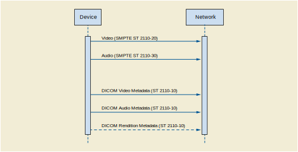

.. _chapter_6:

Data Communication Requirements
===============================

DICOM Real-Time Video uses the RTP protocol as defined in
`biblioentry_title <#biblio_SMPTE_ST2110-10>`__.

.. _sect_6.1:

Interaction
-----------

As shown in `figure_title <#figure_6-1>`__, a device can have multiple
Sources, one for each Essence which corresponds of the type of bulk data
(video, audio or medical metadata), each Source producing one or
multiple Flows representing the same content in different formats (high
definition, low definition, uncompressed, compress with or without loss,
…).

Several Sources may be grouped in a Source Group. A concrete experience
of a Source Group is a Rendition, defined as a collection of
time-synchronized Flows intended for simultaneous presentation (e.g.,
the audio channel of a surgical camera).

.. figure:: figures/PS3.22_6-1.svg
   :alt: Real World diagram of DICOM-RTV
   :name: figure_6-1

   Real World diagram of DICOM-RTV

DICOM Real-Time Video standard specifies the communication mechanism for
metadata, associated with real-time video and/or audio, originated from
a medical imaging device. The mechanism involves one Source and one Flow
of "DICOM Video Metadata Essence" for each video Flow and one Source and
one Flow of "DICOM Audio Metadata Essence" for each audio Flow.
Optionally, there is one Source and one Flow for the "DICOM Rendition
Metadata" associating multiple Flows produced by the same device.

The interaction shall be as shown in `figure_title <#figure_6-2>`__.

   Interaction Diagram

`biblioentry_title <#biblio_SMPTE_ST2110-10>`__ provides end-to-end
network transport functions for applications transmitting real-time
data. Content is transmitted in RTP sessions using RTP packets
respecting `biblioentry_title <#biblio_SMPTE_ST2110-10>`__.

A device can provide and/or consume content. A device that provides
content has one or more Sources that can be of different Essences (e.g.,
Video and Audio). A Source is the origin of one or more Flows. Multiple
Flows coming from the same Source are representations of the same
content in different resolutions and/or codings. This is a
broadcast/multicast protocol, so a device provides content whether or
not a consuming device is present. A device that consumes content can
subscribe/unsubscribe to available Flows.

The context and content of a video and/or audio Flow is described by a
DICOM Metadata Flow, which is associated with each Flow. However the
same DICOM Metadata Flow may be used to describe more than one Flow if
their content is the same and their coding are close enough not to
affect professional interpretation. A DICOM Rendition Metadata Flow may
be used to associate multiple Flows provided by one device.

.. _sect_6.2:

Transport
---------

.. _sect_6.2.1:

RTP Header
~~~~~~~~~~

All Essences shall be transported with RTP according to
`biblioentry_title <#biblio_SMPTE_ST2110-10>`__, which requires that
each Flow is described by an SDP object which specifies its content as
well as connection details enabling the receiver to join the session. In
addition to mandatory information specified in
`biblioentry_title <#biblio_SMPTE_ST2110-10>`__, for Audio and Video
Essence, the SDP may also include the following information:

-  PTP Sync Timestamp

-  PTP Origin Timestamp

-  Source Identifier

-  Flow Identifier

.. note::

   This information is the best way for associating multiple Flows
   originating from the same device. The presence of such information in
   the SDP implies that it is contained in the RTP Extended Header
   present in the first IP packet of a Grain (video frame, audio sample,
   metadata set…). It makes it possible to automatically associate and
   temporarily synchronize two Flows based on their content.

By definition, all the Flows according to
`biblioentry_title <#biblio_SMPTE_ST2110-10>`__ are synchronized by
means of a common reference to the Universal Time, using PTP, with
precision on the order of nanoseconds.

The RTP Header, for video and audio Flows, shall follow
`biblioentry_title <#biblio_SMPTE_ST2110-20>`__ and
`biblioentry_title <#biblio_SMPTE_ST2110-30>`__, respectively.

The RTP Header, for DICOM Metadata Flows, shall follow
`biblioentry_title <#biblio_SMPTE_ST2110-10>`__. The clock rate shall be
identical to the one defined in the referenced audio or video Flow. The
following additional constraints apply:

extension (X) : 1 bit
   Shall be set to 1.

payload type (PT)
   The value of payload type is selected from the range 96-127. It is
   recommended to avoid numbers frequently used for audio (97) and video
   (96), and for example use 104 for DICOM Metadata Essence. The value
   shall be associated to the media type "application" and the subtype
   "dicom" in the SDP. E.g., (DICOM Metadata on port 12345):

   *m=application*\ 12345 *RTP/AVP*\ 104

   *a=rtpmap:*\ 104 *dicom/*\ 90000

For the DICOM Metadata Essence, the RTP Header Extension defined by NMOS
shall be present, including the following information:

-  PTP Sync Timestamp

-  PTP Origin Timestamp

-  Source Identifier

-  Flow Identifier

The "defined by profile" part of the RTP Header Extension shall be set
to 0xBEDE identifying that the one-byte header extension form is used,
as specified in `biblioentry_title <#biblio_RFC_5285>`__.

.. _sect_6.2.2:

RTP Payload
~~~~~~~~~~~

The RTP Payload for audio and video Flows shall follow
`biblioentry_title <#biblio_SMPTE_ST2110-20>`__ and
`biblioentry_title <#biblio_SMPTE_ST2110-30>`__, respectively.

The RTP Payload for DICOM Metadata Flows (audio, video and rendition)
shall follow `biblioentry_title <#biblio_SMPTE_ST2110-10>`__.

The RTP Payload for DICOM Metadata Flows consists of a DICOM dataset
compliant with real-time communication.

The DICOM dataset is made of three parts:

-  the RTV Meta Information part. This part shall be present in each
   Grain.

-  the dynamic part containing information that varies over time (e.g.,
   Origin Timestamp of the frame, Position of a probe, circle defining
   the eye. When it exists, this part shall be present in each Grain.
   The transmission rate of the dynamic part shall be identical to the
   rate of the associated Flow (e.g., one dataset per frame). This part
   is for the moment not applicable to DICOM Rendition Metadata.

-  the static part containing information that doesn't vary over time
   (e.g. Patient Name, Modality, …). This part will not be present in
   every Grain but shall be present at least in one Grain per second.

.. note::

   The receiver cannot process information received from a sender until
   it receives DICOM Metadata including the static part, so it has to be
   sent at least every second in order to avoid a longer wait by the
   receiver when "connected" to a sender.

The transmission rate of DICOM audio flows will be typically of the
range of 48kHz. The transmission rate of DICOM video flows will be
typically of the range of 60Hz. The transmission rate of the DICOM
Rendition Metadata Flow shall be at least 1Hz. It may be appropriate to
use a higher frequency if there is a need for tight synchronization of
associated Flows from a device (e.g., two videos of a stereo pair).

