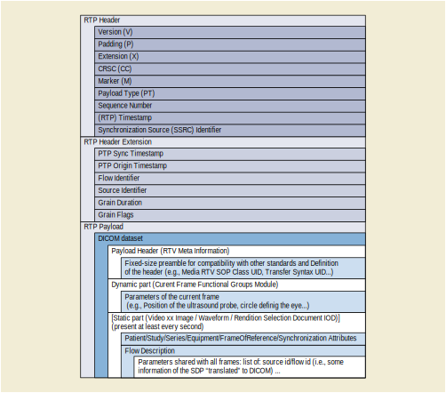

.. _chapter_7:

DICOM Real-Time Format
======================

The DICOM Real-Time Format provides a means to encapsulate in an RTP
session the Data Set representing a SOP Instance.

`figure_title <#figure_7-1>`__ illustrates the encapsulation of a DICOM
audio or video dataset in RTP. The byte stream of the Data Set is placed
into the RTP Payload after the DICOM-RTV Meta Information. Each RTP
session corresponds to a single SOP Instance.

   DICOM Dataset Encapsulation Within RTP

.. _sect_7.1:

RTV Meta Information
--------------------

The RTV Meta Information includes identifying information on the
encapsulated DICOM Data Set.

.. note::

   The group number of the RTV Meta Information attributes (0002,xxxx)
   is lower than the one of other attributes in order to place the RTV
   Meta Information at the beginning of the payload, as is done in .

.. table:: RTV Meta Information

   +-------------------+-------------------+------+-------------------+
   | Attribute Name    | Tag               | Type | Attribute         |
   |                   |                   |      | Description       |
   +===================+===================+======+===================+
   | Header Preamble   | *No Tag or Length | 1    | A fixed 128 byte  |
   |                   | Fields*           |      | field available   |
   |                   |                   |      | for Application   |
   |                   |                   |      | Profile or        |
   |                   |                   |      | implementation    |
   |                   |                   |      | specified use. If |
   |                   |                   |      | not used by an    |
   |                   |                   |      | Application       |
   |                   |                   |      | Profile or a      |
   |                   |                   |      | specific          |
   |                   |                   |      | implementation,   |
   |                   |                   |      | all bytes shall   |
   |                   |                   |      | be set to 00H.    |
   |                   |                   |      |                   |
   |                   |                   |      | Receivers shall   |
   |                   |                   |      | not rely on the   |
   |                   |                   |      | content of this   |
   |                   |                   |      | Preamble to       |
   |                   |                   |      | determine that    |
   |                   |                   |      | this payload is   |
   |                   |                   |      | or is not a DICOM |
   |                   |                   |      | payload.          |
   +-------------------+-------------------+------+-------------------+
   | DICOM Prefix      | *No Tag or Length | 1    | Four bytes        |
   |                   | Fields*           |      | containing the    |
   |                   |                   |      | character string  |
   |                   |                   |      | "DICM". This      |
   |                   |                   |      | Prefix is         |
   |                   |                   |      | intended to be    |
   |                   |                   |      | used to recognize |
   |                   |                   |      | that this payload |
   |                   |                   |      | is or is not a    |
   |                   |                   |      | DICOM payload.    |
   +-------------------+-------------------+------+-------------------+
   | File Meta         | (0002,0000)       | 1    | Number of bytes   |
   | Information Group |                   |      | following this    |
   | Length            |                   |      | RTV Meta Element  |
   |                   |                   |      | (end of the Value |
   |                   |                   |      | field) up to and  |
   |                   |                   |      | including the     |
   |                   |                   |      | last RTV Meta     |
   |                   |                   |      | Element of the    |
   |                   |                   |      | Group 2 RTV Meta  |
   |                   |                   |      | Information       |
   +-------------------+-------------------+------+-------------------+
   | Transfer Syntax   | (0002,0010)       | 1    | Uniquely          |
   | UID               |                   |      | identifies the    |
   |                   |                   |      | Transfer Syntax   |
   |                   |                   |      | used to encode    |
   |                   |                   |      | the referred      |
   |                   |                   |      | bulk-data Flow.   |
   |                   |                   |      | This Transfer     |
   |                   |                   |      | Syntax does not   |
   |                   |                   |      | apply to the RTV  |
   |                   |                   |      | Metadata which is |
   |                   |                   |      | encoded using the |
   |                   |                   |      | Explicit VR       |
   |                   |                   |      | Little Endian     |
   |                   |                   |      | Transfer Syntax.  |
   +-------------------+-------------------+------+-------------------+
   | RTV Meta          | (0002,0031)       | 1    | This is a two     |
   | Information       |                   |      | byte field where  |
   | Version           |                   |      | each bit          |
   |                   |                   |      | identifies a      |
   |                   |                   |      | version of this   |
   |                   |                   |      | RTV Meta          |
   |                   |                   |      | Information       |
   |                   |                   |      | header. In        |
   |                   |                   |      | version 1 the     |
   |                   |                   |      | first byte value  |
   |                   |                   |      | is 00H and the    |
   |                   |                   |      | second byte value |
   |                   |                   |      | is 01H.           |
   +-------------------+-------------------+------+-------------------+
   | RTV Communication | (0002,0032)       | 1    | Uniquely          |
   | SOP Class UID     |                   |      | identifies the    |
   |                   |                   |      | SOP Class         |
   |                   |                   |      | associated with   |
   |                   |                   |      | the Data Set. SOP |
   |                   |                   |      | Class UIDs        |
   |                   |                   |      | allowed for RTV   |
   |                   |                   |      | Communication are |
   |                   |                   |      | specified in      |
   |                   |                   |      | section 7.2       |
   |                   |                   |      | STANDARD SOP      |
   |                   |                   |      | CLASSES.          |
   +-------------------+-------------------+------+-------------------+
   | RTV Communication | (0002,0033)       | 1    | Uniquely          |
   | SOP Instance UID  |                   |      | identifies the    |
   |                   |                   |      | SOP Instance      |
   |                   |                   |      | associated with   |
   |                   |                   |      | the Data Set      |
   |                   |                   |      | placed in the RTP |
   |                   |                   |      | Payload and       |
   |                   |                   |      | following the RTV |
   |                   |                   |      | Meta Information. |
   +-------------------+-------------------+------+-------------------+
   | RTV Source        | (0002,0035)       | 1    | The UUID of the   |
   | Identifier        |                   |      | RTP source that   |
   |                   |                   |      | sends the RTV     |
   |                   |                   |      | Metadata Flow.    |
   +-------------------+-------------------+------+-------------------+
   | RTV Flow          | (0002,0036)       | 1    | The UUID of the   |
   | Identifier        |                   |      | RTV Metadata      |
   |                   |                   |      | Flow.             |
   +-------------------+-------------------+------+-------------------+
   | RTV Flow RTP      | (0002,0037)       | 1C   | The rate of the   |
   | Sampling Rate     |                   |      | dynamic part of   |
   |                   |                   |      | the RTV Metadata  |
   |                   |                   |      | Flow, the same as |
   |                   |                   |      | the bulk-data     |
   |                   |                   |      | Flow rate.        |
   |                   |                   |      |                   |
   |                   |                   |      | Required if RTV   |
   |                   |                   |      | Metadata Flow     |
   |                   |                   |      | includes a        |
   |                   |                   |      | dynamic part.     |
   +-------------------+-------------------+------+-------------------+
   | RTV Flow Actual   | (0002,0038)       | 3    | Duration of image |
   | Frame Duration    |                   |      | capture in msec.  |
   +-------------------+-------------------+------+-------------------+
   | Private           | (0002,0100)       | 3    | The UID of the    |
   | Information       |                   |      | creator of the    |
   | Creator UID       |                   |      | private           |
   |                   |                   |      | information       |
   |                   |                   |      | (0002,0102).      |
   +-------------------+-------------------+------+-------------------+
   | Private           | (0002,0102)       | 1C   | Contains Private  |
   | Information       |                   |      | Information       |
   |                   |                   |      | placed in the RTV |
   |                   |                   |      | Meta Information. |
   |                   |                   |      | The creator shall |
   |                   |                   |      | be identified in  |
   |                   |                   |      | (0002,0100).      |
   |                   |                   |      | Required if       |
   |                   |                   |      | Private           |
   |                   |                   |      | Information       |
   |                   |                   |      | Creator UID       |
   |                   |                   |      | (0002,0100) is    |
   |                   |                   |      | present.          |
   +-------------------+-------------------+------+-------------------+

.. _sect_7.2:

Standard SOP Classes
--------------------

The SOP Classes in the Real-Time Communication Class identify the
Composite IODs to be sent. `table_title <#table_7.2-1>`__ identifies
Standard SOP Classes.

.. table:: Standard SOP Classes

   +-----------------------+--------------------+-----------------------+
   | SOP Class Name        | SOP Class UID      | IOD Specification     |
   |                       |                    | (defined in )         |
   +=======================+====================+=======================+
   | Video Endoscopic      | 1.2.840.10008.10.1 | Real-Time Video       |
   | Image Real-Time       |                    | Endoscopic Image IOD  |
   | Communication         |                    |                       |
   +-----------------------+--------------------+-----------------------+
   | Video Photographic    | 1.2.840.10008.10.2 | Real-Time Video       |
   | Image Real-Time       |                    | Photographic Image    |
   | Communication         |                    | IOD                   |
   +-----------------------+--------------------+-----------------------+
   | Audio Waveform        | 1.2.840.10008.10.3 | Real-Time Audio       |
   | Real-Time             |                    | Waveform IOD          |
   | Communication         |                    |                       |
   +-----------------------+--------------------+-----------------------+
   | Rendition Selection   | 1.2.840.10008.10.4 | Rendition Selection   |
   | Document Real-Time    |                    | Document IOD          |
   | Communication         |                    |                       |
   +-----------------------+--------------------+-----------------------+

